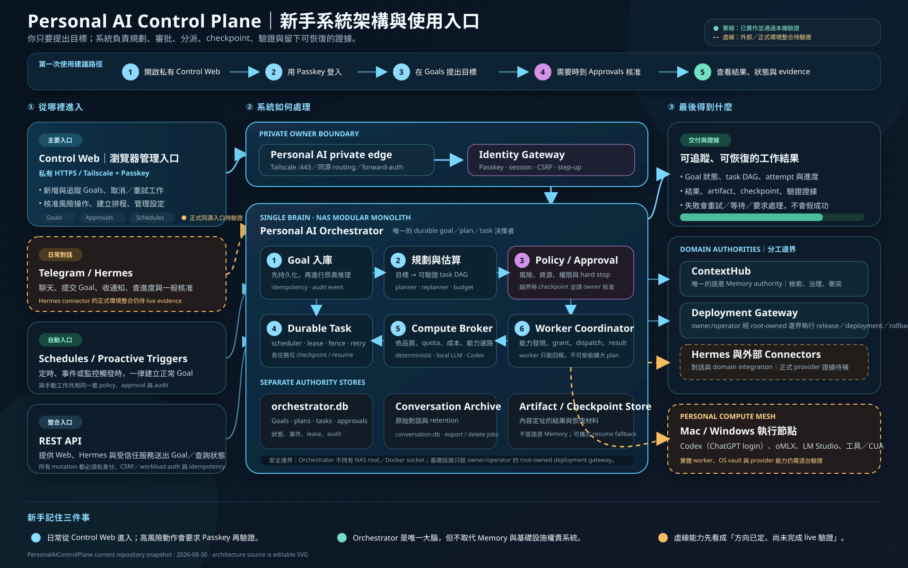

# Personal AI Control Plane

## System architecture at a glance

[](docs/assets/personal-ai-control-plane-architecture-zh-TW.svg)

The diagram distinguishes locally verified capabilities from integrations that still require external or production evidence.

Start here: [Traditional Chinese User Guide](docs/personal-ai-control-plane-user-guide.md)

Design documents:

1. [Requirement Definition](docs/personal-ai-control-plane-requirements.md)
2. [High-Level Design](docs/personal-ai-control-plane-hld.md)
3. [Detailed Design](docs/personal-ai-control-plane-detailed-design.md)
4. [Implementation Status](docs/implementation-status.md)

The repository implements the locally verifiable detailed-design contracts. Design documents and local tests do not by themselves authorize production deployment.

## Local foundation slice

Requires Node.js 22.19+.

```bash
npm run check
npm test
npm run build:web
npm start
```

Worker device bootstrap (development/local channel):

```bash
npm run worker:cli -- enroll
# approve the displayed fingerprint in Control Web, then finalize from the saved local challenge
npm run worker:cli -- enroll-finalize
npm run worker:cli -- rotate
npm run worker:cli -- status
npm run worker:cli -- start --repo-id <logical-id> --repo-path <git-repository>
```

The current local CLI uses a `0600` file fallback for the device key and credential so the protocol can be exercised. It is intentionally reported as `file-fallback`; the signed production packages must replace it with the native macOS Keychain/Windows Credential Manager helper before production acceptance.

The development server listens on `127.0.0.1:9085`, opens independent local Orchestrator and Conversation Archive databases, and permits local unauthenticated goal admission. Production mode fails closed until the Identity Gateway is connected.

Implemented locally: goal admission/idempotency, plan DAG validation and activation, SQLite migrations, continuous planner/outbox/scheduler/reconciliation loops, atomic dispatch with lease/fence checks, durable result verification, audit-chain verification, pure hard-stop policy evaluation, WebAuthn with secure sessions, canonical-origin/CSRF enforcement and refresh, Passkey step-up/recovery, non-secret forward-auth, workload-authenticated action grants through opaque key handles, server-derived approval grants, outbound replay-safe worker execution, Archive durable export/delete/purge jobs, owner management APIs and SSE, a responsive single-entry Portal with read-only AIHomePlatform and ContextHub projections, typed adapters, configuration/observability/checkpoint/quota/backup contracts, dual-image release evidence, and policy-checked production Compose. Hermes remains an independently released conversational site and is opened from its Portal status card.

The live private owner edge is `https://gnest.taila77e5f.ts.net/`: an existing Passkey session enters Control Web at `/home` and `/goals`, while unauthenticated and spoofed-identity requests fail with `401 AUTH_REQUIRED`. The previous `:9084` route is retired; AIHomePlatform remains available at `https://gnest.taila77e5f.ts.net:9443/`. Provider-backed execution remains evidence-gated: an owner-selected opaque signing-key authority and workload enrollment, physical-worker OS-vault proof/finalization and capability adapters, Codex/local-model provider evidence, live ContextHub/Hermes connector operations, CUA/wake adapters, backup/restore proof, and provider acceptance are still required. The three runtime processes join only the AIHomePlatform-owned private edge network. Production registration requires the root-controlled one-time `PAI_BOOTSTRAP_TOKEN`. No API-key fallback, embedded production key, fake readiness flag, or unvalidated production mutation is available.
