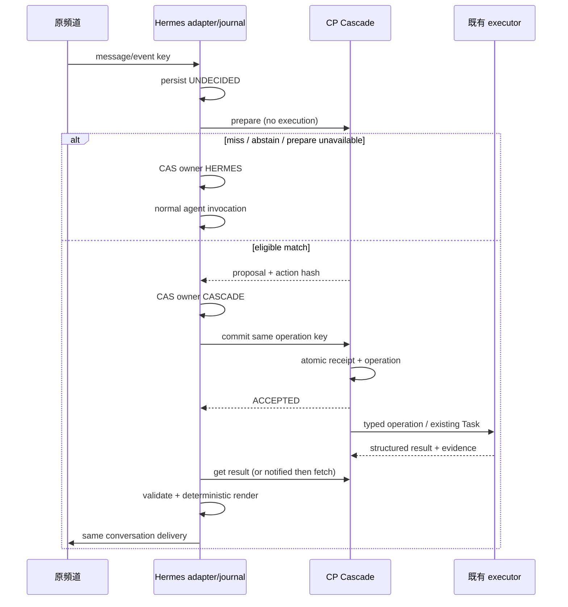
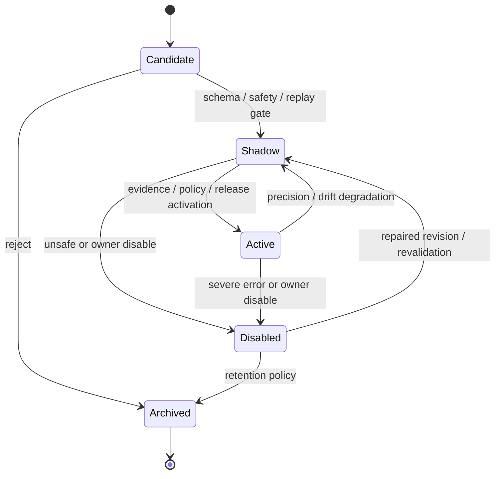
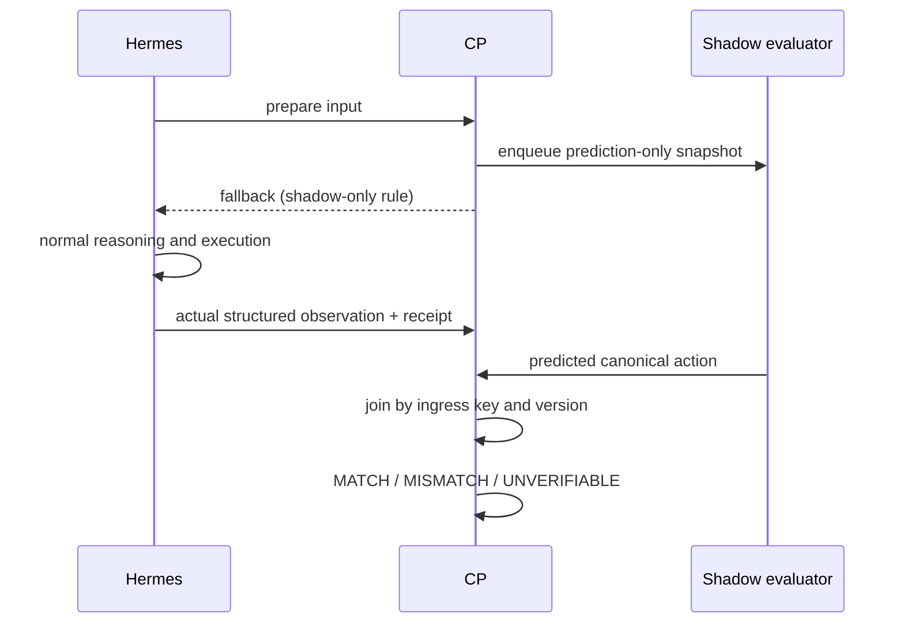

# Adaptive Cascade Dispatch Engine — Detailed Design

日期：2026-09-21｜版本：1.0｜狀態：待實作規格，未部署／未完成 live 驗收。

上游：[HLD v1.0](adaptive-cascade-dispatch-engine-hld.md)；來源：[需求原文](requirements/adaptive-cascade-dispatch-engine-requirements.md)。本文件依 HLD H01–H12 展開；不得將下列 proposed APIs／tables 誤認為目前已存在。技術選擇與數值為設計預設，需依驗收調整並版本化。

## 1. 實作邊界與元件介面

沿用 CP Node.js／TypeScript 與 `controlplane.db`。不在 CP 安裝 Python／PyTorch；模型 runtime 透過 adapter 隔離。現有 TaskService、scheduler、WorkerService、artifact storage、callback outbox 為整合點；不得把 catalog 的 `supported=false` 改成 true 來代替實作。

| 新增位置（建議） | 介面與責任 | HLD |
| --- | --- | --- |
| `apps/control-plane/src/dispatch/dispatch-service.ts` | prepare、commit、查詢與 transaction ownership | H01、H06 |
| `dispatch/cascade-engine.ts` | `evaluate(input, snapshot, deadline): RouteDecision`，無副作用 | H02 |
| `dispatch/deterministic-router.ts` | `match(input, rules): Match / Abstain` | H02 |
| `dispatch/providers/` | normalized SemanticRouterProvider、raw runtime adapters、校準 | H03、H04 |
| `dispatch/rule-registry.ts` | immutable revisions、release CAS、transition audit | H05、H11 |
| `dispatch/dispatch-policy.ts` | canonical operation/ACL/approval/resource gate | H07 |
| `dispatch/execution-adapter.ts` | typed service/Worker integration、receipt reconciliation | H06、H10 |
| `dispatch/learning/` | bounded statistics、candidate、shadow、replay、degrade | H09、H12 |
| `packages/contracts/src/dispatch.ts` | 以下 transport／domain schema | H03 |
| Hermes repository 的 ingress adapter | pre-LLM interception、intake journal、renderer、delivery | H01、H06、H10 |

模組名稱是實作建議；公開契約與狀態不因目錄調整而變更。

## 2. Hermes pre-LLM integration 與 ownership

### 2.1 插入點

在 Telegram/Web 的 channel authentication、owner identity mapping、session load、原生控制命令处理之後，首次 agent/model invocation 之前加入共用 `PreReasoningDispatcher`。不得放在 LLM 已選擇工具後才呼叫的 MCP classify tool。

本輪只核對相鄰 repository 的 runtime/MCP adapter，未證實 deployed upstream 有可用 hook。實作時先鎖定 Hermes source revision，沿 Telegram 與 Web 真實 call path 找第一個 model call；若無可取消原 agent dispatch 的 extension hook，新增最小 gateway patch，兩個 channel 共用同一 adapter。驗收需記錄 hook source path/revision 與 model-call instrumentation；只改 prompt 不合格。

控制命令、approval answer、正在進行工作的追問／更正、工具訊息、attachment、訊息 edit/replay event、非 owner 身分，MVP 交由既有 Hermes flow；不對所有 input event 無差別分類。新文字訊息要有 provider event ID 或 Web client submission UUID；不以文字 hash 作去重 key。

### 2.2 Request envelope

```json
{
  "schema_version": 1,
  "request_id": "01-example-request",
  "ingress_key": "opaque-stable-key",
  "source": {"channel": "telegram", "conversation_ref": "hconv_123", "event_ref": "hevt_456"},
  "subject_ref": "owner_1",
  "text": "ContextHub 還活著嗎？",
  "received_at": "2026-09-21T09:00:00+08:00",
  "timezone": "Asia/Taipei",
  "locale": "zh-TW",
  "context": {"session_revision": 12, "standalone": true, "pending_interaction": false},
  "privacy_class": "LOCAL_ONLY",
  "routing_budget_ms": 250
}
```

認證 principal 才能指定自己的 subject/conversation binding；一般 client 不能自報 owner。`ingress_key` 由 Hermes 以 channel identity＋event ID 穩定生成，含身分隔離；body canonical hash 用於衝突檢查，不含 request tracing ID。相同 key 不同 body 回 409。text 上限 8 KiB，完整 envelope 上限 16 KiB；超長不截斷成命令，直接 Hermes。

`context` 不含完整 chat history、任意可執行指示或 chain of thought。省略／不明的 standalone／session 狀態視為不適合 cheap dispatch。

### 2.3 兩階段執行

1. Hermes 先持久化 intake，狀態 `UNDECIDED`，再呼叫 CP prepare。
2. CP prepare 只做分類與 gate snapshot，存 proposal，絕不派工。
3. 回 fallback 時，Hermes CAS `UNDECIDED → HERMES`，保存原因，啟動一次正常 agent flow。
4. 回 proposal 時，Hermes CAS `UNDECIDED → CASCADE`，保存 proposal ID／hash／operation key，然後才送 commit。
5. CP commit 重新驗 gate、proposal TTL、rule/release eligibility；同交易保存 receipt 與待執行 operation。提交成功不等於執行完成。
6. commit 網路不明：Hermes 保持 `CASCADE`，查詢／同 key 重送，不啟動另一個 agent action。
7. 若要放棄 commit，呼叫 resolve-to-Hermes。CP 在同一寫入交易中把尚未受理 proposal 標 `RELEASED`，形成 tombstone；與 commit 競爭只允許一方成功。CP 回 `NOT_STARTED_RELEASED` 後 Hermes 才能 CAS 轉 `HERMES`。
8. CP 離線且曾可能 commit：顯示「正在確認執行狀態」，保持 pending。不能將 timeout 當成沒執行。

Hermes 重啟由 intake journal 依 owner 續接；`HERMES` 不重新 prepare，`CASCADE` 查 receipt，`UNDECIDED` 可重送 prepare。未送 commit 的 prepare timeout 可以直接選 HERMES，延遲到達的 proposal 永遠不能執行。



### 2.4 回覆與 recovery

Hermes 擁有固定 renderer registry，`template_id + version + result_schema_version` 必須在 release compatibility 中確認。例：`ContextHub：正常。檢查時間：09:00（Asia/Taipei）。來源：health probe。` 要由真實 `status=healthy` result 產生；timeout 只能說未取得狀態。

validated result 包含 `observed_at`、source reference、structured fields、artifact references（有 hash 時驗 hash）。模板不执行 Markdown/HTML 任意內容；log 先截短、遮蔽敏感資訊，超量部分走 ACL artifact link。

如果已完成 action 但 output schema 不相容，記 `VALIDATION_FAILED`，可以啟動一次 Hermes recovery reasoning，帶既有 operation/result evidence，禁止重新執行原 operation；LLM avoided 計數為 0。若 action completion 不明，先 reconcile。Renderer 缺失在 prepare 即拒絕，降低事後 fallback。

Delivery 用 `delivery_key=ingress_key + response_revision` 去重並持久化 provider receipt。投遞失敗只重試 delivery，頻道不提供 idempotency 時發送成功但 ACK 遺失可能重複；標 `DELIVERY_UNKNOWN` 並優先 query/reconcile，不能承諾 provider exactly-once。使用者看到已交付與 CP Task succeeded 是不同 gate。

## 3. Cascade algorithm 與語言處理

```text
authenticate -> validate envelope -> pin immutable routing release
-> check session eligibility / input guards
-> extract known entities and unambiguous slots
-> Tier 0 evaluate full patterns
-> for each enabled semantic tier within global deadline:
     language/length/privacy/resource eligibility
     normalized provider.match
     validate intent membership, calibration binding, slots, assurance
-> canonicalize action -> final policy gate -> proposal
otherwise -> explicit abstain/fallback reason
```

Tier 0：exact/alias 都做 Unicode NFC、空白 normalization、已知 ASCII entity case fold；保留否定、標點意義與原始文字。regex 使用有界安全 subset（禁止 backreference、lookaround、nested quantifier），發布時做靜態檢查；匹配完整輸入且長度有上限。keyword/entity 只能作完整 conjunctive predicate 的一部分，不能看見 `status` 就接受含「不要查 status」的句子。

slot extractor 必須是具版本的有限函式（如 `known_service_v1`、`today_in_timezone_v1`）；語意 provider 的 entity 建議只能作提示，實際值以 deterministic extractor/schema 驗證。服務名唯一且 allowlist 命中；未知、多服務、多意圖、缺時間區域、否定、條件、原因分析、引用命令、無法解析 slot 都 abstain。`今天` 依 received_at/timezone 解析固定日期，retry 不重算。

匹配衝突：多個完整 match 若 canonical action/hash 相同可合併 provenance；不同則 `AMBIGUOUS_RULES`，不依 registry insertion order 決定。明確 rule priority 只處理已驗證的 specificity，不能覆蓋衝突 guard。

Language heuristic v1：先依 allowlist 最長 token 邊界識別 technical English／entity，剩餘文字計 Han characters H 與 Latin letters L。`H/(H+L) >= 0.5` 且 H>0 為 `ZH_DOMINANT`；其餘 `EN_HEAVY`／`UNKNOWN`。technical-only exact command 仍可 Tier 0；semantic 只接 Chinese dominant。門檻版本化，輸入限 160 Unicode code points 且 provider token limit（初始 128）；任一超長就 abstain，不截斷尾部條件。這只是 eligibility heuristic，不是理解正確性證據。混語、繁簡、大小寫、服務名子字串都要有獨立測試。

## 4. Provider 與 calibration 契約

### 4.1 Domain normalized interface

```typescript
type Assurance = "UNASSESSED" | "HIGH";
type RouteInput = {
  requestId: string;
  text: string;
  context: { locale: string; languageClass: string };
  candidateIntents: readonly string[];
  bundleId: string;
  deadlineAt: number;
};
type NormalizedMatch = {
  schemaVersion: 1;
  intent: string | null;
  abstain: boolean;
  reason: string;
  assurance: Assurance;
  calibratedProbability: number | null;
  calibrationProfileId: string | null;
  alternatives: Array<{ intent: string; calibratedProbability: number | null }>;
  provenance: {
    providerId: string; modelRevision: string | null; bundleId: string;
    runtimeRevision: string; ruleSetHash: string; datasetRevision: string | null;
  };
};
interface SemanticRouterProvider {
  describe(): ProviderDescriptor;
  readiness(): Promise<{ ready: boolean; reason: string }>;
  match(input: RouteInput, signal: AbortSignal): Promise<NormalizedMatch>;
  close(): Promise<void>;
}
```

`ProviderDescriptor` 含 protocol version、supported language classes、max bytes/tokens、privacy locality、bundle hash；不含可直接執行的 action。`abstain=false` 必須 intent 非 null、位於 candidate set、校準／bundle hash 相符、HIGH 達門檻；外部 provider 不能只自報 HIGH，CP 驗證已核准的 calibration manifest。無有效 profile 一律 `UNASSESSED + abstain`。Deterministic match 不偽造 `probability=1`；保留 matcher proof 與 policy entitlement。

### 4.2 Provider 內部介面

`RawRouter.score(input, candidateIndex) -> {candidate scores, margin, ood features, model provenance}`；`Calibrator.evaluate(raw, profile, stratum) -> NormalizedMatch`。Score layout、cosine、logits、embedding dimensions 均在 bundle 裡，不進 rule schema。External decision engine 可以使用 classifier logits；不必實作 embedding。

Embedding reference adapter：離線 encode 正負例句，固定 tokenizer/pooling/normalization/quantization；線上 encode request，用小型 in-memory index 算候選 ranking/margin。MVP 至多 50 intents、每 intent 20 examples；可用線性掃描，不需要向量 DB。精確 slot matching 在 provider 外完成。

### 4.3 Confidence 語意

`calibratedProbability` 若提供，代表該 profile/stratum 上「top intent 正確」的估計，非完整 action/authorization 成功率。HIGH 表示該 release 的 acceptance region 經驗證符合 assurance policy。LOW coverage 可以接受；校準樣本不足時 probability=null 並 abstain。

Calibration profile 包含：provider/model/runtime/preprocessing/index hashes、train/calibration/test dataset revisions、strata（intent/language）、calibration method、score/margin/OOD boundaries、測試樣本數、accepted/correct、precision lower bound、evaluation time、expiry。Provider 私有 boundary 不得出現在 domain rule。

流程：按來源事件／conversation／paraphrase family 分組並採時間切分 → training examples → calibration threshold fit → untouched holdout test → shadow。不得同一句改寫同時出現在校準與測試。可比較 logistic calibration 與簡單 empirical threshold region；少資料先 abstain，不強行擬合看似精確的小數。

初始 HIGH policy：accepted complete actions 的 precision 95% Wilson lower bound >= 0.99；按啟用 intent 檢查，低支持度 intent 保持 shadow。零錯誤也通常需約 381 個近似獨立 accepted observations 才可能達標；重複 replay 同一筆不能增加 n。此計算採 z=1.96，lower bound = 1/(1+z²/n)（零錯誤時）；有錯誤用完整 Wilson formula。不是「381 次就保證安全」。稀疏個人用量可延長 shadow，不能為了 demo 靜默降低 production policy。

除 precision 外，必須通過 harmful/out-of-scope negative set 零誤派 gate；entity／slot／policy 全 action 正確率單獨驗證。Profile max age 初始 30 天，schema/index/model change 即失效；expiry 時轉 abstain，待重新驗證。

### 4.4 BGE-small reference implementation

可提供 `BgeSmallZhProvider`，使用固定 hash 的 BGE-small-zh-v1.5 量化 artifact 與輕量 native runtime。Reference spike 優先評估 native llama.cpp＋GGUF 的獨立 container，以避免 CP 載入重量級框架；通過相容性與 RSS gate 才採用。GGUF 是候選包裝，ONNX 等也可實作相同 provider。實作 spike 必須驗證 exact model conversion、CPU ISA、tokenizer、pooling、normalization、reference-vector parity、繁中／混語品質及 cold/warm RSS；不指定未驗證可用的量化下載網址。

BGE runtime dependency 只在可選 inference image/profile；CP 啟動、migration、Tier 0、unit tests 不下載模型。測試採 fixture/fake provider，另以選配 integration job 測 reference provider。替換為另一個 classifier 不更改 rule JSON；重建衍生 index、校準、release bundle 是必要步驟。

官方資料只作 implementation spike 起點：[BGE model card](https://huggingface.co/BAAI/bge-small-zh-v1.5)、[llama.cpp embedding source/example](https://github.com/ggml-org/llama.cpp/tree/master/examples/embedding)。15–30 MB 權重與低 RSS 是否可同時達成，留待 target hardware 實測。

## 5. Rule、capability 與 release schema

### 5.1 Immutable rule revision

```yaml
schema_version: 1
rule_id: service-health-check
revision: 1
intent: service.health_check
match:
  exact: ["{service} status"]
  aliases: ["{service} health"]
  semantic:
    examples: ["{service} 還活著嗎？", "幫我 check {service} status"]
    negative_examples: ["{service} 為什麼一直 restart", "不要查 {service} status"]
slots:
  service:
    type: service_ref
    required: true
    extractor: known_service_v1
    allowed_values: [contexthub]
action:
  kind: single_operation
  logical_worker: devops-worker
  operation: service.health_check
  operation_schema_version: 1
  parameters: {service_ref: "$slot.service"}
risk:
  declared_effect: READ_ONLY
  required_assurance: HIGH
response:
  template_id: service-health-v1
  result_schema_version: 1
provenance:
  origin: curated
  evidence_refs: []
```

`{service}` 是 template grammar placeholder，發布時編譯成有限 matcher，不是任意 regex 替換。`$slot` 只能取已驗證 slot，不能插入 shell、URL、path expression 或其他 template interpreter。Rule schema 拒絕未認得欄位，包括 `bge_threshold`、`model`、`endpoint`、`script`。state 存 registry lifecycle record，不混入 immutable body。

`risk.declared_effect` 是宣告上限／檢查條件，不是權威；必須與 catalog 一致，最終採 catalog 與 actual parameter policy 最嚴格的 effect。`origin=learned` 追加 creator、source receipts／evidence hashes、生成器 revision、生成時間；不能寫自己為 approved。

未來 `action.kind=workflow_ref` 綁 immutable Hermes-owned Skill/workflow revision 與 hash，MVP parser 回 `UNSUPPORTED_ACTION_KIND`。本版不提供任意 DAG evaluator。

### 5.2 Worker capability binding（新增 adapter view）

```json
{
  "logical_worker": "devops-worker",
  "operation": "service.health_check",
  "operation_schema_version": 1,
  "execution_owner": "CP_TASK",
  "required_capabilities": ["service.health.read"],
  "parameter_schema_ref": "service-health-input-v1",
  "result_schema_ref": "service-health-result-v1",
  "effect_class": "READ_ONLY",
  "allowed_resources": ["service:contexthub"],
  "supports_operation_dedup": true,
  "timeout_ms": 5000,
  "freshness_ttl_ms": 60000,
  "descriptor_hash": "sha256:..."
}
```

這是 registry mapping 的 proposed schema，不代表目前有 `service.health.read` Worker。無實作／無 grant 就 unavailable。Logical worker 解析到已核准、online、未 drain、具能力／resource scope／capacity 的實際 Worker；rule 不保存 endpoint。選擇結果存 task/attempt，execution 前重新驗 descriptor/grant。

`execution_owner` 可為 `CP_TASK` 或 `SERVICE_ADAPTER`；原生 Hermes operation 要由已註冊的 typed native adapter 執行並保存 native receipt，禁止偽造 Task。MVP 先接一個實際可用唯讀 adapter，其餘 health/logs/Radar/search/memory/schedule 逐一列 availability。不存在 adapter 就 fallback，不降成通用 shell／LLM worker。

### 5.3 Routing release

Release 固定：rule revision set/hash、tier ordered IDs、provider bundles、calibration profiles、entity/extractor/catalog schema revision、policy revision、renderer compatibility、evaluation manifest hash。`active_release_id` 以 compare-and-swap 原子更新。

Rule body 變更生成新 revision → Candidate；模型更換不改 rule revision，但建立新 routing release 並重校準。預備 index 在背景建好且健康後才能切換；未就緒保留舊 release。緊急 denylist 由 gate 即時讀取，優先於已 pin 的 release，撤權／disable 禁止新的 commit。accepted operation 仍依既有 execution/cancel protocol 對帳。

## 6. REST／IPC 與風險政策

私有 prefix：`/api/v2/dispatch`。以下 endpoint 全為新增；共用現有 authentication/service boundary，新增最小 scoped credential，禁止匿名或借用任意 Worker token。

| Method/path | 成功與主要 schema | scope |
| --- | --- | --- |
| POST `/prepare` | 200 `FALLBACK` 或 `PROPOSED` | `dispatch.prepare` |
| POST `/proposals/{id}/commit` | 202 accepted receipt；重送回同 receipt | `dispatch.commit` |
| POST `/proposals/{id}/resolve-to-hermes` | 200 NOT_STARTED_RELEASED 或 409 ALREADY_ACCEPTED | `dispatch.commit` |
| GET `/requests/{ingress_key}` | 200 decision/receipt/task/result status；404 unknown | `dispatch.read`，same subject |
| POST `/observations` | 202 observation receipt，same event key 去重 | `dispatch.observe` |
| POST `/rules` | 201 Candidate revision | `dispatch.rule.propose` |
| GET `/rules`、`/rules/{id}` | cursor page／versions／metrics | `dispatch.rule.read` |
| POST `/rules/{id}/revisions` | 201 新 Candidate，If-Match 必要 | `dispatch.rule.propose` |
| POST `/rules/{id}/transitions` | 200 lifecycle CAS，body 含 revision/from/to/reason/evidence | `dispatch.rule.manage` |
| POST `/replays` | 202 offline evaluation job（不得 live execution） | `dispatch.evaluate` |
| GET `/replays/{id}` | progress/report/artifact refs | `dispatch.evaluate` |
| POST `/releases` | 201 immutable validated manifest | `dispatch.release.manage` |
| PUT `/active-release` | 200 CAS switch，If-Match 必要 | `dispatch.release.manage` |

Hermes 一般 runtime 僅有 prepare/commit/read/observe/propose，無 promote/release authority。Owner UI 與預先批准的 policy executor 才可 lifecycle manage；audit actor、政策來源、evidence 必記。高風險 grant/release action 是否需要 step-up 沿用現有 auth policy，不新建平行 approval system。

Prepare 回應：

```json
{
  "schema_version": 1,
  "decision_id": "d_123",
  "disposition": "PROPOSED",
  "proposal_id": "p_123",
  "expires_at": "2026-09-21T01:00:30Z",
  "release_id": "rel_7",
  "action": {"operation": "service.health_check", "parameters": {"service_ref": "contexthub"}},
  "action_hash": "sha256:...",
  "operation_key": "op_123",
  "assurance": "HIGH",
  "reason": "CALIBRATED_MATCH"
}
```

commit body：`schema_version, operation_key, action_hash, session_revision, ownership_ref`。ownership_ref 指 Hermes 已持久化 journal reference；服務認證保證來源，不能由終端使用者自報。CP 核對原 subject、proposal hash、expiry、session revision；不接受 commit 夾帶新參數。prepare TTL 30 秒，expired 未受理 proposal 必須重新 prepare；同 key 的 accepted receipt 不因 TTL 失效。

Fallback 回應含 `decision_id, disposition=FALLBACK, reason, constraints`，不含 proposal。reason enum 至少：`NO_MATCH, LOW_CONFIDENCE, UNCALIBRATED, UNSUPPORTED_LANGUAGE, COMPLEX_REQUEST, AMBIGUOUS_RULES, INVALID_SLOTS, PROVIDER_TIMEOUT, PROVIDER_UNAVAILABLE, RESOURCE_BUDGET, PRIVACY_POLICY, CAPABILITY_UNAVAILABLE, POLICY_REQUIRES_HERMES`。

HTTP errors：400 schema、401 auth、403 denied、409 key/CAS/ownership conflict、410 expired proposal、413 oversize、429 budget、503 unavailable。401/403 不當作放寬安全的 fallback；Hermes 原 flow 仍須原身分／policy checks。只有 prepare 等無效果操作可在 infrastructure error 直接 fallback。

Local runtime IPC 採私有 HTTP `POST /v1/match`（RouteInput/NormalizedMatch）、`GET /healthz`、`GET /readyz`；只 bind container private network，不 publish host port。Remote provider 同 protocol，private Worker/TLS 或 mTLS，credential 用 secret reference，endpoint allowlist 與禁止 redirect；request 不可提供 endpoint。校準可在 CP wrapper 執行，raw score transport 則是 provider-private versioned API，不暴露至 domain。

Risk gate 順序：authenticated subject → input/session → catalog schema → resource ACL → effect classification → current approval/grant → actual capability/descriptor freshness → assurance → budget → commit eligibility。MVP 只允許 READ_ONLY 且無未滿足 approval；其餘全部交 Hermes。READ_ONLY 資料讀取與原頻道回覆分開授權，既有 conversation binding 才允許 delivery，不允許把 read result 寄到第三人。

## 7. 狀態機、交易、retry 與 race

### 7.1 Proposal/operation 狀態

```text
PREPARED -> ACCEPTED -> EXECUTING -> SUCCEEDED | FAILED | UNKNOWN
PREPARED -> RELEASED | EXPIRED | REJECTED
UNKNOWN -> SUCCEEDED | FAILED             (only after evidence reconciliation)
```

Proposal lifecycle 是新領域，不能更改既有 Task 六態 enum。validation/delivery 獨立欄位；SUCCEEDED 不表示交付。CP task foreign key 指向原 task/run/attempt，unknown 沿用 execution certainty/effect state。

`BEGIN IMMEDIATE` 交易中驗 receipt 唯一鍵與 proposal CAS、寫 operation、建立 CP Task（同 DB 且走 TaskService domain）、寫 outbox，再 commit。對外 service call 不在 DB transaction 內執行；以 durable outbox 發送並要求同 operation key receipt/dedup。Service 不支援 dedup 時，發出前保存 STARTING，ACK 不明轉 UNKNOWN，禁止 blind resend。單純 outbox 至少一次投遞不保證 action exactly-once。

commit 與 resolve-to-Hermes 共用 proposal revision CAS；resolve 勝出後永久拒絕遲到 commit。GET 404 本身不足以切換 owner，必須 resolve 建立 tombstone，避免在途 commit 之後才抵達。

### 7.2 Timeout／retry defaults

| 階段 | 初始界限 | 重試行為 |
| --- | --- | --- |
| routing 全程 | 250 ms；Hermes prepare transport 350 ms | 同 key 最多一次；超時直接 fallback，prepare 無效果 |
| Tier 0 | p95 5 ms 目標、硬限制 bounded input/matcher | 不在 hot path retry |
| 單一 semantic call | 150 ms，含 queue；受 global deadline 限制 | 0 次；late response 丟棄 |
| commit HTTP | 1 s | 相同 key/hash 指數退避 1/2/4/8 秒，最多 5 次後保留 pending，由 recovery runner 對帳 |
| read-only execution | catalog timeout 初始 5 s，最多 30 s | MVP max_attempts=1；只有確定未開始且 adapter 支援 dedup 才重送 |
| delivery | 10 s per call | 沿 Hermes outbox budget；不重跑執行 |
| shadow job | 1 s／sample | 過期丟棄並記 missing，不阻塞 user response |

準備階段 circuit breaker：30 秒内 5 次 provider error 開啟 60 秒，half-open 單一 probe；abstain 不算 provider failure。資源壓力立即停 semantic intake。Provider 不 ready 不影響 CP readyz，但獨立 `semantic_ready=false`；不能用 CP health 宣稱語意可用。

| 故障注入 | 必要結果 |
| --- | --- |
| prepare 回應遺失 | Hermes 可以處理；CP 無 action |
| commit 交易前 crash | 同 key 重試受理一次或 resolve tombstone |
| commit 成功 ACK 遺失 | 原 receipt/task 被找回；不新增 Task |
| Worker disconnect／service timeout | UNKNOWN，不並行切換 Hermes action |
| release 切換時旧 proposal commit | 若未 revoked 且 bundle retained 可在 TTL 內 commit；otherwise REJECTED，resolve 後轉 Hermes |
| 手動 disable 與 commit 同時發生 | 同 writer gate/CAS，disable 完成後新 commit 被拒；已受理按既有 cancel 規則 |
| 使用者新訊息／edit | 新 event 走 Hermes；舊 operation 不改參數，不默認撤銷已執行工作 |

## 8. 持久化 schema

新增 migration 使用當前 migration registry 的下一版本與 checksum，不硬編舊 migration number。SQLite timestamps 用 UTC epoch milliseconds；API ISO 8601。所有 JSON 欄位在 domain service 驗 schema，hash 採 canonical JSON（key 排序、UTF-8、標準 number；不容許 NaN），array 順序保留。

| Table | 主要欄位 | Keys／indices／constraint |
| --- | --- | --- |
| `dispatch_requests` | id, subject_ref, ingress_key, body_hash, source_json, decision_json, release_id, created_at | PK id；UNIQUE(subject_ref,ingress_key)；index created_at |
| `dispatch_proposals` | id, request_id, action_json/hash, operation_key, status, revision, expires_at, release_id | UNIQUE request_id, operation_key；FK request/release；status CHECK |
| `dispatch_operations` | id, proposal_id, operation_key, execution_owner, task_id nullable, native_receipt_ref nullable, status, certainty, result_ref, validation_state, delivery_state, revision | UNIQUE proposal_id, operation_key；FK task（如適用）；index status/updated_at |
| `dispatch_outbox` | id, operation_id, event_kind, dedup_key, payload_json, available_at, lease_until, attempts, ack_at | UNIQUE dedup_key；index ack_at/available_at；有限 lease |
| `dispatch_rules` | id, current_revision, created_by, created_at | PK id |
| `dispatch_rule_revisions` | rule_id, revision, body_json, body_hash, origin, evidence_refs_json | composite PK(rule_id,revision)，immutable |
| `dispatch_rule_states` | rule_id, revision, state, state_revision, last_evaluated_at | FK revision；state CHECK；CAS state_revision |
| `dispatch_rule_events` | id, rule_id, revision, from_state, to_state, actor, reason, evidence_ref, policy_revision, created_at | append only；index rule_id/created_at |
| `dispatch_releases` | id, manifest_json, manifest_hash, created_by, created_at | UNIQUE manifest_hash；immutable |
| `dispatch_active_release` | singleton_id=1, release_id, revision | CHECK singleton；FK release；CAS revision |
| `dispatch_emergency_denials` | rule_id, revision nullable, reason, actor, created_at | rule-level deny 优先於 release |
| `dispatch_observations` | id, source_event_key, request_id nullable, actual_action_json/hash, action_signature, outcome, evidence_ref, label_state, occurred_at | UNIQUE source_event_key；index signature/occurred_at |
| `dispatch_shadow_results` | id, request_id, candidate_rule/revision, release_id, predicted_action_hash, observation_id nullable, comparison, latency_ms | UNIQUE(request_id,rule_id,revision,release_id)；no execution |
| `dispatch_evaluations` | id, kind, dataset_ref/hash, split_manifest, bundle_id, report_ref, state | replay/calibration/promotion job；index state |
| `dispatch_labels` | id, observation_id, label, source, reviewer, supersedes_id nullable, evidence_ref, created_at | append-only correction history；FK observation |

Provider bundles、calibration manifests、replay corpora 與大 result 用既有 artifact storage，DB 只存 refs/hash/ACL。Rule release 引用關係寫入關聯表或在發布交易做完整 FK 等價驗證；GC 只刪無 active release、in-flight operation、audit hold 的衍生 artifact。向量不寫入 rule body。

Hermes 自有資料庫新增 `cascade_intakes(ingress_key UNIQUE, subject_ref, body_hash, session_revision, owner, proposal_ref, operation_key, revision, state, last_error)` 與 delivery link；不直接跨服務寫 CP DB。owner CHECK 為 UNDECIDED/HERMES/CASCADE。現有 Hermes outbox 若可用則擴充 source key，否則 adapter 自建最小 durable outbox；需以實際 source 核對，不能假定 runtime 已具備。

去重 tombstone／operation keys 與執行 facts 至少保留 90 天；更舊的 ingress event 拒絕自動重播，要求新 event ID。敏感 raw corpus 的短 retention 不可連帶刪掉去重證據。

## 9. Learning、shadow 與規則生命週期

### 9.1 Observation 與 candidate

Hermes 既有執行完成時以相同 inference flow 的 optional metadata 補充 `intent/repeatable/deterministic/safe_to_dispatch`；這些均為弱標籤。強證據是實際 structured tool invocation、參數、catalog revision、結果 receipt、validation、user correction。沒有 evidence 的文字聲稱成功，不納入 promotion。

Observe schema 必備：`source_event_key, ingress_key, execution_ref, actual_actions[], action_signature, outcome, evidence_refs[], observed_at, metadata_origin`。不保存隱藏推理。多 action、動態探索、不明 effects 不產生 single-action candidate。

統計 task 每小時或每累積 20 筆執行摘要觸發一次，最多處理 200 筆／run。先按 typed action signature 分組；初始候選門檻 14 天內 >=5 次成功、>=3 種經去重表述、>=2 天、零已知 user correction。達門檻只產生推薦，不表示 Active。

Action signature = hash(operation ID/schema + logical selector + slot names/types + verified extractor IDs + workflow shape)，完整 actual action hash 另含所有 canonical 值。產生泛化 slots 前須證明 sample 與 extractor 輸出一致，沒有 extractor 則只提出固定參數候選。每天最多 5 個 candidate，AI generalization 預設關閉；開啟後每天最多 1 次且有 token/cost budget。AI 僅提出符合 schema 的資料，禁止生成可執行 source。

### 9.2 Lifecycle



新 revision 都是 Candidate；已 archived body 不修改，需要新 revision。Disabled 修復若內容改變，建立新 revision Candidate，再 Shadow；原內容未變可依重新驗證返回 Shadow。每次 transition 要 expected state_revision，actor、reason、policy revision、evaluation refs。Active 意味納入 atomic active release；Shadow→Active 的 state 與 pointer 同交易切換，不能只改 UI state 而沒有 routing manifest。

### 9.3 Shadow comparison

對符合 eligibility 的 user request 保存候選 prediction；執行仍只由 Hermes owner 正常處理。shadow 以 async worker thread／有界 background slice 計算，不呼叫 worker/tool、不發 approval、不變更原頻道輸出。queue 上限 100，過載 drop 並記數；需限制與前景 inference 競爭。



MATCH 需 operation/schema/logical target/每個 parameter 值一致，且實際 execution outcome 與驗收證據有效。只 intent 相同不算 MATCH。多步、無 receipt、無獨立 label 記 UNVERIFIABLE；不得從 denominator 消失而不報 missingness。超過 24 小時未能 join 記 missing，晚到資料可補寫 versioned evaluation。

Hermes match rate 不是 precision。Promotion corpus 要有人工／受信 deterministic oracle 的 complete-action label；user corrections 優先使舊 label superseded，重算受影響 gate。Training/calibration rows 不能再算獨立 promotion holdout。

### 9.4 Promotion/degradation

MVP manual promotion 仍必須滿足：schema/risk/adapter gate、untouched labeled precision lower bound >=0.99、harmful negative set 零誤派、shadow 至少 30 次跨 7 天、verified agreement=100%、zero known correction、result validation success=100%、bundle not expired。Shadow 30 筆是行為一致性 gate，不能替代 §4 所需獨立 precision 樣本。測試環境 lifecycle fixture 可用較低門檻，但配置明標 test-only，不得 promotion 到 production。

自動 promotion 預設 false，未來以 owner 設定 allowlist + 相同或更嚴格 gate。不得只看 metadata 的 safe flag。

Active monitoring：5% eligibility traffic 在 prepare 前固定 hash 抽為 audit holdout，選 Hermes owner，且執行影子 prediction；不先 cheap execute 再請 Hermes 重做。這部分允許 LLM，但不计為 avoided。其餘成功 cheap traffic 零 LLM。每日查看規則品質與 fresh evidence。

初始 degradation 規則：一筆 confirmed false dispatch 立即 Disabled；descriptor/schema revoke 立即 Disabled；最近 20 次執行中 validation/worker failure >=3 次則 Shadow 並分標 infra reason；7 天且 >=20 次 eligible 中 ambiguity/abstain 比率高於自身基線 20 percentage points 則 Shadow；30 天無 fresh valid evaluation 即 Shadow。底層 provider 整體故障用 circuit breaker，不直接推論每條 rule 意圖錯誤。手動 disable 即時阻止新 intake/commit。

## 10. Replay 與 model upgrade

Replay job 僅使用受 ACL 管理的去識別化 corpus＋frozen entity/catalog snapshot；fake execution adapter 強制拒絕所有實際 tool calls，獨立 offline credential 無 commit scope。報告固定 dataset hash、時間切分/group manifest、seed、所有 bundle revision，確保可重現。

比較 current/candidate provider 的每 intent、語言、否定／複合 hard negative、未知 entity、slot correctness、precision lower bound、coverage、abstain、latency、RSS。先在 calibration split 選門檻，再 untouched test 評估；測完調參必須換新 holdout。

Upgrade：build new bundle/index → parity and resource benchmark → calibration → held-out replay → shadow → release CAS → monitor。Rule revision/body hash 保持不變，以差異報告證明 model-independent。模型換成不同 dimension/classifier 只重建 provider bundle；不 migrate domain rule/Worker/approval schema。舊 bundle 保留至 proposal TTL／in-flight refs／rollback window 都結束。

## 11. Security 與 privacy

將用户文字、工具輸出、候選規則與 remote model output 當不可信資料。意圖分類不提供權限；prompt injection 不能更改 allowlist、risk、subject、recipient、endpoint 或 release。Rule proposal schema 不含 API secrets、arbitrary code、filesystem write。學習有來源 quotas，單一重複事件不增加 evidence count，避免 replay／資料污染。

`LOCAL_ONLY` 不送出 NAS inference；`TRUSTED_PRIVATE` 可送已核准 private Worker；`EXTERNAL_ALLOWED` 才能送允許的外部 endpoint。轉成更高 tier 也受同 privacy class 限制，不能失敗後默默改雲端。遠端送最短 routing text＋候選 intent IDs，不送完整 conversation、raw logs、credentials。

Read-only operation 仍檢查 row/resource ACL；ContextHub 只查 subject 可讀且 accepted 的 memory，candidate 不進一般 recall。分類 corpus 不自動發布 ContextHub。專用 corpus 如需外送仍須符合 explicit privacy policy。

預設 telemetry 不存 raw text；存 input byte/character count、語言、reason 與 keyed HMAC correlation（非無 salt 文字 hash）。Raw evaluation capture 預設關閉，owner 開啟後先去識別化，保留 7 天；核准 deidentified corpus 30 天，evaluation report／version／aggregate 90 天。刪除受保留規則限制的 raw rows 時，保留不含內容的 key/tombstone。Artifact/backup 使用既有 access/encryption policy；不得把 config secret 寫進 release manifest。

## 12. Deployment、configuration 與資源

### 12.1 Topology

CP 原 container 新增 cascade module，仍單 process/SQLite writer。可選 `router-runtime` container 只提供 inference，無 Docker socket、無 CP database mount、無網路管理權；read-only model cache 與 temporary scratch 分開。使用內網、non-root user、read-only root filesystem、drop capabilities、CPU/memory limits；Hermes 獨立 image/data/release。Compose 範本實作時放 repository `compose.prod.yml` 的 optional profile，pin image digest，禁止 NAS build。

初始策略：model 預熱在背景進行，不在第一個 user request 等下載/載入。需要 semantic 時未 ready 就 fallback；idle 10 分鐘可以 unload，下一次背景載入。預設先評估 resident 是否符合 budget，未合格不啟用。

| 模式 | 優點 | 代價與採用條件 |
| --- | --- | --- |
| Always resident isolated | warm latency 穩定，CP crash isolation | 佔 idle RAM；只有實測在 budget 才選 |
| Lazy/load-unload | 少用時釋放記憶體 | cold miss 走 Hermes、頻繁載入增加 I/O；禁止每次請求反覆 spawn |
| Shared inference process | 可重用既有 loaded model | 共享競爭、外部 memory owner；需能力/freshness gate，不認為一定省 RAM |
| Trusted remote | NAS 只保留小 adapter | 連線延遲、可用性與 privacy；超 deadline fallback |

### 12.2 Configuration example

```yaml
dispatch:
  enabled: false
  active_release_id: null
  allowed_effects: [READ_ONLY]
  routing_budget_ms: 250
  proposal_ttl_ms: 30000
  tiers:
    - {id: exact-v1, kind: deterministic, enabled: true}
    - {id: semantic-v1, kind: semantic, enabled: false, provider_ref: reference-local}
  fallback: {kind: hermes}
  providers:
    reference-local:
      adapter: bge-small-zh-reference
      bundle_ref: artifact://router-bundles/approved-reference
      locality: LOCAL_ONLY
      endpoint_ref: secret-config://router-local-origin
      timeout_ms: 150
      concurrency: 1
      queue_limit: 1
  learning:
    enabled: true
    ai_generalization: false
    auto_promotion: false
    max_candidates_per_day: 5
    audit_holdout_fraction: 0.05
  privacy:
    raw_capture: false
    raw_retention_days: 7
```

示例 refs 是邏輯引用，不是現成 secret URI resolver。實作接現有 settings/secret loader；未知 provider_ref/bundle 不允許啟用。`adapter` 可換其他 implementation 並更新 bundle，domain rule 不改。BGE 未安裝且 semantic=false 是合法正常啟動狀態。所有預設 global enabled=false，完成 rollout gate 才切換。

### 12.3 Budget（估算／目標，非 NAS 實測）

| 指標 | 初始目標／限制 | 測量方式 |
| --- | --- | --- |
| CP routing 額外 RSS | <=20 MiB 目標 | 同負載開關 feature 的 matched baseline |
| router artifact weights | 15–30 MB 期望值，可行性未證实 | 實際 pinned artifact bytes，不混成 RSS |
| inference 增量 resident RSS | <=96 MiB 目標；container hard cap 128 MiB | idle/warm/cold peak RSS＋cgroup memory.current |
| CPU | concurrency=1，runtime threads=1，最多 1 CPU 配額 | cgroup CPU、routing wall time |
| Tier 0 / Tier 1 p95 | <=5 ms / <=150 ms | 不含執行／delivery；Tier 1 含自身 queue |
| complete prepare p95 | <=250 ms target | transport、CP queue、tier、gate 各自計時 |
| NAS負載影響 | 不引起 sustained swap／I/O regression | matched idle 與同工作負載對照 |

所有 MB/MiB 分別標示，量化權重大小不等於 runtime working set。Reference provider 若 peak 超過 128 MiB 或 OOM，記 provider unavailable／disable；不可自動提高 memory cap。超過資源門檻但功能正確也不算本地 semantic 驗收。若將來 owner 選擇較大 budget，另以 configuration revision 明確記錄。

## 13. Telemetry 與品質指標

每個 request 產生 durable decision event：`timestamp, request_id, source_channel, language_class, tier_id, rule_id/revision, intent, provider_id, model/runtime/bundle/profile/release, assurance, calibrated_probability(nullable), abstain, reason, logical/selected_worker, operation_key/task_id, risk/effect, disposition, stage_latencies, execution_state, validation_state, delivery_state, correction_state`。所有 raw model scores 在受限 provider debug artifact，非公共跨模型 metric。

Metrics labels 只用 tier/intent/provider/reason 等有界值；request/worker IDs 放 trace，避免 high cardinality。Trace spans：ingress→prepare→tier→policy→commit→Task/adapter→validation→delivery；非同步事件用 request/operation key correlation，clock skew 不用不同主機 wall-clock 差直接算階段 latency。

| 指標 | 定義 |
| --- | --- |
| Tier hit rate | 該 tier accepted decisions / eligible standalone requests，另報全部 ingress denominator |
| Dispatch coverage | committed cheap requests / eligible requests；另報完成並交付 coverage |
| Dispatch precision | 獨立標記正確完整 action / 已標記 committed cheap actions；附 n、CI、label coverage、sampling bias |
| False dispatch | confirmed wrong actions / labeled dispatched；unlabeled 不當正確 |
| Fallback / abstain | 各 reason request count / eligible；分正常拒答與 infrastructure failure |
| Shadow agreement | verified matches / comparable pairs；另列 UNVERIFIABLE/missing rate |
| LLM calls avoided | cheap 完成驗收／交付且該 ingress model-call count=0 的件數（counterfactual estimate） |
| Estimated cost avoided | 僅有可比 baseline token/call cost 才估，附版本／假設；無資料回 null |
| Degradation | transition count 按 reason，含人為 disable 與 infra separately |

「呼叫次數為零」可直接由 instrumentation 驗證；「原本會花多少 token」是反事實估計。全局 precision 不能由只抽簡單句的 audit set 推得；報每 intent/語言及樣本選擇方式。使用者修正可能晚到，應修訂報表版本而非覆寫原始證據。

## 14. Release、migration 與 rollback

1. 實作先提供 additive migration、feature off、fake-provider tests；Hermes adapter 也預設 off，與 CP capability/version negotiation 相容。
2. 本機 isolated DB／stub channel 驗 ownership races，native runtime spike 後才在 NAS 測資源；不能只測 Mac warm cache。
3. Production 操作另取得該次部署授權，備份 CP 實際 data/artifact/config/secrets、Hermes data/secrets 及目前 image/release manifest；驗 checksum 與可讀/restore test。SQLite 使用一致性 online backup 或已驗證 quiesce procedure，不能只複製正在 WAL 寫入的 main DB。
4. CI build immutable images → staging Compose → gateway validate → deploy → status → running digest/ready →真實 Telegram/Web 驗收。每 repo 獨立 release、backup、rollback。
5. 開 Tier 0，再 shadow-only provider，再明確 active semantic allowlist。完成 lifecycle gate 後才啟用該 rule；UI 顯示模型、規則、頻道各自 acceptance status。

緊急 rollback：關 dispatch 新 intake／deny faulty rule →保留 CASCADE owned operation 的 recovery與delivery → CAS active release 到上一個已驗證 bundle → 必要時 disable semantic → 回退相容 CP/Hermes image。新 prepare 全走 Hermes，不影響已受理 owner。

Rollback 不恢復舊 DB 覆蓋新 facts，不刪 migration、不改已受理 action parameters。若舊 image 無法理解新增 in-flight operation，先以相容版本 reconcile/drain 或保留最小 recovery adapter，不能只切 image 宣告回退。資料 restore 是獨立災難復原程序，不是一般模型回退。

## 15. Test 與驗收策略

### 15.1 分層驗證

| 層級 | 測試內容 | 必須證據 |
| --- | --- | --- |
| Unit | matcher 否定/複合/alias、slot/timezone、language、normalizer、conflict、schema拒絕 model字段、calibration stale/profile mismatch | domain tests，fake clock／fixture provider；無模型下載 |
| Integration | SQLite duplicate/CAS、commit/resolve race、outbox replay、auth/resource ACL、Task mapping、retention/tombstone | crash/restart fault injection，side-effect counter <=1 |
| Provider conformance | 任意 provider 的 abstain/unknown intent/cancellation/malformed response/version mismatch | 相同 contract suite 跑 fake、BGE optional、第二個不同實作 |
| Quality | holdout split leakage、完整 action labels、hard negatives、per-intent CI、correction重算 | immutable dataset/report manifest |
| Benchmark | CPU-only cold/warm/idle、1/2 concurrent、短中文/混語/英文/long、model unload、host pressure | 至少各 100 次 timing sample，p50/p95/p99、peak RSS/cgroup/swap；不以 timing n 充 label n |
| Channel E2E | Telegram 與 Web 入口/原 session、no LLM、retries、delivery receipt、fallback正常推理 | 真實頻道事件＋trace/model counters＋結果驗收 |
| Learning | Candidate→Shadow→Active→Disabled、誤派降級、profile expiry、worker failure segregation | lifecycle event、release hash、無 shadow execution |
| Rollback | release pointer rollback、feature off during in-flight、old image compatibility | 原 operation 最終可對帳，無重做或漏交付 |

整合新 code 後跑 repository 所需 `npm run check`、`npm run typecheck`、`npm test`、`npm run build:web`；本次僅文件變更，檢查 Markdown links、schema/example 一致性與 diff whitespace，不用測試結果假冒 runtime。

### 15.2 原需求 §47 的逐項驗收

| ID | 原要求 | 可觀察 pass 條件 |
| --- | --- | --- |
| A01 | Telegram 仍可用 | 真實一般請求正常 Hermes 回覆，原 conversation不變 |
| A02 | 至少一類無 LLM | 一個有實際 adapter 的唯讀 intent完成執行/驗收/交付，model-call delta=0 |
| A03 | Tier 0 | exact/alias 命中，含否定/複合 negative tests不誤派 |
| A04 | semantic 開關 | 同 input 開啟可 semantic、關閉 Tier 0/Hermes仍可用；無模型可啟動 |
| A05 | abstraction | engine/rule 無 BGE API／dimension；provider conformance通過 |
| A06 | router failure fallback | kill/timeout/load failure於 prepare階段能回Hermes；commit不明走reconcile |
| A07 | 唯讀安全 | write/external/未授權read negative set執行次數=0 |
| A08 | 每筆 telemetry | eligible、abstain、failure、成功皆有decision trace；敏感文字不在預設log |
| A09 | 品質可量 | precision/coverage/fallback明確 denominator、n、label coverage與report |
| A10 | 模型替換 | 第二provider bundle通過契約/replay；rule body hashes一致、policy/registry不改 |
| A11 | lifecycle | 至少一條規則有Candidate、Shadow、Active證據，production門檻不可用test override替代 |
| A12 | 手動停用 | disable後新commit被拒，原in-flight仍可查 |
| A13 | 自動降級 | 注入confirmed correction或達門檻failure後Shadow/Disabled且有reason |

附加必要 A14：Web 與 Telegram 共用 pre-LLM engine且各有無LLM case；A15：重送/timeout/crash不產生雙重執行；A16：模型與NAS資源門檻通過；A17：privacy／approval不能以fallback繞過。

P0/P1/P2 的任何未驗收項目都保持 pending，不能以 healthy container、provider inventory 或 mock-only lifecycle 宣稱完整 production MVP。

## 16. 原需求 §49 設計問題的答案索引

| 問題 | 決策與位置 |
| --- | --- |
| 1 Cascade 實體位置 | NAS CP process，§1、§12 |
| 2 Telegram pre-LLM interception | authenticated gateway seam、需 upstream source驗證，§2.1 |
| 3 Web 共用 routing | Web adapter 呼叫同一 PreReasoningDispatcher，§2.1 |
| 4 CP 內或獨立服務 | orchestration 在 CP；inference 可選隔離 container，§1、§12 |
| 5 Provider protocol | normalized TypeScript contract／私有 HTTP，§4、§6 |
| 6 小模型 runtime | reference 優先評估 native llama.cpp/GGUF；相容性／RSS 不通過則選其他 adapter，§4.4 |
| 7 resident 或 on-demand | budget 合格用 resident；idle unload 可選，cold miss 不阻塞，§12 |
| 8 calibration |分組時間切分、profile-bound boundaries、獨立 precision gate，§4.3 |
| 9 examples/embeddings持久化 |例句在 rule revision；index 是 versioned 衍生 artifact，§4.2、§8 |
| 10 registry storage | CP SQLite + artifact refs，§8 |
| 11 ContextHub vs CP | CP 擁有 routing/evaluation；Hub 擁有經審核共享記憶，HLD §4、DD §11 |
| 12 重複 workflow偵測 |signature 統計先行、threshold/budget，§9.1 |
| 13 Hermes execution metadata |typed observation +既有處理附帶弱label，§9.1 |
| 14 shadow comparison |完整 canonical action + outcome/獨立label，§9.3 |
| 15 risk/approval |沿用現有authority，every-tier gate，§6 |
| 16 upgrade replay |immutable split/model manifests，§10 |
| 17 versions/rollback |revision + routing release CAS +保留facts，§5.3、§14 |
| 18 end-to-end trace |ingress/operation/task/delivery linkage，§13 |
| 19 RAM/CPU |isolated runtime limit + matched measurements，§12 |
| 20 remote support |相同provider contract +privacy/transport adapter，§4、§6、§11 |

這份 Detailed Design 完整定義 MVP 契約；自動 generalization/promotion 與 multi-step workflow 的 extension points 已預留，但後者的 workflow 執行協定需獨立設計後才能啟用。
