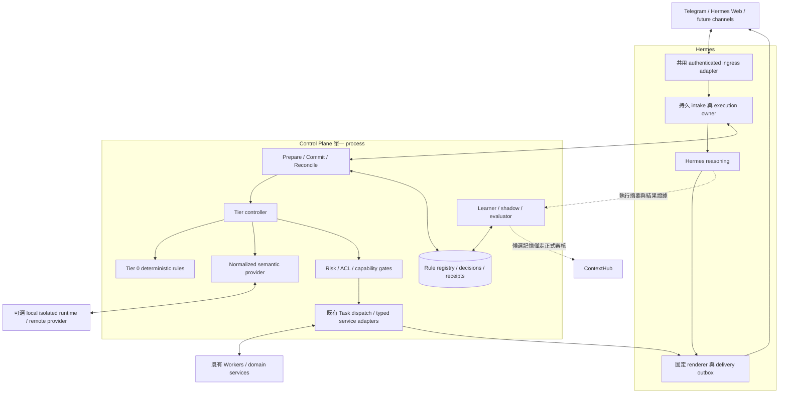

# Adaptive Cascade Dispatch Engine — HLD

日期：2026-09-21｜版本：1.0｜狀態：設計提案，尚未實作、部署或完成 runtime 驗收。

依據：[原始需求](requirements/adaptive-cascade-dispatch-engine-requirements.md)（保留原文）、使用者補充「BGE-small 是 MVP reference implementation，不是硬性 dependency」。下游：[Detailed Design](adaptive-cascade-dispatch-engine-detailed-design.md)。

## 1. 目標與設計效力

在 Hermes 啟動 LLM 前，先以確定性規則與可替換的輕量語意路由處理已知、單一步驟、已授權的唯讀請求。成功後，以固定格式透過 Hermes 原頻道交付，整条路徑不呼叫 LLM。未知、複雜、歧義或證據不足的請求交回 Hermes。

本設計擴充 [Platform v2 HLD](personal-ai-platform-v2-hld.md) 的 CP routing／dispatch 能力。Hermes 仍擁有規劃、目標、排程、原生技能、複雜成果驗收與交付；CP 新增的是受政策限制的已知工作選擇與規則資料管理，不是通用決策大腦。編譯規則是有限 action template，不取代 Hermes Skill authority。

精確率優先於覆蓋率；abstain 是正常結果。模型故障不能使 Hermes 不可用，但已受理執行的請求不能因 timeout 再交給 Hermes 重做。

## 2. 本機基準與落差

核對 CP commit：`78d37f3e52ff5283abf1d2c79c7ca05840fb360e`。本輪未查詢 NAS。README 原有修改與 Grok 研究檔案不是本次產物。

| 本機可用基礎 | 依據 | 本次需要新增或驗證 |
| --- | --- | --- |
| Node.js／TypeScript、SQLite | [package.json](../package.json)、[database.ts](../apps/control-plane/src/db/database.ts) | additive dispatch tables，沿用單一 writer |
| 六態 Task、Run／Attempt、執行確定性 | [TaskService](../apps/control-plane/src/tasks/task-service.ts) | 將 typed operation 綁定原 Task／receipt，不能建第二套 Worker scheduler |
| 宣告式 operation catalog | [operation-catalog.ts](../apps/control-plane/src/control/operation-catalog.ts) | service health／Radar 等實際 adapter 與精確參數/result schema；catalog 標示 unavailable 的能力不能拿來派工 |
| Worker 資格與資源選擇 | [scheduler.ts](../apps/control-plane/src/scheduler/scheduler.ts) | logical worker selector，dispatch 前重新驗權限、capability 與 freshness |
| Hermes MCP、runtime adapter | 相鄰 AiSecretaryChloe repository 的 services/hermes_runtime | 本輪未證明存在共用 pre-LLM hook；必須新增／核對入口 integration，MCP tool 本身不足以 bypass LLM |

所有以下 API、table、budget、threshold 與模組名稱均是新增規格，不表示目前已支援。跨 repository Hermes integration 是 MVP 必要交付。

## 3. 主要架構決策

| ID | 決策 | 理由與代價 |
| --- | --- | --- |
| H01 | Cascade orchestration 放在 CP process；入口與交付 adapter 放在 Hermes | Telegram／Web 使用同一政策；多一次私有 HTTP 往返 |
| H02 | Tier 0 必備；Tier 1 可關閉；tier 用有序設定而非固定編號邏輯 | 無模型也能部署／啟動；新增分類器不修改規則 |
| H03 | SemanticRouterProvider＋Calibration 封装為 normalized match boundary | 原始 cosine 不跨模型比較；更換模型需重建 index／calibration／驗收 |
| H04 | BGE-small-zh-v1.5 僅是可選 MVP reference provider | 不列入 CP 必裝套件、啟動、DB migration 或 CI 基礎測試依賴 |
| H05 | 規則、release、校準證據存 CP SQLite／artifact；向量 index 是可重建衍生物 | 不引入向量 DB、Redis；不可把 vector 當穩定領域 schema |
| H06 | CP prepare 無執行；Hermes 先持久固定執行 owner，再 commit | CP outage 可以安全回到 Hermes；commit 不明時必須對帳 |
| H07 | MVP 所有 cheap tier 只執行明確 allowlist 的唯讀 operation | 防止 exact match 成為寫入繞道；read-only 仍需 ACL |
| H08 | 規則是資料，不容許任意 script、shell、URL、eval 或 prompt 執行 | 學習不能取得新的能力或改 production source |
| H09 | Shadow 只預測；Hermes 行動是對照訊號，不是真理 | 須有 outcome、獨立標籤與修正證據，避免模仿錯誤 |
| H10 | 快速路徑以 schema validator＋Hermes 固定 renderer 驗收交付 | 成功路徑不需 LLM 潤飾；結果無法驗證才轉入明確 recovery |
| H11 | 規則啟用採 immutable routing release＋原子指標切換 | 多一層 version pin，換 provider 不出現舊校準混用 |
| H12 | Learner 為 CP 有界背景工作，先統計，後選擇性 generalization | 低 QPS 不增加常駐 AI；MVP 預設人工 promotion |

## 4. 元件與資料流

Ingress 與 response routing 使用 Hermes 保存的不透明 conversation reference。CP 不接觸 bot token，不接受請求指定任意收件者。

| 資料 | Authority | 限制 |
| --- | --- | --- |
| 原對話、身分、execution owner、delivery receipt | Hermes | CP 只持來源參照與必要 routing input |
| Rule revision、active release、decision、promotion history | CP | Hermes 只能提出 candidate，不能自行啟用 |
| Worker execution、Run／Attempt／artifact | 既有 CP／Worker protocol | Cascade decision ID 連結原有 facts |
| 原生工具 action receipt | 原本工具 owner | 不偽造 Worker Task |
| 專用 replay corpus、labels、calibration profile | CP 受 ACL 保護的 evaluation artifacts | 經去識別化／保留期限控制；不作一般共享記憶 |
| 共享長期記憶 | ContextHub | candidate-first，規則 confidence 不等於使用者採納 |

## 5. Cascade 行為

先做 authentication、session／message eligibility 與輸入限制。已有待回答問題、工具回覆、引用他人指令、附件、編輯後訊息、複合／条件／否定／診斷請求，MVP 直接回 Hermes。不得只看 `restart` 或 `status` 一個詞。

Tier 0 以完整句型、確定 entity、完整參數匹配；相同優先級出現不同 action 則 abstain。Tier 1 僅對符合語言／長度條件的單一請求分類。Provider 回傳有校準依據的 assurance 與 abstain，domain policy 再決定是否足以派工。任何 tier 都不能自己指定授權或 Worker endpoint。

Tier 是有穩定 ID 的 ordered list，末端固定是 Hermes fallback。未來可插入 multilingual 或 small-model tier；全域 routing deadline 與 privacy policy 限制整條鏈。強模型也不能越過執行 gate。

| 請求 | 預期行為 |
| --- | --- |
| `ContextHub status` | Tier 0，service health typed operation |
| `ContextHub 還活著嗎？` | Tier 1 或已存在完整 alias；只有校準達標才接受 |
| `幫我 check ContextHub status` | technical tokens 不計為英文長句；entity 必須唯一 |
| `幫我看看 ContextHub 最近為什麼一直 restart` | 診斷請求，Hermes |
| `restart InformationRadar` | 辨識寫入，Hermes 與既有 policy |
| `如果 ContextHub 掛掉就重啟` | 複合寫入工作，MVP 不編譯執行 |
| `今天 Radar？` | 要有穩定 period extractor 與校準證據；不足即 abstain |

## 6. 模型獨立性與資源

Domain rule 只描述 intent、例句、slots、operation 與 assurance policy。Embedding dimensions、tokenizer、pooling、quantization、similarity threshold、index format 全部留在 provider bundle。BGE、MiniLM、GTE、專用 classifier、private remote endpoint 皆可實作同一 normalized interface；不要求所有 provider 都產生 embedding。

BGE-small reference implementation 的量化格式、runtime、CPU ISA、繁中／混合語言品質與常駐 RAM 都需測量。需求中的 15–30 MB 是期望的權重體積，不是已證實可取得的 artifact，也不是 RSS 承諾。官方 model card 列出 BGE 的模型配置；llama.cpp embedding example 涉及 pooling／normalization，因此不能僅憑 GGUF 副檔名判定相容。[BGE model card](https://huggingface.co/BAAI/bge-small-zh-v1.5)、[llama.cpp embedding example](https://github.com/ggml-org/llama.cpp/tree/master/examples/embedding)。

初版 CP 不載入 PyTorch。可選獨立 inference container 有 CPU／memory limit；超出预算時禁用該 provider，仍提供 Tier 0＋Hermes。若需求 47 的語意啟用驗收尚未通過，只能稱 deterministic foundation，不能宣稱完整 MVP。

詳細预算與 resident／lazy／remote trade-off 見 DD §12；全數是待實測設計目標。

## 7. 學習與品質治理

`成功執行摘要 → action signature 統計 → Candidate → Shadow → Active → Shadow / Disabled → Archived`。

Action signature 固定 operation schema、logical selector、參數名稱／型別與已驗證的 extractor；觀測的完整 canonical action 另外保留實際 entity／時間窗等參數值。只有「都查詢 health」而目標不同，不足以證明 extractor 正確。

MVP 提供統計推薦、受控 candidate API、shadow comparison、人工 promotion／disable 及降級。自動 AI generalization、自動 promotion、compiled multi-step workflow 分期啟用。自動 promotion 仍需 owner 事先啟用政策與足量獨立證據，不會因模型聲稱 `safe_to_dispatch=true` 就放行。

模型 replay／shadow 與 rule lifecycle 分開版本化。新 provider 必須重新校準，不承接舊 provider 的 confidence。Active 規則以固定比例 audit holdout 走正常 Hermes，持續取得對照；一般 cheap success 不額外呼叫 LLM，也不以「沒有客訴」當正確 label。

## 8. 故障、風險與回覆

prepare 失敗／model timeout／低信心／未知能力均可安全 fallback，因為 prepare 不發 action。Hermes 一旦持久選擇 CASCADE 並送 commit，必須以同 key 對帳；未確認 CP 未開始前不可更換 owner。這是需求 safe fallback 的一致性邊界。

安全／ACL denied 回覆受限結果，不能把 bypass policy 當 fallback。寫入請求可交 Hermes 推理，但原權限／approval requirement 隨 handoff 保留。Worker read-only 不代表可讀任意 log／memory／calendar。

執行成功、schema 驗收成功、頻道 delivery 成功分開記錄。快速路徑 template 帶來源、觀測時間與缺資料說明；不能把 service 回應錯誤渲染為健康。投遞 timeout 只重試 delivery，不能重跑 action。

## 9. 分期、驗收與 rollback

| 階段 | 交付 | Exit gate |
| --- | --- | --- |
| P0 Foundation | Hermes Telegram／Web 共用 pre-LLM seam、prepare/commit、單一唯讀 adapter、Tier 0、telemetry | 原頻道成功回覆且 LLM counter delta=0；timeout/重送不重複執行 |
| P1 Semantic MVP | Provider abstraction、可選 reference provider、校準／replay、resource gate | 開關可用；換第二個測試 provider 規則原文 hash 不變；實際 semantic provider 品質／資源達標 |
| P2 Learning MVP | Candidate/Shadow/Active、revision／disable／degrade、statistics | 至少一條規則完成生命周期，無 shadow 執行；滿足需求 47 全部條件才稱 MVP |
| P3 Adaptive | 自動候選生成、policy-controlled auto promotion、remote tier | learner budget、privacy、獨立品質 gate 全通過 |
| P4 Workflow | immutable bounded DAG 與逐步 effect checks | 與 Hermes Skill 版本綁定、停止／部分效果／補償／approval 規格另行設計 |

NAS release 前先隔離本機測試，再資料＋secrets/config backup 驗證、不可變映像、gateway validate/deploy/status、真實頻道驗收。此文件不授權部署。

Rollback 先禁用新 intake，已受理 operation 仍對帳；可獨立回退 routing release/provider bundle 或 CP/Hermes image。新版本 additive DB 保留，禁止用舊 DB backup 覆寫新 Task 或 delivery 事實。具體流程見 DD §14。

## 10. 需求覆蓋與待驗證事項

| 原始需求章節 | HLD 決策／範圍 | DD 落點 |
| --- | --- | --- |
| 1–7、43、51–52 | 目標、角色、精確率、範例 | §1、§3、§15 |
| 8–12、25–27、35、38 | H02–H04、provider、language、calibration | §3–§4、§12 |
| 13–22、33–37、44 | H05、H08–H12、學習、Worker integration | §5、§7–§10 |
| 23–24、39、42 | H06–H07、安全與 privacy | §6、§11、§13 |
| 28–30 | H01、H06、H10、Hermes integration | §2、§6 |
| 31–32、40–41 | telemetry 與 resource budget | §12–§13 |
| 45–50 | 元件、契約與驗收 | DD 全文，尤其 §15–§16 |

實作前的技術驗證：Hermes deployed upstream 的 Telegram／Web 共用 hook 位置、可用唯讀 operation adapter、BGE reference artifact 相容性／RSS、現有 credential scope 擴充方式。這些未確定項目不影響上層設計；未通過的能力保持 disabled/unavailable，不能以文件或 healthz 取代驗收。
