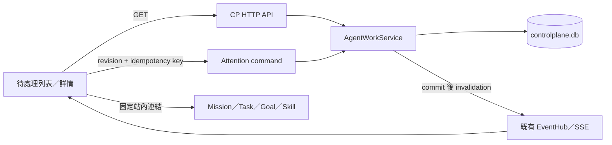

# 待處理中心與後續工作功能 — Detailed Design

日期：2026-10-03。設計基準為目前 checkout；production 狀態未重新驗證。
本文件完成設計後交付一個 GPT-6 Luna／xhigh agent 實作工作包 A；主 agent 獨立審查與驗證。

## 1. 需求與優先順序

目前 Personal Agent Work 已有 SQLite domain、HTTP API、技能／Goal／Routine／Attention 投影。Web 的 `AgentWorkPage` 只列資料，使用者無法在待處理頁完成已讀與暫緩操作。Routine 頁讀 `/api/v2/routines`，server 實際提供 `/api/v2/routine-bindings`。Home 的待處理仍來自 `task_dispatch_state`，不能直接冒充 agent-work Attention。

| 工作包 | 可交付功能 | 依賴／完成邊界 |
| --- | --- | --- |
| A：本次實作 | 待處理中心：篩選、詳情、證據、已讀、暫緩、恢復顯示、相關工作連結；修復 Routine 列表 URL | 現有 CP domain；不需要 Hermes provider；只處理已持久化 Attention |
| B：接續設計方向 | 技能／Goal 詳情與有界控制；版本、靜態驗證與實際試跑分開；Goal 里程碑證據與预算顯示 | 現有 API 可先做唯讀；真實技能試跑與 milestone acceptance 仍需 executor receipt，另寫實作 DD |
| C：後續整合方向 | Hermes Routine 正式同步、觸發／交付回執、通知去重 | 跨 repo scheduler／delivery adapter；CP 不建第二套 cron；另做協定與 live 驗收 |

本輪完整可執行規格是 A；B／C 是排序與依賴說明，不能當已完成的 detailed design 或委派範圍。

使用者應能回答「什麼需要我處理、原因與證據是什麼、回哪個工作處理」。標記已讀僅影響閱讀狀態；暫緩僅影響列表顯示。兩者不能批准外部操作、取消 Task、改 Goal 或視為問題已解決。

## 2. 現有落點與已確認缺口

- `apps/control-plane/src/agent-work/agent-work-service.ts`：`listAttention`、`upsertAttention`、`attentionCommand`、`attentionProjection`。
- `apps/control-plane/src/db/office-migrations.ts`：migration 13 的 `attention_items`、`agent_operations`、`agent_events`，沿用既有 schema。
- `apps/control-plane/src/server.ts`：現有 list 與 command route；缺 Attention detail route。
- `apps/control-web/src/app.ts`：通用唯讀列表與 SSE refresh；新增獨立頁面元件。
- `test/agent-work.test.ts`：既有基本去重、READ 與 HTTP projection 測試。

現有 SNOOZE 接受 0／過去時間，沒有到期投影；command 未檢查 feature flag；command 後未 publish SSE。`upsertAttention` 只從活動項目取 episode，歷史 SUPERSEDED 後再次建立可能撞唯一鍵。失敗 operation 的相同 key replay 可能回 HTTP 200 REJECTED，前端不得視為成功。

## 3. 架構與權責



單 process／SQLite；DB 交易內不呼叫 HTTP 或模型。Hermes 負責通知表達與 provider delivery，ContextHub 保持 memory authority。本輪不自動生成新 Attention、不接 Telegram、不做 background poller 或通知發送。

## 4. 資料與投影

不新增 migration、table 或 durable timer。保留既有 camelCase read projection，snake_case command body。

| 欄位 | 語意 |
| --- | --- |
| state | 持久狀態 `OPEN / SNOOZED / RESOLVED / SUPERSEDED` |
| revision | command CAS revision；SNOOZE／UNSNOOZE 增加，READ 不增加 |
| changeRevision | 語意內容 revision；閱讀進度以此為準 |
| readThroughRevision | 已讀語意 revision；READ 更新為 max(current, changeRevision) |
| effectiveState（新增） | SNOOZED 且 snoozeUntil <= observedAt 時投影 OPEN；其他沿用 state |
| isUnread（新增） | readThroughRevision < changeRevision；暫緩與恢復不製造未讀 |
| observedAt（回應） | 本次 server 時間 ISO UTC，作到期判斷基準 |

到期只改投影，不改資料或 revision。GET 不寫 DB、不新增 events、不授予效果。SNOOZED 缺少 snoozeUntil 的舊資料視為到期 OPEN，避免永遠隱藏。正式 producer 才能判定 RESOLVED，本輪 UI 無「解決」按鈕。

`upsertAttention` 同 fingerprint 的活動 row 保持不變；不同 fingerprint 以既有行為 supersede 活動 row、建立新 episode。episode = 同 subject_kind／subject_id／reason_code 的歷史 MAX(episode)+1，計算與寫入同交易。每個新 episode 初始 changeRevision=1、readThroughRevision=0，形成新未讀事件；不重用已終結的 row。

## 5. HTTP 契約

### 5.1 列表

`GET /api/v2/attention?state=OPEN&severity=HIGH&limit=50`

既有 route 與回應 `{ items, observedAt }` 保持。`state` 對 effectiveState 篩選，使已到期的暫緩項目回到 OPEN。允許上述四個 state；severity 允許 LOW／NORMAL／HIGH／CRITICAL。limit 預設 50，必須為 1–100 的整數，無效值 HTTP 400 `INVALID_FIELD:*`。順序為 severity CRITICAL→HIGH→NORMAL→LOW，再 updatedAt DESC、id DESC；有效篩選應在 LIMIT 前套用，不能先取 50 筆再篩。

本輪不宣稱總數／全域未讀數。UI 標明「目前顯示 N 筆（最多 100）」；使用 limit=100，摘要只計算目前結果。搜尋在已載入結果中匹配 reasonCode／subjectId，不假裝全庫搜尋。

### 5.2 詳情

新增 `GET /api/v2/attention/:id`，回同一 Attention projection 加 observedAt。不存在回 404 `ATTENTION_NOT_FOUND`；state 篩選不影響直接讀歷史 item。沿用既有 evidence／actionRef 原始資料，不額外讀取 cookies、token 或秘密。actionRef 即使含外部 URL 也只是未受信任的資料，不能由本輪 API 或 UI 轉為可執行入口。

### 5.3 Commands

沿用 `POST /api/v2/attention/:id/commands` 與 `Idempotency-Key`。

```json
{
  "kind": "SNOOZE",
  "expected_revision": 3,
  "payload": { "snooze_until": 1791122400000 }
}
```

上例時間只展示 epoch-ms 格式，實際請求由 server now 驗證。

| kind | 前置條件 | 原子更新 |
| --- | --- | --- |
| READ | 任意已存在 state；feature enabled | readThroughRevision=max(current, changeRevision)；不改 state／revision |
| SNOOZE | 持久 OPEN／SNOOZED；feature enabled；now < until <= now+30 days | state=SNOOZED、snoozeUntil=until、revision+1 |
| UNSNOOZE（新增） | 持久 SNOOZED，包含到期項目；feature enabled | state=OPEN、snoozeUntil=null、revision+1 |

RESOLVED／SUPERSEDED 不可 SNOOZE／UNSNOOZE，HTTP 409 `INVALID_ATTENTION_STATE`。既有 `DISMISS_SUGGESTION` 不在本輪 UI 顯示，不擴充其權限；若調整共同 command handler，仍保留已有契約。READ／UNSNOOZE 無 payload 或 null；SNOOZE payload 嚴格只允許 snooze_until。拒絕未知 body 欄位與 non-integer revision，無效輸入 400。

每筆操作先檢查 feature，沿用既有 actor／idempotency scope；CAS 必須在 transaction 中核对最新 row。成功保存 APPLIED operation result + durable event，同交易完成；commit 後 publish `agent-work.attention.updated`，同 key 成功 replay 不增加 revision／event。重複 READ 可保留既有 operation 審計規則，不要求重寫全部 agent-work event infrastructure。

同 key 不同 request hash 回 409 IDEMPOTENCY_CONFLICT。過期 revision 回 409 REVISION_CONFLICT。失敗 operation replay 若沿用既有 200 REJECTED，UI 必須檢查 state；不得當成功。修復 shared operation helper 非本輪必要範圍，避免影響其他 domain。

## 6. Web 詳細行為

新增 `apps/control-web/src/attention/attention-page.ts`，路由 `/attention`、`/attention/:id`；共用小型純函式 helper／型別可放同目錄。沿用 React.createElement、既有視覺樣式，可增加範圍明確 CSS。切換頁面時不保留舊 item 的 pending mutation。

列表提供狀態（預設 OPEN）、severity、未讀（本頁篩選）、本頁搜尋、載入／空值／錯誤／重試。每項顯示原因、severity、未讀、subject、effectiveState、更新時間與暫緩期限，連到 detail。原始 reason code 保留於次要資訊，熟悉 code 可用中文 label；未知 code 用「需要查看」並保留 code，不能虛構原因。

詳情顯示原因、來源、期限、證據（結構化文字或 JSON details，不使用 innerHTML）、相關工作連結及 READ／暫緩 1 小時／24 小時／恢復按鈕。所有时间顯示 `Asia/Taipei`。打開詳情不自動 READ，使用者明確按「標記已讀」才變更。

相關連結由 subjectKind + encodeURIComponent(subjectId) 產生固定站內路徑：TASK `/tasks/:id`、MISSION `/missions/:id`；GOAL `/goals`、SKILL `/skills`、ROUTINE_BINDING `/routines`（後三者目前無詳細頁，顯示「查看列表」）。未知種類只顯示 ID。忽略 actionRef 內的 arbitrary URL／HTML／command，不執行其內容。

capabilities.attention.available=false 時仍可讀历史，控制 disable 並顯示原因；server feature gate 為最後 authority。發送中 disable 同 item 按鈕；結果 confirmed APPLIED 後 refetch，不提前顯示已套用。保留 focus 與清楚成功／失敗訊息，不能只靠顏色。

每次操作固定 key、body、revision；網路／回應解析失敗視為結果未確認，保留同 key/body，提供「重試同一操作」，先禁止該 item 新 command，避免未知時換 key 重送。明確 409 或 REJECTED 表示失敗，refetch 最新投影、顯示需重新操作，不自動改 revision 重送。成功操作或確定拒絕後才清除 pending。

SSE／refreshVersion 觸發 read refresh；使用 alive flag 或 AbortController 避免晚回應覆蓋較新 route／filter。SNOOZE 到期沒有 SSE，因此頁面可見時每 30 秒刷新讀取；頁面隱藏停止 interval、恢復可見立即 refresh，unmount 清除。timer 只讀 API，不發 command／通知。manual refresh 保持可用。

獨立修復 AgentWorkPage routine listPath 為 `/api/v2/routine-bindings`。不改 README 既有 dirty work，也不改 Home 的 task attention authority。

## 7. 故障、容量與相容性

服務重啟後由 DB 還原已讀、snooze 與 operation result，沒有 timer 恢復負擔。restore 的 authority epoch 沿用既有流程；本輪不新增跨服務效果。feature off 不刪資料，禁止新 commands、允許讀历史。

單使用者入口，單頁最多 100 筆；30 秒讀取間隔不要求新增 caching 系統。若實測資料量造成慢查詢，再追加 index／cursor，不在本輪先引入 migration。不得將頁內計數宣稱完整總量。

投影新增欄位相容既有 consumer，GET route additive。state filtering 的到期語意是本輪明確變更；既有 default 無 state filter 仍回歷史。沒有 NAS deploy、push、feature enable 或外部訊息發送。

## 8. 工作包 A 驗收與委派界線

| ID | 必要測試／證據 |
| --- | --- |
| AC-01 | 列表／detail HTTP：未知 ID 404；state／severity／limit 無效值 400；有效 state 在 limit 前篩选 |
| AC-02 | READ 不改 state/revision、不執行來源操作；SNOOZE／UNSNOOZE 不新增未讀 |
| AC-03 | 固定 now 測試過去／0／超過30天／NaN／non-integer snooze 拒絕；終結 row 禁止暫緩 |
| AC-04 | 到期投影 OPEN、DB仍SNOOZED、revision 不變；restart／持久 DB重開仍一致 |
| AC-05 | 同 key replay 不重複 mutation/event；不同 body 衝突；stale revision 保留原資料 |
| AC-06 | feature off 禁止 command；READ／SNOOZE／UNSNOOZE 成功後有 SSE invalidation |
| AC-07 | 既有終結 episode 後再次 upsert 不撞 UNIQUE；同 fingerprint 不重複項目 |
| AC-08 | Web 純邏輯測試固定站內連結與編碼、未知來源不產生 URL、REJECTED 不顯示成功；網路未知沿用 key/body |
| AC-09 | Routine 頁正確 endpoint；Attention route、禁用與錯誤狀態可本機驗證 |
| AC-10 | npm run check、npm run typecheck、npm test、npm run build:web；有 skip 要單獨報告 |

以 service／HTTP integration tests 驗證狀態機與資料不變量，Web 邏輯抽出純 helper 可測；不以 source 字串存在當互動驗收。不為本輪增加大型 browser test framework。可用瀏覽器時做本機 rendered smoke，否則明確記錄 UI 互動尚未驗證。

agent 僅改工作包 A 的 source、tests、新設計／狀態文件。不得修改 unrelated README／Grok research、Compose、release coordinates、production DB／設定、跨 repo source，不 commit／push／deploy。使用 `rtk` 執行 shell 命令。完成時報告變更、檢查結果、skip、未驗證範圍。主 agent 獨立看 diff、查關鍵安全／失敗語意、執行必要檢查後才做完成宣告。
