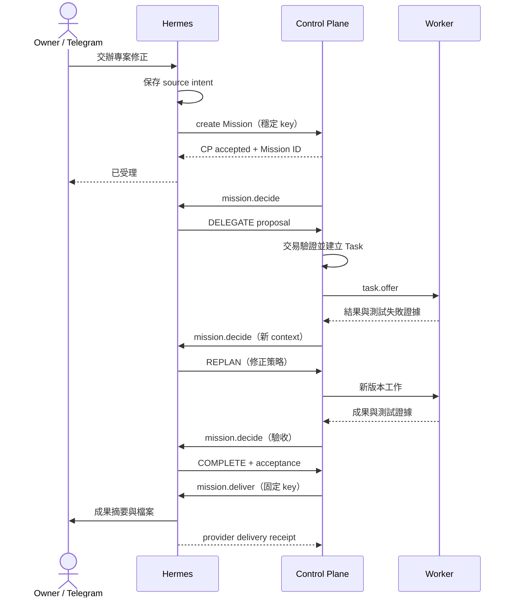

# Hermes 中控大腦第二版 — Detailed Design

日期：2026-09-09　文件版本：2.0

狀態：**核心已實作於本機，待雙 repository CI／live 驗收**。新增欄位、工具、API、設定與測試 ID 中，標示為未連接的 provider／Hermes hook 仍不可宣告可用。

本輪已落地：CP additive migration 11/12、v2 Mission contract、source-intent 去重、context／control／objective revision fencing、`mission.decide` 的 COMPLETE／DELEGATE／WAIT／ASK_OWNER／SELF_TOOL admission／REPLAN／STOP 分流、直接完成驗收與成果 delivery outbox、能力快照 endpoint、typed operation catalog、append input／reopen API，以及 Hermes adapter/client 的 v2 command serializer。尚未落地：真實 Telegram intake／conversation binding、Hermes 原生 scheduler occurrence、工具 permission／receipt wrapper、artifact 串流 API 與 provider-level channel delivery；這些仍需依第 15 節做 integration／live 驗收。

上位設計：[HLD](hermes-control-brain-v2-hld.md)。底層交易、Task／Worker 與 Office invariant 沿用 [既有 Detailed Design](virtual-office-detailed-design.md)，差異以本文為準。

## 1. 基準、格式與不可變條件

### 1.1 原始碼基準

| repository | 核對 commit | 已讀取的主要位置 |
| --- | --- | --- |
| PersonalAiControlPlane | `92f5c186eb9c776346ef95f79abbed2872684c93` | `missions/{mission-service,plan-service,coordinator,command-dispatcher}.ts`、`db/office-migrations.ts`、`server.ts`、`packages/contracts/src/office/index.ts`、`control-web/src/app.ts` |
| AiSecretaryChloe | `b978b289a541f56b6acb78d2bf9a73cc21b66c01` | `services/hermes_office_adapter/office_adapter.py`、`apps/chloe-linebot/adapters/hermes/scripts/pai_control_plane.py` |

前一列 paths 的 `missions/`、`db/`、`server.ts` 位於 `apps/control-plane/src/`。本輪未檢查正式 provider／Telegram 執行，不能把這些 commit 等同 live image。

### 1.2 Contract 約定

- `/api/v2` 路徑保留。新增 brain contract 使用 `brain_protocol_version: 2`，不要與 HTTP API v2、Worker protocol v2 或舊 Office `protocol_version: 1` 混用。
- 擴充現有 Office envelope，保留 `protocol_version: 1` 作傳輸格式；只有雙端公告 `brain_protocol_versions: [2]` 才能送新 command kind。舊端未知欄位可能 strict-reject，故協商前不發送。
- HTTP public request／工具輸入及 internal JSON 採 snake_case；public response 採 camelCase；internal request/response 採 snake_case。工具 adapter 做明確 serializer 轉換。
- UUIDv7 作 domain ID；外部 source keys 使用穩定 hash。時間為 UTC milliseconds（DB）、RFC 3339（API），排程另保存 IANA timezone，預設 `Asia/Taipei`。
- strict schema 拒絕未知欄位；字串上限、一般 request 1 MiB、command/result 2 MiB 沿用既有規格。檔案走 artifacts，禁止把大檔 inline 塞進 prompt。
- 以下 JSON 使用短 ID 作示意；實作測試替換成合法 UUID。JSON 範例本身必須可解析。

### 1.3 Invariants

| ID | 必須成立 |
| --- | --- |
| B-I01 | 同一 source intent 在 CP 最多建立一件 Mission；重送相同 key 不新增工作 |
| B-I02 | 同一 Mission Run 最多一個可提交的 supervisor decision turn；背景 worker steps 可依上限並行 |
| B-I03 | 決策、state mutation、budget reservation、衍生 command 與 receipt 同一 CP transaction 提交 |
| B-I04 | LLM、HTTP、Telegram、檔案串流都在 DB write transaction 外執行 |
| B-I05 | context/objective/control revision 或 authority epoch 不符，舊決策不能啟動新工作 |
| B-I06 | supervisor 不執行副作用；SELF_TOOL 必須先獲接受並取得執行 permission receipt |
| B-I07 | 工具完成、step 驗收、Mission 完成、Telegram 接受分開保存 |
| B-I08 | transport retry 沿用 key；新的邏輯執行才建立 attempt 並扣額度 |
| B-I09 | 未知執行／未知副作用不能靠換 attempt、換 Worker 或重建 Mission 消除 |
| B-I10 | scope 由可信 owner 輸入與既有 policy 決定；模型、artifact、工具輸出不能授予自己新權限 |
| B-I11 | 排程只有 Hermes authority；CP 的 wait timer 不建立新排程 occurrence |
| B-I12 | 等待與完成的任務不占用正在推理的槽位；網頁關閉不改變任何 Mission 狀態 |

## 2. 模組分工與整合介面

| 位置 | 責任／必要改動 |
| --- | --- |
| CP `missions/mission-service.ts` | intake 去重、補充 input、objective/scope revision、source reference、reopen |
| CP `missions/coordinator.ts` | v1/v2 run 分流、決策喚醒、結果套用、失敗再判斷、wait/recovery、直接完成 |
| CP `missions/plan-service.ts` | plan fragment 合併成 immutable revision、依賴／能力／scope 檢查、受影響工作停止後啟用 |
| CP `missions/command-dispatcher.ts` | 沿用 lease/outbox，新增協商與 v2 command kinds；ACK 仍只改 transport state |
| CP 新增 `missions/brain-contract.ts` | 純 schema 驗證、action union、context serializer，不呼叫模型 |
| CP 新增 `control/operation-catalog.ts` | 全業務操作目錄、typed parameters、必要 policy、CAS、idempotency 與 service routing |
| CP 新增 `capabilities/catalog.ts` | Worker 與 Hermes 能力快照、版本、TTL、dispatchability；不代理持有工具 secret |
| CP artifacts／contracts／Web | Mission 上傳與授權下載、接受證據、公開投影、原有操作共用 service |
| Hermes 現有 `services/hermes_office_adapter/` | 擴充 source intents、conversation binding、v2 consumer、execution／delivery adapter；沿用單一 adapter DB |
| Hermes 現有 `pai_control_plane.py` | 擴充 typed client；保留 legacy Task 呼叫供舊工作，新增工具走完整 contract |
| Hermes channel hook（新增） | 原始 Telegram event 的可信來源、reply binding、附件、owner 控制；不以 LLM 產生 chat ID |
| Hermes scheduler hook（新增） | schedule metadata、occurrence ledger、overlap、misfire、CP create 對帳 |
| Hermes tool wrapper（新增） | 真正工具呼叫前後記錄、permission 驗證、query/cancel handle、artifact ingestion |

新模組僅拆必要職責，不要求重構整個 server 或 Web。Hermes adapter 必須實際呼叫既有 Hermes Agent runtime，沿用其工具與頻道；單純呼叫裸 LLM API 不滿足整合驗收。

### 2.1 三個 execution lane

1. **前景對話／控制**：Telegram intake、CHAT、查詢、pause/cancel。已知控制操作直接走 typed tool，不排在長背景推理後方。
2. **背景 supervisor**：`mission.decide`，讀 context、ContextHub 與唯讀工具後提交 action。禁止改檔、派工、發送訊息等副作用工具。
3. **背景 execution／delivery**：受接受 action 驅動的 `tool.execute`、既有 `step.execute`、`mission.deliver`；工具呼叫受執行 scope 約束。

三條是權責與佇列，不保證三個 LLM 並行。Hermes runtime 若只提供一個 Agent 槽，所有 Agent turn 共用該槽；前景控制可由非 LLM handler 優先處理，前景需要模型時顯示等待。不得藉增加 role profile 超額執行。

supervisor 的唯讀限制必須由 runtime tool allowlist 與 wrapper 強制執行，不能只寫在 system prompt。若目前 Hermes run API 無法隔離工具或攔截副作用，該 runtime 的 `supervisor_read_only=false`，阻止 v2 自主執行啟用，並在 Hermes repository 補 adapter/runtime 支援；不能宣告已具備安全的決策 lane。

## 3. 持久資料模型

### 3.1 CP additive schema

實作 migration 編號以當時 DB migration 尾端接續，不固定宣稱下一版號。不重建 fresh DB；舊資料補預設 `brain_protocol_version=1`。

| 表／欄位 | 規格與約束 |
| --- | --- |
| `missions` 擴充 | `source_intent_key TEXT NULL`、`conversation_ref TEXT NULL`、`acceptance_json TEXT`；source key 非空時唯一；完整 Telegram routing 不放 CP |
| `mission_runs` 擴充 | `brain_protocol_version INTEGER DEFAULT 1`、`brain_state TEXT`、`context_revision INTEGER DEFAULT 1`、`decision_generation INTEGER DEFAULT 0`、`current_decision_command_id TEXT NULL`、`decision_pending INTEGER DEFAULT 0` |
| `mission_runs` context | acceptance／scope／limits／objective snapshot 在 run 中版本化；read-only 查詢與 UI refresh 不增加 context revision |
| `mission_commands` | 沿用 command/result JSON 保存決策，不另建第二份 decision authority；新增 v2 kinds、context revision 與 generation 到 envelope |
| `mission_decisions` | 沿用作 owner 待回答問題，`kind=OWNER_INPUT` 或 `SCOPE_EXTENSION`；answer 僅由可信 owner channel 提交；不是任意模型 approval |
| `mission_waits`（新增） | `id, mission_run_id, decision_command_id, reason, subscription_json, deadline_at, state, satisfied_event_id`；每個 decision command 最多一個等待紀錄 |
| `mission_tool_operations`（新增） | `id, execution_id NULL, command_id, tool_id, operation_key, request_hash, effect_class, state, external_handle_json, result_hash, result_json, scope_revision, updated_at`；operation key 唯一；可查 unknown／停止證據；supervisor 查詢歸屬 command，SELF_TOOL 同時歸屬 execution |
| `mission_acceptance_checks`（新增） | `id, mission_run_id, criterion_id, objective_revision, subject_hash, verdict, evidence_json, reviewer_ref, producer_command_id, check_key, created_at`；`UNIQUE(producer_command_id, check_key)` 與 request hash 保證去重；不同 reviewer／新證據新增不可變 check，不覆寫舊 verdict |
| `operation_receipts` | 沿用 `(scope, operation_key)` 唯一；hash、response、operation ID、狀態。長操作不得把「已收件」當作「已生效」 |
| `mission_deliveries` 擴充 | `delivery_key, delivery_revision, result_hash, conversation_ref, uncertainty_reason`；不保存 Telegram token；沿用原有 state／receipt 欄位 |
| capability snapshot cache | 可重建的記憶體／DB cache；`snapshot_id, observed_at, expires_at, content_hash, entries`。不是 Worker registry 第二 authority |

索引：source intent unique；`mission_runs(brain_protocol_version, brain_state)`；`mission_waits(state, deadline_at)`；`mission_tool_operations(state, updated_at)`。使用 transaction + current command CAS 保證 B-I02；可另為 v2 未終止 supervisor command 加 partial unique index，predicate 必須涵蓋 claim／admitted／running 階段。

對 Mission 事件、inbox 及 receipt 不做外鍵級聯刪除來消除歷史。相同結果 hash 的重送返回原 receipt，不產生第二個 accepted event。

### 3.2 Hermes adapter additive schema

| 表 | 主要欄位與唯一鍵 |
| --- | --- |
| `source_intents` | `intent_id, source_key, source_hash, conversation_key, operation_kind, payload_json, state, cp_id, next_retry_at`；`UNIQUE(source_key)` |
| `conversation_bindings` | `conversation_key, provider_message_id, mission_id, mission_run_id, purpose, question_id, created_at`；`UNIQUE(conversation_key, provider_message_id, mission_id, purpose)` |
| `schedule_metadata` | native schedule ID、版本、overlap/misfire、notification policy；native cron expression／next fire 仍從既有 scheduler 讀取 |
| `schedule_occurrences` | `occurrence_key, schedule_id, schedule_revision, scheduled_for, intent_id, state, cp_mission_id`；`UNIQUE(schedule_id, scheduled_for)` |
| `tool_operations` | 同 CP operation key、request hash、執行狀態、provider handle、結果與 CP receipt；執行真實副作用的本地紀錄 |
| `channel_outbox` | `delivery_key, part_index, target_ref, content_hash, state, provider_message_id, attempt, last_error`；`UNIQUE(delivery_key, part_index)` |

既有 `office_commands` 保存 inbox、claim、driver handle 與 result pending acknowledgement；與上述表共用 adapter DB。本地 payload 包含必要交辦／routing，secret 仍在既有 runtime secret 管理中。

Hermes 的原生 session 不能作為唯一續接來源。即使 session 被壓縮或遺失，也要從 CP snapshot、source intent、artifact references 續接。

### 3.3 保留與刪除

活動／等待／unknown 的 key、receipt、成果 pin 不到期。終止後 source、operation、delivery receipt 預設保留 90 天；重送期限最多 30 天，必須小於 retention。原始對話沿用 Hermes 政策，CP 不複製聊天紀錄。封存可移除大型 payload，但保留去重 tombstone 與 hash；過期 tombstone 外的來源不接受自動 replay，回 `SOURCE_EXPIRED`，需明確新交辦。

## 4. Telegram intake 與任務定位

### 4.1 可信來源

channel hook 從現有 Telegram integration 取得 `bot identity, owner identity, chat_id, message_thread_id, message_id, update_id, reply_to_message_id, edited timestamp`。owner 綁定沿用既有頻道設定；群組其他使用者、轉貼或引用文字不繼承 owner 控制能力。

`conversation_key = hash(bot_identity, chat_id, message_thread_id-or-null)`。CP 收到不透明 `conversation_ref`；只有 Hermes 能解回實際收件地址。模型只能引用已提供的 conversation reference，不能任意指定新收件者。

### 4.2 去重與受理

1. 收到新訊息，先以 `(bot_identity, update_id)` 保存 raw intake 去重。相同 key 不同 hash 為衝突。
2. 分類 CHAT／MISSION／CONTROL。若一則訊息產生多個明確操作，保存固定 `intent_index`，重試不得重新分配序號。
3. MISSION／CONTROL 建立 `source_key = hash(bot_identity, update_id, intent_index)`，保存 payload 後發送 typed request。
4. CP 在單一 transaction 寫 source key、Mission／Run、首個 command、event 與 receipt。HTTP timeout 後以相同 key 重送或查詢，禁止產生新 UUID 當去重 key。
5. Hermes 收到 CP receipt 才寫 `CP_ACCEPTED` 並回報已建立任務；只完成本地保存時回「已收到，待中控受理」。

source intent 狀態：`RECEIVED → CLASSIFIED → CP_PENDING → CP_ACCEPTED`；永久 schema／policy 錯誤進 `REJECTED`，狀態不明保留 `CP_PENDING`。owner 在 CP 尚未受理前取消，標記 cancel intent 並對帳 create；若 CP 已建立，立即以同一 mission control 取消，不能僅刪本地佇列。

### 4.3 「剛才那件」解析順序

依序使用：明確 Mission ID → reply-to binding → 精確名稱且唯一 → 同 conversation 唯一 open question／active Mission。仍有多個候選時列出短名稱與 ID 請 owner 選擇。跨 chat 不默認共用目前任務。

每個 Hermes 回覆都記錄 provider message ID 與對應 Mission；單一回覆列出多件 Mission 時，reply-to 仍屬多候選，不能擅選。確認答案只關聯 `question_id + objective_revision`，過期問題不得更動新計畫。

### 4.4 訊息編輯、附件與範圍變更

- Telegram edited message 是新 source event，作為 append input；不覆寫已執行 instruction。保存原 message reference 與新的 update key。
- 附件由 Hermes 下載、檢查大小、上傳 CP Mission artifact、取得 digest 後才能綁定 input；取檔失敗顯示 `INPUT_UNAVAILABLE`。
- 附加來源、目標或完成條件增加 objective/context revision。只詢問狀態不增加 revision。
- scope 縮小即時阻止新 dispatch／tool admission；已進行操作要求取消並回報實際停止／unknown。不能宣稱可以撤銷已發生效果。
- scope 擴大必須有具體 owner 輸入與現有 policy 允許；先前 scope 內工作可繼續，受影響後續步驟等新 plan。

## 5. 核心 API 與工具契約

### 5.1 API 狀態標示

下表「沿用」指 route 已存在但需補 v2 欄位／serializer／測試；「新增」是設計，不可當作現有 endpoint。

| 狀態 | endpoint | 用途／並行控制 |
| --- | --- | --- |
| 沿用擴充 | `POST /api/v2/missions` | 必填 idempotency key；新增 source intent、acceptance、brain version |
| 沿用 | `GET /api/v2/missions`、`/:id`、`/:id/events`、`/:id/results` | 列表、事實、事件 cursor、成果；工具不猜 Task artifact 結構 |
| 新增 | `GET /api/v2/missions/by-source?source_intent_key=...` | create timeout 對帳；在 `/:id` 路由前比對 |
| 新增 | `POST /api/v2/missions/:id/inputs` | append input／scope amendment，expected objective revision |
| 沿用擴充 | `POST /api/v2/missions/:id/control` | PAUSE／RESUME／CANCEL，expected control revision；v2 必填 |
| 新增 | `POST /api/v2/missions/:id/reopen` | terminal Mission 新 Run，expected mission revision；不改寫舊 Run |
| 新增 | `POST /api/v2/missions/:id/questions/:question_id/answer` | owner evidence、expected objective revision；question 單次解答 |
| 新增 | `POST /api/v2/missions/:id/deliveries/:delivery_id/retry` | 只重送既有成果；DELIVERY_UNKNOWN 需符合 §11 的處理 |
| 新增 | `POST /api/v2/missions/:id/artifacts` | metadata 預留／串流上傳流程；完整 commit 後才 AVAILABLE |
| 新增 | `GET /api/v2/capabilities` | snapshot、工具／Worker 能力、TTL 與不可用原因 |
| 新增 internal | `GET /api/v2/internal/office/operations` | operation catalog；不可用功能也回傳原因 |
| 新增 internal | `POST /api/v2/internal/office/operations` | 執行 allowlisted CONTROL action；不可指定任意 HTTP path／shell |
| 新增 internal | `GET /api/v2/internal/office/operations/:operation_id` | 受理／已生效／失敗／未知與期望、觀察版本 |
| 沿用擴充 internal | `GET /api/v2/internal/office/commands/:id/context` | v2 supervisor／executor 專用 context |
| 沿用擴充 internal | `POST /api/v2/internal/office/command-results` | v2 action、tool result、final acceptance；同一結果 hash 去重 |
| 沿用 internal | `.../commands/:id/admissions`、`/progress`、`/stop-receipts`、`/failures` | attempt、lease、停止證據；沿用原規格 |
| 新增 internal | `POST /api/v2/internal/office/tool-operations/:id/admit`、`/receipts` | 工具副作用前授權重查，結果套用 |
| 沿用擴充 internal | `POST /api/v2/internal/office/delivery-receipts` | delivery revision、provider evidence、UNKNOWN |

內部介面只接受既有私有 peer policy 中可信 Hermes adapter。新增 operations 與 receipts 不能從瀏覽器任意帶 owner 欄位取得權限。所有 mutating v2 API 必填 idempotency key；same key/same hash 回原 receipt，same key/different hash 回 409。查詢 cursor 為 opaque，page limit 預設 50、上限 200。

### 5.2 MISSION request 示例

```json
{
  "office_id": "office-1",
  "brain_protocol_version": 2,
  "source_intent_key": "sha256:source-key",
  "conversation_ref": "conversation-opaque-1",
  "title": "修正專案測試失敗",
  "goal": "修正失敗並交付變更與測試證據",
  "inputs": [{"kind": "TEXT", "text": "專案為 PersonalAiControlPlane"}],
  "scope": {
    "workspace_ids": ["workspace-pai"],
    "capabilities": ["codex"],
    "external_effects": []
  },
  "acceptance": [
    {"id": "tests", "kind": "COMMAND_EXIT", "required": true, "description": "相關測試通過"},
    {"id": "changes", "kind": "ARTIFACT", "required": true, "description": "提供變更與測試紀錄"}
  ],
  "delivery": {"mode": "HERMES_CHANNEL", "target_ref": {"conversation_ref": "conversation-opaque-1"}},
  "limits": {"max_hermes_turns": 30, "max_worker_attempts": 100, "max_replans": 3}
}
```

`capabilities` 限制任務可要求的操作，不能憑 request 新增 Worker grant。專案名稱由 workspace catalog 解析，不把使用者主機路徑直接當作合法 workspace。owner 未授權部署時，修正與測試不隱含部署。

### 5.3 全業務工具目錄

工具採少量 typed action groups，每個 `action` 有 strict schema；不是一個可任意拼 URL 的萬用工具。

| 工具 | 必須涵蓋的 action | authority／實作要求 |
| --- | --- | --- |
| `control.missions` | create/list/get/append_input/pause/resume/cancel/reopen/answer/results/retry_delivery | CP；Mission 子 Task 的 retry/cancel 經 Coordinator，不繞過 owner_kind |
| `control.tasks` | list/get/events/results/create/cancel/retry | CP；create 僅供明確 standalone／legacy，不作 v2 Mission 旁路 |
| `control.workers` | list/get/rename/drain/resume/preferences/enable/disable/diagnose/onboarding/approve_registration/reject_registration/remove_registration/grant/revoke/remove | CP；沿用 WorkerService、step-up 與 busy-safe removal |
| `control.models` | list/test_templates/test_create/test_get/test_cancel/preference_list/preference_create/preference_update/preference_delete | CP；偏好需 ETag，測試結果與設定生效分開 |
| `control.office` | list/get/role_create/role_revise/member_create/member_revise/member_archive | CP；現有 role/member route 不完整的部分新增 service method，不能直接改 DB |
| `control.systems` | health/dashboard/acceptance/recovery_status | CP 查詢；不能從 health 推導部署／provider 完成 |
| `control.settings` | get/effective/patch | CP；expected settings revision 必填，白名單欄位，回報 pending effect |
| `control.artifacts` | list/preview/download/upload | CP；Mission／Task 關聯授權、hash 與大小驗證 |
| `hermes.schedules` | list/get/create/update/pause/resume/delete/run_now/history | Hermes native scheduler＋adapter metadata；非 CP cron |
| `hermes.configuration` | model_status/model_change/tool_status | Hermes 自身能力；需真實 adapter 才 available，不能拿 CP model preference 假裝已改 Hermes |
| `control.operations` | status/catalog | 各操作與能力狀態；不可透過此工具新增任意 action |
| `platform.deployments` | list/validate/deploy/status/rollback | 條件式外部 adapter；僅已註冊專案、既有授權及 gateway，未支援則 UNAVAILABLE |

每筆 catalog 包含 `operation_id, parameter_schema_version, supported, unavailable_reason, policy_class, side_effect_class, requires_revision, result_schema_version`。新增 Web 功能須同步檢查 catalog coverage；「完整」不代表假裝每個外部 adapter 都已安裝。

`control.workers.preferences` 的「今天不要用」解析成明確截止時間與 `pause=TIMED`。drain 僅阻止新接案，disable 會影響連線，不能把兩者互換。省略「停止目前工作」時預設保留現有執行並在回覆說明。

### 5.4 CONTROL transaction 與 owner 權限

Hermes channel hook 建立不可由模型改寫的 actor context：owner mapping、source intent、授權的操作／對象與 expiry。internal operations handler 只接受可信 adapter 傳入的這份 context，重新套用既有 policy；普通對話文字不能自行變成 `step_up=true`。

沿用既有私有 ingress／peer 邊界；不新增通用登入或 vault。現有 `stepUpActor()` 需求保留：沒有相容的可信 owner step-up 證據時，回 `OWNER_ACTION_REQUIRED` 與既有管理頁連結。後續 channel bridge 若要承接這類證據，必須有獨立 contract／驗收；禁止 client 自行偽造相關 header。

routine operation transaction：查 prior receipt → 驗證 actor/scope/revision → 呼叫共用 service 的 `...InTx` → 保存事件與 receipt → commit → 執行必要網路副作用。existing route 若 mutation 與 receipt 分兩段，v2 工具需修正交易核心，不能照抄缺口。

設定更新回 `desired_version`、`observed_version`、`effect_state=PENDING|APPLIED|RESTART_REQUIRED|FAILED|UNKNOWN`。只有實際觀察到套用才向 owner 說已生效；修正 CAS 衝突時重新讀取並判斷，不盲目帶最新版本重送不同意圖。

### 5.5 錯誤與重試語意

| HTTP／code | 處理 |
| --- | --- |
| 400 `INVALID_SCHEMA`／`UNKNOWN_FIELD` | 有界修正輸出；不重複送同一錯誤 body |
| 403 `SCOPE_DENIED`／`OWNER_ACTION_REQUIRED` | 說明具體缺少的範圍或現有 owner action，不能自行放寬 |
| 409 `REVISION_CONFLICT`／`STALE_DECISION` | 讀新 snapshot，放棄舊 decision；重新決策 |
| 409 `IDEMPOTENCY_CONFLICT` | 停止，保存衝突證據；不能改 key 偷渡相同邏輯操作 |
| 410 `SOURCE_EXPIRED` | 不自動重建舊交辦 |
| 422 `CAPABILITY_UNAVAILABLE`／`PLAN_INVALID` | 明確指出欄位／資源；觸發重新決策或等待 |
| 429／503 | 同 key、退避＋jitter；respect retry-after；不新增邏輯工作 |
| timeout／連線中斷 | 查詢 operation／source receipt；未確認前顯示 pending／unknown |

## 6. 大腦 context、能力與行動協定

### 6.1 Context snapshot

`mission.decide` context 必含：mission/run ID、authority epoch、objective/control/context revision、decision generation、owner goal／acceptance／scope／limits snapshot、按序輸入、目前計畫與有效 step、成果與驗收摘要、失敗指紋、等待條件、未解問題、能力 snapshot、剩餘額度及呼叫來源。

保存必要的操作理由與結果，不保存隱藏 chain-of-thought。大型 log／文件只提供 artifact ref、digest、摘要與可授權分頁讀取介面。截斷必須有 `truncated=true`，無法取得證據不能視為已通過。

ContextHub 為 supervisor 唯讀工具，依任務 namespace 取得相關背景與來源版本。關閉／不可用時，非必要背景可標記缺少後繼續；若驗收依賴該資料則 WAIT／ASK。完成後透過 Hermes 提出記憶候選，寫入失敗不倒退已完成 Mission，也不把暫態 task_state 寫成 accepted memory。

### 6.2 Capability entry

必要欄位：`capability_id, executor_kind=HERMES_TOOL|WORKER, operation, input_schema_ref, output_schema_ref, effect_class, replay_safety, workspace_ids, data_locations, runtime/model constraints, max_concurrency, observed_load, verification_status, verified_at, available, unavailable_reason, observed_at, expires_at`。

Hermes tool descriptors 由實際 runtime 列舉，Worker entries 從 CP registry／heartbeat／model inventory 產生。名稱為「研究員」不授予搜尋工具。價格與等待估值可為 null，不用零取代未知。

CP 先做硬限制過濾；Hermes 依 context 選擇能力，最多給候選 selector，不直接保留物理槽位。執行時 CP／Hermes wrapper 重新驗證 scope、工具版本及 resource。過期 snapshot 可重新取得，不能僅依 30 秒前顯示可用就執行。

### 6.3 Decision result union

共同欄位：`brain_protocol_version, command_id, brain_attempt_id, authority_epoch, expected_objective_revision, expected_control_revision, expected_context_revision, decision_generation, action, rationale_summary, payload`。`rationale_summary` 上限 1,000 字元。

| action | payload 必要內容 | 套用結果 |
| --- | --- | --- |
| COMPLETE | `summary, final_manifest, acceptance_checks` | 驗證無未結副作用／必要工作、證據齊全；保存最終結果及 delivery command |
| SELF_TOOL | `tool_id, arguments, input_refs, expected_output, acceptance, effect_class` | CP 驗證後編譯成 HERMES_ACTION step 與 `tool.execute` command |
| DELEGATE | `plan_fragment, capability_snapshot_id` | 編譯／驗證 plan revision，Worker steps 經既有 TaskService 建立 |
| WAIT | `reason, event_filter, deadline_at, on_timeout` | 原子保存 subscription，重新檢查是否已滿足，釋放 Brain 槽 |
| ASK_OWNER | `question, required_fields, candidate_refs, reason, expires_at` | 保存 question 與通知 command；同 question 重送不新增問題 |
| REPLAN | `base_plan_revision, replacement_plan, affected_step_keys, reason, reusable_outputs` | 停止受影響派工，按安全邊界取代後續 plan，扣 replan 額度 |
| STOP | `reason, partial_manifest` | 有未結執行先取消／對帳；可結束後標 FAILED，交付部分結果與原因 |

supervisor 不可傳「任意工具名稱＋shell string」繞過 action union。`effect_class` 由 catalog 決定，模型所填若不符直接拒絕。

直接完成示例（省略非必要大型 manifest 欄位）：

```json
{
  "brain_protocol_version": 2,
  "command_id": "cmd-1",
  "brain_attempt_id": "attempt-1",
  "authority_epoch": "epoch-1",
  "expected_objective_revision": 1,
  "expected_control_revision": 1,
  "expected_context_revision": 1,
  "decision_generation": 1,
  "action": "COMPLETE",
  "rationale_summary": "輸入資料已足夠，摘要不需要外部工具",
  "payload": {
    "summary": "已完成摘要",
    "final_manifest": {"schema_version": 1, "summary": "摘要內容", "artifacts": []},
    "acceptance_checks": [
      {"criterion_id": "summary", "verdict": "PASS", "subject_hash": "sha256:result", "evidence_refs": ["input-1"], "verification_kind": "HERMES_REVIEW"}
    ]
  }
}
```

`subject_hash` 由 CP 依正式 canonicalization 重算，不信任模型宣稱的 hash。COMPLETE 可用於沒有 active plan 的純 Hermes Mission；須明確修改現有「required steps 全成功才 finalize」分支。未建立 Worker Task 是驗收條件之一；不能為滿足舊流程造一個假 Worker step。

### 6.4 Plan／執行相容

DELEGATE 與 SELF_TOOL 重用原 Plan/Step/Execution，不新增第二種 Worker 任務。單步使用隱含 manager profile 或 capability selector，不要求 owner 先在 Office 手動建立研究員／工程師。實作可建立固定隱藏系統 member 供既有 schema 使用；其 binding 仍須從真實能力解析。

v2 `HERMES_ACTION` 加入可辨識的 action contract：`operation=TOOL_EXECUTE|CONTENT_GENERATE|REVIEW`。`TOOL_EXECUTE` 用 `tool.execute`；其餘沿用受限 `step.execute`。工具 arguments 及 artifact IDs 由 schema 驗證。

plan fragment 規則：初次 DELEGATE／SELF_TOOL 建立 revision 1；後續新增工作將已驗收且 fingerprint 相同的成果帶入新 immutable revision。DELEGATE 只能追加尚未存在的穩定 step key，不能修改既有 instruction／依賴／scope；取代或刪除既有未完成工作一律 REPLAN 並扣 replan 額度。

第一版 plan activation 採整個 Run 的 step boundary：有任何 active／unknown execution 時，新版只保存為 pending，不啟用。未受影響的舊工作可完成；受影響者要求取消。所有結果完成對帳且資源安全後，再檢查 objective/control revision、輸入 fingerprint、依賴與 scope，啟用新版。若 owner 又變更目標，舊 pending plan 作廢並重新決策。不將運行中的 Task ownership 搬到新 revision，也不為新 revision 重建第二份 Task。

每份 plan 最多 100 steps；同 Run 跨版本最多 200 個不同邏輯 steps，以穩定 key 與來源關聯計數。改名不能清除計數；COMPLETE、ASK、WAIT、schema repair 仍計入 Brain turns。追加計畫不能用來繞過 replan／總額上限。

step 輸入須將 input refs 解析成具 run/scope 關聯的 task `input_artifact_ids` 或 Hermes 可取用 reference；不得保留目前 Worker 建立路徑的空 artifact 陣列作為已完成 handoff。input fingerprint 包含 instruction、輸入 digest、workspace baseline、驗收與 binding 版本。

## 7. 事件迴圈與狀態機

### 7.1 Phase 與 brain state

保留既有 phase：`PLANNING, EXECUTING, REVIEWING, COMPLETED, FAILED, CANCELLED`。初始 v2 Mission 使用 PLANNING，即使下一步可能直接 COMPLETE。新增 brain state 與 phase 正交：

| brain_state | 進入／離開條件 |
| --- | --- |
| IDLE | 尚無決策工作或 run 已 terminal |
| DECISION_QUEUED | 原子建立 `mission.decide`，等待 adapter |
| THINKING | 真實 Hermes attempt 回報 RUNNING；transport ACK 不足 |
| WAITING_RESULT | 存在有效工具／Worker 執行；有界結果事件可喚醒 |
| WAITING_RESOURCE | 訂閱能力／槽位或 deadline |
| WAITING_OWNER | 有未解 question；只有匹配 owner answer 或期限可離開 |
| RECONCILING | 未知副作用、未知停止、還原；禁止啟動衝突工作 |

pause/cancel 使用原有 control 欄位，不用 brain state 取代。pause 阻止新決策 action／dispatch；已執行工作依其停止能力處理。resume 重讀 snapshot；cancel 後到達結果只保存歷史，不觸發完成或交付成功訊息。

### 7.2 喚醒規則

觸發事件：新 Mission、owner input/answer、tool/task result、acceptance fail、capacity available、wait deadline、control resume。每個事件有 `(producer, producer_event_id)` 去重；SSE 只是提示，不用作 durable 消費來源。

CP transaction：保存 inbox/event → 更新語意狀態與 `context_revision` → 設 `decision_pending=1`。若無有效 current decision 且允許推進，generation +1、建立唯一 `logical_key=decide:{run_id}:{generation}`、更新 current command 與 brain_state。

多個事件可合併一次 decision。建立 context 時記錄當下 revision；推理中有新證據增加 revision，提交舊 action 得 `STALE_DECISION`。CP 結束舊 command、保留 pending flag，再建立下一個 generation。UI refresh、progress heartbeat 不使 action 無限失效。

v2 的所有 required steps 成功後，應觸發 `mission.decide` 做最終驗收，不直接呼叫 legacy `ensureFinalize()`。v2 建立流程亦不先發 `plan.requested`；由首個 `mission.decide` 選路。v1 的 `plan.requested`／`mission.finalize` 路徑維持原協定，不能讓兩個 consumer 同時推進同一 run。

建立 WAIT 時，在同一 transaction 登記 subscription 並重新檢查已保存事件／目前資源，避免事件恰好先到而永久睡眠。所有 wait 必須有明確 deadline 或受 Mission elapsed 上限約束。

### 7.3 Decision apply transaction

順序：

1. 驗證 command identity／brain attempt／request hash，查相同 result 的 receipt。
2. 同 hash 已 APPLIED 回原結果；不同 hash 對同 command 回衝突。
3. 驗證 epoch、active run、ACTIVE control、objective/control/context revision、generation。
4. 驗證 action schema、scope、能力、剩餘額度、資源衝突與完成條件。
5. 一個 transaction 寫 action result、接受證據或 plan、派生 step／command／wait／delivery、budget charge、events、receipt。
6. commit 後送出通知／HTTP；任何網路失敗由 outbox 重試。

Brain turn admission 即保留並扣一次 turn 額度；失敗的真實 turn 不退額。transport retry 不另扣。Worker 每個真正 attempt admission 扣一次，不能只按 step 建立計數。工具每個邏輯 call admission 扣一次；主管唯讀工具亦扣 call 額度。

### 7.4 完整委派序列



## 8. Hermes 工具執行與副作用

### 8.1 Effect／replay 分類

| effect_class | 例子 | 失敗後策略 |
| --- | --- | --- |
| READ_ONLY | 搜尋、讀取 artifact／ContextHub | 可安全重試；仍限制呼叫次數 |
| IDEMPOTENT_WRITE | 支援固定 operation key 的 API 更新 | 同 key 查詢／重送，不換 key |
| WORKSPACE_WRITE | 修改指定 checkout | 需排他／隔離 workspace、baseline、程序停止證據後再修正 |
| EXTERNAL_EFFECT | 發送訊息、建立外部資源 | 需既有授權與 provider receipt；不明結果進 UNKNOWN |

工具宣告、實際 wrapper 及 CP catalog 必須一致。無 query/cancel/idempotency 支援的工具可以在明確範圍執行，但不得宣告可自動恢復未知副作用。

### 8.2 執行 handshake

1. CP 接受 SELF_TOOL，保存 execution 與 operation key，送 `tool.execute`。
2. Hermes durable inbox 去重，保存 operation 為 PREPARED；以 key 向 CP `/admit` 驗證目前 control、scope、epoch、execution generation 與額度。
3. 收到短期 permission receipt 後，wrapper 再查本地 cancel fence，保存 STARTED，再呼叫真正工具。首次 permission 預設 30 秒啟動有效期；到期重查，不等於可重新執行 STARTED 操作。
4. 保存 provider handle、結果／停止證據及 artifact，再傳 CP receipt；CP 接受後改 ACKED。

跨服務無法保證「取消指令發出那一瞬間」阻止已獲許可且開始的外部呼叫。取消先擋後續 admission，再對現有操作發出停止／查詢；回覆必須說明已發生或未知效果。

### 8.3 重啟狀態處理

PREPARED 且從未 admission 可續接；STARTED 有 provider handle 先查詢；STARTED 無 handle 且可能有副作用，標 UNKNOWN。READ_ONLY 可建立受限制的新 attempt；IDEMPOTENT_WRITE 只用原 key；WORKSPACE_WRITE 需 reconciliation；EXTERNAL_EFFECT 不盲目重做。

BrainDriver start timeout 可能代表遠端已啟動。新 adapter 必須具備以 admission key 查詢或重送取得同 run 的能力；無法對帳時標 UNKNOWN，不能沿用「timeout 等同尚未執行」假設。decision lane 也不能在舊 run 是否仍運作未知時無限新增 provider turn。

## 9. 失敗修正、驗收與成果

### 9.1 Failure routing

| 類別 | 例子 | 行為 |
| --- | --- | --- |
| TRANSIENT | 可辨識的暫時服務錯誤 | 同邏輯操作有限退避；確認 replay safe |
| RESOURCE | Worker 離線／繁忙 | WAIT 或選合格替代；有 active unknown execution 時先對帳 |
| INPUT | 缺檔／格式不符 | 能由工具補足就補；否則 ASK_OWNER |
| QUALITY | 測試不通過／報告缺來源 | 保存驗收缺口，觸發 decision／REPLAN |
| POLICY | 超出 workspace／缺授權 | 調整 scope 內方案或問必要授權 |
| UNKNOWN_EFFECT | start timeout／失聯／未確認停止 | RECONCILING，不進一般 retry |
| PERMANENT／LIMIT | 無可行工具、達上限 | STOP 或 WAIT_OWNER，保存部分結果與原因 |

v2 必要 step FAILED 不立即 `failRun`。先保存 failure fingerprint、扣已使用額度並發 decision；v1 保持原有行為。Fingerprint 包含 error class、step contract hash、workspace baseline 與主要錯誤碼。相同指紋連續 2 次不得再用相同策略，可用剩餘 replan 做不同方案或向 owner 說明。

replan 不重設 Mission elapsed／turn／attempt budget。schema 修正最多 2 次且計入 Brain turns；不得以不停修 JSON 繞過 turn 上限。

### 9.2 Acceptance contract

每個 criterion 保存 `id, kind, required, description, verifier_ref, expected, source`。source 是 owner 明示或 Hermes 推定；推定標準可向 owner 顯示但不要求每件小事確認。缺少可執行 verifier 時只能作 Hermes review，不能偽稱測試通過。

同一 criterion 的新證據可形成新的 acceptance check，舊 FAIL 保留。最終選用的 check ID 必須由當前 COMPLETE 引用，符合目前 subject hash／objective revision，且沒有未處理的驗證矛盾；不能只以最新時間戳掩蓋不同 verifier 的失敗結果。

| kind | PASS 最低證據 |
| --- | --- |
| COMMAND_EXIT | 真實 executor、command/profile、exit code、執行版本、log artifact；不是模型生成的文字 |
| ARTIFACT | AVAILABLE、digest、size、media type、Mission 關聯與 retention pin |
| STRUCTURED_RESULT | schema parse 成功與輸入／輸出引用 |
| SOURCE_COVERAGE | 來源可定位、使用內容與 claim 對應、缺漏明示 |
| HERMES_REVIEW | 對明確 criterion 的判斷、subject hash、evidence refs；標示模型審查 |

COMPLETE 必須覆蓋目前 objective revision 的所有 required criteria；subject hash 不符、檔案不存在或有 active/unknown 副作用則拒絕。Worker 成功僅令 output ready，需要驗收才成為 accepted。審查模型與執行模型相同時明示，不宣稱獨立驗證。

### 9.3 Artifact handoff

Hermes 產生文件：預留 upload → 串流檔案 → 驗證 digest/size → commit AVAILABLE → 綁定 step/Mission → 提交 result。未 commit 檔案不得進 final manifest。讀取 endpoint 以 Mission scope 與 artifact 關聯檢查，不接受任意 filesystem path。

final manifest 包含 summary、artifacts、acceptance evidence、limitations、版本與結果 hash。部分完成進 FAILED／STOP 結果時仍可交付 partial manifest，但不能標全部完成。

## 10. Hermes 排程整合

### 10.1 Authority 與設定

native scheduler 保存 schedule ID／expression／timezone／enabled／next fire；adapter metadata 補 native 不具備的 overlap、misfire、通知與版本。所有 schedule 操作由同一 Hermes service 協調 native mutation 與 metadata receipt。native mutation timeout 先依穩定 schedule key 查詢，不能建立同名第二份排程。

`hermes.schedules` request 包含 `schedule_id（更新時）, expected_revision, schedule_expression, timezone, instruction, scope_ref, overlap_policy, misfire_policy, notification_policy`。公開給 CP 的鏡像只讀；CP 不修改 cron expression。

timezone 預設 Asia/Taipei；其他時區的 DST 行為以 native scheduler 實際能力公告並測試，未確認時拒絕模糊時區設定。不得假設原生 CLI 支援全部欄位。

### 10.2 Occurrence protocol

`occurrence_key = hash(schedule_id, scheduled_for_utc)`；schedule revision 作 snapshot，不放入去重 key，以免同一 scheduled instant 更新設定後重複觸發。manual run 使用獨立 `manual_request_id`。

流程：到期 hook 保存 occurrence → 原子檢查同 schedule active/reserved occurrences → 保存 intent → create Mission（source key=occurrence key）→ 保存 CP ID → 監看 terminal evidence。native scheduler 將觸發送出視為完成，不代表該 Mission 完成。

| overlap_policy | 精確語意 |
| --- | --- |
| SKIP_IF_ACTIVE（預設） | 同 schedule 有 CP_PENDING、QUEUED 或未 terminal Mission，當次保存 SKIPPED，不建立新工作 |
| QUEUE_ONE | 最多保留一個等待 occurrence；較新到期替代未開始的舊項，舊項記 COALESCED |
| ALLOW_BOUNDED | owner 指定 max_overlap，初始上限 3；未確認 CP 狀態的 occurrence 也計數 |

`misfire=LATEST_ONLY` 只補停機期間最新一次，預設超過 24 小時不補並保存 MISSED；可明確選 SKIP。對帳不知道上一輪是否結束時，不假定空閒。cancel schedule 阻止未來與未受理 occurrence；已受理 Mission 只有 owner 同時要求才取消。

### 10.3 通知

`notification_policy=ACTIONABLE_ONLY` 是監控工作預設：沒有變化／問題不通知；重要變化、失敗、必要 owner action 通知。普通交辦預設 FINAL_AND_ACTION_REQUIRED。排程工作成功但無可通知內容可保存 `delivery=SUPPRESSED_BY_POLICY`，不能冒充 provider SENT。

## 11. Telegram 結果交付

### 11.1 專用 handler

`mission.deliver` 由確定性的 delivery adapter 處理，不能落入 generic BrainDriver 提示要求模型「回傳 result_manifest」。若需美化回覆，先生成並保存固定內容，再使用專用 handler 發送。

`delivery_key = hash(mission_run_id, result_hash, conversation_ref, delivery_revision)`。summary、檔案、分段內容與順序在發送前固定；不同內容必須新增 delivery revision。CP 與 Hermes 都保存此 key。

對應原 Telegram topic／reply-to。原訊息已刪除時可在同一已授權 conversation 不引用原訊息送出並標示 Mission；chat/topic 不可達則 FAILED，不能自行改收件人。

### 11.2 狀態與語意

| delivery state | 意義 |
| --- | --- |
| PENDING | 成果已準備，尚未向 provider 發送 |
| SENDING | 當前 part 正在發送 |
| SENT | 每個 required part 有 provider message ID；只證明 provider 接受 |
| UNKNOWN | 發送可能成功但 receipt 遺失，尚無可靠查詢證據 |
| FAILED | 已確認拒絕／無法交付；可重試的錯誤另保存 next retry |
| SUPPRESSED_BY_POLICY | 排程通知策略選擇不送；保存原因 |

CP 公開 projection 可將 SENT 映射為既有 DELIVERED，但需 `evidenceLevel=PROVIDER_ACCEPTED`，不能顯示 owner 已讀。Mission COMPLETED 不因投遞失敗倒退；交付重試只操作 outbox。

Telegram 發送端是否支援 provider idempotency／歷史查詢必須以實際 adapter 驗證，本文不假設支援。若沒有可用的 query/idempotency，SENDING 崩潰後進 UNKNOWN，禁止自動重送可能已送出的 part。owner 明確要求再送時建立新 delivery revision，告知可能重複；不能把沒有去重能力的外部服務宣告 exactly-once。

多 part 預設摘要在前、檔案依 manifest 順序；僅在前一 part 確認 SENT 後發下一個。已有 provider message ID 的 part 可安全略過；pending part 可續送；unknown part 阻止後續，保留所有證據。

### 11.3 檔案可達性

Hermes 透過私有 CP artifact API 取檔並驗證 hash，再使用已授權 Telegram adapter 上傳；不把 token 或私有 download credential 放在文字／URL。超過 provider 實際上限時，保存清楚的交付缺口並提供 owner 可存取的中控頁面；未證明可存取的連結不能滿足 required file delivery。

## 12. 恢復、資源與故障矩陣

| 崩潰／異常位置 | 恢復動作 | 禁止事項 |
| --- | --- | --- |
| Hermes 保存 intent 後、CP receipt 前 | 同 source key 查／重送 create | 新 key 建第二個 Mission |
| CP 寫入決策後、HTTP 回覆前 | result hash 回原 receipt | 重扣額度、重建 Task |
| command transport claim 後 | lease 到期回收 transport claim | 將 ACK 當 RUNNING |
| Brain start 後、handle 保存前 | admission key 查遠端；無法查則 UNKNOWN | 當成未開始再啟一個 turn |
| tool STARTED 後、結果前 | provider query／原 key idempotent retry／UNKNOWN | 盲目重做外部副作用 |
| Worker 結果已到、Hermes 離線 | CP 保存 inbox、等待 adapter 回來 | 因沒有回覆而重派已完成 Task |
| owner input 與 decision 同時到 | revision CAS，舊 action 失效 | 用新目標執行舊 instruction |
| CP 暫停／不可達 | Hermes CHAT 繼續；CP 工作標 CP_PENDING | 宣稱中控已受理或已修改 |
| ContextHub 不可達 | 根據資料是否必要降級或等待 | 編造已查記憶 |
| 全 Worker 離線 | Hermes 可用工具繼續；Worker 工作 WAIT | 把全部 Hermes 功能一起停掉 |
| Telegram 發送後 receipt 遺失 | UNKNOWN 與專用對帳 | 重做 Mission 或無條件重送 |
| 舊備份還原 | CP 新 epoch、recovery mode、對帳所有外部執行 | 自動解除 unknown／直接重播 outbox |

正常重啟保持 epoch。進 recovery mode 停止新的 action admission／dispatch，仍可讀取／保存 reconciliation evidence。清除需符合既有 stop/resource checks；Hermes 不能以「我確定」文字清除 unknown。

資源衝突以 workspace、真實 Worker slot、Hermes runtime slot、外部工具限制判斷。cancel 為 best effort 且回報 STOP_REQUESTED／STOPPED／UNKNOWN；只有停止或已完成且 children accounted-for 的證據才能釋放衝突資源。

背景 scheduler 不得占住 LLM 等 Worker／owner。事件 consumer 使用有界 polling/backoff；重試預設 2、5、15、30、60、300、900 秒，加 jitter；超過 transport 10 次進 attention，保留可查錯誤，不重置 Mission 上限。

## 13. Web 投影與可觀測性

Mission public projection 增加 `source=HERMES_TELEGRAM|HERMES_SCHEDULE|WEB`、`brainState`、`currentActionSummary`、`waitReason`、`nextWakeAt`、`needsOwner`、`executionMode=HERMES_ONLY|WORKER|MIXED`、`acceptanceSummary`、`deliveryEvidence`、`lastObservedAt`。

一般顯示：已收到、待中控受理（Hermes 側）、正在判斷、正在查資料、Worker 執行中、等待設備／你、正在驗收、成果已完成、交付待確認。Mission／Task ID、revision、原始 errors 留在詳情。Office 與列表讀同 projection，SSE 斷線後依 cursor/GET 補齊。

Web 保留人工管理與緊急介入；若使用 Web 交辦，也建立同一 Mission 流程並由 Hermes 決策。沒有已綁定 Telegram target 時回 OFFICE_ONLY，不猜 chat ID。既有 run 不因 UI 預設入口調整改 source/delivery。

每件任務可追溯：source intent → Mission/Run → decision command/attempt → plan/step/execution → Task 或 tool operation → artifact/acceptance → delivery/provider message。日誌只記 ID、hash、狀態、耗時及短錯誤，不記 token、私人完整對話或隱藏推理。

指標：受理延遲、decision queue age、事件到 admission、無進度時間、成功／修正／等待／unknown 比率、Worker 誤派、turn/tool/attempt 用量、額度耗盡、Telegram pending/unknown、schedule skipped/missed。指標缺資料則 null；不顯示假 ETA／百分比。

## 14. 設定、相容與交付

### 14.1 新設定提案

CP：`hermes_brain_v2_enabled=false`、`hermes_brain_max_tool_calls=100`、`hermes_brain_capability_ttl_seconds=30`。Mission 上限沿用既有 office 設定並 snapshot；新增設定需嚴格型別、範圍與有效版本。

Hermes adapter：公告 `brain_protocol_versions, supervisor_read_only, tool_receipts, source_intents, schedule_occurrences, channel_delivery, query_by_admission_key, cancel_evidence, max_slots`。能力描述取實際探測，不以 URL 或 secret 存在就宣告 ready。頻道、scheduler、工具注冊使用既有 Hermes 配置；新 hook 支援情況列 readiness。

### 14.2 Feature compatibility

新 Mission 要求版本 2，而 adapter 缺必要能力時回 `BRAIN_V2_UNAVAILABLE`，不能默默降級成只建立 Worker Task。old run 固定版本 1 走既有 dispatcher；版本 2 handler 不處理舊命令。根據 command kind 明確分流 supervisor、tool、delivery，防止一個 generic JSON prompt 承接全部行為。

### 14.3 發佈與回滾

1. 完成兩個 repository 的本機 contract／recovery tests；保存 protocol fixture 與 release compatibility matrix。
2. 先發佈支援新 schema/contract 且功能關閉的 CP，再發佈支援雙版本的 Hermes；舊 run 持續運作。
3. 使用已註冊 NAS project、CI immutable image、staging Compose → gateway validate → deploy → status／health。不得直接改 root production Compose、env 或部署 controller。
4. 協商通過後啟用少量新 v2 Mission，執行 §15 的真實驗收，再允許全部新交辦走 v2。
5. 回滾先停止 v2 新 intake、drain 或對帳活動 v2 run；不能把 v2 run 交給只懂 v1 的舊映像。優先退回可讀新 schema 的前一個相容 release；不做破壞式 down migration。
6. 若必須還原 DB，停寫、備份目前證據、進入新 epoch recovery，依 §12 對帳後才重新派工。Hermes／CP／artifact 備份各自保存相容版本與時間點，不假定跨 DB 同時提交。

此輪文件交付不執行上述 deployment，也不改 production 設定。

## 15. 驗收矩陣與證據

| ID | 情境／故障注入 | 必須觀察的結果 | 層級 |
| --- | --- | --- | --- |
| B2-01 | Telegram 短摘要 | 正確回覆；沒有 CP Mission／Worker Task；可觀察分類紀錄 | 真實 Hermes＋Telegram |
| B2-02 | 要求追蹤的 Hermes-only 報告 | 一件 Mission、工具與來源證據、無 Worker Task、成果可取得 | contract＋provider |
| B2-03 | repository 修正與測試 | 真實 Worker、workspace、attempt、變更與測試 log；驗收後交付 | 真實 Worker＋provider |
| B2-04 | 首次測試失敗 | Mission 未立即終止；Hermes 選不同修正、版本增加、再次驗收 | integration＋provider |
| B2-05 | owner 執行中縮小範圍 | 舊 decision 被拒；未開始的不符工作不派出；現有作用誠實回報 | 並行測試＋live smoke |
| B2-06 | 相同 Telegram update／CP create timeout 重送 | 一件 Mission／一份 receipt；不重扣額度 | 故障注入 |
| B2-07 | 同 chat 多件任務，「取消剛才那件」 | 有歧義才詢問；reply binding 明確時取消正確任務 | channel integration |
| B2-08 | decision、tool、result 中途重啟 | 安全續接／UNKNOWN；沒有重複外部副作用或 Task | 跨服務 restart |
| B2-09 | Worker 全離線及稍後上線 | CHAT／Hermes tools 可用；等待無推理占槽；上線後適當續接 | live smoke |
| B2-10 | 所有 required checks 通過但 Telegram 不可達 | Mission COMPLETED、delivery FAILED/PENDING；修復後只重送成果 | channel 故障注入 |
| B2-11 | provider 發送成功後 receipt 遺失 | UNKNOWN；無 idempotency 證據時不自動重送；明確再送用新 revision | channel 故障注入 |
| B2-12 | Hermes 排程到期、重複 callback、重疊與 misfire | 一個 occurrence 一件 Mission；skip/queue/bounded 符合設定；CP 無第二份 cron | scheduler integration＋live |
| B2-13 | 有效設定／Worker 暫停／模型偏好／角色修改 | typed tool 與 Web 共用 service、CAS 衝突不覆寫、desired/effective 分開 | contract＋live smoke |
| B2-14 | owner grant 缺少、引用文字試圖改 scope | routine 授權持續有效；缺授權明確拒絕；不能偽造 step-up／任意部署 | policy contract |
| B2-15 | 假 artifact／不同 digest／模型宣稱測試通過 | COMPLETE 被拒；真實 artifact＋verifier 才 PASS | integration |
| B2-16 | 重複錯誤、replan／turn／tool／attempt 上限 | 預算不因改版重設；停止相同策略，保存部分成果與原因 | deterministic tests |
| B2-17 | 舊 run、新 run、adapter 協商失敗、rollback／restore | 版本隔離、功能關閉不破壞舊 run、新 epoch 拒絕舊結果 | compatibility＋restore 演練 |
| B2-18 | Web 關閉／SSE 斷線、事件先到 WAIT 前 | 任務不停止、不丟喚醒；重開 Web 得到相同事實；UI 動畫不增加進度 | integration＋browser |

### 15.1 測試與證據產物

CP 使用既有 `npm run check`、`npm run typecheck`、`npm test`、`npm run build:web`，新增具體 contract／transaction／fault tests。Hermes 在其 CI 既有 Python test 環境執行 adapter tests，補 channel/scheduler 的 fake provider 與真實 smoke；不以更換 runtime 讓測試通過取代實際 provider。

每條驗收記錄：case ID、時間、兩端 commit/image digest、protocol capabilities、source key（敏感值 hash）、Mission/Run、commands/attempts、task/tool operations、artifact hashes、acceptance checks、delivery evidence、清理結果與限制。Telegram 截圖可遮蔽私人內容；provider message ID 不是已讀證據。

狀態分開標記 `designed`、`implemented_local`、`ci_verified`、`live_verified`、`provider_verified`；每個 case 獨立，不能用健康端點提升全部驗收狀態。

## 16. 實作工作包與完成定義

| 工作包 | 必要內容 | 前置／退出條件 |
| --- | --- | --- |
| W1 | schema、版本協商、source intent、conversation binding、typed operation catalog、API、CAS／receipt | B-I01～B-I05 可測；v1 fixtures 保持相容 |
| W2 | supervisor mode、能力 context、SELF_TOOL／DELEGATE／COMPLETE、artifact handoff、驗收 | B2-01～03、15 本機通過；確定不強迫呼叫 Worker |
| W3 | event coalescing、WAIT／ASK、replan、scope amendment、工具 permission、unknown recovery | B2-04～09、16、18 故障案例通過 |
| W4 | native scheduler hook、occurrence、channel delivery、完整管理 tools、Web projection | B2-10～14；catalog coverage 驗證所有正式 UI 操作 |
| W5 | 雙 repo release、NAS gateway、真實 provider／Worker／Telegram、restart／restore | B2-01～18 按層級保存 evidence，未通過項有具體原因，不宣告全功能完成 |

第一個可對 owner 宣告完成的成果是：**在原 Telegram 對話交辦後，Hermes 可自行選擇執行方式，根據真實結果修正可處理的失敗，重啟後續接，最後交付可取得且符合驗收條件的成果；全程對話與中控記錄一致。**
