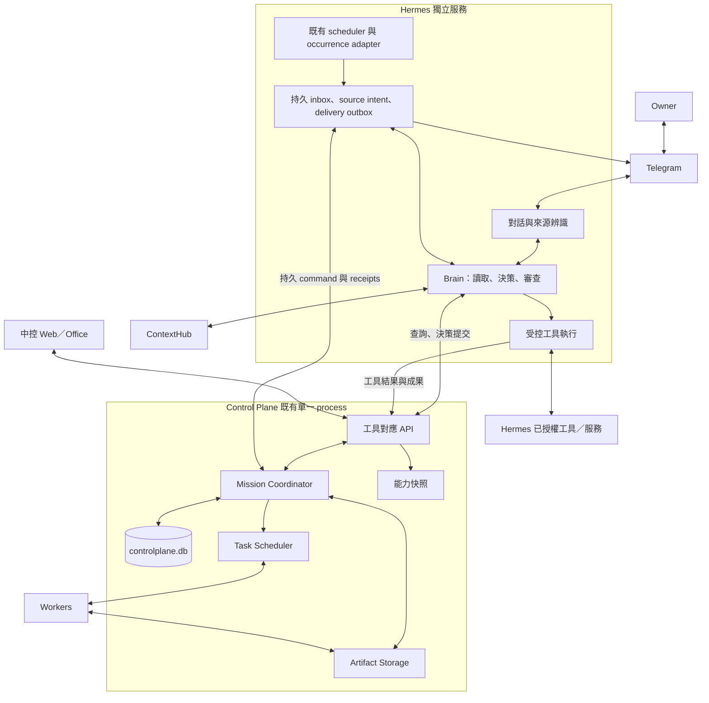

# Hermes 中控大腦第二版 — HLD

日期：2026-09-09　文件版本：2.0

狀態：**設計完成，核心已實作於本機，待雙 repository CI／live 驗收**。使用者已確認 Telegram／Hermes 為對話入口與大腦的方向；本文不宣告 Telegram、排程與工具 provider 已上線。

配套：[Detailed Design](hermes-control-brain-v2-detailed-design.md)。

## 1. 目標與核心決策

使用者在 Telegram 交辦目標，Hermes 自主選擇直接完成、使用自身工具或委派 Worker，持續處理結果與失敗，最後回到原對話交付。Control Plane 保存任務事實、執行決策、管理設備與成果；網頁與虛擬辦公室呈現相同狀態，並保留人工管理入口。

產品承諾是「交辦後有人持續負責到交付」。一次 HTTP 成功、模型回覆、Worker Task 成功，都不足以單獨代表這個承諾成立。

| 決策 | 第二版設計 |
| --- | --- |
| 日常對話入口 | Telegram → 既有 Hermes；沿用既有頻道與排程能力 |
| 唯一任務大腦 | Hermes 理解、查背景、選擇行動、規劃、審查、修正與回覆 |
| 執行 authority | Control Plane 保存 Mission／Run／Plan／Step／Task、限制、執行事實及成果 |
| 按需執行資源 | Workers 提供 repository、裝置、runtime、模型及運算能力 |
| 長期記憶 authority | ContextHub；Hermes 透過正式介面查詢並提出記憶候選 |
| 網頁定位 | 進度、成果、設備、設定、問題處理；使用者可全程只用 Telegram 完成一般任務 |
| 控制方式 | Hermes 透過具型別的中控工具與正式 API 操作；沿用各領域驗證與授權 |
| 發佈邊界 | Hermes、Control Plane、ContextHub 保持獨立 repository、映像、資料與回滾 |

「唯一大腦」指責任與決策入口唯一，不要求只有一個 LLM 呼叫，也不要求所有任務共用一份對話。不同 Mission 使用隔離執行上下文；角色是工具能力或提示配置，不是另一個自主主管。

## 2. 與既有文件的關係

本文的「第二版」是 **Hermes 中控大腦產品設計第二版**，不是把既有 `/api/v2` 升級成 `/api/v3`，也不是重做既有 v2 cutover。

| 既有文件 | 沿用 | 由本版取代或擴充 |
| --- | --- | --- |
| [執行層 HLD](personal-ai-control-plane-hld.md)／[Detailed Design](personal-ai-control-plane-detailed-design.md) | 單一 CP process、SQLite、Task／Worker、私有入口、gateway 部署 | 管理範圍延伸至既有 Mission 及本版決策協定；不再次建立 fresh DB |
| [Virtual Office HLD](virtual-office-hld.md)／[Detailed Design](virtual-office-detailed-design.md) | Mission／Run、版本化 DAG、交易、fencing、成果與恢復 invariant | Web 優先交辦改為 Hermes 優先；一律先產生 Worker 導向計畫改為按需要決策；必要步驟失敗先交回 Hermes 判斷 |
| [功能與 UX 設計](personal-ai-control-plane-functional-ux-hld.md) | Worker 接案狀態、有效設定、成果可用性、重試語意 | 將相同操作提供給 Hermes，保留 expected revision 與真正生效的區別 |
| [沉浸式 Office](virtual-office-immersive-ui.md) | 真實狀態投影、可及性、示範隔離 | 主管席增加決策／等待／審查投影；人物不是派工權限來源 |

衝突時，本版對入口、路由、排程分工、對話續接與新增協定優先；未修改的 Task／Worker 約束沿用既有文件。Detailed Design 的資料、交易及狀態細節優先於本文摘要。舊版 run 固定使用舊協定，不能執行到一半改用新解譯器。

## 3. 現況證據與缺口

原始碼核對基準：PersonalAiControlPlane `92f5c186eb9c776346ef95f79abbed2872684c93`；AiSecretaryChloe `b978b289a541f56b6acb78d2bf9a73cc21b66c01`。本輪為本機設計檢視，未重查 NAS、Telegram 投遞或 provider 行為。

| 區域 | 本機觀察 | 本版工作 |
| --- | --- | --- |
| Mission／Plan／Coordinator | 已有 domain、DAG、command dispatcher、attempt／epoch 與 artifacts 基礎 | 加入版本化決策迴圈、直接完成、補充輸入與 failure reconsideration |
| Hermes client | `pai_control_plane.py` 支援單一 Task 建立／查詢／取消／重試及 Worker／模型查詢 | 完整工具目錄、Mission 操作、CAS、idempotency、成果讀取；修正舊 client 未傳新重試條件的落差 |
| Hermes Office adapter | 已有 durable inbox、HTTP BrainDriver、poll/cancel 與結構化結果 | 真正的 supervisor／executor 模式、能力協商、對話映射及 delivery handler |
| 規劃提示 | 目前範例主要為 `WORKER_TASK`，偏好派出推論工作 | 能力與資料位置導向的 SELF／TOOL／WORKER 路由 |
| 失敗處理 | 必要 step 失敗會直接 fail Mission | 區分可修正失敗、資源等待與未知執行，按上限重新決策 |
| Context | 提供目標、輸入、成員 binding、計畫、成果與失敗摘要 | 即時能力快照、可讀 artifact references、對話補充及 ContextHub 查詢流程 |
| Web | Mission 表單與協定詳情可用 | Telegram 優先的任務投影；管理入口仍可操作 |
| 排程／頻道 | 依使用者已使用的 Hermes 能力作整合前提 | 核對真實 scheduler hook、頻道 API、idempotency 能力，不能只以 CLI／設定存在宣告整合 |

主要程式：[Mission intake](../apps/control-plane/src/missions/mission-service.ts)、[Coordinator](../apps/control-plane/src/missions/coordinator.ts)、[HTTP routes](../apps/control-plane/src/server.ts)、[Office schema](../apps/control-plane/src/db/office-migrations.ts)、[Web](../apps/control-web/src/app.ts)。Hermes 相關路徑與責任列於 Detailed Design。

## 4. 使用情境與範圍

### 4.1 必須能完成的事

| 情境 | 預期行為 |
| --- | --- |
| 「幫我摘要這段內容」 | Hermes 自行回覆；普通短對話不必建立 Mission 或 Worker Task |
| 「研究這個問題，完成後給我有來源的報告」 | 建立 Mission；可全程使用 Hermes 工具，保存來源與成果後回 Telegram |
| 「修改專案，測試完成後回報」 | Hermes 選擇有 workspace 的 Worker；讀取測試證據，不合格則修正 |
| 「剛才那件先別動資料庫」 | 找到對應 Mission，縮小 scope、阻止後續不符操作、重建後續決策；說明已發生的修改 |
| 「這件先暫停／取消／繼續」 | 控制同一 Mission，回報 requested 與實際停止的區別 |
| 「今天不要用我的筆電」 | 預設暫停新接案到當地午夜；已有工作繼續並明示。另要求停止才走取消程序 |
| 「每天早上檢查，有問題再通知」 | Hermes 保存排程；每次 occurrence 去重觸發工作；無問題保持安靜 |
| Worker 全離線 | Hermes 繼續對話及使用可用工具；只有依賴 Worker 的工作等待或改用合格替代資源 |
| 關閉網頁、服務重啟 | 已受理 Mission 仍由持久狀態續接，不依賴瀏覽器或存活中的 prompt |

### 4.2 第一個完整交付的必要範圍

包含對話與 Mission 映射、六種核心行動、完整 CP 業務工具目錄、Hermes 排程 occurrence、成果驗收、事件喚醒、Telegram 交付、重啟恢復、UI 同步、可量測的驗收案例。

系統不保證任意 Agent 中途指令恢復；恢復單位是已提交的決策、step 與已確認工具操作。不新增自主招聘／無上限多 Agent 對話、任意 root shell、通用身分平台或第二套長期記憶。不存在 adapter 的外部系統操作明列 `UNAVAILABLE`。

## 5. 系統架構與資料權責

| 資料 | 唯一 authority | 其他端保存 |
| --- | --- | --- |
| Telegram 原始對話、原生 session | Hermes／既有頻道儲存 | CP 僅保存 owner 主動交辦的文字、附件及不透明來源 ID |
| 接收中的交辦、排程 occurrence、對話對應 | Hermes durable adapter | CP 保存可去重的 source key 與 Mission 關聯 |
| Mission 目標、版本、執行、結果、限制 | CP | Hermes 取 snapshot；本地可保存 cache 但不得覆寫真實狀態 |
| 排程定義、時區、下一次觸發 | Hermes scheduler | CP 只讀鏡像和已建立 Mission 的 occurrence reference |
| Worker 能力／執行事實 | CP 與 Worker 協定 | Hermes 讀取帶有效時間的目錄 |
| Hermes 工具能力／實際工具操作 | Hermes tool adapter | CP 保存描述快照、operation receipt 與成果引用 |
| Telegram 發送結果 | Hermes delivery adapter | CP 保存投遞狀態與 provider message reference |
| 長期語意知識 | ContextHub | 任務保存引用、版本與必要短摘要 |

跨服務不共用 DB、不雙寫同一筆 authority。採各自的本地交易、持久 outbox／inbox、穩定 operation key 與查詢對帳；不宣稱跨服務 exactly-once。

## 6. 大腦的決策與執行模型

### 6.1 交辦分類

- **CHAT**：沒有承諾稍後交付、持續追蹤、重要外部操作或長工作；沿用 Hermes 對話。
- **MISSION**：需要追蹤、檔案交付、Worker、多步工作、持久等待或稍後回報；建立 CP Mission。是否用 Worker 與是否建立 Mission 分開判斷。
- **CONTROL**：查詢／控制既有任務、設備、設定或排程；呼叫 typed tool，保存 operation receipt，不為每次狀態查詢建立 Mission。

CHAT 執行中一旦發現需長工作或外部副作用，先升級為 MISSION 或受控 CONTROL，成功受理後才能承諾背景執行。使用者明確要求追蹤時，建立 Mission，即使只需要 Hermes 產生一份文件。

### 6.2 六種行動

| action | 意義 |
| --- | --- |
| `COMPLETE` | 直接產生符合完成條件的答案，或驗收已有成果並要求交付 |
| `SELF_TOOL` | 在 Hermes 執行已知工具；持久登記後執行，回傳 operation evidence |
| `DELEGATE` | 提交有界 plan fragment，交由 CP 以既有 Task 系統派 Worker |
| `WAIT` | 訂閱可判定的事件／期限；釋放推理槽位 |
| `ASK_OWNER` | 保存必要問題與所屬版本，於原對話提問 |
| `REPLAN` | 因新資訊、失敗或要求變更，取代尚未執行的後續計畫 |

另有終止結果 `STOP`，用於已無可行路徑或上限耗盡，保存部分成果與原因。主管決策 turn 只讀 context 及查詢工具；有副作用的 action 經 CP 接受後，交由執行 lane 執行。模型說出一個 action 不代表 action 已發生。

### 6.3 路由準則

先過濾授權、工具與資料可達性，再比較執行能力、近期驗證、負載、預估等待與成本。能力未知不可當作已支援。模型依可用工具作選擇，CP 在真正啟動前再次檢查資源與 scope。

| 工作特性 | 預設路徑 |
| --- | --- |
| 文字理解／摘要，context 已足夠 | Hermes 直接完成 |
| 已有搜尋、服務 API 或文件工具能處理 | Hermes 工具 |
| 資料僅在指定電腦、需 repository、長運算或特定 runtime | Worker |
| Worker 忙碌但有其他合格環境 | Hermes 可選替代；不把未授權資料搬到其他環境 |
| 資源暫缺、可等到期限 | WAIT；只有 adapter 確實支援才允許 Wake |

不使用模型自報 confidence 作為唯一派工依據。路由紀錄保存簡短理由、能力版本與選擇結果，讓驗收能比較誤派率與完成率。

### 6.4 漸進式計畫

最初只規劃已知必要工作。依賴明確的步驟可提交小型 DAG 並行執行；研究發現、step 成果或失敗成為下一次決策輸入。CP 確定性執行目前版本，策略選擇都交回 Hermes。

計畫改版需暫停受影響的未開始工作。第一版在同 Run 的活動執行都已完成或確認停止、且沒有 unknown 後才啟用新 revision；未受影響的工作可先完成，受影響者要求取消。已驗收成果依 input fingerprint 與驗收條件重用；已失效成果仍保留歷史，但不滿足新目標。

## 7. 對話、排程與交付

### 7.1 對話續接

優先用 Telegram reply-to message、明確任務 ID／名稱、目前 thread 的唯一待回答問題定位 Mission。多個合理候選時只問一次具體選擇；不能以「最新一筆任務」默認取消或修改。

同一 Mission 的 owner 輸入按序保存。新目標／scope 使舊 decision 失效；「目前進度」查詢不增加 objective revision。附件先落地並取得 hash，才能作為已存在的任務輸入。

### 7.2 排程分工

Hermes 保存 schedule、timezone、next fire、overlap、misfire 與通知策略。每次觸發生成穩定 occurrence key；CP 僅受理 occurrence 對應的 Mission，不另建 cron。

預設 `overlap=SKIP_IF_ACTIVE`、`misfire=LATEST_ONLY`，由 Hermes occurrence adapter 實作；既有 scheduler 不支援的欄位不能假定生效。使用者可明確指定排隊或有限重疊。排程修改只影響未來觸發，取消排程不默認取消已開始 Mission。

### 7.3 回報與交付

Hermes 負責受理、必要問題、重要變化與最終成果回報。沒有要求定期狀態時，不為每個 step 發送訊息。結果附上摘要、可存取的檔案與證據；CP 私有網址無法直接作為 Telegram provider 下載來源時，由 Hermes 私下取檔後上傳。

分開保存 `result available`、`mission completed`、`delivery pending/sent/unknown/failed`。Telegram provider 接受訊息不代表使用者已閱讀。傳送結果不明時保留 `UNKNOWN`，不藉重做 Mission 解決投遞問題。

## 8. 全中控台控制面與授權

「全部控制」的範圍是所有正式業務功能都有型別化入口與可說明的結果。新 UI 操作必須在同一 operation catalog 登記；Hermes 工具與 Web 呼叫相同 service，不能維護兩套業務規則。

| 領域 | 工具範圍 |
| --- | --- |
| 任務 | 建立、補充、查詢、暫停、取消、恢復、重開、結果與交付重試 |
| Worker | 列表、診斷、命名、接案／drain、偏好、註冊與能力管理、移除 |
| 模型 | 可用模型、測試、偏好與實際套用狀態；Hermes 自身模型設定屬 Hermes |
| Office | 角色與 binding 管理、委託看板；不以 UI 座位決定執行能力 |
| 系統／設定 | 健康、有效設定、版本化修改、管理操作狀態 |
| 排程 | 經 Hermes native adapter 建立、查詢、更新、停用、刪除及執行紀錄 |
| 部署等外部管理 | 只暴露已有且被允許的 adapter；NAS 固定走 gateway |

既有 owner 授權持續有效；routine 操作在 scope 內自動執行。新增授權才要求確認，呈現具體對象與變更。既有 step-up 操作若尚無可信 Telegram 授權傳遞，回傳 owner action link，由 Hermes 等待結果；不能偽造 step-up header。這是 adapter 的實際能力邊界，不把普通查詢／修改全部改成逐次審批。

## 9. 可靠性、容量與限制

第一版採單 owner、單 CP 寫入 authority、既有 SQLite 與 Hermes runtime。設計預設為最多 5 筆活動 Mission、背景 Brain turn 1 槽、每 Mission 最多 3 個同時執行步驟；槽位以實際 runtime 能力為準。背景等待釋放槽位；Telegram 控制由輕量工具路徑優先處理，不宣稱單槽 LLM 可同時思考。

| 限制／目標 | 預設設計值 |
| --- | --- |
| Mission elapsed | 7 天，等待也計入 |
| Mission Brain turns | 30 次，包含規劃、審查與修正 |
| 工具呼叫 | 100 次，包含決策中的查詢；transport retry 不重複計算邏輯呼叫 |
| Worker attempts | 100 次總額；每個可安全重試 step 預設最多 2 次 |
| Replan | 最多 3 次；相同失敗指紋連續 2 次停止相同策略 |
| Plan／總邏輯步驟 | 單一計畫最多 100 步；同 Run 跨版本最多 200 個不同邏輯步驟 |
| Telegram 受理目標 | 服務健康時本地 durable intake p95 ≤ 3 秒，不包含 LLM 完成時間 |
| 事件續接目標 | provider／槽位可用時，持久事件至 Brain admission p95 ≤ 10 秒 |
| 能力快照 | 30 秒 TTL；dispatch 時重新驗證 |

以上是待量測驗收目標，不是容量承諾。實際 token／金額未知時顯示未知，不能宣稱精確金額封頂；可用 turn、operation、時間與並行數限制消耗。

Hermes 暫停時 CP 保留事件及既有執行；CP 暫停時 Hermes 可對話，但新的 CP 交辦只標記「待中控受理」。兩端恢復後以來源 key、command ID、attempt 與 authority epoch 對帳。災難還原須新 epoch 與 reconciliation，正常重啟不換 epoch。

## 10. 驗收與實作順序

依 Detailed Design 的 B2-01～B2-18 驗收。至少要有六條真實情境：直接回覆、Hermes 工具 Mission、Worker 委派、失敗修正、跨服務重啟、原 Telegram 對話交付。測試 stub 只證明 contract；真實 provider／Worker／Telegram 各自記錄證據。

| 工作包 | 產出與完成條件 |
| --- | --- |
| W1 Contract／持久化 | 版本協商、source intent、conversation binding、decision CAS、完整 API 工具目錄 |
| W2 Brain／執行 | SELF／TOOL／WORKER、能力快照、context／artifact、受控工具執行、直接完成 |
| W3 續接／修正 | 事件喚醒、ASK／WAIT、plan revision、失敗分類、restart／unknown 對帳 |
| W4 排程／交付／Web | Hermes occurrence、overlap／misfire、Telegram outbox、管理工具與共同投影 |
| W5 真實驗收／發佈 | NAS gateway、immutable image、provider 與頻道 evidence、回滾和備份恢復演練 |

此順序是依賴關係，不是每包完成就要求 owner 重新批准同一範圍。正式實作與發佈依當次授權執行；本次交付只包含文件。

## 11. 取捨與未來重訪條件

- 沿用 Hermes 可重用對話、排程、工具與模型配置；代價是須為真實 Hermes runtime 建立可恢復、可隔離的 adapter。不能用另一個裸模型 endpoint 替代後宣稱 Hermes 整合完成。
- 保留 CP 確定性狀態與 Hermes 策略分工，可測試並恢復；代價是每次決策需要清楚 contract 與往返。
- CHAT 不入 CP 可降低對話負擔；代價是普通聊天不出現在 Mission 看板。明確追蹤／交付承諾必須升級。
- SQLite 適合目前單 owner 規模；持續量到寫入鎖競爭、需多 active CP 或數百活動 Mission 時才重訪 queue／DB 架構。
- 單 supervisor 先確保結果正確；需要更高背景吞吐時再增加隔離 Mission 槽位，角色數量本身不增加並行。

成功標準：**使用者只透過 Telegram 交辦與追問，Hermes 能選擇執行方式、修正可處理的失敗、驗收成果並回到原對話交付；中控台呈現可查證的同一件工作。**
