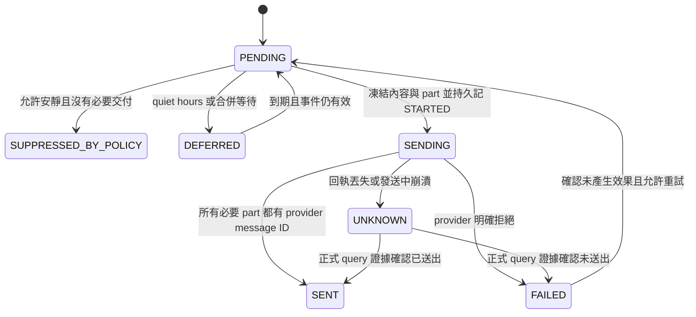

# 個人代理工作能力擴充 — Detailed Design

日期：2026-09-09。版本：1.0。狀態：**設計基準；本 repository 的 Control Plane 本地 domain 已實作並通過本機檢查，跨 repository adapter、provider 與正式部署尚未宣告。**

上位文件：[HLD](personal-agent-capabilities-hld.md)。產品研究：[Grok Bot／Muse](grok-muse-bot-research.md)。沿用協定：[Hermes v2 Detailed Design](hermes-control-brain-v2-detailed-design.md)、[Virtual Office Detailed Design](virtual-office-detailed-design.md)。本文件固定 HLD 留待細化的資料、介面與行為；未覆寫的 Mission／Worker invariant 仍沿用既有設計。

## 1. 設計基準與實作缺口

本輪僅讀取本機 source，未連 NAS 或 provider。核對基準如下；跨 repository 連結依目前 sibling checkout 排列，發佈文件時須保留 repository／commit 資訊。

| Repository | HEAD | 核對內容 |
| --- | --- | --- |
| PersonalAiControlPlane | `c33be707a65926944cb0acf46365d507aa134be5` | Mission、DB、dispatcher、artifact、catalog、Worker |
| AiSecretaryChloe | `99e5efae87dc37747be37ac5df3cc4470c15ed37` | office adapter、capability flags、現有 cron bootstrap |
| ContextHub | `1b64a1fc08cd7ea0b3f0d5f4e721290b400fefc6` | compile／items／successor／review／changes 介面及 authority 規則 |

| 現有事實 | 本版必須補上的部分 |
| --- | --- |
| [MissionService.create](../apps/control-plane/src/missions/mission-service.ts) 自行開 transaction | 抽出 `createInTx`，讓 occurrence、Goal admission、budget reservation 與 Mission 一起提交；public create 行為保持相容 |
| [mission_commands／mission_events](../apps/control-plane/src/db/office-migrations.ts) 必須綁定 Mission Run | Goal review、Routine 設定不能塞入假 Mission；新增小型、確定性 domain command outbox |
| [EventHub](../apps/control-plane/src/events/event-hub.ts) 是 process 內 best-effort 通知 | 新增持久 domain event／projection cursor；EventHub 只提示 UI 更新 |
| [operation catalog](../apps/control-plane/src/control/operation-catalog.ts) 有部分 unavailable 操作 | 新增 handler 與 adapter probe 才標 available；不得靠列名或設定 flag 宣告可執行 |
| [artifacts](../apps/control-plane/src/db/database.ts) 與 mission_artifacts 已存在 | 共用儲存／pin，補 skill pin、lineage 與來源 metadata，不能只存不存在的路徑 |
| [Hermes adapter](../../AiSecretaryChloe/services/hermes_office_adapter/office_adapter.py) 的部分能力來自 feature flag | 加入 protocol／driver／native hook 實測結果；flag 只是允許嘗試 |
| [cron bootstrap](../../AiSecretaryChloe/apps/chloe-linebot/adapters/hermes/scripts/ensure_tibo_codex_reset_cron.sh) 使用絕對 CLI 路徑 | 既有腳本存在不代表本版 occurrence、CAS、query-by-key 已實作 |
| ContextHub 已接受記憶不可直接由 agent 改寫 | 用候選 successor＋正式 review；不把 agent 說法當成 owner 身分 |

本文件內新增方法、routes、資料表及 capability 都是實作契約，不是目前 API 的使用說明。設計不新增第二個 planner、cron engine 或長期記憶庫。

## 2. 模組與執行責任

| 新增／修改模組（建議路徑） | 責任 | 不負責 |
| --- | --- | --- |
| `apps/control-plane/src/agent-work/skill-service.ts` | 不可變版本、驗證、固定版本執行與 pin | 自行寫提示、安裝任意套件 |
| `agent-work/routine-service.ts` | binding、回執同步、occurrence admission | 計算 cron next fire |
| `agent-work/goal-service.ts` | Goal、milestone、child admission、control fan-out | 策略生成 |
| `agent-work/budget-service.ts` | 原子預留、計費、結清 | 猜測 provider 費用 |
| `agent-work/attention-service.ts` | 事件收斂、狀態、有效操作投影 | 代替 owner approval authority |
| `agent-work/command-service.ts`／`command-dispatcher.ts` | 非 Mission 命令、outbox、回執與對帳 | 執行 shell 或 LLM |
| `agent-work/artifact-view-service.ts` | lineage、pin、可用性及安全 preview metadata | 任意 HTML 的可信執行 |
| `agent-work/browser-service.ts` | session metadata、接手 request、broker 回執 | 直接控制 CDP／存 cookies |
| `apps/worker/src/executors/browser.ts` | 把已受理 Task 交給受控 broker，回傳結果 | 讀取 broker profile 或自行擴權 |
| Hermes `services/hermes_office_adapter/agent_work/`（新增） | Skill loader、Goal review、Routine native bridge、通知／memory adapter | 直接寫 CP DB |

依賴由既有 `apps/control-plane/src/index.ts` 組裝，domain service 接受 DB、clock、policy／adapter interface。新的 controller 只解析 strict DTO、辨識 caller、呼叫 service、映射錯誤。新增功能預設關閉，舊路徑不因新增欄位被迫升級。

## 3. 共同資料與協定規則

### 3.1 識別、時間、hash、revision

- ID 沿用 UUIDv7；外部 ID 僅作不透明 reference，不接受為檔案路徑。
- DB 時間為 UTC epoch milliseconds；wire 為含 `Z` 的 ISO 8601。排程時區首版固定 `Asia/Taipei`，其他 IANA 時區在 native adapter 的 DST 契約驗證後才開放。
- 新 JSON 一律 snake_case；內部 TS 可 camelCase，以 mapper 隔離，不改舊 public response。
- `hash_v1` 使用既有 `canonicalJson` 的排序規則後 SHA-256，wire 格式固定 `sha256:<64 lowercase hex>`。拒絕非有限數、undefined、重複 key、超過安全整數範圍的 JSON number；成本以整數 micros 表示。Python adapter 必須通過相同 golden vectors，不能直接假定預設 `json.dumps` 的 number／Unicode 格式相同。
- `content_hash` 針對實際 artifact bytes；`request_hash` 針對 normalized payload，包含 expected revision／固定版本／scope reference，不包含 transport attempt、authorization secret 或請求時間。舊 hash 欄位保持舊格式，跨界由 mapper 明確轉換。
- `revision` 用於 owner／設定／成果條件變更；`projection_revision` 用於活動投影；新增 progress 不讓使用者的設定 CAS 無故失效。`generation` 用於執行／session 的舊操作者失效。

### 3.2 Idempotency 與交易

每個 mutation 必須有 `Idempotency-Key`（1–200 字元）與 authenticated actor。logical scope=`agent-work:<actor-id>:<operation-kind>:<resource-id-or-create>`。先檢查既有 receipt；同 key／同 normalized request 回第一次結果，即使目前 revision 已改變；同 key／不同內容回 409。

每個寫入 transaction 內依序：重查 receipt→CAS／scope／capacity→domain mutation→durable event／outbox→operation receipt。commit 後才 publish UI event。不存在、能力不足等未產生效果的 validation error 不消耗 key；已 accepted 的操作保留失敗／unknown 結果，重試不可換 key 逃避。

資料表 UUID／ordinal unique constraint 是最後防線。禁止 transaction 中做 network、LLM、檔案 render 或開巢狀 transaction。需要共用交易的方法命名 `*InTx`，public wrapper 負責開 transaction；回傳 `afterCommitEvents`，不在 rollback 前發 UI 事件。

`operation_receipts` 可保存既有回應；本版 `agent_operations` 保存長工作進度及 durable unique key，不因 90 天 HTTP receipt 清理而失去去重。Routine occurrence tombstone 與可能仍被重送的操作 key 保留至 producer watermark 確認，未知 watermark 不自動刪。

### 3.3 Domain operation 與命令狀態

`agent_operations.state`：`ACCEPTED → RUNNING → APPLIED | REJECTED | UNKNOWN | CANCELLED`。`UNKNOWN` 僅能由正式對帳回執轉 terminal；不能因逾時當失敗重做。同步完成操作直接 APPLIED。`operation_id` 是唯一 invocation ID；catalog 名稱另稱 `operation_kind`，避免與舊 catalog 的 `operationId` 混淆。

`agent_commands.transport_state`：`PENDING、IN_FLIGHT、RETRY_WAIT、ACCEPTED、ATTENTION`；`processing_state`：`NOT_STARTED、ADMITTED、RUNNING、APPLIED、REJECTED、UNKNOWN、CANCELLED`。HTTP ACK 只改 transport，不改 execution。

transport claim 30 秒，HTTP timeout 5 秒；重試間隔 2／5／15／30／60／300／900 秒，最多 10 次自動 transport 嘗試，之後 ATTENTION。query／cancel 有獨立操作，不讓一筆 UNKNOWN 阻塞整個 dispatcher。provider 執行是否可 retry 由效果及 query/idempotency 能力決定，不套用 HTTP 重試表。

### 3.4 能力協商

新 protocol 名為 `agent_work_v1`，不更改 `brain_protocol_version=2`。Hermes capabilities 增加 `agent_work` 物件：`schema_versions、skill_bundle_v1、routine_cas、routine_query_by_key、scheduled_for_utc、goal_review_v1、notification_parts_v1、memory_successor_v1`。每項有 `configured、available、reason、checked_at、implementation_version`；CP 同時檢查設定與近期（5 分鐘內）probe。

新 Worker capabilities 增加 browser broker protocol／policy version／停止證據能力，broker 存活與 session 可用性另外量測。無 capability 時拒絕對應新 intake，回 `CAPABILITY_UNAVAILABLE`；不讓無關的普通對話／既有 Task 一起失效。

## 4. 資料模型

### 4.1 Reference DDL

以下 SQLite DDL 是新增 migration 的規格附件；本次已依既有版本新增 migration 13，並在空的既有 CP schema 上啟動驗證。所有 `_json` 欄位都必須由 strict DTO parser 驗證；表內狀態字串受第 5–12 節狀態機限制。後續 migration 仍按當時最大版本號分配，不硬編號覆蓋既有 migration。

```sql
CREATE TABLE agent_operations (
  id TEXT PRIMARY KEY, actor_id TEXT NOT NULL, operation_kind TEXT NOT NULL,
  resource_kind TEXT NOT NULL, resource_id TEXT, logical_scope TEXT NOT NULL,
  idempotency_key TEXT NOT NULL, request_hash TEXT NOT NULL, request_json TEXT NOT NULL,
  authority_epoch TEXT NOT NULL, state TEXT NOT NULL, revision INTEGER NOT NULL DEFAULT 1,
  result_json TEXT, error_code TEXT, created_at INTEGER NOT NULL, updated_at INTEGER NOT NULL,
  UNIQUE(logical_scope, idempotency_key)
);
CREATE UNIQUE INDEX idx_agent_goal_review_active ON agent_operations(resource_id)
  WHERE resource_kind = 'GOAL' AND operation_kind = 'hermes.goals.review'
    AND state IN ('ACCEPTED', 'RUNNING', 'UNKNOWN');
CREATE TABLE agent_commands (
  id TEXT PRIMARY KEY, operation_id TEXT NOT NULL REFERENCES agent_operations(id),
  target TEXT NOT NULL, kind TEXT NOT NULL, logical_key TEXT NOT NULL,
  envelope_json TEXT NOT NULL, request_hash TEXT NOT NULL,
  transport_state TEXT NOT NULL, processing_state TEXT NOT NULL,
  next_send_at INTEGER NOT NULL, claim_token TEXT, claim_until INTEGER,
  delivery_attempts INTEGER NOT NULL DEFAULT 0, result_revision INTEGER NOT NULL DEFAULT 0,
  result_hash TEXT, result_json TEXT, last_error TEXT, created_at INTEGER NOT NULL,
  UNIQUE(operation_id, logical_key)
);
CREATE INDEX idx_agent_commands_due ON agent_commands(transport_state, next_send_at);
CREATE TABLE agent_inbox (
  producer_id TEXT NOT NULL, event_id TEXT NOT NULL, payload_hash TEXT NOT NULL,
  payload_json TEXT NOT NULL, state TEXT NOT NULL, result_json TEXT,
  received_at INTEGER NOT NULL, processed_at INTEGER,
  PRIMARY KEY(producer_id, event_id)
);
CREATE TABLE agent_events (
  seq INTEGER PRIMARY KEY AUTOINCREMENT, event_id TEXT NOT NULL UNIQUE,
  producer_id TEXT NOT NULL, source_key TEXT NOT NULL,
  subject_kind TEXT NOT NULL, subject_id TEXT NOT NULL, subject_revision INTEGER NOT NULL,
  type TEXT NOT NULL, payload_json TEXT NOT NULL, created_at INTEGER NOT NULL,
  UNIQUE(producer_id, source_key)
);
CREATE INDEX idx_agent_events_subject ON agent_events(subject_kind, subject_id, seq);
CREATE TABLE agent_projection_cursors (
  consumer TEXT PRIMARY KEY, seq INTEGER NOT NULL DEFAULT 0, updated_at INTEGER NOT NULL
);
CREATE TABLE work_skills (
  id TEXT PRIMARY KEY, office_id TEXT NOT NULL REFERENCES offices(id),
  name TEXT NOT NULL, active_version INTEGER, revision INTEGER NOT NULL DEFAULT 1,
  next_version INTEGER NOT NULL DEFAULT 1, archived_at INTEGER,
  created_at INTEGER NOT NULL, updated_at INTEGER NOT NULL
);
CREATE TABLE work_skill_versions (
  skill_id TEXT NOT NULL REFERENCES work_skills(id), version INTEGER NOT NULL CHECK(version > 0),
  artifact_id TEXT NOT NULL REFERENCES artifacts(id), content_hash TEXT NOT NULL,
  spec_json TEXT NOT NULL, source_mission_id TEXT REFERENCES missions(id),
  source_result_hash TEXT, validation_state TEXT NOT NULL, compatibility_state TEXT NOT NULL,
  lifecycle TEXT NOT NULL, state_revision INTEGER NOT NULL DEFAULT 1,
  created_at INTEGER NOT NULL, PRIMARY KEY(skill_id, version)
);
CREATE TABLE skill_validation_runs (
  id TEXT PRIMARY KEY, skill_id TEXT NOT NULL, skill_version INTEGER NOT NULL,
  case_key TEXT NOT NULL, mode TEXT NOT NULL, input_hash TEXT NOT NULL,
  mission_id TEXT REFERENCES missions(id), operation_id TEXT NOT NULL REFERENCES agent_operations(id),
  evidence_json TEXT NOT NULL, state TEXT NOT NULL, created_at INTEGER NOT NULL,
  UNIQUE(operation_id, case_key),
  FOREIGN KEY(skill_id, skill_version) REFERENCES work_skill_versions(skill_id, version)
);
CREATE TABLE mission_skill_bindings (
  mission_run_id TEXT PRIMARY KEY REFERENCES mission_runs(id), skill_id TEXT NOT NULL,
  skill_version INTEGER NOT NULL, content_hash TEXT NOT NULL, parameters_json TEXT NOT NULL,
  capability_snapshot_hash TEXT NOT NULL,
  FOREIGN KEY(skill_id, skill_version) REFERENCES work_skill_versions(skill_id, version)
);
CREATE TABLE routine_bindings (
  id TEXT PRIMARY KEY, office_id TEXT NOT NULL REFERENCES offices(id),
  native_key TEXT NOT NULL UNIQUE, routine_id TEXT UNIQUE,
  desired_revision INTEGER NOT NULL DEFAULT 1, effective_revision INTEGER,
  native_revision INTEGER, remote_state TEXT NOT NULL, sync_state TEXT NOT NULL,
  admission_blocked INTEGER NOT NULL DEFAULT 1 CHECK(admission_blocked IN (0,1)),
  next_fire_at INTEGER, observed_at INTEGER, created_at INTEGER NOT NULL, updated_at INTEGER NOT NULL
);
CREATE TABLE routine_binding_revisions (
  binding_id TEXT NOT NULL REFERENCES routine_bindings(id), revision INTEGER NOT NULL,
  skill_id TEXT NOT NULL, skill_version INTEGER NOT NULL, intent_json TEXT NOT NULL,
  request_hash TEXT NOT NULL, operation_id TEXT NOT NULL REFERENCES agent_operations(id),
  created_at INTEGER NOT NULL, PRIMARY KEY(binding_id, revision),
  FOREIGN KEY(skill_id, skill_version) REFERENCES work_skill_versions(skill_id, version)
);
CREATE TABLE routine_occurrences (
  source_key TEXT PRIMARY KEY, binding_id TEXT NOT NULL REFERENCES routine_bindings(id),
  binding_revision INTEGER NOT NULL, native_revision INTEGER NOT NULL,
  payload_hash TEXT NOT NULL, payload_json TEXT NOT NULL,
  scheduled_for INTEGER, state TEXT NOT NULL, reason_code TEXT,
  mission_id TEXT UNIQUE REFERENCES missions(id), received_at INTEGER NOT NULL, updated_at INTEGER NOT NULL
);
CREATE TABLE goals (
  id TEXT PRIMARY KEY, office_id TEXT NOT NULL REFERENCES offices(id), title TEXT NOT NULL,
  objective_json TEXT NOT NULL, scope_json TEXT NOT NULL, limits_json TEXT NOT NULL,
  state TEXT NOT NULL, health TEXT NOT NULL, revision INTEGER NOT NULL DEFAULT 1,
  projection_revision INTEGER NOT NULL DEFAULT 1, deadline_at INTEGER,
  next_review_at INTEGER, review_generation INTEGER NOT NULL DEFAULT 0,
  review_state TEXT NOT NULL DEFAULT 'IDLE', review_pending INTEGER NOT NULL DEFAULT 0,
  review_schedule_ref_json TEXT, created_at INTEGER NOT NULL, updated_at INTEGER NOT NULL,
  CHECK(review_pending IN (0,1))
);
CREATE TABLE goal_milestones (
  id TEXT PRIMARY KEY, goal_id TEXT NOT NULL REFERENCES goals(id), ordinal INTEGER NOT NULL,
  title TEXT NOT NULL, required INTEGER NOT NULL CHECK(required IN (0,1)),
  criteria_json TEXT NOT NULL, revision INTEGER NOT NULL DEFAULT 1,
  state TEXT NOT NULL, acceptance_json TEXT, created_at INTEGER NOT NULL, updated_at INTEGER NOT NULL,
  UNIQUE(goal_id, ordinal)
);
CREATE TABLE goal_mission_links (
  mission_id TEXT PRIMARY KEY REFERENCES missions(id), goal_id TEXT NOT NULL REFERENCES goals(id),
  milestone_id TEXT REFERENCES goal_milestones(id), goal_revision INTEGER NOT NULL,
  proposal_key TEXT NOT NULL, work_fingerprint TEXT NOT NULL,
  blocked_by_goal_control INTEGER NOT NULL DEFAULT 0 CHECK(blocked_by_goal_control IN (0,1)),
  created_at INTEGER NOT NULL, UNIQUE(goal_id, proposal_key)
);
CREATE INDEX idx_goal_links_goal ON goal_mission_links(goal_id, work_fingerprint);
CREATE TABLE goal_budget_accounts (
  goal_id TEXT NOT NULL REFERENCES goals(id), period_key TEXT NOT NULL, dimension TEXT NOT NULL,
  limit_amount INTEGER NOT NULL CHECK(limit_amount >= 0),
  consumed INTEGER NOT NULL DEFAULT 0 CHECK(consumed >= 0),
  reserved INTEGER NOT NULL DEFAULT 0 CHECK(reserved >= 0),
  state TEXT NOT NULL, period_start INTEGER NOT NULL, period_end INTEGER,
  PRIMARY KEY(goal_id, period_key, dimension)
);
CREATE TABLE goal_budget_reservations (
  id TEXT PRIMARY KEY, goal_id TEXT NOT NULL, period_key TEXT NOT NULL, dimension TEXT NOT NULL,
  mission_run_id TEXT REFERENCES mission_runs(id), operation_id TEXT REFERENCES agent_operations(id),
  remaining INTEGER NOT NULL CHECK(remaining >= 0), state TEXT NOT NULL,
  created_at INTEGER NOT NULL, updated_at INTEGER NOT NULL,
  CHECK((mission_run_id IS NOT NULL) <> (operation_id IS NOT NULL)),
  UNIQUE(mission_run_id, dimension), UNIQUE(operation_id, dimension),
  FOREIGN KEY(goal_id, period_key, dimension) REFERENCES goal_budget_accounts(goal_id, period_key, dimension)
);
CREATE TABLE goal_budget_entries (
  id TEXT PRIMARY KEY, reservation_id TEXT NOT NULL REFERENCES goal_budget_reservations(id),
  charge_key TEXT NOT NULL, amount INTEGER NOT NULL CHECK(amount >= 0),
  evidence_json TEXT NOT NULL, created_at INTEGER NOT NULL, UNIQUE(reservation_id, charge_key)
);
CREATE TABLE attention_items (
  id TEXT PRIMARY KEY, subject_kind TEXT NOT NULL, subject_id TEXT NOT NULL,
  reason_code TEXT NOT NULL, episode INTEGER NOT NULL, severity TEXT NOT NULL,
  state TEXT NOT NULL, revision INTEGER NOT NULL DEFAULT 1, change_revision INTEGER NOT NULL DEFAULT 1,
  fingerprint TEXT NOT NULL, evidence_json TEXT NOT NULL, action_ref_json TEXT,
  deadline_at INTEGER, snooze_until INTEGER, read_through_revision INTEGER NOT NULL DEFAULT 0,
  created_at INTEGER NOT NULL, updated_at INTEGER NOT NULL,
  UNIQUE(subject_kind, subject_id, reason_code, episode)
);
CREATE UNIQUE INDEX idx_attention_open ON attention_items(subject_kind, subject_id, reason_code)
  WHERE state IN ('OPEN', 'SNOOZED');
CREATE TABLE attention_notifications (
  id TEXT PRIMARY KEY, attention_id TEXT NOT NULL REFERENCES attention_items(id),
  change_revision INTEGER NOT NULL, target_ref TEXT NOT NULL, policy_revision INTEGER NOT NULL,
  delivery_key TEXT NOT NULL UNIQUE, disposition TEXT NOT NULL,
  receipt_revision INTEGER NOT NULL DEFAULT 0, receipt_json TEXT, created_at INTEGER NOT NULL,
  UNIQUE(attention_id, change_revision, target_ref)
);
CREATE TABLE agent_artifact_refs (
  owner_kind TEXT NOT NULL, owner_id TEXT NOT NULL, owner_version INTEGER NOT NULL DEFAULT 1,
  artifact_id TEXT NOT NULL REFERENCES artifacts(id), purpose TEXT NOT NULL,
  metadata_json TEXT NOT NULL DEFAULT '{}', pin_state TEXT NOT NULL,
  retain_until INTEGER, created_at INTEGER NOT NULL,
  PRIMARY KEY(owner_kind, owner_id, owner_version, artifact_id, purpose)
);
CREATE TABLE browser_sessions (
  id TEXT PRIMARY KEY, worker_id TEXT NOT NULL REFERENCES workers(id), broker_id TEXT NOT NULL,
  profile_ref TEXT NOT NULL, state TEXT NOT NULL, generation INTEGER NOT NULL DEFAULT 1,
  revision INTEGER NOT NULL DEFAULT 1, controller TEXT NOT NULL,
  mission_run_id TEXT REFERENCES mission_runs(id), lease_until INTEGER,
  policy_hash TEXT NOT NULL, broker_snapshot_seq INTEGER NOT NULL DEFAULT 0,
  observed_at INTEGER NOT NULL, created_at INTEGER NOT NULL, updated_at INTEGER NOT NULL
);
CREATE UNIQUE INDEX idx_browser_active_profile ON browser_sessions(broker_id, profile_ref)
  WHERE state NOT IN ('CLOSED', 'EXPIRED');
CREATE TABLE browser_action_receipts (
  operation_key TEXT PRIMARY KEY, session_id TEXT NOT NULL REFERENCES browser_sessions(id),
  generation INTEGER NOT NULL, action_seq INTEGER NOT NULL, request_hash TEXT NOT NULL,
  state TEXT NOT NULL, receipt_revision INTEGER NOT NULL, receipt_json TEXT NOT NULL,
  created_at INTEGER NOT NULL, updated_at INTEGER NOT NULL,
  UNIQUE(session_id, generation, action_seq)
);
CREATE TABLE teaching_sessions (
  id TEXT PRIMARY KEY, browser_session_id TEXT NOT NULL REFERENCES browser_sessions(id),
  revision INTEGER NOT NULL DEFAULT 1, state TEXT NOT NULL, allowed_origins_json TEXT NOT NULL,
  started_at INTEGER, stopped_at INTEGER, expires_at INTEGER NOT NULL,
  manifest_artifact_id TEXT REFERENCES artifacts(id), draft_skill_id TEXT REFERENCES work_skills(id),
  capture_hash TEXT, error_code TEXT, created_at INTEGER NOT NULL
);
```

表之間不能純由 FK 表達的條件，在 service 同一交易內檢查：active_version 必須指向自己的 READY 版本；milestone 必須屬於 Goal；occurrence 綁定的 revision 必須存在；browser metadata 必須匹配已註冊 broker；artifact lineage 只能引用 caller 可讀且同 owner 的成果。

`agent_artifact_refs` 統一保存 skill、Goal evidence、lineage、teaching 等新 pin，避免每個 UI 功能建一套檔案表。GC 必須聯集檢查 task／mission／agent references；只改 UI、不改 GC 不能視為技能持久化完成。

### 4.2 重要 JSON 結構

| 欄位 | 必要內容／上限 |
| --- | --- |
| Skill spec | `schema_version=1、purpose、input_schema、sources、required_capabilities、steps、acceptance、output_contract、effect_requirements、failure_policy`；UTF-8 bundle ≤ 1 MiB，steps ≤ 50；首版僅指令與已安裝工具 reference，沒有自動安裝程式 |
| `sources[]` | `source_id、adapter_id、adapter_version、max_age_seconds、required、selector`；URL／selector 是資料，不是授權 |
| `effect_requirements[]` | `operation_kind、resource_selector、effect_class`；與 Mission scope／runtime policy 取交集 |
| Goal objective | `description、completion_criteria、conversation_ref`；milestone ≤ 50；criteria 有穩定 ID、型別、必要性及 evaluator version |
| Goal limits | `max_active_missions=2、max_review_turns、budget_period、dimensions、notification_policy_ref`；numeric bounds 由 server 設定封頂 |
| Attention evidence | 來源 event IDs、來源新鮮度、變更前後摘要、artifact refs；≤ 32 KiB，無整份聊天／cookie |
| Action reference | `{authority, operation_kind, resource_id, expected_revision, expires_at}`；不是 bearer authorization |
| Memory reference | `{context_bundle_id,item_id,item_revision,purpose,required,observed_at}`；敏感摘要僅有必要時保存於受控 artifact |
| Artifact lineage metadata | `supersedes_artifact_id、root_artifact_id、input_fingerprint、source_observed_at、acceptance_refs`；新引用時拒絕循環 |

## 5. F1 工作技能

### 5.1 版本與驗證狀態

將 HLD 的顯示狀態拆成三個正交欄位，避免「測試曾通過、現在 adapter 失效」互相覆寫：

| 欄位 | 值 | 規則 |
| --- | --- | --- |
| validation_state | `DRAFT、VALIDATING、PASSED、FAILED` | 版本內容不可變，重新測試同版本可產生新 validation run |
| compatibility_state | `UNKNOWN、COMPATIBLE、INCOMPATIBLE` | 與固定 adapter／input contract 核對；過期 probe 不能放行 |
| lifecycle | `CANDIDATE、READY、DEPRECATED` | READY 必須 PASSED＋COMPATIBLE；DEPRECATED 不再接受新工作 |

對使用者映射：FAILED→VALIDATION_FAILED；INCOMPATIBLE 優先顯示；READY 只有三者符合才顯示「可使用」。`activate` 更改 work_skills.active_version，version 狀態不因活躍指標移動被刪掉。

`POST /skills/drafts` 接收已保存且可讀的 bundle artifact＋source Mission reference，並驗證來源成果已驗收。**真正產生草稿由 Hermes 的有界 Mission 完成**，CP 不自行呼叫模型。沒有來源 Mission 的手寫技能也可建立，但標 `source_kind=OWNER_SPEC`，必須走相同驗證。

修改草稿也配置新 version；版本計數在 `work_skills.next_version` 的交易中遞增，失敗不露出半套版本。每個 version 綁定原始 bytes hash、來源 result hash 與驗收規格，不能原地替換 artifact。

### 5.2 驗證契約

三類案例必須各有結果：`normal、missing_source、schema_changed`。負向案例的 PASS 是正確停止並回報指定錯誤／無非預期效果，不是要求它成功產出報告。

- `VALIDATE_ONLY`：schema、adapter availability、資料與效果要求靜態核對；不建立執行 Mission，僅有 operation。此模式單獨不能將技能升成 READY。
- `SANDBOX_RUN`：以三個預先建立的測試 fixtures 執行；scope 只包括測試目標。artifact 與預期輸出比對。
- `LIVE_RUN`：已有 scope 下的真實任務；首個正常案例可重用相同 input／adapter／spec hash 的來源成功 Mission，負向案例仍在 sandbox 執行。

一次 validate suite 有同一 operation ID、多筆 validation_runs；各 case key 去重。動作執行前凍結 test manifest hash，事後不可改 expected output 湊 PASS。Evaluator 是固定規則或結構驗證器；Hermes 品質評語可補充，但不能取代 required checks。任一必要 case 無 evidence，activate 回 `VALIDATION_INCOMPLETE`。

### 5.3 執行固定版本

`POST /skills/{id}/runs`→SkillService 原子核對 READY／scope→MissionService.createInTx→mission_skill_bindings→artifact pin→Mission command。Routine 及 Goal 也呼叫同一內部入口。首版每 Run 一個頂層 Skill；需其他做法時由有界 steps 引用已安裝工具，避免遞迴 Skill 依賴。

Hermes skill loader 取 private artifact、驗 bytes hash、做 strict parse，唯讀 materialize 至以 hash 命名的 runtime cache。載入 receipt 必須含 skill／version／hash／loader version／必要工具實際可用性。loader 不能在任何指令裡變更 system prompt、授權、provider 機密或既有原生 skills。

升級已存在 Routine 需明確更新 binding revision。執行中版本若 DEPRECATED 可完成；若因具體風險被撤回 capability，所有尚未開始動作在 admission 被阻擋，活動動作沿停止／UNKNOWN 流程，不以刪技能清除證據。

## 6. F2 Routine binding 與 occurrence

### 6.1 Native bridge 的確定行為

Hermes 保存 native schedule 及 scheduler-side metadata，CP 的 intent_json 只是使用者請求／同步歷史。native bridge 使用固定 executable／typed arguments；既有絕對 CLI 路徑 `/opt/hermes/.venv/bin/hermes` 是本機腳本證據，live 仍需驗證版本，不將自然語言拼成 shell。

首版只開放 `SKIP_IF_ACTIVE`、`LATEST_ONLY`、`Asia/Taipei`，事件型只對實作穩定 cursor 的 adapter 開放。`QUEUE_ONE`／`ALLOW_BOUNDED` 先回 `UNSUPPORTED_POLICY`，未實作功能不能默默降級。停止後的補跑最多最新一筆且 scheduled instant 在過去 24 小時內；由 Hermes 決定 eligible occurrence，CP 不掃 cron 補跑。

native bridge 必須能：按 `native_key=cp-binding:<binding-id>` 找唯一排程、以 revision 修改、取得原始 `scheduled_for_utc`、持久保存 occurrence 後再呼叫 CP。只有 cron CLI 名稱比對或環境 flags 不符合契約；若原生 runtime 不提供 callback metadata，需在 Hermes 側增加受控 hook 才宣告 available。

### 6.2 建立／變更同步

1. CP 同一交易保存 binding desired revision、immutable revision intent、operation／command；初始 `admission_blocked=1`。
2. Hermes inbox 以 command ID＋hash 去重。首次 native create 若要避免立即觸發，先建立 disabled 設定，再持久 native mapping，最後啟用；無 disabled create 的 native 由 bridge gate 攔截 trigger。
3. 任何 native mutation 前保存 STARTED；timeout 先 query native_key。不能 query 時進 UNKNOWN，不依同名搜尋再 create。
4. Hermes 回傳 `{binding_revision,native_revision,routine_id,native_key,state,next_fire_at,normalized_schedule,policy_ref}`。
5. CP 驗 receipt 與 desired revision；套用 effective revision／remote state。首次成功後 admission_blocked=0；晚到舊 receipt 只存歷史，不覆寫新 desired。

修改含 skill／scope 時，先 block 新 admission，再同步新 revision；舊 revision 的新 occurrence 回 `BINDING_REVISION_STALE` 並留 rejected evidence，不以新版本補代。已 accepted Mission 維持 snapshot。純 pause 也先 block 本地新 admission，UI 顯示「停止新工作；等待 Hermes 停用確認」。resume 需 Hermes 回 ACTIVE 且 scope／skill 仍有效才解除 block。

同步狀態：`PENDING、SYNCING、EFFECTIVE、FAILED、UNKNOWN、RECONCILING`。remote_state：`UNKNOWN、ACTIVE、PAUSED、DELETED`。不能用 effective 代表有權無限執行。

### 6.3 Occurrence 契約

key 計算：

- 時間：`hash_v1(["time", native_key, scheduled_for_utc])`，不含 revision。
- 手動：`hash_v1(["manual", native_key, manual_request_id])`，必須源自明確 run-now。
- 事件：`hash_v1(["event", producer_id, subscription_id, source_event_id])`。

```json
{
  "schema_version": 1,
  "source_occurrence_key": "sha256:0000000000000000000000000000000000000000000000000000000000000000",
  "binding_id": "019a0000-0000-7000-8000-000000000001",
  "binding_revision": 2,
  "native_revision": 4,
  "trigger": {"kind": "TIME", "scheduled_for_utc": "2026-09-14T00:00:00Z"},
  "skill": {"id": "019a0000-0000-7000-8000-000000000002", "version": 1},
  "parameters": {"report_period": "previous_week"},
  "conversation_ref": "telegram:owner-topic",
  "notification_policy_ref": {"id": "monitor-default", "revision": 1}
}
```

範例 hash 為格式占位，實際必須重算驗證。native_key、scope、skill hash 由已授權 binding 解析，不能由 producer payload 任意覆寫；conversation_ref 必須等於已綁定目標。

交易流程：查 source key→驗 payload hash→驗 caller／binding／epoch→檢查同 binding 是否已有未 terminal Mission／未知 admission→符合者建立 Mission＋固定 Skill＋occurrence＋events；有活動工作則保存 `SKIPPED_ACTIVE`。容量不足保存 `WAITING_CAPACITY`，同 binding 此狀態也占位；CP capacity event 重試同一 occurrence 的 admission，保留原參數／期限，不產生另一個排程。

eligible 且尚未受理 occurrence 的狀態：`RECEIVED、WAITING_CAPACITY、ADMITTED、SKIPPED_ACTIVE、MISSED、REJECTED、COALESCED`。`ADMITTED` 不回退，完成狀態由 mission_id 查得。Hermes 重播同 key／同 hash 回原結果；同 key不同 hash 回 409，不能修正時間或輸入後沿用 key。

WAITING_CAPACITY 的等待期限固定為原 scheduled instant＋24 小時與業務 deadline 較早者；manual／event 則為首次 received_at＋24 小時與業務 deadline 較早者。到期轉 MISSED 並釋放 overlap 占位；不能等到一週後才無聲執行過期週報。同一 key 重播 MISSED 仍回原結果，補做須明確 manual request。

Hermes 對同一 native_key 的 pending occurrence 先做 overlap reservation；CP 再做最後交易檢查。連線不明的 CP_PENDING 也算 active。pause／delete 使 WAITING_CAPACITY 轉 REJECTED，accepted Mission 不被默默取消。

## 7. F3 Goal、里程碑與預算

### 7.1 Goal 控制與證據

| 轉移 | 前提 | 同一交易的結果 |
| --- | --- | --- |
| DRAFT→ACTIVE | 明確 owner 目標、criteria／scope／limits 有效 | 設定 budget account、排入第一個 goal.review command |
| ACTIVE→PAUSED | expected revision 符合 | 阻擋新的 child／review effect；標記活動 child 的 blocked_by_goal_control，排入逐一 pause command |
| PAUSED→ACTIVE | scope 未失效；未知執行已處理 | 只恢復因 Goal 暫停且仍符合 revision 的 child；owner 個別暫停的 child 維持暫停 |
| ACTIVE→ACHIEVED | 所有 required milestone 都有有效 acceptance，無未完成 required work／未知效果 | 固定 final evidence，停止未來 review，安排 Goal 最終交付 |
| DRAFT／ACTIVE／PAUSED→CANCELLED | owner 取消指示及 CAS | 阻擋 admission，排入 child cancel；不宣稱所有外部效果已撤銷 |
| ACHIEVED／CANCELLED→ARCHIVED | 無活動／unknown child、無 pending 必要交付 | 隱藏預設列表，保留 evidence 與 budget |

Goal.state 是請求的控制意圖，`control_summary={requested,pending_children,confirmed_children,unknown_children}` 另作真實停止投影。pause 不強制殺掉不可中斷程式；沿用 Mission pause 的 step boundary。每個待開始 step／tool admission 都查 Goal gate，不能只在建立 child 時查一次。

pause fan-out 只對當時 control=ACTIVE 的 child 標 `blocked_by_goal_control=1`，並在子操作 request／receipt 保存前後 control revision。resume 只有該 pause receipt 仍是目前版本才可恢復；若 owner 曾個別控制而 revision 已變，保留現狀並回報，不批次覆寫 owner 的個別選擇。

首版 Goal 不提供重新開啟 ACHIEVED；新目標建立新 Goal 並引用舊成果。CANCELLED 也不能靠直接改 DB 恢復。scope 縮小先 block 新動作，逐一停止／對帳不相容活動工作；scope 擴大必須帶新的有效 owner authority。

milestone state：`PENDING、IN_PROGRESS、READY_FOR_REVIEW、ACCEPTED、INVALIDATED、CANCELLED`。驗收紀錄包含 criterion ID、criterion hash、evaluator version、artifact ID／hash、觀察時間、verdict、review actor 及 Goal／milestone revision。owner judgement 類型只接受經驗證 owner 的明確操作。

更改 criteria 新增 revision，舊 acceptance 改 INVALIDATED；可提交新的等價驗證重用舊 artifact，但不能保留 ACCEPTED 不重驗。`health` 投影依序為 BLOCKED（必要工作缺能力／未知）→AT_RISK（期限已過且未達標）→ON_TRACK；進度是必要里程碑的已驗收數／總數。

### 7.2 有界 Goal review

Goal review 是 **Hermes 的決策 turn**，透過非 Mission `agent_commands.kind=goal.review`；不假造 Task／Mission，只讀 snapshot。它使用與 Mission supervisor 相同的 read-only wrapper、provider handle、admission／cancel evidence，但使用獨立 Goal context mapper。

觸發：owner 新輸入、child 終態／成果驗收、必要資料恢復或 Hermes review schedule occurrence。短時間內多事件合併為一個 generation；已有 ADMITTED／RUNNING review 時保存 dirty marker，完成後最多再排一個最新 snapshot review。

dirty marker 使用 `goals.review_pending`；active review 使用 `agent_operations.operation_kind=hermes.goals.review`，partial unique index 保證每 Goal 最多一筆 ACCEPTED／RUNNING／UNKNOWN。context hash 只包含目標 revision、criteria、已驗收成果、child 終態、有效能力及相關 owner 輸入，不包含 heartbeat／UI timestamps；新語意資料會使舊結果 stale 並排下一代 review。

ASK_OWNER 後 review command 可 APPLIED，而 Goal.review_state 轉 WAITING_OWNER；`question_id=review operation_id`，問題、answer schema、expected Goal revision、expiry 保存在該 immutable result。ANSWER_QUESTION 以另一 operation／event 保存答案，原問題不覆寫，重複或過期答案不得建立第二個 child。

WAIT_REVIEW 的時間喚醒由 `goal.schedule_review` command 交 Hermes native bridge，以 `native_key=cp-goal-review:<goal-id>` 管理；`review_schedule_ref_json` 只存 ID／revision／next fire 鏡像。此類 schedule 不走必須綁 Skill 的 routine_binding，也不建立假 Skill。bridge 使用同一 idempotent query／trigger contract；暫停、取消、達標時停用，原始 occurrence key 納入 review 去重。

Hermes 回覆嚴格 discriminated union，包含 `goal_id、expected_goal_revision、review_generation、context_hash`：

| action | payload | CP 准入 |
| --- | --- | --- |
| `CREATE_MISSION` | proposal_key、work_fingerprint、milestone_id、MissionCreate DTO、可選 Skill ref | 單次 review 最多建立 1 筆；所有 Goal／Skill／scope／budget gate |
| `PROPOSE_MILESTONES` | 有界 milestone 變更及理由 | 不增加 owner 未授權 scope；變更 required criteria 需 owner policy 許可 |
| `ACCEPT_MILESTONE` | milestone revision、criteria hash、evidence refs | 確定性 evaluator 或有效 owner verdict |
| `WAIT_REVIEW` | reason、subscription 或 next_review_at | Hermes 保存下次喚醒；無未知 adapter 能力時才可承諾 |
| `ASK_OWNER` | 問題、schema、expires_at | 寫 question event／attention，等待相同 revision 的回答 |
| `MARK_ACHIEVED` | final evidence refs | 重查所有 milestone／pending／unknown 狀態 |
| `STOP_REVIEW` | code、partial evidence | 停止新 review 並標 BLOCKED；不把 Goal 偽裝為 ACHIEVED |

兩個 CREATE_MISSION 同時進入時，用 `(goal_id,proposal_key)` 去重；work_fingerprint 以 milestone revision／Skill hash／normalized inputs／成果條件計算。同 fingerprint 有 active 或已驗收相容成果時拒絕重做；必要重試只在已確認失敗且有新 retry reason／預算時生成新 proposal key。UNKNOWN 不屬於可重試失敗。

Goal review 自身也計入 budget（不歸任何假 Mission）：以 `agent_operation_id` 保存 review charge，見 7.3 的獨立 reservation 規則。每 Goal 最多一個 active review，30 次為初始總上限；超過由 owner 調整或等待既定新 period。

### 7.3 預算維度、期間、預留與結清

固定維度：`brain_turns、worker_attempts、browser_action_count`；可選 `provider_cost_micros`。首版預設 Goal 終身 period（`period_key=lifetime`），不在跨日重置。使用者明確要求周期額度才用 `CALENDAR_MONTH`／Asia/Taipei；period boundaries 由服務依固定設定轉 UTC 並持久化，不能由 agent payload 改變。

Mission admission 先預留 child 的最大允許 turn／attempt／browser actions，保守避免多 Mission 各用同一剩餘預算。小任務可明確要求較小 limits。Goal review 使用同表的 `operation_id` owner，DDL 的 XOR CHECK 保證 reservation 恰屬於一個 Mission Run 或 review operation。

不變式：`available = max(0, limit_amount - consumed - reserved)`；所有儲存值為非負整數，預留不得超 available。遲到真實費用可造成超支，另顯示 overdrawn amount，不能因 available 下限為 0 就藏掉超支。尚未拿到結算證據的已開始工作，remaining 不能釋放。period 邊界後執行中的 child 仍計入 admission 時固定的 period；新 child 用新 period，舊 account 仍留對帳。

```text
admitChild(goal, proposal):                   // 一次 BEGIN IMMEDIATE
  replay existing operation if same key/hash
  check Goal ACTIVE + expected revision + no conflicting fingerprint
  check child count and available budget for every required dimension
  create Mission + Run via MissionService.createInTx
  insert goal_mission_links and optional mission_skill_bindings
  increment account.reserved and insert per-run reservations
  persist command + event + operation receipt
commit                                      // 此後才能開始 dispatch

charge(reservation, stable_charge_key, amount): // 一次交易
  existing key/hash => replay, no second charge
  require remaining >= amount or atomically reserve the extra first
  reserved -= amount; consumed += amount; remaining -= amount
  insert charge ledger with evidence

settle(reservation):                         // 有確認 terminal/stop evidence
  return unused remaining to account; state = SETTLED
  UNKNOWN or started-without-receipt => keep reservation, mark RECONCILING
```

Brain charge key 是 provider admission ID；attempt charge key 是 Worker attempt ID；browser 是 broker action operation key。transport retry 不扣第二次；新 execution attempt 需新額度。重開同 Mission 建新 Run，但沿用 Goal link 並重新預留；原 Run charges 不清除。遲到 usage 若超預留，實際 consumed 必須如實入帳，account 轉 OVERDRAWN、停止新 admission，不丟掉真實費用以維持漂亮數字。

同 charge key 的 amount／evidence hash 不同時回 LEDGER_CONFLICT，不能直接視為 replay。Goal review 先預留 1 個 brain turn，provider admit 後計費；驗證拒絕且確認未開始才釋放。不同 dimension 的 charges 與 account update 必須同一交易，避免 ledger 有紀錄但 counter 沒變。

沒有 provider 可驗證上限／usage 的硬性金額預算不能啟用（`COST_ENFORCEMENT_UNAVAILABLE`）；UI 顯示 UNKNOWN，仍用 turn／attempt 控制。這避免將估算成本誤稱 hard cap。

## 8. F4 待處理、通知與交付

### 8.1 事件收斂與解決

原 domain transaction 同時寫 agent_events。既有 Mission 事件透過按 seq 的 durable projector 轉成 agent_events，使用 `source_key=mission-event:<event_id>`；轉入事件、更新 attention 與 cursor 在同一交易。崩潰重播不產生第二個 episode。來源被清理前必須超過所有 projector watermark，否則以權威 snapshot 重建並標 GAP_RECOVERY，不能猜測漏掉的事件。

聚合 key=`subject_kind+subject_id+reason_code`；OPEN／SNOOZED 最多一筆。新證據與既有 fingerprint 相同，只更新 last observed，不增 change_revision；有重要變更才增 change_revision。事件 RESOLVED 後又出現，episode+1。新 episode 可以重新通知，不能被上次已讀紀錄吃掉。

read 操作只把 read_through_revision 推進至看到的 change_revision；較晚進來的變化仍未讀。SNOOZE 只延後非必要提示，不能批准／取消／回答底層問題。RESOLVED 必須來自權威狀態事件，例如問題已回答、正式 action 已確認、故障恢復；owner dismiss 僅隱藏非必要建議。

過期 question、舊 Goal revision 或已換 generation 的 browser takeover action 轉 SUPERSEDED；UI 上的 stale button 回 `ACTION_STALE` 並刷新。Emoji／已讀不是安全敏感操作的同意。

### 8.2 通知政策、佇列與 key

Hermes 是 policy authority。預設 `FINAL_AND_ACTION_REQUIRED`；監測工作明確使用 `ACTIONABLE_ONLY`；另支援 `QUIET`（保留必要授權／失敗的處理狀態，依 owner 設定是否推播）。quiet hours 預設無，使用者設定後才生效；首版不替 owner 自行發明夜間禁發時段。

政策決策順序：檢查事件仍有效→必要性／期限→來源新鮮度→fingerprint／cooldown→quiet hours→使用者限額。Hermes 可以產生摘要／判斷軟性 relevance，但不能壓掉 required final delivery 或 required owner action。未授權緊急越時通知時保持延後並在 Web 顯示 deadline risk。

同 attention/change/target 只有一個通知 operation；`delivery_key=hash_v1(["attention",id,change_revision,target_ref])`。policy revision 記錄於 payload，不納入 key，避免政策一更新就重送同變化。policy 若修改已凍結通知的內容，需新 content revision 並明確判定是新交付，不能覆寫已送出的 part。

首次 SUPPRESSED_BY_POLICY 沒有 provider side effect；owner 日後要求「現在給我」是獨立 manual delivery operation，以 owner request key 去重。必要提醒可設持久 deadline escalation event，各級有唯一 key；最高一級送過後不每次 heartbeat 再提醒。

Hermes 新增本地 durable store：`notification_jobs(delivery_key PK, payload_hash, state, disposition, policy_revision, next_send_at)`、`notification_parts(delivery_key, part_index, payload_hash, state, provider_message_id, request_started_at, receipt_json)`、`notification_receipt_outbox`。沿用／擴充既有 delivery adapter，不由 generic BrainDriver 執行發送。

CP `attention_notifications` 只保存投影回執，與 Mission final delivery 的原 mission_deliveries 不混為同一封訊息。對 Mission 結果產生的 attention，引用既有 final delivery key，禁止 attention sender 再送一份相同成果。Goal 最終交付走 domain delivery operation。

### 8.3 Delivery state machine



summary、檔案順序與 hash 在發送前固定；part 順序遞增，前一個 SENT 才送下一個。已 SENT part 不重送；UNKNOWN 阻止後續 required part。若 provider 無可靠 query／idempotency，UNKNOWN 不自動離開；owner 明確要求再送建立新 delivery revision 並保存可能重複提示。送出確認僅指 PROVIDER_ACCEPTED，不記 owner 已讀。

監測「來源不可用」不得判定 NO_CHANGE；source freshness／read failure 必須進 evidence。普通 Mission 已 COMPLETED 而交付失敗，維持 Mission 完成並顯示 delivery failure，不重做研究／Worker 工作。

## 9. F5 Artifact 與 F6 Memory

### 9.1 成果註冊與存取

沿用既有 mission upload contract，先寫暫存、驗 bytes／大小／MIME、以不可變檔名完成寫入，再在 transaction 內登記 artifacts＋references＋manifest。artifact bytes 不能與 SQLite 真正原子：寫入後 DB 失敗留下 orphan，由可重試清理器處理；DB 不可先標 AVAILABLE 再慢慢寫檔。

公開 view DTO：`artifact_id、display_name、media_type、size_bytes、content_hash、availability、preview_kind、lineage、source_observed_at、acceptance、delivery`。availability 是 `AVAILABLE、MISSING、EXPIRED、CORRUPT、PENDING`；download 時再次驗 pin／authorization 與檔案存在，必要時驗 hash。renderer 缺失回 DOWNLOAD_ONLY。

成果修訂產生新 artifact，supersedes link 指原版；同 run 的交付 manifest 不被自動換版。branch revisions 可共存，不強迫單一 latest 指標覆蓋其他修改。Goal／Skill 的引用按 ID／hash 固定。

首版預覽文字用 escaped text，Markdown 不容許 raw HTML；PDF／圖片以受控 MIME endpoint；HTML 只提供 sanitized 靜態預覽或 download，不能同源執行 script。檔名使用 display name，實際 storage path 沿既有 basename／server-generated 規則，禁止 caller 指定主機路徑。

Retention 設計值：未 pin 成果 90 天、試跑中間材料 30 天、teaching raw 7 天；READY Skill 及有效 Goal evidence 持續 pin。每個 upload 預設 ≤25 MiB，較大成果依既有部署配額明確調整；預覽 ≤1 MiB 文字，超過下載。新功能總 artifact 預算初始 1 GiB，空間不足回 STORAGE_QUOTA_EXCEEDED，不能刪掉正在使用的 pinned 結果。

### 9.2 ContextHub 對接

沿用已存在的 REST authority，Hermes credential 由 ContextHub server 推導 namespace／source，CP 不接收能偽造 namespace 的 payload：

| 目的 | 已核對的既有介面 | 本版 adapter 行為 |
| --- | --- | --- |
| 組合任務背景 | `POST /v1/context/compile` | 記 bundle／item reference，必要背景不可用時等待 |
| 讀取原記憶 | `GET /v1/items/{id}` | 確認 current revision、可讀性及 trust state |
| 修正已接受記憶 | `POST /v1/items/{id}/successor` | 建 candidate，保留 returned successor ID／revision |
| 正式審核 | `POST /v1/items/{id}/review`／owner Control UI | 由具 reviewer authority 的實際身分操作，不是 creator 自審 |
| 撤回既有記憶 | `POST /v1/items/{id}/revoke` | 按現有 capability／revision 規則；不是通用 hard delete |
| 失效通知 | `GET /v1/changes` | 持久 cursor、namespace-filtered changes，刷新受影響引用 |

來源：[items routes](../../ContextHub/src/http/routes/items.ts)、[context routes](../../ContextHub/src/http/routes/context.ts)、[commands](../../ContextHub/src/core/commands.ts)。本版不改 ContextHub accepted-memory invariant。

「只改這次」→既有 Mission append input／context revision；「以後都改」→Hermes 持久 memory mutation intent，原 key 呼叫 successor，收到 candidate 只回「已提出修正，待記憶庫審核」。只有 accepted／supersession evidence 才回「已生效」。若 owner 已授權的正式 reviewer path 可用則沿該流程，不另要求重複確認；若無 Telegram reviewer 身分橋接，提供 ContextHub owner UI action link，不能借 agent token 模擬 owner。

讀取 accepted reference 時固定 item revision；新後續工作重新 compile，不一直使用舊 cache。修改／revoke change event 到達時使受影響 cache 失效；對正在使用該記憶做外部動作的 Mission，更新 context revision 並阻止舊決策准入。changes cursor 遺失則全量重新編譯必要 reference。

忘記操作先依既有 revoke／delete policy 更新 authority，再清衍生摘要 cache；不聲稱刪掉歷史 audit／備份。reference metadata 可留去識別 tombstone，敏感內容不得藉 audit 長期再生。ContextHub 不可用時不得聲稱偏好已保存。

## 10. F7 Browser Worker 與 F8 示範學習

### 10.1 首個實作目標及部署形態

固定首版為 **Linux 專用 Browser Worker＋broker**：browser executor 所屬 OS 身分無 shell executor／profile 讀權，broker 以另一受控 OS 身分管理 Chromium／profile／操作 API。這需要獨立部署配置及隔離驗證，不能只以資料夾分隔宣稱安全。

先以私有測試 fixture 網站驗證 login／download／autosave／timeout，再用本研究已引用的 `https://x.ai/news` 做公開唯讀瀏覽 smoke（抓取公開頁面並保存來源與 HTML／摘要 artifact）。這是選定的驗收目標，不承諾網站永遠可達或現有 selector 不變；403／版型變更要明確失敗。真實需登入的業務網站由後續明確站點設定開啟。

broker 只允許執行層對 Unix socket 發 typed requests，CDP 不向 agent 網路或通用 command executor 曝露。持續 profile 所在 volume 不提供其他 Worker runtime 掛載。若無法證明 broker／runtime／網路出口隔離，保持 browser capability unavailable，不能降級為任意 shell 驅動瀏覽器。

### 10.2 動作與 per-site policy

Typed action：`snapshot、navigate、click、type_text、select_option、download、inspect_download`。沒有 raw JavaScript／CDP／eval／任意 fetch；selector 只能來自最近 broker observation 的 element_ref。

動作 envelope 包含 `schema_version、operation_key、mission_run_id、task_attempt_id、authority_epoch、session_id、generation、action_seq、observation_id、scope_hash、policy_hash、action、arguments`。broker 先核對 admission／實際目的地／control fence，再持久 STARTED，才產生效果。snapshot 內容不得包含秘密或可還原秘密的 DOM／network logs。

per-site policy 固定 allowed origins／redirect destinations／操作類型／下載 MIME／單檔與session上限。未知導航及跨站表單不自動放行。瀏覽器一般導航也可能觸發網站寫入；任意 click／輸入不得只因 HTTP GET 或按鈕文案標唯讀。`browser.form_draft` 只在已驗證無未授權 autosave 或已有該效果 scope 的網站提供。

broker 的網路限制須在 runtime 無法改寫的位置生效，包括 browser network 與 broker 可處理的下載；模型計畫／提示不是邊界。首版禁用外部寄送、付款、public publish 與 production mutation，未來新增由獨立 adapter／站點 effect contract 處理。

### 10.3 接手通道

採 **已註冊私有 HTTPS broker origin 的直接 WebSocket 接手**，CP Web 只做 session 授權與導向，視訊／輸入不經 LLM 或 CP artifact recorder。origin／TLS 配置是 worker registry 的 owner 設定，不來自網頁內容；browser 不可達時顯示 PRIVATE_ROUTE_UNAVAILABLE。

1. Owner 在 CP 登入狀態按接手；CP 保存 takeover operation，向 broker 要求停止 agent observation／control／capture。
2. broker 本地串行 gate 關閉舊 generation，等所有已開始動作終態；無法確認則回 UNKNOWN，不能交雙重控制。
3. broker 返回 fencing receipt 與短效一次性 ticket（60 秒）。ticket 只在 owner HTTPS response 交付，不在 Telegram、URL query、log、LLM context 或 localStorage。
4. Web 以 POST 在 broker exchange ticket，建立 owner-only session；限制 CP origin、短期 idle expiry。頁面以即時記憶持有憑證，broker 保存 hash／已使用狀態。
5. Owner 結束後，broker 清接手授權、遞增 generation、重讀頁面，回傳 READY snapshot。Agent 下一次動作需新 CP admission 及 observation，舊座標／element_ref 全部失效。

owner session idle 5 分鐘後停止輸入並收回控制，**不自動恢復 agent**；回 READY_PENDING_RESUME，由 owner 明確繼續或既有明確 resume 流程確認。ticket 可以重發只代表接手入口，不代表允許重新執行未知網站效果。

### 10.4 Session／action 狀態

Session：`READY、LEASED、TAKEOVER_PENDING、OWNER_CONTROL、READY_PENDING_RESUME、UNKNOWN、EXPIRED、CLOSED`；EXPIRED 是登入／工作環境不可再用，只有登入恢復證據或新 session 才可使用。profile 即使 EXPIRED 仍有 broker local lock，不能讓另一 CP session 與它同時操作。

CP 租約 30 秒，每 10 秒續租；broker 自主核對 expiry，與 CP 斷線後禁止新動作但保留已開始 action 的 outcome。租約逾時只收回「開始新動作」的權利，不能清除已發生效果。新 session lease 需 broker 證明舊動作已終止且 profile lock 安全釋放。

broker 本地 durable `sessions、actions、control_requests、ticket_hashes` 為物理執行事實 authority；CP metadata 是回執投影。action state：`PREPARED、STARTED、SUCCEEDED、FAILED_NO_EFFECT、UNKNOWN、STOPPED_CONFIRMED`。同 operation_key 同 hash 回舊 receipt；不同 hash 拒絕。回報 action_seq／receipt_revision 嚴格單調，晚到舊 generation 的證據可留稽核但不能取得操作權。

取消時同時阻擋 CP admission 與 broker local gate；已 started 動作需要實際停止／提交證據。Worker runtime 現有 CANCELLED fence 不足以代表 browser submit 未發生，新增 executor 必須回 stop evidence。遇 UNKNOWN 不換 Worker 重做、不拷貝登入 profile 解決。

### 10.5 示範錄製與技能草稿

Teaching state：`CREATED、RECORDING、PAUSED_PRIVATE、STOPPING、CAPTURED、DRAFTING、READY_FOR_REVIEW、DISCARDED、EXPIRED、FAILED`。開始前明確保存 owner capture scope／目的／allowed origins；只錄當前 browser 工作範圍，最長 10 分鐘、每次 100 MiB、raw retention 7 天。

錄製資料是 broker 產生的語意事件：sequence、相對時間、origin、遮罩 observation ref、action 類型、非秘密輸入 placeholder、結果 observation。登入／credential／owner-private section 直接停擷取與 agent observation；後製遮罩不能取代停止擷取。用戶可以暫停、刪除並查看被擷取範圍。

普通 owner 接手預設關閉 capture；只有明確 START Teaching 才重新開始選定範圍的錄製，agent 仍不得同時控制。raw capture 分成每片 ≤25 MiB 的 artifact，整份 manifest 記錄 chunk hashes／順序／truncation，符合一般 upload 上限；缺任何片段都不能當完整 capture 進入 READY_FOR_REVIEW。

停止後先固定 capture manifest hash，寫 artifact，再由 Hermes 的 Skill draft Mission 產生語意步驟與未知分支。沿 F1 三類測試才能 READY，單次 demonstration 不能跳過驗收。DISCARDED 要取消未開始 draft／驗證並移除 raw refs；已保存的去敏感技能與其來源可獨立保留，UI 必須說明範圍。

## 11. F9 角色交接與能力路由

沿用 Office role／member version、Plan Step、input_mapping，不新增獨立 agent 社交網路。Handoff DTO：`from_step_id、to_step_id、artifact_refs[{id,hash}]、recipient_role_version、acceptance_contract_hash、scope_hash、deadline_at`。它屬於 Plan contract，不能直接啟動對方 Worker。

Hermes 選擇角色後，CP 依實際 capability／workspace／資源選 Worker；Role≠Worker≠Browser session。任一 handoff artifact 不可讀、hash 不符或來源成果無效，接收 step 保持 WAITING／FAILED_VALIDATION，不以聊天摘要代替。每個 step 的局部 retry 受 Mission 與 Goal 共同上限。

## 12. API 與跨服務 Wire Contract

### 12.1 公開 routes 與 catalog

所有路徑以 `/api/v2` 為前綴；下面是**本版新契約**。既有 `/internal/office/operations` 保留 Mission 行為；新增 `/agent-work/operations` 供非 Mission invocation，兩者共用 catalog／service／授權規則，不能假造 mission_id 才查得 Goal 操作。

| HTTP route | operation_kind | request 必要欄位 | 成功回應 |
| --- | --- | --- | --- |
| GET `/skills`、`/skills/{id}`、`/skills/{id}/versions/{v}` | `control.skills.list/get/version` | filter／ID | 200 projection |
| POST `/skills/drafts` | `control.skills.draft_create` | office_id、bundle_artifact_id、content_hash、source_ref | 201 skill/version＋operation |
| POST `/skills/{id}/versions` | `control.skills.version_create` | expected_revision、bundle_artifact_id、content_hash | 201 immutable version |
| POST `/skills/{id}/versions/{v}/validate` | `control.skills.validate` | expected_state_revision、mode、case_manifest | 202 operation |
| POST `/skills/{id}/activate` | `control.skills.activate` | expected_revision、version、expected_state_revision | 200 APPLIED |
| POST `/skills/{id}/runs` | `control.skills.run` | version、parameters、mission_spec | 202 Mission＋operation |
| POST `/skills/{id}/commands` | `control.skills.command` | expected_revision、kind=DEPRECATE_VERSION／ARCHIVE | 200／202 |
| GET/POST `/routine-bindings` | `control.routines.list/create` | create: office_id、skill、trigger_intent、scope_ref、conversation_ref、policy_ref | 200 list／202 operation |
| GET `/routine-bindings/{id}`、`/{id}/occurrences` | `control.routines.get/history` | ID、cursor | 200 projection |
| POST `/routine-bindings/{id}/commands` | `control.routines.command` | expected_revision、kind=UPDATE／PAUSE／RESUME／DELETE／RUN_NOW、payload | 202 operation |
| POST `/routine-occurrences` | `hermes.routines.occurrence` | 第 6 節 DTO；只允許對應 producer | 202 ADMITTED／WAITING 或 200 terminal skip／replay |
| GET/POST `/goals`、GET `/goals/{id}` | `control.goals.list/create/get` | create: office_id、title、objective、scope、limits、milestones | 200／201 |
| POST `/goals/{id}/commands` | `control.goals.command` | expected_revision、kind、payload | 200 APPLIED 或 202 operation |
| GET `/goals/{id}/budget`、`/{id}/events` | `control.goals.budget/events` | period/cursor | 200 ledger／events |
| GET `/attention` | `control.attention.list` | state、severity、cursor | 200 projection |
| POST `/attention/{id}/commands` | `control.attention.command` | expected_revision、kind=READ／SNOOZE／DISMISS_SUGGESTION | 200 projection |
| GET `/artifacts/{id}/view` | `control.artifacts.view` | ID | 200 DTO，不回 filesystem path |
| POST `/missions/{id}/memory-requests` | `control.memory.request` | expected_objective_revision、kind=THIS_MISSION／PERSISTENT_CORRECTION／REVOKE、reference、text | 202 operation／候選狀態 |
| GET `/browser-sessions`、`/{id}` | `control.browser.list/get` | filters／ID | 200 metadata |
| POST `/browser-sessions/{id}/commands` | `control.browser.command` | expected_revision、generation、kind=TAKEOVER／RESUME／STOP／CLOSE | 202 operation |
| POST `/browser-sessions/{id}/owner-ticket` | owner UI only | successful_takeover_operation_id | 200 短效票證；不暴露給 Hermes catalog |
| POST `/teaching-sessions` | `control.teaching.create` | browser_session_id、capture_scope、purpose | 201 CREATED |
| POST `/teaching-sessions/{id}/commands` | `control.teaching.command` | expected_revision、kind=START／PAUSE／STOP／DISCARD | 202 operation |
| GET `/agent-work/operations/{id}` | `control.agent_work.operation_get` | invocation ID | 200 status |
| POST `/agent-work/operations` | typed dispatcher | operation_kind、parameters | 同對應 route；mutation 同樣需 Idempotency-Key |
| GET `/agent-work/events` | `control.agent_work.events` | after_seq、limit | 200 durable page |

Goal command kind 固定 `ACTIVATE、REVISE、PAUSE、RESUME、CANCEL、ARCHIVE、CREATE_CHILD、ACCEPT_MILESTONE、MARK_ACHIEVED、ANSWER_QUESTION`；每個 kind 是獨立 strict schema，不接受任意 operation name／URL。CREATE_CHILD／answer 要帶相應 proposal／question revision。既有執行中 Mission 不提供事後轉入另一 Goal 的捷徑。

READ／列表預設 50、上限 100，cursor 綁 filters hash／sort key，篩選變更時重設；durable event 頁最大 200。新 JSON body ≤256 KiB，超過回 413；artifact 走 upload API。所有 response 包含 `observed_at`，長操作有 `operation_id、state、revision、result、error`。

### 12.2 回應範例與錯誤

```json
{
  "operation_id": "019a0000-0000-7000-8000-000000000010",
  "operation_kind": "control.routines.create",
  "state": "ACCEPTED",
  "revision": 1,
  "replayed": false,
  "result": {"binding_id": "019a0000-0000-7000-8000-000000000001", "sync_state": "PENDING"},
  "observed_at": "2026-09-09T03:00:00Z"
}
```

| HTTP／code | caller 行為 |
| --- | --- |
| 400 `INVALID_FIELD`／`UNKNOWN_FIELD` | 修正 payload，新邏輯要求用新 key；無效果 |
| 401／403 `AUTH_REQUIRED`／`SCOPE_DENIED` | 走既有身分／授權流程，不用另一介面繞過 |
| 404 `RESOURCE_NOT_FOUND` | 對無權讀取的 resource 也不洩漏存在性 |
| 409 `IDEMPOTENCY_CONFLICT` | 不可自動換 key 重新執行 |
| 409 `REVISION_CONFLICT`／`ACTION_STALE` | refresh 後重新形成具體請求；非重播舊效果 |
| 409 `GOAL_NOT_ACTIVE`／`BUDGET_EXHAUSTED`／`EXECUTION_UNKNOWN` | 等待正式控制／額度／對帳結果 |
| 422 `VALIDATION_INCOMPLETE`／`BINDING_REVISION_STALE`／`UNSUPPORTED_POLICY` | 明確指出不符合的版本／政策，不默默 fallback |
| 503 `CAPABILITY_UNAVAILABLE`／`CONTEXT_UNAVAILABLE` | 保存等待狀態，能力恢復再查；不能假裝已受理 |
| 507 `STORAGE_QUOTA_EXCEEDED` | 保留原成果與 pin，清理可刪內容或調整配額 |

對長操作，已接受後的失敗以 GET operation 的 state／reason 呈現，不把 HTTP 200 status query 誤認為操作成功。

### 12.3 CP↔Hermes／broker command

新增 Hermes `/api/internal/agent-work/commands`、`/commands/{id}`、`/capabilities`；CP `/api/v2/internal/agent-work/receipts`。沿用受控 private transport 並要求既有 adapter 身分驗證；未有對應身分能力則標 unavailable，不接受外部請求自報 producer_id。

```json
{
  "schema_version": 1,
  "protocol": "agent_work_v1",
  "command_id": "019a0000-0000-7000-8000-000000000011",
  "operation_id": "019a0000-0000-7000-8000-000000000010",
  "kind": "routine.configure",
  "authority_epoch": "epoch-example",
  "resource": {"kind": "ROUTINE_BINDING", "id": "019a0000-0000-7000-8000-000000000001", "expected_revision": 1},
  "request_hash": "sha256:0000000000000000000000000000000000000000000000000000000000000000",
  "payload": {"native_key": "cp-binding:019a0000-0000-7000-8000-000000000001", "desired_state": "ACTIVE"}
}
```

範例僅展示 envelope，kind-specific payload 必須由前述 schema 填滿；request_hash 排除 request_hash 自身，對 `{schema_version,protocol,kind,resource,payload}` 計算。transport／epoch 分開驗證；restore 新 epoch 不重新使用舊已 STARTED 動作的 key 發動效果。

receipt 固定：`command_id、operation_id、authority_epoch、request_hash、receipt_revision、processing_state、result_hash、result、evidence`。CP 接受相同 revision 同 hash 重播；相同 revision 不同 hash 回衝突；較舊 receipt 不覆寫投影。APPLIED 必須有 kind 所要求的原生 ID／版本或 provider evidence。

非 Mission command 可包括 `routine.configure/query、goal.review/cancel_review/schedule_review、notification.deliver/query、memory.propose/query、browser.control/query、teaching.control`；收到未知 kind 回 422，禁止降為 generic shell 或 generic BrainDriver。每個 receiver 都先持久 inbox，回 ACK，再開始處理。

新增 CP `/api/v2/internal/agent-work/commands/{id}/admissions`、`/progress`、`/stop-receipts` 與既有 Mission lane 平行，驗證 resource revision／Goal gate／epoch／generation／budget。開始權預設 30 秒，必須由 receiver 的 local fence 再核對；開始權不是「在接下來 30 秒任意重複執行」的憑證。

pause 與開始存在競態時，以 CP admission transaction 為線性化點：pause 提交後不發新開始權，之前已發且可能在途中執行的操作仍列為 pending stop，直到 receiver 確認。UI 不承諾「按下暫停後已發動的所有效果瞬間消失」。

## 13. Web／Telegram 實作行為

### 13.1 Web routes 與狀態

新增 `/goals`、`/goals/:id`、`/skills`、`/skills/:id`、`/routines`、`/attention`、`/browser-sessions/:id`，沿用現有 navigation、request client、error boundary。成果視圖嵌入 Mission／Goal，不建立另一份結果 DB。

各頁必要 empty／loading／unavailable／stale／error 狀態。示範資料只能在既有 demo 模式，不能在 live API 沒資料時補出假的工作進度。列表顯示 last observed、effective／pending 區別；操作按鈕以 server capability descriptor 為準。

mutating controls 在送出後顯示 operation status，停止重複提交同一 logical request；網路斷線後先查 operation ID／source key。409 時保留使用者草稿並刷新最新狀態，不能自動把 expected_revision 改成最新後重送破壞性的舊操作。

SSE 或 EventHub 消息僅觸發 refresh；可靠 catch-up 走 `GET /agent-work/events?after_seq=`。consumer 持久序號由頁面目前 snapshot 回傳值開始；舊 cursor 不可用回 `CURSOR_EXPIRED`，重新取 snapshot。UI 不自行計算 Goal 達標、通知送達或 browser operator。

### 13.2 Telegram 對話對應

Hermes 先用 reply-to／明確 Goal、Skill、Routine、Mission ID／唯一待回答問題定位 resource；多個合理候選才詢問具體選擇，不能以最新任務推斷取消對象。每個 pending question 綁 resource revision 及 expires_at，答案只解該問題，不自動授權其他網站或後續目標。

產品措辭例：

| 真實狀態 | 回覆 |
| --- | --- |
| Skill 已保存，驗證未完 | 「做法已保存，正在檢查能否重複執行。」 |
| Routine native receipt 未到 | 「設定已受理，排程還沒確認生效。」 |
| memory successor candidate | 「已提出偏好修正，記憶庫審核後才會套用到之後的工作。」 |
| Goal pause stop pending | 「已停止安排新工作；還有一項正在等待停止確認。」 |
| Mission 完成、delivery unknown | Web 顯示「成果已完成；訊息送達狀態待確認」，不再啟一個 Task |
| Browser 接手不可達 | 「目前無法開啟工作電腦的私有連線，任務會保留等待。」 |

關閉 CP Web 不影響已受理工作；手機無法開 browser 私有接手時，可以繼續普通 Telegram 對話，但登入工作保持等待。語音、支付或新手機 App 不在本版範圍。

## 14. Feature flags、限制與 observability

新增設定納入既有 SettingsService revision／effective projection，預設 false：

| flag | 依賴 |
| --- | --- |
| `agent_work_skills_enabled` | Mission v2、artifact pin／loader／validator |
| `agent_work_routines_enabled` | skills＋Hermes native bridge／occurrence／query-by-key |
| `agent_work_goals_enabled` | Mission v2、Goal review wrapper／budget gate |
| `agent_work_attention_enabled` | durable projection／通知回執；無 sender 時仍可唯讀列表 |
| `agent_work_memory_enabled` | ContextHub compile／reference／successor 實測，review 能力另列 |
| `agent_work_browser_enabled` | broker 隔離／session／停止證據／private transport |
| `agent_work_teaching_enabled` | browser＋capture privacy／retention＋skills |

「設定已開」與「目前可用」分開：`effective = configured AND dependencies_verified AND runtime_probe_fresh AND policy_allowed`。UNKNOWN 原因要提供可理解 reason；不能把全部功能一個 boolean 一起變 green。

固定上限沿 HLD：最多 10 ACTIVE Goals、5 active Missions、背景 Hermes 1 turn、每 Goal 2 child、每 browser Worker 1 session。Goal review 與 Mission supervisor 共享同一背景容量 gate，owner 的 CONTROL 讀取／停止走輕量路徑。scheduler 等待釋放推理槽位，不能靠「每 Goal 一個 agent」繞過容量。

log 包含 operation／Goal／Mission／occurrence／command／receipt revision／schema version；不輸出 raw memory、ticket、cookie、token、表單完整內容。高基數 ID 留 structured logs，metrics label 只用 operation kind／reason／state。

建議 metrics：

- `agent_work_intake_total{kind,outcome}`、`agent_work_command_age_seconds{target,state}`。
- `skill_validation_total{case,outcome}`、`routine_occurrence_total{outcome}`、`goal_budget_remaining{dimension}`。
- `attention_event_to_visible_seconds`、`notification_attempt_delay_seconds`、`notification_unknown_total`。
- `browser_stop_latency_seconds`、`browser_action_total{kind,outcome}`、`artifact_unavailable_total{reason}`。

p95 量測採 HLD 的 event durable→UI 可見 ≤5 秒、非 quiet/provider 健康→首次通知嘗試 ≤60 秒。每次報告都附 sample size、觀察窗口及排除條件，不把健康檢查時間當端到端延遲。首輪 20 筆代表任務建立成功／人工介入基線，不預先宣稱省時百分比。

## 15. 故障恢復與資料生命週期

| 故障位置 | 持久證據 | 恢復／拒絕行為 |
| --- | --- | --- |
| Skill artifact 已寫、DB 尚未 commit | orphan 檔與未完成 upload | 原 key finalize／回收 orphan；不顯示 READY |
| occurrence→Mission transaction 中斷 | 全部 rollback 或全數 commit | 查 source key；不能只存在 occurrence 卻宣稱有 Mission |
| child 預算已預留、command 未發 | 同 transaction 的 reservation／command | dispatcher 續送；不重新預留 |
| native create 成功、回執遺失 | Hermes STARTED＋native_key | query 原 key；無法 query 則 UNKNOWN |
| Goal review start 後 provider handle 遺失 | provider admission key | query／UNKNOWN；不並行再起一次 review |
| Goal pause 與 child admission 同時 | Goal revision／單 writer transaction | 後提交的一方按 gate／CAS，已發動操作等待停止證據 |
| notification STARTED 後當機 | parts／request_started_at | UNKNOWN；不以新 job key 重送 |
| memory successor 已建立、Hermes 未記下 ID | idempotency key | 重播取得同 candidate；不形成兩個 successor |
| Web 漏掉事件 | durable cursor | catch-up；無 cursor 則 snapshot 重建 |
| broker action STARTED 後斷線 | broker local action log | query 原 action key；不換 session 重做效果 |
| owner 接手中重啟 | broker generation／ticket consumed／controller | 使舊 ticket 失效，保持 agent blocked，重新辨識 owner |
| capture 到期／容量滿 | session deadline／bytes count | 停錄，回報截斷；不靜默漏記後半段卻當完整示範 |
| provider usage 遲到 | charge key／原 period | 原 account 入帳，超支標 OVERDRAWN、禁止新開始 |
| CP 備份早於 Hermes／broker | 新 epoch＋recovery mode | 停新 admission、對帳 remote key／action／budget／receipt 後恢復 |

普通 process restart 保留 epoch。restore 啟用既有 recovery mode 並更新 epoch；舊回執僅作 reconciliation evidence，不直接推進新 generation。對帳必須包含「遠端有、本機沒有」的 native routine／provider operation／browser action；不可只重送本機 outbox。

readiness 分兩層：既有 CP 必要健康不變；新 agent-work domain 另提供 dependency readiness，Goal／Routine 必需 adapter 不通時拒絕該 lane，不讓既有 UI／Task 全面不可用。長期 ATTENTION／UNKNOWN 需 owner action，不靠重啟清掉。

Backup manifest 包含 CP schema version／authority epoch／artifact manifest hash／domain command watermark；Hermes store 及 broker profile 各自備份與版本，ContextHub 保持獨立。備份不包含可直接還原有效 owner ticket。retention／GC 有 dry-run 統計，刪除前重查所有 references，與 pin 新增在同一 authority 下互斥。

## 16. Migration、相容性與交付工作包

### 16.1 Database 與 API 相容

M1：新增 operations／commands／inbox／events／cursor／artifact refs；M2：Skills／Routine；M3：Goal／budget；M4：Attention；M5：Browser／Teaching。migration 按依賴拓撲排序；同一 release 可合併為一批，但每批有 checksum／schema version／可重跑啟動驗證。

本設計 reference DDL 的表名目前未出現於已核對 CP schema，實作仍需 migration preflight。既有資料不做猜測式 backfill：沒有 skill binding／goal link 的 Mission 繼續既有行為，舊 Goal 文字不自動轉 Goal 實體。

MissionService 的 create／control／reopen wrapper 與 `*InTx` 版本必須共用完整驗證邏輯，不能只把 INSERT 搬走而漏掉 admission／receipt。Goal CREATE_CHILD、Routine occurrence、Skill run、Mission reopen 路徑全部測試；TaskService 已有 createInTx，不另外開交易。

舊映像可能仍會處理新 Mission／Step，因此回滾前必須先停新 intake、完成／確認停止新協定 run、取得 no-active-new-work fence；只關 flag 不足以保證可直接回滾。對尚未能處理新 row 的舊版本，啟動 preflight 必須拒絕接手而不是跳過未知欄位。DB migration 不自動 downgrade；需要 restore 走正式 owner 授權流程。

### 16.2 工作包與完成條件

| 工作包 | 主要產出 | 完成條件 |
| --- | --- | --- |
| AW-00 Foundation | 真實 Hermes v2 runtime／原對話交付／Worker loop evidence | HLD PA-01／02，含重啟及停止；不能只交 mock |
| AW-01 Durable domain lane | M1、strict DTO、shared transaction、catalog／dispatcher | 故障注入確認 receipt／event／outbox 原子，無假 Mission |
| AW-02 Skills | 版本／pins／validator／loader | 三類 case、固定版本、deprecated 與 capability drift |
| AW-03 Routine bridge | Hermes native key／CAS／hook／occurrence | native timeout query、停用競態、重送 100 次只一筆 Mission |
| AW-04 Attention／Artifact | durable projector、sender parts、成果版本與 Web | 10 次無變化保持安靜、變化送一次、UNKNOWN 不重送 |
| AW-05 Goal／Budget | Goal review、milestone、atomic child／reservation | 並發 admission、reopen、period、late usage、pause 完整證據 |
| AW-06 Memory | ContextHub refs／successor／review projection | candidate 不假稱 effective、revoke cache invalidation |
| AW-07 Browser | Linux broker／executor／private takeover／fixture | 同時操作者只一個，取消／租約／失聯不盲目重送 |
| AW-08 Teaching／Handoff | scoped capture／draft／既有 Step handoff | 秘密停錄、schema change、artifact hash／pin 驗證 |

以上是實作依賴順序，不是每包需再請 owner 批准的流程。本次已完成本 repository 可負責的 additive migration、strict service/API、Skill／Routine occurrence／Goal budget／Attention／Artifact view 與 fail-closed Browser/Teaching metadata boundary；Hermes native scheduler、ContextHub memory authority、browser broker、provider turn、跨 repository live evidence 與正式部署仍需各自 adapter／環境完成，不能以本機測試代替。

NAS 部署沿原規則：registered project allowlist→預建 immutable image→staging Compose→`sudo -n /usr/local/bin/deployment <id> validate`→deploy→status＋health／app smoke。Browser Worker 的獨立環境先註冊／依 owner 政策管理，不能藉本設計修改 gateway allowlist、root-owned Compose／`.env` 或引入 privileged／Docker socket。

## 17. 測試與驗收追蹤

### 17.1 HLD 對應

| HLD ID | 規格章節／工作包 | 必要測試證據 |
| --- | --- | --- |
| PA-01 | 8／9／13、AW-00 | Telegram source→Mission→可讀 artifact→原對話 provider part receipts |
| PA-02 | 3／7、AW-00 | 真實 Worker result、scope revision fence、停止證據 |
| PA-03 | 5、AW-02 | 三類固定 fixtures、validator hash、來源與版本 |
| PA-04 | 5／6、AW-03 | v1 進行中發布 v2，原 occurrence 不變 |
| PA-05 | 3／6、AW-03 | 100 並發重播、斷線／重啟、唯一 Mission／source key |
| PA-06 | 6.2、AW-03 | native create 回執丟失／query，無第二個排程 |
| PA-07 | 8、AW-04 | 10 次無變化＋第 11 次有變化；通知 operations／receipts |
| PA-08 | 6／8、AW-04 | 來源失效與恢復事件，stale data 不當正常 |
| PA-09 | 7.1／7.2、AW-05 | 一項 acceptance 失敗，Goal 保持未達標 |
| PA-10 | 7.1／12.3、AW-05 | pause／admission barrier 的前後兩種排程 |
| PA-11 | 7.3、AW-05 | 新 Run／Mission 不重置額度；重複 charge 不重扣 |
| PA-12 | 8.1／13、AW-04 | read／snooze 不 approve；新 episode 可再通知 |
| PA-13 | 8.3、AW-04 | 在 provider success／receipt commit 之間 crash，UNKNOWN |
| PA-14 | 9.1、AW-04 | 舊新版可讀、引用固定、GC 尊重所有 pin |
| PA-15 | 9.2、AW-06 | THIS_MISSION／candidate／accepted 三種效果明確 |
| PA-16 | 10.3／10.4、AW-07 | broker fence 後才交 ticket；過期 generation 被拒 |
| PA-17 | 10.4／15、AW-07 | lease 到期／submit unknown，無新 Worker 重做 |
| PA-18 | 10.5、AW-08 | capture 隱私 fixture／網頁注入文字，不增加 scope |
| PA-19 | 15／16、AW-01／07 | restore 時遠端較新，雙向 inventory reconciliation |
| PA-20 | 16、全部 | 關 flag、drain、相容性 preflight、舊 Task 回歸 |

### 17.2 必要新增自動測試

以下檔名是預定實作產出，尚未新增：

- `test/agent-work-transactions.test.ts`：用兩個 SQLite connections／故障 barrier 驗證 CAS、idempotency、rollback、outbox/event cursor；不只測單一 happy path。
- `test/agent-work-skills.test.ts`：immutable bytes/hash、validation failure、capability drift、active version 與 pin。
- `test/agent-work-routines.test.ts`：同 scheduled instant 不同 revision、capacity wait／pause race、native timeout／query、24h misfire cutoff。
- `test/agent-work-goals.test.ts`：milestone invalidation、重複 proposal、Goal revision／child control、review generation／budget。
- `test/agent-work-budget.test.ts`：兩 child 競爭剩餘額度、UNKNOWN reservation、不重扣 charge、late usage、period 邊界、review 與 run 的 XOR owner。
- `test/agent-work-attention.test.ts`：投影 crash／cursor、episode、read-through、quiet hours、最終交付與 attention 去重。
- `test/agent-work-http.test.ts`：strict DTO／unknown field、身份／scope、operations 狀態、private artifact／ticket 不洩漏。
- Hermes tests：Python↔TS hash vectors、native adapter spy、provider send-then-crash、memory successor／review states。
- Browser tests：獨立 broker process＋fixture server，驗 profile 隔離、stale element refs、owner ticket 一次性、STARTED crash、privacy capture、實際停止。

實作驗證最低命令：CP `npm run check && npm run typecheck && npm test && npm run build:web`；Hermes 用該 repository 正式 verify/tests；ContextHub 若修改 domain／HTTP／schema，遵循其 `npm test && npm run e2e`。只更新此設計文件不要求重跑所有 runtime 測試。

### 17.3 Live evidence bundle

每條代表流程保存：repository commit／image digest、schema／adapter／broker version、功能 capability snapshot、匿名化 source／Goal／Mission／occurrence／operation IDs、驗收 artifact hashes、provider receipt、恢復／stop evidence、日期與未驗證事項。

首批流程是 NAS 健康週報 Skill／Routine、平台可靠性 Goal、browser 公開頁面與私有 fixture 接手。測試 fixture 的登入／停止成功僅證明該 fixture；不同網站的 provider_verified 必須各自驗證。

## 18. 設計文件檢查範圍

本輪檢查設計文件內的 local links、JSON 語法、SQL 可建立性／外鍵、關鍵 unique／CHECK constraints、驗收 ID 對應與 repository 基本檢查。這些驗證只支持規格內部一致性，不能替代未來 domain service／Hermes／broker 的實作、race tests 或 live evidence。

檢查紀錄（2026-09-09）：reference DDL 在既有 CP schema 的獨立記憶體資料庫中建立 24 張新表，外鍵檢查通過；驗證 operation／occurrence／charge 去重、單一活動 Goal review／Attention、reservation owner 與非負額度約束。3 個 JSON 範例語法、20 個 PA 驗收 ID 對應、README／HLD／本文件的 41 個本機連結均已檢查。`npm run check` 與 `git diff --check` 通過；未宣稱執行未來規格中的 runtime 測試。
