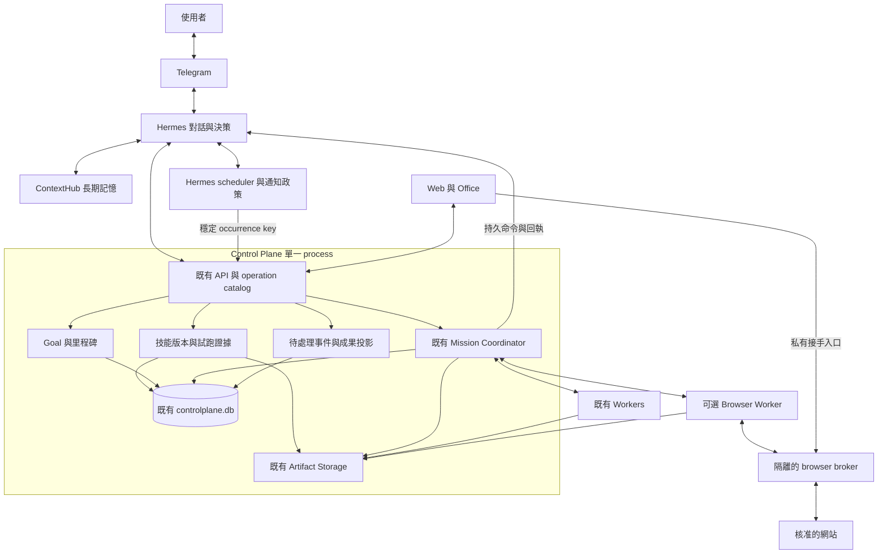
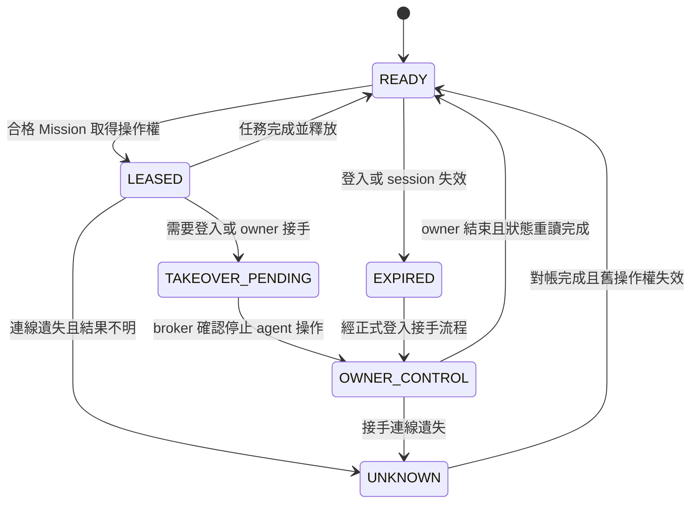
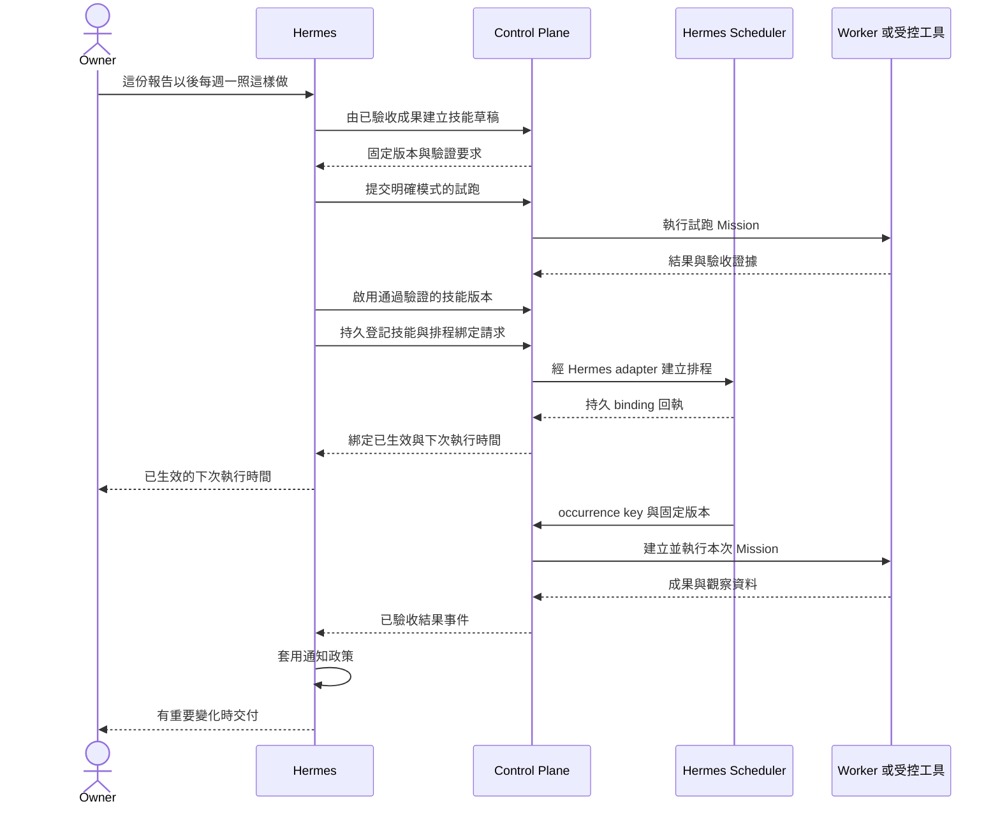

# Personal AI Control Plane：個人代理工作能力擴充 HLD

日期：2026-09-09。版本：1.0。狀態：**設計基準；Control Plane 的本地 durable lane 已實作，Hermes／ContextHub／browser broker 跨 repository 能力仍由 capability gate 明確標示未驗證。**

研究依據：[Grok Bot／Muse 功能研究](grok-muse-bot-research.md)。原始碼核對基準：`c33be707a65926944cb0acf46365d507aa134be5`。下列 API、資料實體、能力名稱、容量及驗收門檻，除特別標示既有項目外，均為提案。

配套：[Detailed Design](personal-agent-capabilities-detailed-design.md) — 固定資料表、API、狀態機、跨服務回執、恢復與驗收規格；細部契約以該文件為準。

## 1. 產品目標與設計決策

讓使用者在 Telegram 交辦之後，能得到可檢視的成果、重用已成功的做法，並讓 Hermes 持續推進明確的長期目標。日常操作不必了解 Worker、DAG 或重試協定。

成功體驗：

1. 「這份報告以後照這樣做」→保存經驗證的工作技能。
2. 「每週一早上檢查，沒問題不用通知」→Hermes 管理排程，CP 保存每次執行與判定證據。
3. 「這個月把平台可靠性改善好」→可追蹤里程碑、證據及下一個工作，而非一筆無期限任務。
4. 「這個網站沒有 API，幫我下載最新報表」→在合格 browser Worker 完成；必要時讓使用者接手登入。

| 決策 | 採用方式 |
| --- | --- |
| 對話／推理 | Telegram→Hermes，仍是唯一對使用者負責的決策入口 |
| 執行／恢復 | 沿用 CP Mission／Run／Plan／Step／Task、command／receipt |
| 記憶 | ContextHub 保持長期語意記憶 authority |
| 排程 | Hermes native scheduler 保持定義、時區及觸發 authority |
| 技能 | CP 管理新增「任務工作技能」的版本與證據；Hermes／Worker 讀取固定版本執行 |
| 長期目標 | CP 保存 Goal／里程碑事實；下一步計畫由 Hermes 決定 |
| 瀏覽器 | 增加受控 Worker 能力，CP server 本身不啟動通用瀏覽器／shell |
| UI | Web／Office 顯示同一份事實，新增成果、待處理、技能、目標入口 |

本文擴充 [Hermes v2 HLD](hermes-control-brain-v2-hld.md)，不取代其協定及 [Detailed Design](hermes-control-brain-v2-detailed-design.md)；既有 v1／v2 run 保持各自語意。Goal 是新領域名詞，不是引入舊版 `GoalPlanner` 或把規劃權移回 CP。

## 2. 範圍與基礎驗收

**Foundation 必須先成立：** 真實 Telegram 交辦能持久建立 v2 Mission，Hermes runtime 確實載入工具，完成一次 Hermes-only 成果交付及一次實體 Worker 工作，並在原對話收到結果。另需驗證追問、停止、重啟後續接。不能以 `202 accepted`、健康檢查或 Office 動畫取代。

新增範圍：F1 工作技能、F2 例行工作整合、F3 長期目標、F4 待處理／通知、F5 成果視圖、F6 記憶引用。F7 瀏覽器執行、F8 示範學習為後續能力。F9 角色交接沿用現有結構。

首版假設：單一 owner，既有 NAS CP 單 process＋SQLite，既有 Hermes／ContextHub 獨立服務。無新增 Redis、通用 workflow engine 或 Agent 訊息網路。任意網站、全天候電腦資源、支付、全自動修改 runtime 與公開分享平台不在本版承諾內。

## 3. 架構與資料權責

圖中的 browser broker 是新增 Worker 部署內的受控元件；不表示已有遠端桌面通道。該通道及私有連線可用性必須通過 F7 驗收才顯示入口。

| 資料 | Authority | 副本／引用規則 |
| --- | --- | --- |
| 對話、channel binding、原生 session | Hermes | CP 只留任務所需文字與不透明來源參照 |
| Goal、里程碑、Mission 及關聯 | CP | Hermes 每次決策取 revision snapshot |
| 工作技能版本、採用版本、試跑結果 | CP | 內容存 artifact；執行端只用 hash 驗證後的固定版本 |
| Hermes 原生 skills／工具包 | 原有 Hermes 管理流程 | 不被新增技能 registry 接管；以 adapter/version reference 引用 |
| Routine 定義、通知偏好、時區／觸發 | Hermes | CP 只讀 revision 鏡像、關聯與 occurrence 紀錄；不重建 cron |
| 待處理事件、解決狀態 | CP | Hermes 判斷表達方式並投遞；Web 讀同一份狀態 |
| 通知佇列、provider 發送紀錄 | Hermes | CP 保存同一 delivery key 的回執投影 |
| 瀏覽器 cookies／登入秘密 | Browser broker 所屬工作環境 | CP 只存 session metadata；不把 profile 複製進 artifact／ContextHub |
| 偏好、語意知識 | ContextHub | CP 保存最少引用與版本；本地 cache 不是 authority |

跨服務使用既有 outbox／inbox 與穩定 key，不共用 DB，不以先寫 CP、再寫 Hermes 的兩次呼叫宣稱原子成功。

## 4. 功能設計

### F1. 從成果產生版本化工作技能

借鏡 Grok 的方法重用，本案將技能正式化為可追溯的執行輸入。技能包含用途、輸入 schema、來源與新鮮度、必要能力、工作指引、驗收條件、輸出格式及允許效果。**技能內容不能授權自己。**

流程：`Mission 成果已驗收 → 使用者要求保存或既有規則允許產生草稿 → 草稿 → 隔離試跑 → 可用版本 → 選用`。自動提出草稿不等於自動啟用排程。

版本狀態：`DRAFT → VALIDATING → READY → DEPRECATED`，驗證失敗記為 `VALIDATION_FAILED`；工具／網站不相容則標 `INCOMPATIBLE`。發布只更新 registry 的可用版本，與 NAS production deploy 是不同操作。既有授權內可直接完成，不為每個技能保存再問確認。

執行固定 `skill_id + version + content_hash`；新版本不改已開始的 Mission，也不自動升級已綁定的 Routine。更改格式或規則產生新版本，保留來源 Mission、使用者修正及試跑 evidence。舊版本停用後禁止新 intake，進行中執行依 scope／停止策略處理。

試跑模式必須清楚：`VALIDATE_ONLY` 不執行外部效果；`SANDBOX_RUN` 只能使用隔離測試目標；`LIVE_RUN` 會真正執行，必須已有相應 scope。至少涵蓋正常、缺資料及來源格式變更三種案例，避免只重播成功範例。

技能 registry 不是向量記憶庫，不自動改 Hermes system prompt，不讓 agent 直接安裝或改寫 production adapter。

### F2. 技能綁定 Hermes 例行工作

CP 建立版本固定的技能 binding；Hermes 保存排程與參數。一次建立操作先持久登記跨服務請求，再由 Hermes adapter 回傳正式 `routine_id`、revision 及下一次觸發時間，CP 才顯示「已生效」。失敗顯示待同步／不可用，不顯示假的 next run。

每次觸發傳入 `source_occurrence_key`、routine revision、skill version、輸入參數、scope、通知政策 reference。CP 在單一交易內對 occurrence 去重並建立 Mission。原則沿用 `SKIP_IF_ACTIVE` 與 `LATEST_ONLY`，具體語意與能力以 Hermes adapter 協商為準。

時間型 key 由穩定的 routine ID 與原始預定 UTC 時間生成；重試沿用相同 key，不以重試當下時間重算。事件型由 source system／subscription ID／原始 event ID 生成；無穩定事件 ID 的來源必須定義持久 cursor 與去重規則後才能啟用。

事件監聽必須有來源、匹配條件、cooldown、遺漏偵測與來源不可用狀態；connector 不支援事件時只提供已標示延遲的 polling。下載失敗或資料過期輸出 `SOURCE_UNAVAILABLE`／`STALE_INPUT`，不能用舊資料得出無變化。

停用 Routine 阻止新的觸發，不默認取消已開始工作。刪除保留必要歷史 tombstone；restore 後先核對 Hermes 與 CP revision、occurrence，再恢復觸發，避免補發已完成工作。

### F3. 長期 Goal 與里程碑

新增 `Goal → Milestone → Mission links`，每個 Goal 有可觀察的成果條件、期限、資源／通知上限、下一次檢視及狀態。Mission 可沒有 Goal；首版每 Mission 最多屬於一個 Goal，簡化授權及費用歸屬。共享成果以 artifact reference 重用。

狀態：`DRAFT、ACTIVE、PAUSED、ACHIEVED、CANCELLED、ARCHIVED`。`AT_RISK`／`BLOCKED` 是從期限、缺口及執行狀態推導的健康標記，不與主狀態混用。

Hermes 根據 Goal snapshot 與新成果提出下一個有界 Mission；CP 驗證 Goal revision、scope、預算及重複工作 fingerprint。CP 不自行產生策略，也不因日曆到期就判定達標。

里程碑完成需要驗收 artifact／check evidence 或 owner 的明確判定。UI 顯示「3／5 個里程碑驗收完成」，不使用模型自報百分比冒充量測。變更目標後舊證據需重新核對相容性；無效證據仍保留歷史。

跨週／月工作拆成有限期限的 Mission，沿用既有每 Mission 上限。Goal 的成本與嘗試上限跨 child Mission／reopen 累計，不能透過新增 Mission 洗掉預算。週期補充的資源必須使用 owner 已設定的 budget period。

暫停 Goal 時立即停止新 Mission admission，並對活動 child Mission 發出既有 pause request；只有已確認停下才顯示「全部暫停」。取消也沿用 requested／confirmed／unknown 區別，不假設能撤回外部效果。恢復需處理殘留 unknown，不自動重做先前效果。

### F4. 待處理事件與適量通知

新增統一待處理視圖，收斂既有 owner question、approval、失敗、登入接手、期限風險及成果可用事件。它只是索引與互動入口；實際回答、授權、重試仍呼叫各 authority 的操作。

資料包含 `source_event_key、subject_id、reason_code、severity、deadline、evidence_refs、suggested_action、resolution_state`。可用狀態為 `OPEN、SNOOZED、RESOLVED、SUPERSEDED`。標成已讀不等於解決；過期問題不接受回覆。

通知由 Hermes 政策處理：

1. CP 先以來源 key 去重、合併同一 subject／reason 的活動事件。
2. Hermes 讀使用者通知偏好、變化 fingerprint、期限與 quiet hours。
3. 必要問題／執行失敗／承諾的最終交付進入通知；普通 heartbeat 只留活動紀錄。
4. 低優先通知可合併或延後；期限不足且已有緊急通知規則才可越過 quiet hours。
5. 每次發送使用穩定 delivery key，回寫 provider evidence。送達不明保留 `UNKNOWN`，禁止無限制重送。

一般 Mission 保留最終交付承諾；「無變化保持安靜」僅適用明確採該政策的監測工作。這類無通知結果記為 `SUPPRESSED_BY_POLICY`，它是通知處置，不是 provider `SENT`，也不能把需要交付的 Mission 偽裝為已送達。

「為什麼通知我」應回覆觸發來源、新變化及必要動作。不同 subject 不共用去重 key，避免將第二個真正問題吃掉。高優先通知不被 LLM 的「不值得打擾」單獨壓掉。

### F5. 成果視圖與修訂

沿用 artifacts／acceptance／delivery，不建第二個檔案儲存系統。成果卡包含：標題、簡短摘要、產出時間、來源與新鮮度、可下載內容、驗收狀態、尚未完成項目及交付狀態。

先支援 Markdown／文字、PDF／圖片附件、CSV 下載及現有格式的安全 fallback；Office 文件可下載，預覽需 renderer 真正可用才顯示。HTML 預覽須隔離且不得繼承 CP 登入憑證；首版可提供靜態預覽或下載，不承諾任意生成網頁可執行。

「把剛才報告改成比較表」建立新成果版本，保存 `supersedes_artifact_id`、來源 Mission 與 input hash，相關 Goal／Skill 仍固定原版本直到明確換用。檔案缺失、過期或 hash 不符顯示不可用，不能因有 artifact ID 顯示下載成功。

Telegram 由 Hermes 私下取得 artifact 後送檔或送可存取連結；不把只有內網可達的 URL 當作 provider 能下載的檔案，也不把建立公開網址當預設交付方式。

### F6. 可解釋的記憶引用與修正

Hermes 查 ContextHub 時保留 reference、version、用途及最少必要摘要。任務可顯示「本次採用：報告使用繁中／先摘要後證據」，使用者可修正。

「只改這次」更新 Mission context；「以後都改」透過 ContextHub 正式介面提出更新並等寫入回執。更改偏好不會默默替換已固定技能版本；需要時產生技能修訂草稿。

ContextHub 不可用時，對必要背景回報 `CONTEXT_UNAVAILABLE`，對非必要背景可註明不足並繼續。刪除／忘記須使後續檢索與衍生 cache 失效；歷史稽核內容的保存／去識別仍遵守 ContextHub 與既有資料政策，不宣稱一次刪除能清掉所有備份。介面在 adapter 未驗證前顯示不可用。

### F7. 可接手的 Browser Worker

以既有 Worker 協定增加 `browser.read、browser.download、browser.form_draft、browser.takeover` 等待協商能力。首先在獨立且已授權的工作環境上線，使用專用 profile；需要 shell 的程式 executor 不能讀取 broker profile／憑證儲存。

路由原則：正式 API／connector 足夠時先使用；只在缺能力或需要視覺工作時選 browser。首版「form draft」也可能觸發網站 autosave，因此不一律當唯讀，必須依指定網站實際行為分類。網站提交、寄送、購買及 production 操作不因存在瀏覽器就獲得權限。

session metadata 包含 worker／profile reference、網站範圍、可用性、generation、操作者及 lease。不同 profile 提供組織與併發界線，**不單獨構成 OS 安全隔離**；真正的秘密／效果邊界在外部 broker 與受控執行環境。

每 session 同時一個操作者。broker 在每個動作核對 generation；owner 接手前先阻止舊 agent 動作，再交控制。恢復執行要重讀頁面與任務 revision，不能接續舊座標腳本。lease 到期只代表租約失效，不代表效果未發生，須先對帳才可重派。

登入、MFA、CAPTCHA 由使用者在私有接手介面完成，不經 Telegram 傳秘密；輸入秘密時停止 agent 觀察／操作及錄製。成效證據保存來源 URL、擷取時間、下載檔 hash、必要遮罩畫面及提交回執，不保存 cookies／密碼／完整輸入錄影。

CP／Worker 失聯、取消與重啟沿用既有 execution fencing，另在 broker 執行實際停止。對可寫網站，若缺乏 idempotency 或查詢對帳，結果不明只能 `UNKNOWN`，不能重新開 browser 任務盲目重送。

工作環境休眠時依賴它的 Mission 等待，Hermes 仍可對話；只有實際常駐且通過驗證的 Worker 才標示可全天候工作。NAS 不預設承擔 GUI／browser 負載，也不修改 gateway policy 取得瀏覽器權限。

### F8. 從示範產生技能

F7 通過後提供明確開始／停止的教學 session；只記錄選定 browser 工作範圍，呈現錄製狀態並允許丟棄。登入／秘密輸入期間暫停擷取。

Hermes 將操作證據整理成語意步驟、必要前提、完成條件及錯誤分支，輸出 F1 草稿。畫面文字是被觀察資料，不能成為新增權限的指令；單次示範不能證明所有分支都正確。輸出需用另一組輸入、缺資料及網站變更情境試跑，通過才可採用。

首版不做整台 Mac 錄影、麥克風收音或任意 app 行為側錄。錄製原始材料只短期保存，技能引用去敏感的 evidence。

### F9. 角色與交接

沿用 role definitions、office members、Plan Step 與 artifact input mapping。交接資料至少包括來源 step、成果 hash、接收角色、完成條件及 CP admission 狀態。Hermes 負責整體整合，Worker 的局部推理只能在已委派的 step contract 內進行。

Office 可顯示研究、實作、驗收各自狀態；不因多三個角色就提高實際可並行工作數，也不再建立 Bot-to-Bot 常駐訊息服務。

## 5. 核心資料與介面

新增資料全部採 additive migration；migration 編號由實作時的 repository 決定。CP 中的資料與既有 Mission admission 使用同一 SQLite transaction／unit of work，禁止巢狀 `BEGIN IMMEDIATE`。

| 邏輯實體 | 主要內容與 invariant |
| --- | --- |
| `work_skills`／`work_skill_versions` | ID、不可變版本、content hash、artifact ref、source Mission、輸入／驗收規格、狀態；發布指標以 CAS 更新 |
| `skill_validation_runs` | skill version、test mode、測試輸入 hash、Mission ID、驗收結果；測試不允許因模式名稱擴權 |
| `routine_bindings` | Hermes routine ID／revision、skill version、sync state；不保存可獨立執行的排程引擎 |
| `routine_occurrences` | 穩定 source key、routine ref、Mission ID、接收結果；唯一約束防重複 intake |
| `goals`／`goal_milestones`／`goal_mission_links` | revision、成果條件、狀態、證據；Task 成功不能直接滿足 milestone |
| `goal_budget_entries` | goal／period、reservation／charge key、dimension、amount；admission 預留與執行計費去重 |
| `attention_items` | source key、subject、原因、期限、resolution、revision；delivery 與已讀各自保存 |
| `browser_sessions` | broker／Worker ref、generation、操作者、狀態；秘密不進 CP DB |

artifact lineage 優先擴充既有 metadata；memory reference 優先放在既有 Mission context evidence，不為每個 UI 元件另建表。跨 repo adapter 只透過正式 API，不直接讀寫 CP SQLite。

建議沿用 `/api/v2`，新 routes 是設計候選，需於 Detailed Design 固定 schema 並加入 operation catalog：

| 候選介面 | 用途 |
| --- | --- |
| `POST /api/v2/skills/drafts` | 由既有 Mission／輸入產生草稿 |
| `POST /api/v2/skills/{id}/versions/{version}/validate` | 建立明確模式的測試 Mission |
| `POST /api/v2/skills/{id}/activate` | 在驗證與 CAS 成功後選定版本 |
| `POST /api/v2/routine-bindings` | 持久啟動 Hermes binding 操作；成功回執後才 effective |
| `POST /api/v2/routine-occurrences` | 受驗證的 Hermes adapter 觸發 Mission |
| `GET/POST /api/v2/goals` | 查詢／建立長期目標 |
| `POST /api/v2/goals/{id}/commands` | revise／pause／resume／cancel／link Mission／驗收里程碑 |
| `GET /api/v2/attention` | 統一待處理投影 |
| `POST /api/v2/attention/{id}/commands` | snooze 等索引操作；效果導向正式 authority |
| `GET /api/v2/browser-sessions/{id}` | session metadata 與短效私有接手 reference |
| `POST /api/v2/browser-sessions/{id}/commands` | 要求接手／恢復／停止；broker 確認後才 applied |

Mutation 需 caller 身分、scope、idempotency key；涉及既有實體需 expected revision。同 key 不同 payload 回 `IDEMPOTENCY_CONFLICT`，舊 revision 回 `REVISION_CONFLICT`，能力不足回 `CAPABILITY_UNAVAILABLE`。HTTP `202` 只表示持久受理，依既有 operation status 查詢真正結果。

跨服務請求共用 envelope 最少包含 `operation_id、source_key、mission_id（適用時）、expected_revision、authority_epoch、request_hash、schema_version`。回執區分 accepted／applied／rejected／unknown，並帶 actual revision、evidence reference 及可說明的 reason。

## 6. 主要資料流

### 6.1 完成一次，之後例行執行

首次設定已由「每週一」授權；只有欠缺時間、來源或效果授權且無法由上下文決定時才詢問。若只保存成功技能但排程同步失敗，必須清楚說明「技能可用、排程尚未生效」。

### 6.2 長期目標續接

Hermes 收到目標→CP 保存 Goal→Hermes 提出第一個可驗收 Mission→CP 受理／執行→成果回饋→Hermes 審查 milestone→CP 提交 milestone evidence→Hermes 選下一步或安排下一次檢視。

檢視由 Hermes scheduler／事件喚醒；等待不占 LLM 槽位。新 owner 指示先更新 revision，舊提案失效。完成目標需所有必要條件達成，並保存整體驗收記錄。

## 7. UX 原則

Telegram 是完整日常入口，主動回報使用「正在處理／需要你決定／已完成／目前做不到」等具體文字。scope hash、generation 與 operation key 留在診斷詳情。

| 視圖 | 使用者看到什麼 | 避免的誤導 |
| --- | --- | --- |
| 待處理 | 需要我做什麼、期限、來源、可操作按鈕 | 打開頁面不代表已同意或已解決 |
| 目標 | 里程碑證據、當前工作、下一次檢視 | 不用角色活動量推算進度 |
| 技能 | 做什麼、最近試跑、版本、可用能力 | 未驗證技能不顯示「已學會」 |
| 例行工作 | Hermes 確認的 next run、來源狀態、執行歷史 | CP 鏡像過期需顯示同步時間 |
| 成果 | 預覽／下載、版本、驗收、交付狀態 | 不把 Task 完成當 owner 已收到 |
| 工作電腦 | 當前網站、操作者、等待／接手 | 斷線畫面不顯示為即時直播 |

首版不用新做聊天 App。Office 保留場景，但日常決策以待處理、目標和成果為主；所有操作與 Telegram 共用正式服務及 revision 檢查。

## 8. 可靠性、容量與觀測

以下是首版**設計預設／驗收目標，未經負載量測**：

| 項目 | 初始設定或目標 |
| --- | --- |
| 活動 Goal | 最多 10；不代表同時推理 10 次 |
| 活動 Mission／Brain turn | 沿用 v2 設計最多 5 筆、背景推理 1 槽；以 live runtime 能力調低 |
| 每 Goal 活動 Mission | 最多 2，仍受全域及 Worker 限制 |
| Browser session | 首版 1 個活動 session／Worker；單一操作者 |
| 背景無變化 | 連續 10 次測試不產生通知；10 次都須有執行證據 |
| CP 已持久接受事件→待處理可見 | 正常測試負載下 p95 ≤ 5 秒；不包含上游 polling 延遲 |
| 待處理→通知開始嘗試 | 非安靜時間、provider 健康時 p95 ≤ 60 秒；不承諾收件人已讀 |
| 通知去重 | 同 source event 重播 100 次，只有 1 個有效通知操作 |
| 示範原始材料 | 預設最多 10 分鐘／session、保留 7 天，可提前刪除；容量滿時停止擷取 |

每 Mission 沿用 turn／attempt／elapsed 限制；Goal 增加跨 Mission 上限與 reservation。沒有 provider 成本證據就顯示 UNKNOWN，使用 turn／時間上限保護，不能把未知費用當 0。

持久等待只用事件／timer 恢復；事件頻率高時先合併，再決定是否需要 Hermes turn。DB 交易內不呼叫模型、網站或外部 HTTP。大量原始畫面在 artifact storage，不塞入 SQLite 事件 payload。

監測：端到端交付率、技能重用驗收率、必要人工介入次數、通知重複／漏報、stale-input 次數、goal 逾期、browser 接手成功率、UNKNOWN 效果數及每 Goal 資源使用。初次至少 20 筆代表性任務建立基準，再設定省時或成功率提升目標，不能先聲稱省下特定百分比。

恢復重點：

- 普通重啟保留 authority epoch，恢復未完成 outbox／inbox，不重放已確定的效果。
- restore 依既有政策換 epoch／進對帳模式；核對 Hermes Routine、Goal budget、browser lease 與 provider delivery。
- provider 發送不明、browser 提交不明保留 UNKNOWN；查詢對帳或 owner 解決後才能繼續。
- 停用新 feature flag 只停止新 intake；舊 run 由相容 handler 完成或有證據地停止。
- 備份需 CP DB＋artifacts 一致性以及 Hermes／ContextHub 各自備份；browser profile 有獨立加密／恢復政策，不能用 CP 備份成功替代。

## 9. 邊界與取捨

本設計採用 Muse 的「執行者不能自行批准自己」原則，但先沿用確定性的 CP scope admission、受控 adapter 與 broker；不建立第二個 LLM 主管，也不承諾複製 Muse 的完整網路攔截架構。

新增能力只在具體操作／目的地／資料範圍的授權內執行。既有 owner 授權持續有效；一般唯讀及已授權例行操作不重複打擾。需要新增授權時先準備可檢視的內容，再呈現具體效果；授權綁定 request hash／revision，修改內容後重新判定。

NAS production 仍必須使用已註冊 `/usr/local/bin/deployment`，預建 immutable image→staging Compose→validate→deploy→status／health。所有特權命令維持 `sudo -n`，不改 root-owned controller、production `.env`／Compose，也不在 NAS 直接 build。本輪沒有部署動作。

| 選擇 | 得到的好處 | 代價／重新評估條件 |
| --- | --- | --- |
| Goal 管事實，Hermes 規劃 | 單一決策責任、可恢復 | 需正式 goal snapshot／event adapter |
| CP 保存工作技能，原生工具包獨立 | 可固定版本、重現執行 | 多一層發送／快取驗證；不應複製原生技能市場 |
| Hermes 排程、CP binding | 保持現有 scheduler authority | 必須處理同步失敗及 revision 對帳 |
| API 優先、browser 補缺 | 路徑可驗證，減少 UI 變更影響 | 部分網站仍需額外 adapter／人工登入 |
| SQLite 單 writer | 沿用現況、跨領域交易簡單 | 若量測持續 writer contention／無法達延遲目標再拆分 |
| 有界角色交接 | 保留分工與清楚成本 | 無自由 Bot 社交；只有跨團隊 owner 場景再重評 |
| 私有成果交付 | 沿用使用者資料控制 | Telegram 大檔／格式限制需回報或用私有可達下載 |

## 10. 實作落點與交付順序

| 區域 | 既有落點 | 擴充內容 |
| --- | --- | --- |
| CP domain／DB | [office migrations](../apps/control-plane/src/db/office-migrations.ts)、[Mission service](../apps/control-plane/src/missions/mission-service.ts)、[Coordinator](../apps/control-plane/src/missions/coordinator.ts) | additive Goal／Skill／Attention 模組，沿用 Mission unit of work |
| API／contracts | [server](../apps/control-plane/src/server.ts)、[catalog](../apps/control-plane/src/control/operation-catalog.ts)、[contracts](../packages/contracts/src/index.ts) | typed operations、版本／CAS／idempotency、capability 協商 |
| 成果 | [artifact storage](../apps/control-plane/src/artifacts/artifact-storage.ts) | lineage、可用性／預覽投影 |
| Worker | [service](../apps/worker/src/service.ts)、[runtime](../apps/worker/src/runtime.ts) | browser executor 接口、session fencing、broker receipts |
| Web／Office | [app](../apps/control-web/src/app.ts)、[scene projection](../apps/control-plane/src/office/scene-projection.ts) | 待處理、目標、技能、成果與接手投影 |
| Hermes repository | 既有對話／scheduler／工具／delivery adapter；跨 repo 路徑於實作時核對 | skill loader、Goal review、routine occurrence、通知去重 |
| ContextHub repository | 既有查詢／更新介面；跨 repo 路徑於實作時核對 | memory reference、修正回執及失效通知 |

交付次序是依賴關係，不是新增逐階段人工批准程序：

1. **Foundation**：修復／驗證目前真實 Hermes v2 交付閉環，建立 evidence baseline。
2. **第一個可用版本**：F1／F2＋F4／F5，完成 NAS 健康週報技能、試跑、Hermes 排程、安靜通知及成果。
3. **目標版本**：F3／F6，驗證跨多個 Mission 的「平台可靠性月目標」，接好 ContextHub 引用與修正。
4. **瀏覽器版本**：F7，先單一已選網站、下載與接手；合格後再 F8 教學。
5. F9 以各版本需要的成果交接補齊，沿用既有 Office，不另建 Agent 團隊服務。

每次 release 記錄 `design_only、implemented_local、ci_verified、live_verified、provider_verified` 各自證據。跨 repo 各自 version／image／rollback，支援能力不足時拒絕新 intake，不能靠部署順序假設兩端永遠同步。

## 11. 驗收案例

以下為跨服務與 live 驗收規格；本次已執行其中的本地 domain／API 測試，Hermes／provider／browser／重啟與正式部署證據仍未宣告。

| ID | 情境 | 必須觀察到的結果 |
| --- | --- | --- |
| PA-01 | Telegram 交辦研究並交付檔案 | 同一 source→Mission→artifact 驗收→同對話 provider 回執；純 Hermes 工作不建假 Worker Task |
| PA-02 | 交辦實體 Worker 並在工作中補充限制 | 取得真實執行證據；舊 revision 提案不能繼續新增不符操作 |
| PA-03 | 由已驗收報告保存技能 | 版本/hash、來源及正常／缺資料／格式改變案例證據完整 |
| PA-04 | 新技能發布時舊 Routine 執行中 | 舊 occurrence 保持舊版本；切換只影響明確更新後的觸發 |
| PA-05 | 同 occurrence 重送 100 次，Hermes／CP 重啟 | 只建立一筆邏輯 Mission；沒有重複外部效果 |
| PA-06 | CP binding 已記錄，Hermes 建排程失敗 | UI 顯示未生效；重試回到同一操作，不產生兩份排程 |
| PA-07 | 監測 10 次無變化，再一次真實變化 | 前 10 次留 evidence、0 通知；第 11 次 1 筆通知並有新舊差異 |
| PA-08 | 資料來源失效、接著回復 | 失效不是無變化；同類失敗合併，恢復有可追溯事件 |
| PA-09 | 一 Goal 包含 3 個 Mission，其中一份成果不合格 | 不合格 milestone 保持未完成；Hermes 提出有上限的修正工作 |
| PA-10 | Goal 暫停與新 child Mission 同時進入 | 交易／revision 阻止新 admission；活動工作顯示 requested 與 confirmed |
| PA-11 | 建新 Mission 或 reopen 試圖繞過 Goal budget | 仍受同一 period 的預留／累計限制 |
| PA-12 | 重播事件、忽略通知或只開啟頁面 | 不重送同通知；已讀不會批准外部操作或回答問題 |
| PA-13 | 傳送成功後回執丟失 | UNKNOWN；不重跑 Mission、不無限重發 |
| PA-14 | 修改報告後查原版與新版 | 兩版可追溯，Goal／Skill 的原版引用未被默默更換 |
| PA-15 | 使用者說只改本次／以後都改 | 分別更新 Mission／ContextHub；後者有實際寫入回執 |
| PA-16 | browser agent 執行時 owner 接手 | broker 確認 agent 停止後交接；過期 generation 動作被拒絕 |
| PA-17 | browser profile／Worker 離線、提交結果不明 | 明確 waiting／UNKNOWN；換 Worker 不重送效果、不搬秘密 |
| PA-18 | 示範包含登入、網站文字要求擴權 | 秘密區間未被記錄，網頁要求不變成授權，輸出仍是待驗證技能草稿 |
| PA-19 | CP restore 後 Routine／browser 狀態較新 | 進對帳模式，舊 epoch 不生效，核對後才恢復新工作 |
| PA-20 | 停用功能並回滾相容映像 | 不丟進行中事實；舊 run 完成或確認停止；既有 Task／Worker 流程仍可用 |

## 12. 實作前需固定的細節

不影響本 HLD 的方向，但 Detailed Design 必須依現場能力作出明確決策：Hermes scheduler 的事件／misfire 支援、ContextHub 記憶修正契約、第一個 browser 網站與私有接手 transport、broker OS 隔離、實際 Worker 容量、Goal budget period 與 artifact 保留配額。

本提案的第一個可評估成果是「一份成功報告能變成可重複執行的服務」，再擴充到跨任務目標與非 API 工作。所有能力的完成都以成果和交付證據判定。
