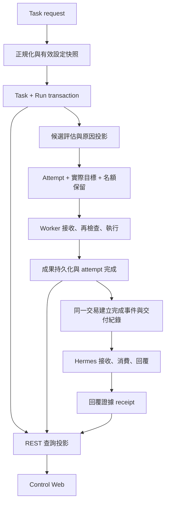
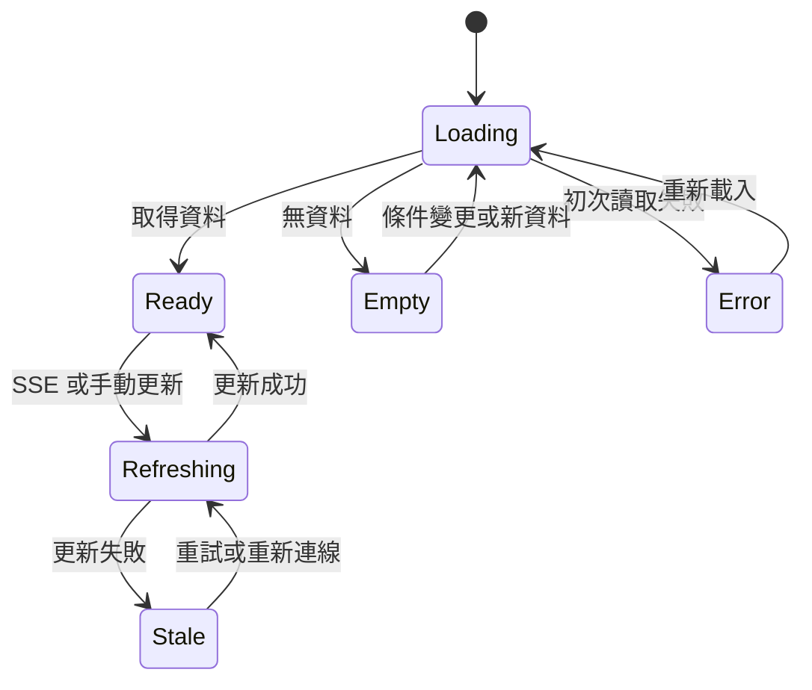

# Personal AI Control Plane v2 — 功能與人機介面改善 Detailed Design

日期：2026-09-05

狀態：待實作的設計規格。本文的新增資料表、API、協定與 UI 尚未代表已存在或已通過驗收。

上位設計：[功能與人機介面改善 HLD](personal-ai-control-plane-functional-ux-hld.md)。基礎架構：[v2 HLD](personal-ai-control-plane-hld.md)、[既有 Detailed Design](personal-ai-control-plane-detailed-design.md)。

## 1. 範圍、約定與目前差異

本文將 HLD 的 16 項需求展開為可以實作與測試的規格。維持 Hermes 規劃、ContextHub 記憶、Control Plane 協調、Worker 執行的分工，以及現有單一 Control Plane process/container。新增模組僅用於承載新增功能，不要求整理無關程式、換框架或拆服務。Security review、實作、commit、push 與部署不在本次文件交付範圍。

### 1.1 共通 contract

- HTTP 輸入、Worker WebSocket 訊息使用 `snake_case`；REST 查詢回應維持既有 `camelCase`。既有建立 Task 回應及 settings key 保留 snake_case，屬相容性例外。轉換集中在 contract parser／serializer，禁止直接轉送內部 execution 物件。
- 時間在 SQLite 使用 UTC Unix milliseconds，API 使用 RFC 3339 UTC；畫面以使用者時區呈現，預設 `Asia/Taipei`。
- 新增 ID 沿用 UUIDv7；數字 revision 為持續遞增整數。
- `null` 表示沒有值；另用狀態欄位區分 `UNKNOWN`、`UNSUPPORTED`、`NOT_APPLICABLE`。不可將未知量測值填成 0。
- 範例中的短 ID 為示意值，實際 API 應使用完整 ID。本文列出的預設值為產品設計選擇，非量測結果。
- 修改任務的 API 保留既有路徑；新 UI 與 Hermes client 必須更新寫入前置條件，舊只讀欄位繼續提供。

### 1.2 本次重新確認的現況

| 元件 | 目前行為 | 本設計的必要修改 |
| --- | --- | --- |
| Task service | 人工 retry 歸零 attempt count；查詢按派工優先度與舊到新排序 | 輪次與全歷史編號分開；使用者清單獨立排序 |
| Worker runtime | 以第一個 `canExecute` 成立的 executor 執行 | offer 必須包含確定的 runtime／model／workspace |
| Contracts／Codex | API 轉為 `workspaceId`，executor 讀 `workspace_id` | HTTP、DB、offer 與 executor 明確轉換 |
| Settings | 寫入 settings table，主要執行迴圈仍使用環境變數 | 有效設定解析、套用版本與 runtime 使用 |
| Hermes client | `create_task` 自行補入 1800 秒與 2 次 | 未指定時交由 Control Plane 的有效設定決定 |
| Hermes callback receiver | 以 event ID 去重後寫入 JSONL，回 accepted／duplicate | 增加可恢復的消費、回覆與回報流程；收件不能等同已回覆 |
| Windows installer | 要求 WorkerExecutable 已存在 | 補齊安裝來源、Node／依賴與 launcher 準備，再建立登入後常駐工作 |

上表來自 repository 原始碼檢視，不是本次進行正式環境端到端測試的結果。

## 2. 模組責任與資料路徑

| 現有位置 | 修改內容 | 新增支援單元的責任 |
| --- | --- | --- |
| `tasks/task-service.ts` | 建立、retry、結果、cancel transaction | `task-query.ts`：清單／統計；`task-projection.ts`：詳情與待處理摘要 |
| `scheduler/scheduler.ts` | 選定完整目標、等待原因、設定套用 | `eligibility.ts`：產生候選與同一套排除原因 |
| `workers/worker-service.ts` | inventory、專案、接案投影 | `worker-preferences.ts`：接案設定與版本 |
| `workers/worker-channel.ts` | feature 協商、offer serialization、ack | 沿用現有 channel，不另建傳輸服務 |
| `settings/settings-service.ts`、`index.ts` | 有效值、schema、CAS 與迴圈套用 | `settings-registry.ts`：欄位型別、範圍、使用元件 |
| `artifacts/` | 預覽、下載、顯示名稱與保留週期 | `result-projection.ts`：可閱讀成果 |
| `callbacks/outbox.ts` | 輪次、事件去重、重送與交付投影 | Hermes receipt 接收與事件狀態更新 |
| `models/`（新增功能目錄） | 試跑批次、模板、偏好 | 使用既有 Task service，不建立第二個 executor |
| `apps/worker/src/` | 目標檢查、設定、workspace、idle adapter、結果結構 | 新功能各自有小型 contract 與測試 |
| `apps/control-web/src/` | 六頁 UI、查詢狀態、URL、草稿與結果 | 保留 React/Vite 與既有路由，不要求全面拆解 UI |



所有 Task／Run／Attempt 狀態與其事件在同一 SQLite transaction 內更新，commit 後才送 SSE。網路呼叫、檔案串流與 Worker send 不放在持有 SQLite write transaction 的區段。

## 3. 資料結構與 v2 資料增補

### 3.1 既有表新增欄位

以下 TEXT JSON 欄位在讀寫邊界均經 schema 驗證。新增索引與欄位的實際 migration 沿用 `schema_migrations`；目前 repository 已使用版本 1、2，依下述順序新增 3–6，若實作前編號已被占用則順延。

| 表 | 新增欄位／規格 |
| --- | --- |
| `tasks` | `created_seq INTEGER UNIQUE`；`current_run_id TEXT`；`revision INTEGER NOT NULL DEFAULT 1`；`purpose TEXT DEFAULT 'USER'`（USER／MODEL_TEST／WORKER_TEST）；`source_ref_json TEXT`；`preference_snapshot_json TEXT`；`settings_version INTEGER`；`request_snapshot_json TEXT`；`archived_at INTEGER` |
| `task_attempts` | `run_id TEXT`；`attempt_in_run INTEGER`；`resolved_execution_json TEXT`；`deadline_at INTEGER`；`occupancy TEXT DEFAULT 'RELEASED'`（RESERVED／RUNNING／RELEASING／RELEASED）；`cancel_requested_at INTEGER`；`cancel_ack_at INTEGER` |
| `artifacts` | `display_filename TEXT`；`storage_state TEXT DEFAULT 'AVAILABLE'`（AVAILABLE／PURGING／EXPIRED／MISSING）；`expired_at INTEGER`；`artifact_key TEXT`；`preview_kind TEXT` |
| `callback_outbox` | `run_id TEXT`；`event_kind TEXT DEFAULT 'TERMINAL'`；`state TEXT DEFAULT 'PENDING'`；`first_attempt_at INTEGER`；`last_attempt_at INTEGER`；`failure_streak INTEGER DEFAULT 0`；`receipt_revision INTEGER DEFAULT 0`；`reply_state TEXT DEFAULT 'UNKNOWN'`；`reply_json TEXT` |
| `workers` | `protocol_features_json TEXT DEFAULT '[]'`；`inventory_revision INTEGER DEFAULT 0`；`settings_applied_version INTEGER DEFAULT 0`；`preferences_applied_version INTEGER DEFAULT 0`；`availability_json TEXT` |
| `worker_models` | `present INTEGER DEFAULT 1`；`last_seen_at INTEGER`；不再以刪除再新增的方式破壞模型實例歷史身分 |
| `systems` | `entry_url TEXT`，與 `base_url`／`health_path` 分開 |

`attempt_count` 改為 Task 歷史 attempt 總數投影，不能用來判斷本輪剩餘額度。原 `max_attempts` 保留為每輪上限快照。`created_seq` 由下方 `runtime_metadata.next_task_seq` 在建立交易內配發，與時鐘／UUID 排序無關。

升級時先新增 nullable created_seq，依 `(created_at, id)` 排序回填歷史資料，再建立 UNIQUE index，將 next_task_seq 設為 MAX+1；不直接以 SQLite ALTER COLUMN 增加唯一約束。新任務必須在建立交易內配發非 null 值。

### 3.2 新增功能表

| 表 | 欄位與約束 |
| --- | --- |
| `task_runs` | `id TEXT PK`、`task_id TEXT FK`、`run_number INTEGER`、`trigger TEXT`（INITIAL／MANUAL／LEGACY）、`status TEXT`（沿用 Task states）、`max_attempts INTEGER`、`attempts_used INTEGER DEFAULT 0`、`created_at`、`finished_at`、`result_json TEXT`、`failure_json TEXT`；UNIQUE(task_id, run_number) |
| `task_dispatch_state` | `task_id TEXT PK FK`、`run_id TEXT`、`primary_reason TEXT`、`reasons_json TEXT`、`candidates_json TEXT`、`reason_hash TEXT`、`blocked_since INTEGER`、`evaluated_at INTEGER`、`dispatch_not_before INTEGER` |
| `operation_receipts` | `scope TEXT`、`operation_key TEXT`、`request_hash TEXT`、`status_code INTEGER`、`response_json TEXT`、`created_at INTEGER`；PK(scope, operation_key) |
| `runtime_metadata` | `key TEXT PK`、`value_json TEXT`；至少保存 next_task_seq、list_revision、settings_version、settings_effective_hash |
| `worker_workspaces` | `worker_id TEXT FK`、`workspace_id TEXT`、`display_name TEXT`、`capabilities_json TEXT`、`state TEXT`（READY／MISSING／DISABLED／UNKNOWN）、`config_version INTEGER`、`checked_at INTEGER`；PK(worker_id, workspace_id) |
| `worker_preferences` | `worker_id TEXT PK FK`、`version INTEGER`、`mode TEXT`（NORMAL／IDLE_ONLY）、`pause_id TEXT`、`pause_until INTEGER`、`pause_indefinite INTEGER DEFAULT 0`、`idle_threshold_seconds INTEGER`（null=跟隨全域）、`updated_at INTEGER` |
| `worker_onboarding` | `id TEXT PK`、`platform TEXT`、`selected_capabilities_json TEXT`、`selected_workspaces_json TEXT`、`registration_id TEXT`、`worker_id TEXT`、`last_step TEXT`、`diagnostic_task_ids_json TEXT`、`created_at`、`updated_at`、`abandoned_at`；進度事實仍以註冊與 Worker 回報計算 |
| `model_preferences` | `id TEXT PK`、`name TEXT`、`task_type TEXT`、`version INTEGER`、`targets_json TEXT`、`allow_fallback INTEGER`、`deleted_at INTEGER`、`updated_at INTEGER` |
| `model_test_batches` | `id TEXT PK`、`template_id TEXT`、`template_version INTEGER`、`input_json TEXT`、`parameters_json TEXT`、`input_hash TEXT`、`state TEXT`（QUEUED／RUNNING／COMPLETED／CANCELLED）、`created_at`、`finished_at` |
| `model_test_cases` | `batch_id TEXT FK`、`position INTEGER`、`target_json TEXT`、`task_id TEXT UNIQUE FK`、`queue_deadline_at INTEGER`、`state TEXT`（PENDING／QUEUED／RUNNING／SUCCEEDED／FAILED／SKIPPED／CANCELLED）、`skip_reason TEXT`；PK(batch_id, position) |

本機 Worker 在既有 local DB 的 `worker_state` 保存「最後完整有效的設定快照與版本」及「本機設定版本」；assignment 保存完整 offer，包括 run、實際 execution 及輸入 artifact manifest。新增本機 `pending_artifacts` 以 `(attempt_id, artifact_key)` 唯一，保存待回報檔案與 ack 狀態。

必要索引：

- `tasks(created_at DESC, id DESC)`、`tasks(status, created_at DESC, id DESC)`、`tasks(purpose, finished_at DESC, id DESC)`、`tasks(created_seq)`。
- `task_runs(task_id, run_number)`、`task_attempts(run_id, attempt_in_run)` 唯一；保留原 `(task_id, attempt_number)` 唯一。
- `task_attempts(worker_id, occupancy)`、`worker_workspaces(workspace_id, state)`。
- `callback_outbox(state, available_at, claimed_until)`、`callback_outbox(task_id, run_id)`。
- `artifacts(attempt_id, artifact_key)` 唯一（舊資料 artifact_key 為 null）；`artifacts(storage_state, created_at)`。

### 3.3 資料增補與歷史資訊

1. **版本 3：** run、operation receipts、task query metadata。每個既有 Task 建立一個 LEGACY run；`attempts_used` 由目前可見的歷史 attempt 計算，`attempt_count` 由 COUNT 重新建立，下一次編號使用 MAX(attempt_number)+1。
2. 既有人工重試可能留下不完整輪次資訊，不能據此宣稱知道原輪次。統一標記歷史輪次未記錄；既有 QUEUED task 若有人工 retry 事件，只為「目前新的執行」建立一輪 MANUAL、額度重置，其他舊 attempt 留在 LEGACY run。
3. 既有 ASSIGNED／RUNNING 任務依目前 attempt 連入 LEGACY run並保留原 execution；實際 target 不明時維持 null。等待其完成或取消，不猜測模型，也不重新啟動工作。
4. **版本 4：** artifact／callback／source projection。舊 outbox 的輪次若無法從事件證明，`run_id=null`，置於「歷史交付」，不得當作目前輪次交付。
5. **版本 5：** Worker 專案、接案與導引。原 drain=1 正規化為 indefinite pause；尚未提供新 features 的裝置顯示需要更新。
6. **版本 6：** 模型試跑與偏好。所有既有 USER 任務保留，不自動轉成診斷。

每個版本在啟動接受新請求前單一交易執行，記錄 checksum；失敗回滾該版本並停止啟動。實作須用目前 schema 的副本測試升級與重複啟動；不得用新建空 DB 測試取代資料保留測試。

只回退 image 不保證舊程式能理解新增輪次語意。回復必須使用相符的 image 與一致 DB／artifact 備份；有升級後新資料時先停止新派工並保留資料，不直接用舊 image 寫入新語意的 DB。這是未來 release 的相容性規則，本次不執行資料操作。

## 4. Task／Run／Attempt 與人工重試（F01）

### 4.1 三層狀態

- Task 的六種狀態維持不變，表示目前 run 的狀態。
- Run 是一次初始執行或人工重新執行；自動重試在同一 run 內。
- Attempt 是一次明確派送。`attemptNumber` 在 Task 內全歷史遞增；`attemptInRun` 在各輪由 1 遞增。
- `maxAttempts=2` 表示該輪最多兩次派送，包含第一次，不是另外重試兩次。

| 動作 | 前提 | 同一 transaction 的結果 |
| --- | --- | --- |
| 建立 Task | 合法 request | Task QUEUED、Run 1 QUEUED、指令／限制／偏好快照、TASK_CREATED |
| assign | 當前 Task QUEUED、有名額、未超額度 | 唯一 attempt、實際 target、名額 RESERVED；Task／Run ASSIGNED，額度 +1 |
| accept／started | task、run、attempt、worker 均符合當前執行 | attempt ACCEPTED／RUNNING；started 時 Task／Run RUNNING |
| retryable fail | 當前 attempt 且本輪還有額度 | attempt LOST；Task／Run QUEUED；設定下一次可派送時間 |
| terminal fail | 不可自動重試或額度用完 | Task／Run FAILED；唯一終態事件與 outbox |
| success | 當前且尚未結束的 attempt | Task／Run SUCCEEDED；保存結果、終態事件與 outbox |
| manual retry | Task FAILED、run 前置條件符合 | 新 Run n+1；Task QUEUED；沿用快照；不刪除舊 run／attempt |
| cancel | QUEUED／ASSIGNED／RUNNING | Task／Run CANCELLED；執行中 attempt 保留取消處理投影 |

### 4.2 Retry request 與去重

`POST /api/v2/tasks/{id}/retry`，必要 header：`Idempotency-Key`；body：

```json
{
  "expected_run_id": "run-1",
  "expected_task_revision": 8
}
```

處理順序：先以 scope=`task:{id}:retry` 查 receipts；相同 key／body 回原 202 response，不重新檢查已變動的 Task。相同 key 不同內容回 `409 IDEMPOTENCY_CONFLICT`。沒有 receipt 時檢查 revision、run 與 FAILED；在同一 transaction 新建 run、更新 Task、儲存 receipt、append event。不同 key 但相同舊 revision 的第二次點擊回 `409 TASK_CHANGED`。

成功回傳既有 Task 欄位，加上 `currentRun`、`revision`、`previousRunId`。缺少前置條件回 `428 PRECONDITION_REQUIRED`；新 Control Web 與 Hermes retry client 一起更新。網路結果不明時重送相同 key，不產生新 key。

清除的 Task 現行投影包含舊 currentAttemptId、result、failure、assignedAt、startedAt、finishedAt；原資訊保存在舊 run／attempt。QUEUED task 缺少已過期輸入成果時回 `409 INPUT_ARTIFACT_EXPIRED`，引導回 Hermes 重新交辦。

### 4.3 派送、取消與延遲結果

- attempt ID 與編號在 SQLite transaction 內配發，不依 UI 提供的次數。
- deadline 在派送時固定為 `assigned_at + timeout_seconds`；progress、log、其他更新不延長時間上限。Worker 收到剩餘時間，自己的啟動時鐘不重設總期限。
- 同一 terminal result 重送只 ack，不新增第二個 terminal event／callback；真正過期的 attempt 記一筆 deduplicated late-result event。
- Task 已取消但 Worker 尚未回報停止時，occupancy=RELEASING，不能先釋出名額。UI 顯示「任務已取消，等待裝置停止」。
- cancel ack 或確認 execution 結束後設 RELEASED；離線裝置不派新工作。重連時交換 running attempt IDs，取消不再有效的執行並完成確認，再計算可接案名額。
- 原因屬 EXECUTION_TARGET_CHANGED／WORKER_DISCONNECTED 等基礎環境問題才自動重試；內容品質由 Hermes 決定另建工作。重派時間預設 5、15、30 秒遞增並於 30 秒封頂，避免不可用環境快速吃光額度。

## 5. 確定執行目標、workspace 與等待原因（F02、F03、P01）

### 5.1 輸入與正規化

Task 建立仍使用 `/api/v2/tasks`；新增欄位如下，其餘維持既有 contract。

```json
{
  "source": "hermes",
  "source_ref": {
    "kind": "conversation",
    "id": "conversation-123",
    "title": "整理專案文件",
    "url": null
  },
  "correlation_id": "conversation-123",
  "title": "摘要專案說明",
  "task_type": "llm.inference",
  "instruction": "摘要已提供的說明文字。",
  "execution": {
    "capabilities": ["llm.inference"],
    "runtime": "auto",
    "model": {"mode": "preferred", "name": "model-a"},
    "preference_id": null,
    "workspace_id": null,
    "resources": {"min_ram_mb": 4096, "gpu_required": false}
  },
  "limits": {}
}
```

`limits` 可省略或為空物件；缺省欄位由有效設定解析。Hermes client 不可再自行補硬編碼值。`purpose` 不由 Hermes 任意指定，正式入口固定 USER，診斷入口由伺服器指定。

workspace 正規化：只有 execution 值則採用；只有舊 payload 值則提升到 execution；兩者相同則接受；不同則 `400 WORKSPACE_CONFLICT`。內部 canonical execution 使用 workspaceId；Worker serializer 必須輸出 workspace_id。驗收涵蓋 create → DB → scheduler → wire → executor → result 的完整路徑。

### 5.2 候選建立與排序

候選結構：`{workerId, runtime, modelId|null, workspaceId|null, inventoryRevision, features, scoreComponents}`。

1. 先檢查 Task 指定的 Worker 與所需 protocol features，再檢查連線、fresh inventory、啟用與接案條件。
2. 同一候選的 runtime 必須同時提供 task type 與對應 model，不能從不同 runtime 拼成可用候選。
3. Codex／Python／command 只要求各自 runtime 與 workspace；model 可為 null。generic 也必須有明確回報可執行的 capability，不因名稱 generic 就自動可用。
4. LLM 任務必須選出非空 model：required 精準匹配；preferred 先精準匹配再看替代；any 在符合條件的模型中選取。preferred／required 有模式但無名稱回輸入錯誤。
5. workspace 必須屬於該 Worker 且 READY；資源不足、未知或 stale 分別回報原因。
6. 名額以未 RELEASED 的 attempt 與 Worker 回報的實際 running IDs 綜合計算，不能只計 Task=RUNNING。

資源規格：`min_ram_mb` 在本設計定義為可供新工作使用的最低記憶體。Worker 回報 `availableForTasksMb` 與量測來源；不能使用 `max(total, free)` 代替可用量。若平台只能提供未校正的 free 值，標記 conservative，未知且有最低 RAM 要求則列為 RESOURCE_UNKNOWN。GPU 要求無證據時同樣不視為成立。

排序固定為：明確要求的匹配 → 偏好候選順序（有引用時）→ 已載入模型 → 較少 active attempts → 較多已量測記憶體餘裕 → 較久未派送 → Worker ID／runtime／model ID。所有欄位作為可重現排序鍵，不由 AI 評分。UI 顯示簡短原因，例如「指定模型可用，裝置目前空閒」。

最終 assign transaction 重新檢查 run、名額與 inventory revision；失效則放棄本次選擇，下個 tick 重新評估，不留下半個 attempt。Worker 啟動前再核對 local inventory，目標不可用則拒絕該 attempt 並回報新 inventory，不能自行換 runtime。

### 5.3 原因投影

`task_dispatch_state` 以相同 eligibility evaluation 的輸出建立，避免畫面與 scheduler 使用兩套規則。沒有候選時，依下列優先序選主要原因；其他原因保留於 details：

`WORKER_UPDATE_REQUIRED` → `WORKER_DISABLED` → `WORKER_OFFLINE` → `WORKSPACE_MISSING` → `CAPABILITY_UNAVAILABLE` → `RUNTIME_UNAVAILABLE` → `MODEL_UNAVAILABLE` → `RESOURCE_UNKNOWN`／`INSUFFICIENT_RESOURCES` → `PAUSED` → `IDLE_REQUIRED` → `CONFIG_PENDING` → `CAPACITY_BUSY`。

對多台裝置，只以接近符合需求的候選集合摘要主要原因，不能因任意不相關裝置離線就宣稱全體被離線阻擋。回傳每個原因涉及的裝置數與最多 5 個候選摘要；完整候選可在詳情展開取得。

```json
{
  "dispatch": {
    "state": "WAITING",
    "primaryReason": "MODEL_UNAVAILABLE",
    "message": "指定模型目前無法使用",
    "blockedSince": "2026-09-05T03:00:00Z",
    "evaluatedAt": "2026-09-05T03:05:00Z",
    "needsAttention": true,
    "actions": [{"kind": "OPEN_MODELS", "href": "/models?worker=worker-a"}]
  }
}
```

reason hash 只包含原因、候選身分及可用動作，不包含 evaluatedAt；hash 改變才寫 TASK_DISPATCH_CHANGED event。純評估時間最多每 30 秒持久化一次。CAPACITY_BUSY／IDLE_REQUIRED／使用者主動 PAUSED 不升級為錯誤；其他持續阻擋超過 `queue_attention_seconds` 才進入待處理清單。

## 6. Worker 協定與設定同步

### 6.1 Feature 協商

仍使用 `protocol_version: 2`，hello 新增 `features`：

`resolved_execution_v1`、`task_run_v1`、`workspace_inventory_v1`、`settings_apply_v1`、`availability_v1`、`result_manifest_v1`、`artifact_ack_v1`。

伺服器回覆接受的 feature 交集。新建立的工作要求 resolved_execution_v1＋task_run_v1；Codex 另需 workspace_inventory_v1；有接案設定的工作另需 availability_v1／settings_apply_v1。舊 Worker 可連線與回報既有工作結果，但不接收依賴缺少功能的新工作，列表顯示「請更新 Worker」。

新 Worker 連到舊伺服器時不猜測 feature 支援；缺少 resolved_execution_v1 即維持只回報狀態，避免重新落入 auto 選錯環境。此限制需在更新說明中明示。

### 6.2 task.offer

```json
{
  "type": "task.offer",
  "task_id": "task-a",
  "run_id": "run-a",
  "run_number": 2,
  "attempt_id": "attempt-c",
  "attempt_number": 3,
  "attempt_in_run": 1,
  "task_type": "codex",
  "instruction": "執行指定的專案診斷。",
  "purpose": "WORKER_TEST",
  "execution": {
    "worker_id": "worker-a",
    "runtime": "codex",
    "model": null,
    "workspace_id": "docs-project"
  },
  "inventory_revision": 12,
  "settings_version": 4,
  "preferences_version": 2,
  "limits": {"timeout_seconds": 120, "remaining_seconds": 118},
  "input_artifact_ids": [],
  "input_artifacts": []
}
```

Worker 的 accept、started、progress、log、result、failed、cancelled 全部附 task_id／run_id／attempt_id。伺服器仍驗證目前 attempt；run_id 只增加關聯，不能單獨決定接受結果。

### 6.3 Inventory 與 availability

- 合併能力、模型、專案為 `inventory.update` 完整快照，附 revision、observed_at；transaction 內一起更新，避免 models 已更新但 capabilities 還是上一版。
- 未在新快照中的模型保留為 present=false；專案標記 MISSING，舊 attempt 的實際目標快照保留。舊 protocol 分開上報時只供舊工作顯示，不作新派工證據。
- `availability.update` 在模式、使用者活動門檻或執行名額改變時即時送出；IDLE_ONLY 模式另每 5 秒送出，即使狀態未變也更新觀察時間；heartbeat 也附最新值。
- availability 欄位：`supported`、`session_scope`、`idle_seconds`、`can_accept`、`reason`、`running_attempt_ids`、`observed_at`、`preferences_applied_version`。
- inventory freshness 使用目前 effective offline 門檻；availability 活動資料超過 15 秒未更新時，IDLE_ONLY 模式不派新工作。正常模式仍使用一般 heartbeat 與名額條件。

### 6.4 config.apply／config.applied

Server 發送完整快照，不是依賴遺失訊息的 patch：

```json
{
  "type": "config.apply",
  "settings_version": 4,
  "preferences_version": 2,
  "config": {
    "heartbeat_interval_seconds": 30,
    "mode": "IDLE_ONLY",
    "idle_threshold_seconds": 600,
    "pause_id": null,
    "pause_remaining_seconds": null,
    "pause_indefinite": false
  }
}
```

Worker 驗證完整快照，原子保存本機有效值、重設計時器、重新計算接案狀態，再回 `config.applied`：版本、APPLIED／UNSUPPORTED／FAILED 與 error_code。失敗維持前版，不回假成功。相同版本重送回相同結果，較舊版本忽略並回目前版本。

版本比較分別針對全域 settings 與該裝置 preferences，不能把兩者混為單一大小比較。重連一律傳送目前完整快照，只有雙方版本相同且需要的支援存在才標記已套用。

## 7. 有效設定、套用交易與保留週期（F04）

### 7.1 設定登錄表

每個 registry entry 包含 key、label、description、type、unit、default、min／max、nullable、envKey、applyScope。未列於 registry 的 key 回 `400 UNKNOWN_SETTING`。

| Key | 型別／預設／允許範圍 | 生效範圍 | 環境覆寫名稱 |
| --- | --- | --- | --- |
| heartbeat_interval_seconds | integer／30／5–300 秒 | Worker ack | PAI_HEARTBEAT_INTERVAL_SECONDS（新增） |
| worker_offline_seconds | integer／90／15–3600 秒 | server＋UI | PAI_WORKER_OFFLINE_SECONDS |
| registration_enabled | boolean／true | 下次註冊請求 | PAI_REGISTRATION_ENABLED |
| default_max_attempts | integer／2／1–10 次 | 新 Task | PAI_DEFAULT_MAX_ATTEMPTS（新增） |
| default_task_timeout_seconds | integer／1800／1–86400 秒 | 新 Task | PAI_DEFAULT_TASK_TIMEOUT_SECONDS（新增） |
| task_retention_days | integer／30／1–3650 天 | 保留週期 | PAI_TASK_RETENTION_DAYS（新增） |
| artifact_retention_days | integer／30／1–3650 天 | 保留週期 | PAI_ARTIFACT_RETENTION_DAYS（新增） |
| system_health_interval_seconds | integer／30／10–3600 秒 | server 迴圈 | PAI_SYSTEM_HEALTH_INTERVAL_SECONDS |
| scheduler_interval_ms | integer／1000／100–60000 毫秒 | server 迴圈 | PAI_SCHEDULER_INTERVAL_MS |
| queue_attention_seconds | integer／600／60–86400 秒 | 待處理投影 | PAI_QUEUE_ATTENTION_SECONDS（新增） |
| idle_threshold_seconds | integer／600／60–7200 秒 | 未指定個別值的 Worker | PAI_IDLE_THRESHOLD_SECONDS（新增） |
| hermes_entry_url | string／null | Systems 入口 | PAI_HERMES_ENTRY_URL（新增） |
| contexthub_entry_url | string／null | Systems 入口 | PAI_CONTEXTHUB_ENTRY_URL（新增） |

跨欄位條件：`worker_offline_seconds >= 3 × heartbeat_interval_seconds`。有效值必須合法，不能以「環境變數優先」略過驗證。保留天數 0 不代表無限或立即刪除，直接判為輸入錯誤。

### 7.2 API 與有效值

- `GET /api/v2/settings` 保留平面 effective values 回應。
- `GET /api/v2/settings/effective` 提供 `version`、`values`、`fields`、`applications`，response header `ETag: "settings-4"`。
- `PATCH /api/v2/settings` body 保留平面的「變動欄位」，新增必要 `If-Match`。不能一次送回全部 form values，避免覆寫其他人或環境鎖定欄位。
- 有效值優先序：存在且合法的環境覆寫 → DB value → default。fields 包含 storedValue、effectiveValue、source、editable、applyScope；ENV 來源的欄位 editable=false。
- 被覆寫欄位的修改回 `409 SETTING_OVERRIDDEN`；版本不同回 `412 SETTINGS_CHANGED`；型別錯誤回 `422 INVALID_SETTING_VALUE`，附 fieldErrors。

```json
{
  "version": 4,
  "values": {"default_max_attempts": 5},
  "fields": [{
    "key": "default_max_attempts",
    "label": "每輪最多執行次數",
    "type": "integer",
    "unit": "次",
    "min": 1,
    "max": 10,
    "source": "STORED",
    "storedValue": 5,
    "effectiveValue": 5,
    "editable": true,
    "applyScope": "NEW_TASK"
  }],
  "applications": [{"target": "new_tasks", "state": "APPLIED", "version": 4}]
}
```

### 7.3 保存與套用順序

1. 讀取目前 revision，merge patch 與環境有效值，驗證所有欄位與相互關係。
2. transaction 檢查 revision 未變，寫入全部變更、版本 +1、有效快照 hash 與設定事件；任一錯誤整筆回滾。
3. commit 後 server 各元件取得不可變的 effective snapshot。設定讀寫不可另有散落 fallback。
4. 迴圈採「一次 tick 完成後依最新 interval 排下一次」；舊 timer 清除，已在跑的 tick 不並行啟動另一個。Worker 消息由 config.apply 傳送。
5. applications 回傳 APPLIED／PENDING_WORKER／FAILED／UNSUPPORTED，各項分開顯示。server 套用失敗保留上一個 running snapshot，標示保存版本與運行版本不同，背景重試，不宣稱失敗版本已生效。
6. 重啟時驗證環境與 DB，若 effective hash 改變則增加 version。Worker 重新連線後同步；無變更不製造新版本。

`runtime_metadata` 另以 `settings_application:{target}` 保存 desiredVersion、appliedVersion、最後已套用完整快照、state、errorCode、updatedAt；target 為 server 元件或 worker ID。Worker 的已套用 heartbeat 間隔由該快照取得。重啟後 server 必須重新套用才標 APPLIED，Worker 必須重新確認 ack；不能只用上次保存的狀態宣稱目前已生效。

增大 heartbeat 間隔時，server 先接受新 offline 門檻，再讓 Worker 套用。縮小 offline 門檻時，對尚未 ack 的 Worker 暫採 `max(新門檻, 3 × 該 Worker 最後已套用 heartbeat 間隔)`，直到 ack；UI 顯示該裝置的有效門檻。超過兩個舊間隔仍無 ack 列為設定待處理，不把設定傳播延遲偽裝成裝置故障。

Task 在 request 解析時使用同一版本的 defaults；明確輸入的限制覆蓋 defaults。人工 retry 保留 Task 的限制快照。保留週期與待處理投影使用目前有效設定，歷史顯示不因此被改寫成不同的執行限制。

### 7.4 Retention 功能

每小時檢查一次，每批最多 100 筆；使用固定的週期開始時間計算年齡。清理交易只做標記與確認，實體檔案刪除在交易之外，刪除後再標記 EXPIRED。重啟後繼續 PURGING 項目。

- 任務只在最後一輪已結束、無未釋放 attempt、無待交付／待處理回覆、且 finishedAt 超過門檻時可封存。
- 任務封存保留最小 tombstone：ID、名稱、來源入口、狀態、建立／完成／過期時間。清除大的指令、context、payload、log 與結果本文；詳情回 `410 TASK_ARCHIVED` 加上 tombstone，歷史來源不成為無說明的 404。
- Artifact 同時滿足自身年齡與「所有引用工作的處理保護已解除」才可過期。QUEUED／ASSIGNED／RUNNING、未釋放 attempt、尚待交付或尚待 Hermes 回覆處理的引用都保護檔案。
- 檔案只有名稱與日期過期不夠；共享 input artifact 必須檢查所有 task_artifacts 關聯。
- 下載開始時增加程序內 read lease；PURGING 等待 lease 歸零再刪檔。已在 PURGING／EXPIRED 的新下載回 410。刪檔失敗保留可重試狀態，不把仍存在檔案標成已刪除。
- 成果過期不刪除 callback event ID 的去重身分。Hermes 消費完成以前不能因「HTTP 已收件」就解除結果保護。
- 長期未交付／UNKNOWN_DELIVERY 保持受保護並列為需處理；不自動丟棄尚未完成的交付。先解決交付或來源已失效的處理結果，才進入保留週期。

## 8. 清單、搜尋、統計與可恢復分頁（F05、U04）

### 8.1 Tasks 查詢

`GET /api/v2/tasks` 新增以下 query；未傳仍回 `items`，新增 `page`、`appliedFilters`、`observedAt`：

| Query | 規格 |
| --- | --- |
| `search` | trim 後 1–200 字；名稱、Task ID、correlation ID、來源名稱與 workspace 顯示名稱搜尋；debounce 300 ms |
| `status` | 六種 Task status，可用逗號列多個 |
| `worker_id` | 曾參與執行的 Worker；畫面標示「執行裝置（含歷史）」 |
| `workspace_id` | canonical request workspace；與 worker_id 組合時限該裝置的 logical workspace |
| `task_type` | 既有五種 task type |
| `purpose` | USER（UI 預設）／MODEL_TEST／WORKER_TEST／ALL；API 未傳預設 ALL 以保留既有 client 語意 |
| `archived` | EXCLUDE（預設）／ONLY；ONLY 回 tombstone 清單，僅支援 search、status、日期與排序，其他功能篩選回 400 |
| `created_from`、`created_to` | RFC 3339，含起點不含終點；傳無效期間回 400 |
| `finished_from`、`finished_to` | 供最新成果與完成期間查詢，規則同上 |
| `sort` | `created_desc`（預設）、`created_asc`、`finished_desc`；finished_desc 只回 finishedAt 非 null 的資料 |
| `limit` | 預設 50，上限 200；不以 limit 控制聚合統計 |
| `cursor` | 第一頁不傳；後續為前頁回傳值 |

新增專案與來源搜尋採已保存的顯示快照，不依賴外部服務即時成功。字串搜尋使用有界 literal substring 語意，百分比等符號視為文字；不是額外的查詢語言。

### 8.2 游標語意

游標包含 `{v:1, sort, filtersHash, highWaterCreatedSeq, listRevision, lastSortValue, lastId}`，以 opaque 字串回傳。排序使用 timestamp＋ID；下一頁採嚴格小於／大於最後一筆，不使用 offset。

- 首頁記錄最大的 created_seq；此後新增 Task 不進入該次翻頁，畫面提示有新工作。
- Task 狀態、完成時間、被搜尋的名稱或封存狀態變更時增加 list_revision；progress、heartbeat、log 不增加。
- 下一頁發現同 high-water 範圍的 membership／sort 有變更，回 `409 CURSOR_STALE`。畫面保留已載入內容並提供「資料已變更，重新整理清單」；不得默默混接兩個版本造成遺漏。
- 為避免新 Task 不必要地使游標失效，新建事件只變更 created_seq，不變更既有範圍的 list_revision。初版可保守地對任何既有 Task membership 變更使游標失效。
- 前端保留已載入頁的起點 cursor stack 與捲動位置；URL 保存當前 cursor 與完整條件。直接開啟過期游標時顯示提示並讓使用者回第一頁。

這是短期穩定的分頁工作階段，並不宣稱能在持續變更的 Task 集合上維持永久歷史快照。

### 8.3 統計定義

`GET /api/v2/tasks/summary` 接受與列表相同的篩選（無 cursor／limit／sort），回 `countsByStatus`、`total`、`observedAt`、`appliedFilters`；以單一讀取交易計算全部符合資料。保留的 tombstone 預設不計入，可用 archive 檢視另看。

首頁預設 24 小時統計指「最近 24 小時建立的正式任務」，subtitle 明說範圍。每個數字使用 API 回傳的 drilldown query 跳轉；「目前正在執行／等待」另外使用不設日期的查詢，避免舊的活動工作消失。

最新成果是 USER、SUCCEEDED、依 finished_desc 的前 6 筆；最近任務是 USER、created_desc 的前 6 筆。`GET /api/v2/dashboard` 聚合上述資料與待處理事項，各區帶 observedAt；任一外部服務讀取失敗不讓其他區域一起空白。

## 9. 成果 manifest、檔案與預覽（P02）

### 9.1 Worker result v1

保留原 result／metrics；新 Worker 加上 `result_manifest`。只依可驗證來源正規化，不能讓 UI 對 log 自行猜測結果。

```json
{
  "schema_version": 1,
  "kind": "CODEX",
  "summary": "完成指定診斷",
  "text": "此處為實際輸出文字",
  "format": "plain",
  "execution": {
    "worker_id": "worker-a",
    "runtime": "codex",
    "model_id": null,
    "workspace_id": "docs-project"
  },
  "changes": {
    "state": "NOT_PROVIDED",
    "files": [],
    "diff_artifact_id": null,
    "attribution": "UNKNOWN"
  },
  "validation": {"state": "NOT_RUN", "checks": []},
  "artifacts": [],
  "metrics": {
    "execution_ms": 2100,
    "prompt_tokens": null,
    "completion_tokens": null,
    "time_to_first_token_ms": null
  }
}
```

kind：TEXT／CODEX／PYTHON／COMMAND／GENERIC。LLM executor 提供文字、runtime／model 與真正存在的 token 指標。Codex parser 依執行輸出的結構化事件解析實際驗證命令及結果，沒有證據即 NOT_RUN／NOT_PROVIDED；exitCode=0 不自動代表 validation=PASSED。

Codex 的變更摘要比對開始與結束的 workspace 狀態；原本 dirty 檔案與同時其他程序改動時標記 attribution=MIXED_OR_UNKNOWN。只能稱「此執行期間觀察到的變更」，不能把全部 dirty diff 都歸給本任務。大 diff／stdout／stderr 存為 artifact。

### 9.2 Artifact 回報與完成順序

每個輸出由 Worker 產生穩定 `artifact_key`，例如 `attempt-c:stdout`。upload 附 run_id、attempt_id、artifact_key、原始 display filename；相同 key／相同 digest 回相同 artifact ID，不重複寫檔；相同 key 不同 digest 回 `409 ARTIFACT_CONTENT_CONFLICT`。

沿用 `POST /api/v2/worker/tasks/{id}/artifacts` 串流 body，必要 header 為 `X-Run-Id`、`X-Attempt-Id`、`X-Artifact-Key`、`X-Artifact-Filename` 與 Content-Type。檔名使用 UTF-8 percent encoding，server 解碼一次；digest 由 server 實際計算。新建回 201，重送回 200，皆回 `{id, artifactKey, filename, mediaType, sizeBytes, sha256, availability}`。關聯使用明確的 attempt ID，不以目前 Task 的 currentAttemptId 推定，以免舊輪次附件被掛到新輪次。輸入下載沿用 `GET /api/v2/worker/artifacts/{id}`。

檔案先寫入 task-local 暫存檔，完成 digest 與長度後原子改名，再將 AVAILABLE 記錄加入 DB。ack 丟失時 Worker 重送相同 key；結果只有在全部必要 artifact ack 完成後才回報成功。manifest 引用不存在或非 AVAILABLE 的檔案時不完成 Task，回 `RESULT_ARTIFACT_NOT_READY`。

Worker 本機持久化 pending artifact 與 result manifest；重啟後先補傳 artifact，再重送 result。伺服器重啟掃描未入 DB 的 staging 檔，保留短暫重試時間後清理，不對外展示半成品。

輸入 manifest 包含 id、displayName、mediaType、sizeBytes、digest。Worker 在執行前取得 input artifact 至該 attempt 的輸入目錄並回報取得失敗；executor 只依明確的 Task payload 使用輸入，不自動把二進位檔案轉成 prompt。輸入尚未準備好時不能把缺少資料的工作標成成功。

### 9.3 管理 API

- `GET /api/v2/tasks/{id}/results?run_id=...`：預設目前 run，回 manifest、附件與 availability；無結果回 200 state=PENDING／NOT_APPLICABLE。
- `GET /api/v2/artifacts/{artifactId}`：中繼資料、previewKind、downloadUrl、availability。
- `GET /api/v2/artifacts/{artifactId}/preview`：UTF-8 text／Markdown／JSON／diff 預覽，最多 256 KiB，回 truncated 與 downloadUrl；不支援回 415 PREVIEW_UNSUPPORTED。
- `GET /api/v2/artifacts/{artifactId}/download`：串流下載，保留 UTF-8 顯示檔名；EXPIRED 回 410，實體遺失回 409 ARTIFACT_MISSING，未知 ID 回 404。

Task detail 只帶短摘要與附件中繼資料，不一次下載所有結果與 logs。結果文字過長時使用預覽 API；複製按鈕清楚區分複製全文與目前預覽。Markdown rendering 不執行嵌入式互動內容，避免將結果文字誤當產品操作；此處僅定義顯示行為。

## 10. Hermes 交付、來源工作與回覆證據（P03）

### 10.1 Callback payload

沿用 Hermes `POST /api/internal/control-plane/task-events`；完成事件保留既有 type，增補 run、來源及成果索引：

```json
{
  "event_id": "terminal-event-a",
  "type": "task.completed",
  "event_version": 1,
  "task_id": "task-a",
  "run_id": "run-a",
  "run_number": 2,
  "attempt_id": "attempt-c",
  "correlation_id": "conversation-123",
  "status": "succeeded",
  "source_ref": {"kind": "conversation", "id": "conversation-123", "url": null},
  "result": {"summary": "工作完成"},
  "result_url": "/api/v2/tasks/task-a/results?run_id=run-a",
  "artifacts": [{"id": "artifact-a", "filename": "report.md"}]
}
```

completed／failed／cancelled 在 run 終態交易內只建立一次。payload 保存最多 32 KiB 的結果摘要與 artifact IDs；大型全文由 Hermes 經 results／download API 取得，避免目前 receiver 的大小上限阻斷成果交付。這些 URL 是 Control Plane API 路徑，由已設定的 origin 解析，非來源對話網址。

### 10.2 投遞 state 與人工重送

| State | 條件 | UI |
| --- | --- | --- |
| NOT_REQUIRED | MODEL_TEST／WORKER_TEST | 診斷工作，不需交付 |
| PENDING | 尚未嘗試 | 等待傳送 |
| IN_FLIGHT | 有效 claim 內 | 傳送中 |
| RETRY_WAIT | 暫時性失敗 | 等待重送、下次時間 |
| DELIVERED | Hermes 回 accepted／duplicate 且 event_id 相符 | 已送達 Hermes |
| ATTENTION | 明確不可重試回應，或連續 10 次失敗 | 需要處理、最後錯誤與重送動作 |

暫時性失敗包含 timeout、連線失敗、429、5xx；退避沿用 2、5、15、30、60、300、900 秒，900 秒封頂。第 10 次進 ATTENTION，暫停自動重送，保留資料；其他 4xx 直接進 ATTENTION。claim 60 秒，HTTP timeout 5 秒；不同 dispatcher tick 不可同時取得同一事件。

`POST /api/v2/tasks/{id}/delivery/retry` body `{event_id}`＋Idempotency-Key。只將原 event 的 failure_streak 歸零、available_at 設 now、state=PENDING；總 attempt_count 與歷史錯誤保留，不改 payload／event ID，不觸發 Task retry。IN_FLIGHT／DELIVERED 回目前狀態，不建立另一筆投遞。

缺少 Hermes URL 時正式任務的交付列為 ATTENTION／HERMES_NOT_CONFIGURED；不可與診斷的 NOT_REQUIRED 混用。

### 10.3 Hermes 消費與 receipt

目前 receiver 已持久化 JSONL 並以 event_id 去重。本設計在 Hermes repository 增加持久化 consumer checkpoint／inbox：`event_id PK, task_id, run_id, source_ref, consume_state, reply_operation_id, message_id, receipt_revision, last_error`。既有 JSONL 仍是收件紀錄；啟動時從 checkpoint 接續，不能每次重啟重送全部回覆。

consumer 流程為 RECEIVED → PROCESSING → REPLIED，異常為 FAILED／UNKNOWN_DELIVERY／SOURCE_UNAVAILABLE。取得完整成果、交回 Hermes 的原工作上下文，由 Hermes 合成回覆；Control Plane 不撰寫該回覆。

Hermes 回報 `POST /api/v2/tasks/{id}/delivery/receipts`：

```json
{
  "event_id": "terminal-event-a",
  "run_id": "run-a",
  "receipt_revision": 2,
  "state": "REPLIED",
  "message_id": "message-456",
  "source_url": null,
  "observed_at": "2026-09-05T03:20:00Z"
}
```

接收同 revision 同內容為冪等；較低 revision 忽略；同 revision 不同內容回 409。狀態不得從 REPLIED 倒退為 PROCESSING。舊輪次 receipt 只更新舊輪次，頁面目前交付仍以 current run 為準。

訊息傳送的 exactly-once 不能由本地 inbox 去重單獨保證。Hermes 使用穩定 reply_operation_id；管道支援送信去重時使用該功能。管道不支援且出現「可能已送出但沒有回應」時，列 UNKNOWN_DELIVERY 並查詢可用訊息紀錄；無法確認前不自動再送，避免重複回覆，UI 明說待確認。

consumer 每個階段的 receipt 先存入 Hermes 自有待回傳紀錄，再重送直到 Control Plane 確認；receipt POST 失敗不可重新發送使用者訊息。原對話不存在時回 SOURCE_UNAVAILABLE 並保留結果，使用者從任務頁仍能取得成果。

來源連結優先使用 Hermes 實際提供的 URL；若沒有聊天 deep link，只提供已設定的 Hermes 首頁與可複製 correlation ID，不能自行發明聊天路由。Systems 中的公開給使用者的 entry URL 使用第 7 節設定。

### 10.4 等待原因通知

當 USER 任務由正常等待進入 needsAttention，且持續超過 queue_attention_seconds，建立 `task.attention` 非終態事件。event_kind=ATTENTION，按 `(task, run, reason_hash)` 去重，每輪每種原因最多一則；一般忙碌、主動暫停與閒置等待不通知。

Hermes receiver 必須擴充 type allowlist 與 consumer；未回報 `task_attention_v1` 支援前，Control Plane 只在 Dashboard 顯示，不發送新事件。ATTENTION 事件與 terminal event 分列，不能覆寫成果交付狀態。

## 11. 模型試跑、比較與用途偏好（P04）

### 11.1 模型實例識別與查詢

模型實例身分使用 `(workerId, runtime, modelId)`，不使用目前會因 inventory 重建而變動的自增 row ID。`GET /api/v2/models` 保留既有 items 欄位，增補：

`instanceKey`（三元組的 opaque 編碼）、`present`、`loaded`（true／false／null）、`loading`、`dispatchable`、`unavailableReasons`、`lastSeenAt`、`lastTest`。

query 支援 search、worker_id、runtime、dispatchable 與 present；預設只列 present=true，歷史檢視可列全部。可派工數依目前共同 eligibility 的連線、runtime、模式與名額條件計算，subtitle 顯示「目前可接收新工作」；去重模型數採 runtime＋modelId，不宣稱不同 runtime 的同名模型內容一定相同。

模型狀態按維度呈現：「模型已發現」「服務可用」「已載入／尚未載入／未知」「可接案／暫時無法接案」「最近試跑」。曾經成功的模型現在離線時，歷史成功不覆蓋當前不可用狀態。

### 11.2 試跑模板與請求

內建模板直接隨版本存於 repository，包含 id、version、名稱、system prompt、user text、taskType、參數與限制。第一版提供 `short-summary-v1`、`code-explanation-v1`；均為短文字推論，不修改專案。預設 temperature=0.2、max output tokens=512、單次執行上限=120 秒、maxAttempts=1。

`GET /api/v2/model-test-templates` 取得模板；`POST /api/v2/model-tests` body：

```json
{
  "template_id": "short-summary-v1",
  "template_version": 1,
  "input_text": "同一段待摘要文字",
  "targets": [
    {"worker_id": "worker-a", "runtime": "ollama", "model_id": "model-a"},
    {"worker_id": "worker-a", "runtime": "omlx", "model_id": "model-b"}
  ],
  "parameters": {"temperature": 0.2, "max_output_tokens": 512}
}
```

Idempotency-Key 必填。最多 8 個 target、自訂輸入最多 20000 字；同一 target 去重後保持選擇順序。body 不接受不同 target 的不同 prompt，確保比較使用同一輸入。不存在的模板版本回 409 TEMPLATE_CHANGED；target 不存在回 422 TARGET_UNKNOWN，尚在列表但暫時無法接案可以排隊並顯示原因。

不同 executor 必須將 temperature／輸出 token 上限映射到各 provider 可用參數。若無法支援指定參數，在確認畫面明示並回 `422 TEST_PARAMETER_UNSUPPORTED`，不能默默忽略後宣稱條件相同。仍可能有 runtime/tokenizer 差異，報告將原始設定與實際 effective parameters 並列，不把跨模型結果當成嚴格效能基準。

### 11.3 序列批次與恢復

建立 batch 與所有 case，但只為第一個 case 建立 MODEL_TEST Task。其餘 case 為 PENDING、task_id=null，不會出現在正式派工佇列，也不需要 planner。

每次 case 結束後，由完成事件啟動下一個；啟動步驟在 transaction 內檢查 case 仍 PENDING，建立唯一 Task 並回填 task_id。啟動時與每 5 秒恢復掃描未完成批次，確保 server 重啟後不中斷進度、不重複建立 case Task。case 的 actual result 直接讀相連 Task／Run，不維護第二份執行結果。

- 預設逐一執行，包含不同 Worker；不透過提高 maxConcurrency 搶占正式工作。
- 每個已進 QUEUED 的診斷 Task 等待上限為 300 秒；到期取消該 Task，case=SKIPPED／TARGET_WAIT_TIMEOUT，繼續下一個。
- 使用者在開始前明確看到測試會遵守裝置模式。暫停或離線不自動改成正常接案。
- `POST /api/v2/model-tests/{id}/cancel` 取消目前 Task，未開始 case 標 CANCELLED；等目前 occupancy RELEASED 才把 batch 標 CANCELLED。
- 每個 case 顯示排隊時間、執行時間、輸入 hash、實際參數、模型實例與回應。缺少 token 指標填 null；不從字數假造 token 數或首 token 時間。
- loaded 狀態記錄試跑前與開始時快照；若 runtime 只回報 loaded=false，不直接宣稱已量得冷啟動時間。

`GET /api/v2/model-tests/{id}` 回 cases、目前位置、可用動作與結果索引；可從 `/models?test={id}` 恢復比較畫面。試跑歷史受 task retention 保護規則管理，過期結果保留條件及過期標籤。

### 11.4 用途偏好 API

`GET /api/v2/model-preferences`；`POST /api/v2/model-preferences`；`PATCH /api/v2/model-preferences/{id}`（If-Match）；`DELETE /api/v2/model-preferences/{id}` 為停用偏好，既有 Task 快照仍可讀。

```json
{
  "name": "快速摘要",
  "task_type": "llm.inference",
  "targets": [
    {"worker_id": "worker-a", "runtime": "omlx", "model_id": "model-b"},
    {"worker_id": "worker-a", "runtime": "ollama", "model_id": "model-a"}
  ],
  "allow_fallback": true
}
```

偏好第一版只對 LLM 推論生效；「程式分析」是用途名稱，不表示會啟動 Codex。Codex 的專案選擇由 workspace contract 管理，不能因選了文字模型偏好就更換 task type。

引用 preference_id 時，Task 保存完整版本與有序 target 清單。明確 worker／runtime／required model 先過濾；偏好只在剩餘集合中排序。allow_fallback=false 只允許第一個 target，否則等待；true 允許清單中後續 target，不擴大到清單以外的模型。未引用偏好的 auto 任務依第 5 節處理。

Task 明確指定且可用的 required model 若不在偏好清單，採明確需求、回 preferenceApplied=false／EXPLICIT_REQUIREMENT；不以偏好否決使用者明確需求。刪除或更新偏好不改動既有 Task，只有新建工作使用新版本。

## 12. Worker 安裝、專案設定與導引（P05）

### 12.1 導引頁與伺服器資源

使用 `/workers/new`，仍屬「執行裝置」導覽。`POST /api/v2/worker-onboarding` 建立 `{platform, selected_capabilities}`，回 onboarding ID；`GET /api/v2/worker-onboarding/{id}` 讀進度；`PATCH` 只更新使用者選擇與 lastStep，不允許直接把能力標成 READY。

安裝請求可附 onboarding_id，registration service 將註冊與導引關聯。已有裝置透過 `POST /api/v2/workers/{id}/onboarding` 建立補設定流程。資料表中一個 registration 或 worker 只連到一個進行中的導引；重複建立回已有資源。

| Step | 完成依據 | 失敗／中斷操作 |
| --- | --- | --- |
| SELECT_PLATFORM | 使用者選擇已保存 | 可修改，重新產生安裝資訊 |
| INSTALL | registration 已到達 | 下載／指令可再取得；不能只因按過複製就算完成 |
| APPROVE | 現有 registration 已核准並完成 Worker 建立 | 使用既有 approve；逾時可建立新的註冊並綁回導引 |
| CAPABILITIES | 選擇的能力有當前 inventory 證據 | 顯示未啟動／未設定／需要更新的差別 |
| WORKSPACES | 需要專案的能力已至少登錄一個 READY workspace | 重新執行本機設定；只有 LLM 時標不適用 |
| DIAGNOSTIC | 明確選擇的能力／專案診斷有成功結果 | 可重跑，保留失敗原因；跳過就標未驗證 |
| COMPLETE | 本次選擇的必要步驟完成 | 顯示能力、專案、試跑時間與接案模式入口 |

只啟用 LLM 的裝置可完成 LLM 導引；Codex 未選擇時顯示尚未設定，不因此要求使用者配置所有 executor。之後可從 Worker 詳情新增能力。重新整理、關閉瀏覽器或 Worker 重連，均從伺服器事實恢復。

### 12.2 安裝內容與跨平台差異

`GET /api/v2/worker-installer?platform=darwin|win32&onboarding_id=...` 回 release version、下載 URL、安裝說明、origin 與必要檢查。下載 URL 來自已發佈 Worker release metadata，不在頁面猜測尚未存在的檔名。

- macOS 沿用現有安裝腳本與 LaunchAgent，新增讀取已發佈版本、onboarding ID、專案設定步驟與重跑時保留設定。
- Windows 補齊 bundle／Node.js／依賴／`pai-worker.cmd` 建立，再執行目前 Scheduled Task 安裝。使用者不必先手動準備不存在的 WorkerExecutable。
- 兩平台皆使用登入後常駐。安裝流程先做 Node 版本、可執行檔及 origin 基本檢查，最後才回報完成；安裝失敗需有可重試的步驟與錯誤。
- 更新時保留 Worker identity、本機設定與 local DB；registration 不得因重跑安裝器而無故變成新裝置。
- release artifact 必須包含對應平台的 idle helper；不要求在 NAS 建置 Worker，也不要求一般使用者先安裝原生編譯工具。

### 12.3 本機設定 contract

新增 Worker 使用者設定檔 `worker-config.json`，位於既有 Worker data directory；欄位為 version、executors、workspaces。此檔只保存本機功能設定，既有 credential store 使用方式不變。

```json
{
  "version": 1,
  "executors": {"codex": {"enabled": true}, "python": {"enabled": false}},
  "workspaces": {
    "docs-project": {"name": "文件專案", "path": "<本機選定目錄>"}
  }
}
```

提供 `worker:cli -- configure` 導引：選擇能力、輸入本機目錄與顯示名稱、預覽並保存；另提供 `workspace add --id ... --name ... --path ...` 給安裝器使用。logical ID 初版限 1–80 個英數字、連字號與底線。空路徑、不存在的目錄、重複 ID 有可理解的錯誤。

檔案以暫存檔＋原子改名保存；daemon 每 5 秒或下個 inventory 更新讀取版本變更。驗證成功後套用於新 assignment；執行中的工作保留開始時的 workspace 路徑快照。顯示「此變更適用於下一個工作」，不搬動正在執行的目錄。

本機環境明確覆寫仍優先於設定檔，畫面與 configure 顯示來源。安裝器不得把所有預設值都寫成永久環境覆寫，以免稍後 configure 的變更無法生效。首次讀到既有 PAI_WORKSPACES_JSON 可轉入設定檔作為初始值，但仍存在的明確環境覆寫必須標明。

網頁只提供集中導引與可複製的本機設定入口，不直接把 NAS 或瀏覽器所在電腦的目錄當成 Worker workspace。本機完成後只回報 logical ID、名稱、狀態與功能，不要求在網頁輸入遠端任意路徑。

### 12.4 裝置診斷

`POST /api/v2/workers/{id}/diagnostics` body `{kind: "MODEL"|"CODEX", workspace_id?, target?}`＋Idempotency-Key；伺服器建立 WORKER_TEST Task，固定單次、120 秒上限、遵守接案設定，不觸發 Hermes callback。

Codex 診斷使用固定的只讀診斷指令與 diagnostic executor profile：確認選定專案可讀並回報專案摘要，不修改檔案或執行使用者專案測試。一般 Codex 工作仍使用原本正式執行模式；不可將診斷成功擴張為所有程式修改與測試流程已通過。

## 13. 接案模式、暫停與閒置偵測（P06）

### 13.1 偏好與 API

`PATCH /api/v2/workers/{id}/preferences` 必要 If-Match 與 Idempotency-Key：

```json
{
  "mode": "IDLE_ONLY",
  "idle_threshold_seconds": 600,
  "pause": {"kind": "TIMED", "duration_seconds": 3600}
}
```

mode 可為 NORMAL／IDLE_ONLY；閒置門檻 null 表示跟隨全域。pause.kind 可為 NONE／TIMED／INDEFINITE；TIMED 時 duration 60–86400 秒。伺服器生成 pause_id 與 pause_until，原子版本 +1，再發 config.apply。

既有 drain endpoint 等同 INDEFINITE，resume 等同 pause=NONE；兩者都不變更 mode。UI 的「恢復接案」subtitle 顯示恢復後會正常接案或等待閒置。裝置停用獨立存在，恢復暫停不會重新啟用裝置。

到期處理使用 CAS：只在 worker_id、pause_id、version 仍匹配且期限已到時清除該次暫停，版本 +1。後來新增的暫停、mode 或停用不可被舊 timer 覆蓋。重啟時掃描到期暫停，不依賴記憶體 timer 才恢復。

### 13.2 有效接案條件

先計算：`enabled AND connected AND requiredFeatures AND appliedVersionsMatch AND NOT paused`；IDLE_ONLY 再要求 `supported AND freshIdleReport AND idleSeconds >= threshold`。最後加上 runtime／專案／資源與空閒名額。

只要 server 已保存暫停，就立即停止新派送，不等待 Worker ack；解除暫停或放寬條件則等待 ack 再派。Worker 接到 offer 時本機再次檢查，能抵擋 heartbeat 與實際使用者活動之間的短暫差距。

已 accept 的工作繼續執行，恢復使用電腦不主動中止任務；本次不提供跨 executor 的 pause/resume execution。UI 不顯示假的「已暫停目前工作」。

### 13.3 OS idle adapter

Worker 增加 `IdleProvider.read(): {supported, idleSeconds|null, sessionScope, observedAt, errorCode|null}`。每 5 秒讀取，跨過門檻或由閒置變為活動立即送 availability.update。無法取值、非有限數字或負數時回 unknown，不以 CPU usage 代替。

- **macOS：** 隨 Worker release 打包小型 helper，使用 `CGEventSourceSecondsSinceLastEventType`，查詢目前互動工作階段的所有輸入事件；API 回傳距上次輸入的秒數。參考 [Apple 官方 API 說明](https://developer.apple.com/documentation/coregraphics/cgeventsource/secondssincelasteventtype%28_%3Aeventtype%3A%29?changes=latest_ma_2&language=objc)。
- **Windows：** helper 使用 `GetLastInputInfo`，僅表示呼叫端所在登入工作階段。需處理 tick wrap／輸入時間非單調情況，異常值回 unknown，不能推廣為其他登入使用者都閒置。參考 [Microsoft 官方 API 說明](https://learn.microsoft.com/en-us/windows/win32/api/winuser/nf-winuser-getlastinputinfo)。

上述是預計採用的 API，不是此機器或所有 OS 版本的驗證結果。helper 使用 stdin/stdout 的有界 JSON contract，由 Node Worker 呼叫；每次 timeout 1 秒。macOS 與 Windows 的鍵盤、滑鼠、鎖定、切換工作階段、休眠喚醒行為都列入實機驗收。

Worker 以 monotonic clock 執行收到的 pause_remaining_seconds，server 保留 UTC pause_until。休眠／重連後重新取完整設定，不以錯位的本機 wall clock 提前解除暫停。處於其他工作階段或無互動工作階段時回 UNSUPPORTED_SESSION，IDLE_ONLY 保持不接案並顯示原因。

## 14. 六頁 UI、元件與互動狀態（U01–U05）

### 14.1 頁面規格

| 頁面 | 預設呈現 | 主要互動 |
| --- | --- | --- |
| 工作總覽 `/` | 待處理、執行中、最新成果、24 小時統計；縮小介紹區 | 每張卡跳到帶條件清單或詳情；無待處理事項顯示「目前沒有需要處理的工作」 |
| 任務 `/tasks` | USER、created_desc、50 筆；狀態與實際 Worker／模型名稱 | 搜尋／篩選／排序／下一頁；查無結果可清除條件 |
| 任務詳情 `/tasks/{id}` | 摘要與主要動作；進度、成果、各輪次紀錄 | 選 run、重試、取消、交付重送、複製、下載、來源連結 |
| 執行裝置 `/workers` | 連線、接案模式、能力摘要、目前工作、新增裝置 | 搜尋、待處理篩選、暫停 1 小時、恢復、詳情 |
| 裝置詳情 `/workers/{id}` | 接案設定、專案、模型、能力與診斷 | 導引、模式設定、目前／歷史 Task 跳轉；詳細診斷可展開 |
| 模型 `/models` | 可派工實例優先，各維度狀態分開 | 篩選、選最多 8 個試跑、結果比較、保存偏好 |
| 系統 `/systems` | 健康、最後確認、入口、交付摘要 | 開啟 Hermes／ContextHub；跳到待交付 Task |
| 設定 `/settings` | 中文欄位、單位、預設／環境／已儲存來源、生效範圍 | 只保存變動值；衝突處理；可看各裝置套用狀態 |

Task/Worker 詳情的「返回清單」保存來源 URL；直接進入詳情則回預設列表。模型 deep link 使用 instanceKey query，不能用模糊名稱跳到其他裝置上的模型。

### 14.2 顯示資料契約

Task view model 在原 detail response 上增加：currentRun、runs、resolvedExecution、dispatch、progressSummary、resultSummary、delivery、sourceLink、availableActions、revision、observedAt。長 events／results 另行取得。

`availableActions` 為依 action 名稱索引的物件，例如 `{retry: {enabled, reason, label}, cancel: {enabled, reason, label}}`，不能只有 boolean。UI 依物件控制主按鈕，後端仍在動作時重查；狀態已改變時以最新資料與提示恢復，不顯示一整頁不可恢復錯誤。

Worker card 只列出可理解的能力，例如「本機模型推論」「Codex 專案工作」與支援 runtime，合併重複的 llm.inference 名稱。詳細 JSON、descriptor、provider 原始證據與長 ID 放在「技術詳細資料」，不占主要操作區。

status message 由固定的繁體中文對照表產生，未識別代碼顯示「未知狀態」並保留原值於詳細資訊。取消是中性狀態，不和失敗共用紅色錯誤語意；需處理才使用警示色。

### 14.3 共通查詢狀態機



Query state 包含 data、lastSuccessAt、error、isRefreshing、requestSequence。新 request 取消舊 request，或以 sequence 丟棄晚到回應，避免 A 任務的資料蓋到 B 任務。

- 首次 request timeout 10 秒；初次失敗不無限 spinner，顯示重試。
- background refresh 失敗保留資料，顯示「資料更新失敗，最後更新…」；不抹掉結果區。
- SSE 是提示，250 ms 合併同資源事件；可見頁背景 REST 更新最多每 5 秒一次，手動更新立即執行。
- SSE error 時顯示連線狀態，以 15 秒 polling 補充；恢復後取完整 query snapshot。server 每 15 秒送 SSE comment 保持連線，ready event 用明確 event listener 接收。
- 隱藏分頁停止一般 polling；回到頁面重新取得資料。與時間有關的顯示以最後 server 時間校正，不靠心跳才能讓「已等待多久」前進。
- 任務狀態或新增資料可能改變游標時，顯示清單更新提示；不自動跳回首頁或重設閱讀位置。

### 14.4 Settings 草稿與版本衝突

前端保存 `serverSnapshot`、`draft`、`dirtyKeys`、`etag`、`incomingSnapshot`。SSE 只更新 serverSnapshot；dirtyKeys 非空時不覆蓋 draft。

保存時 disabled 重複點擊，PATCH 只送 dirtyKeys＋If-Match。412 時保留草稿，顯示每個衝突欄位的原值／目前值／我的值，使用者選擇後才以新 ETag 再送。成功時用伺服器回傳的 effective snapshot 更新，清空已保存 dirtyKeys；PENDING_WORKER 另列，不能只顯示「全部設定已生效」。

頁面內導航遇到未儲存輸入，提供「留在此頁」「捨棄變更」；不利用背景自動儲存更改使用者尚未決定的設定。

### 14.5 版面、可用性與空資料

- 實作先提供首頁、Task 詳情與 Worker 導引三個版面樣稿確認資訊配置，沿用現有色彩與品牌。
- 桌面驗證 1280×800，小螢幕驗證 390×844 與 320 px 寬。主內容不得水平溢出，長表格有獨立捲動區；Task 狀態與主動作在小螢幕卡片頂部。
- 可展開詳細資訊使用標準 disclosure／button，鍵盤可到達；所有 input 有 label，select 不只靠 placeholder。
- focus 在對話框關閉後回到觸發按鈕；背景更新不移動 focus。操作成功使用 role=status，錯誤使用 role=alert。
- empty state 分「尚未建立工作」「篩選無結果」「尚未安裝裝置」「尚未發現模型」，各提供相關下一步，不一律顯示空表格。
- 不支援的 Wake 功能顯示原因，不提供外觀可點但沒有 handler 的按鈕。接案模式不是 Wake，名稱與說明分開。

## 15. REST 端點與錯誤處理總表

本節路徑是待實作的確定規格。所有靜態子路徑如 tasks/summary、settings/effective，須先於 `{id}` 路由匹配，避免被當成 ID。

| Method / Path（前綴 `/api/v2`） | 成功回應 | 主要寫入條件／說明 |
| --- | --- | --- |
| POST `/tasks` | 202 `{task_id,status,created_at,run_id}` | 支援 Idempotency-Key；Hermes client 應使用；limits 可省略 |
| GET `/tasks`、`/tasks/summary` | 200 list／aggregate | 第 8 節 query |
| GET `/tasks/{id}` | 200 detail | 新增各種投影，保留舊欄位 |
| GET `/tasks/{id}/events` | 200 `{items,nextCursor}` | `run_id`、`after_event_id`、`limit` 預設 100 上限 500 |
| POST `/tasks/{id}/retry` | 202 Task | Idempotency-Key＋expected run／revision |
| POST `/tasks/{id}/cancel` | 202 Task | 冪等；附 cancel acknowledgement 狀態 |
| GET `/tasks/{id}/results` | 200 result projection | 可指定 run_id |
| POST `/tasks/{id}/delivery/retry` | 202 delivery | Idempotency-Key＋event_id |
| POST `/tasks/{id}/delivery/receipts` | 200 receipt projection | event_id＋run_id＋receipt_revision |
| GET `/artifacts/{id}`、`/preview`、`/download` | 200 metadata／preview／stream | 第 9 節 availability |
| POST `/worker/tasks/{id}/artifacts`、GET `/worker/artifacts/{id}` | 201／200 artifact／stream | 明確 run／attempt 與 artifact key；第 9.2 節 |
| GET `/dashboard` | 200 sections | 每區獨立 observedAt／error |
| GET `/workers`、`/workers/{id}` | 200 projection | 新增 workspace、preferences、applications、availableActions |
| PATCH `/workers/{id}/preferences` | 200 desired／applied | If-Match＋Idempotency-Key |
| POST `/workers/{id}/diagnostics` | 202 Task ID | Idempotency-Key；固定診斷規格 |
| POST／GET／PATCH `/worker-onboarding[/{id}]` | 201／200 onboarding | 已選能力與步驟；事實由裝置提供 |
| POST `/workers/{id}/onboarding` | 201／200 onboarding | 取得既有裝置的進行中流程 |
| GET `/worker-installer` | 200 release/install descriptor | platform、onboarding_id |
| GET `/models` | 200 instances | 第 11 節 query |
| GET `/model-test-templates` | 200 templates | 固定版本 |
| POST `/model-tests` | 202 batch | Idempotency-Key |
| GET `/model-tests/{id}`、POST `/model-tests/{id}/cancel` | 200／202 batch | 序列執行，取消冪等 |
| GET／POST `/model-preferences` | 200／201 preferences | POST 使用 Idempotency-Key |
| PATCH／DELETE `/model-preferences/{id}` | 200 preference | If-Match；DELETE 是停用 |
| GET `/settings`、`/settings/effective` | 200 values／snapshot | effective response 提供 ETag |
| PATCH `/settings` | 200 effective snapshot | If-Match；原子保存變更欄位 |
| GET `/systems` | 200 systems | entryUrl 與交付摘要 |
| GET `/events` | SSE | 沿用 message event，增加 server ready／keepalive |

onboarding 完整路由為 POST `/worker-onboarding`、GET／PATCH `/worker-onboarding/{id}`；表格的方括號只表示上述組合，不是 literal URL。既有 Worker enable／disable／approve／remove／capability 等功能維持，只有顯示名稱與接案動作對應需同步。

### 15.1 錯誤 envelope

```json
{
  "error": {
    "code": "SETTINGS_CHANGED",
    "message": "設定已被更新，請先確認最新值。",
    "retryable": false,
    "details": {"currentVersion": 5, "fieldErrors": []}
  },
  "requestId": "request-a"
}
```

| HTTP | 類型 | UI 行為 |
| --- | --- | --- |
| 400／422 | 格式、欄位或組合無效 | 顯示欄位錯誤，保留輸入 |
| 404 | 資源從未存在或無對應資料 | 說明並提供返回清單 |
| 409 | Task 已變更、游標失效、相同 operation key 衝突、成果狀態衝突 | 重取該資源，不自動重做動作 |
| 410 | 任務或成果已過期 | 顯示 tombstone／來源連結 |
| 412 | 設定或偏好版本改變 | 比較草稿，不覆寫 |
| 428 | 缺少寫入前置條件 | client 更新提示；不能盲目重送 |
| 429／503／timeout | 暫時不可用 | 查詢可有限重試；寫入只以原 Idempotency-Key 查詢／重送 |

operation_receipts 與對應 Task／batch 的最小身分一起保留；只清理大 response 時保留 key、hash、resource ID。重送可以回最新資源投影與 originalOperation=true，但不得建立另一份工作。更新類操作額外受到 revision 前置條件保護。

### 15.2 Hermes 整合功能宣告

Hermes 新增 `GET /api/internal/control-plane/features`，回 `{features, observed_at}`，features 至少可列 `source_ref_v1`、`delivery_receipt_v1`、`task_attention_v1`、`model_preferences_v1`。Control Plane 啟動時與每 60 秒取得一次；失敗顯示整合能力未知。

未宣告 receipt 支援時 replyState=UNSUPPORTED，不能假造 REPLIED；既有 terminal callback 仍可交付。本文 P03 的完整驗收要求 Hermes 也實作 consumer 與 receipt，能力降級只是過渡期間的如實顯示，不代表整體功能已完成。

## 16. 測試案例與 HLD 追蹤矩陣

以下測試名稱是待新增／擴充案例，不是已執行結果。既有 test files 可擴充相符區域；不要求為命名或檔案拆分增加測試。

| HLD ID | 設計章節 | 必要案例與明確預期 |
| --- | --- | --- |
| F01 | 3、4 | retry-two-runs：兩輪各 2 次，attemptNumber=1..4；duplicate-click：只有一個新 run；late-old-result：新 run 結果不被覆寫；cancel-occupancy：ack 前不釋出名額 |
| F02 | 5、6 | only-ollama-ready：只呼叫 Ollama；required-missing：不派送；preferred-fallback：只採合法替代；target-change-before-start：重新評估；empty-model：不送給 LLM |
| F03 | 5、6、12 | execution-only-workspace：API 到 executor 路徑一致；payload-fallback：相容舊欄位；conflicting-workspace：400；moved-folder：清楚阻礙原因 |
| F04 | 7 | defaults-five-and-sixty：新 Task 5 次／60 秒；explicit-limits-win；env-readonly；atomic-invalid-patch；worker-offline-ack；interval-change-no-double-tick；retention-protects-references |
| F05 | 8 | 101／1001-tasks：最新可見且全數可翻頁；same-time-ids：不重複；new-task-during-pagination：只提示；membership-change：409 不混頁；summary-independent-of-limit |
| P01 | 5、14 | each-block-reason：原因與候選一致；busy-idle-pause：不誤發需處理通知；reason-change-dedup；freshness-expired：不顯示可立即執行 |
| P02 | 9 | text-preview-copy；unicode-filename-download；artifact-ack-loss：不重複檔案；result-before-artifact：不完成；large-preview-truncated；missing／expired-state；dirty-workspace-attribution |
| P03 | 10、15 | callback-accepted-not-replied；retry-delivery-not-execution；duplicate-terminal-event；receipt-out-of-order；old-run-receipt；Hermes-consumer-restart；uncertain-message-delivery-no-blind-resend |
| P04 | 11 | identical-input-two-targets；serial-no-overlap；batch-restart-one-task-per-case；queue-timeout-skip；unsupported-parameter-explicit；preference-version-snapshot；explicit-target-overrides-preference |
| P05 | 12 | mac-clean-install；windows-clean-install-no-preexisting-launcher；reload-onboarding；registration-expired-resume；workspace-config-reload；LLM-only-completion；Codex-diagnostic-does-not-modify-files |
| P06 | 6、13 | pause-one-hour；replace-pause-before-expiry；disabled-wins；resume-keeps-idle-mode；config-ack-required；keyboard-mouse-active；sleep-wake-resync；unsupported-session；ongoing-task-continues |
| U01 | 8、14 | 首屏三區可見；24h 範圍文字明確；目前活動含舊任務；卡片 drilldown 條件與計數一致 |
| U02 | 14 | 六頁中文字典覆蓋；Retry／Cancel／Drain／Disable 不混用；未知代碼有中文說明及原值 |
| U03 | 9、14 | 不展開 JSON 可完成判讀；長模型名／長輸出不溢出；未知指標不填 0；沒有 evidence 不顯示測試通過 |
| U04 | 8、14 | URL 分享／reload／back 恢復條件與游標；Worker／模型／來源對應正確；缺少來源 URL 不產生壞連結 |
| U05 | 14、15 | API 初次失敗可恢復；晚到回應不蓋新頁；SSE 斷線與恢復；草稿不被刷新覆蓋；412 衝突保留輸入；鍵盤與焦點正常 |

### 16.1 測試層級與資料準備

1. **Contract／核心行為：** 隔離 SQLite、固定時鐘與 mock runtime；驗證輪次、配額、CAS、候選、事件去重、同時請求與升級資料。
2. **HTTP／WS integration：** 使用實際 server＋測試 Worker，涵蓋 serializer、feature 交集、config ack、artifact 上傳／下載、callback／receipt；不能只測同一個內部物件。
3. **Browser：** 六頁與詳情、桌面／小螢幕、1001 筆資料、長輸出、失敗／空資料、背景更新與設定草稿。以可見行為驗證，不以截圖存在代替功能成功。
4. **macOS／Windows 實機：** 全新安裝來源、登入後常駐、既有安裝更新、專案登錄、idle helper、休眠重連及診斷。分平台記錄結果。
5. **Hermes E2E：** 真實來源交辦 → Task → Worker → 成果下載 → callback → Hermes 綜合回覆 → receipt。記錄相同 task／run／attempt／event／message ID 的關聯。

升級測試 fixture 必須包含：既有 QUEUED、ASSIGNED、RUNNING、FAILED、SUCCEEDED、CANCELLED；有人工 retry 痕跡但輪次不明；共享 artifact；未送達 callback；drain Worker；舊 Worker protocol。重複執行 migration 不能多出 run 或改寫已填資料。

缺少實機、模型或 Hermes 回覆證據時，對應項目標記未驗證，不把 mock、UI badge 或 health 結果替代 provider 驗收。

## 17. 實作依賴、交付順序與檢查

### 17.1 建議工作包

| 順序 | 工作包 | 完成條件 |
| --- | --- | --- |
| 1 | 資料增補、Run 與 operation receipts | 升級／重啟與 F01 案例通過，舊資料仍可讀 |
| 2 | 目標解析、workspace、Worker feature／offer | F02／F03 跨 HTTP／WS 案例通過，舊 Worker 顯示可理解的更新狀態 |
| 3 | Effective settings、套用 ack 與 retention | F04 使用真實 consumer 測試，所有顯示可編輯欄位有實際作用 |
| 4 | 任務查詢、統計、原因與成果 API | F05、P01、P02 可由 browser 操作，附件與輪次對應正確 |
| 5 | Hermes consumer、來源與 receipts | P03 真實訊息與重送案例通過；不是只收到 accepted |
| 6 | 模型批次與偏好 | P04 能由頁面建立、恢復與比較，Task 偏好快照可驗證 |
| 7 | Worker installer、configure 與接案模式 | P05／P06 各平台案例通過，安裝與更新不丟本機設定 |
| 持續 | 六頁互動與文件同步 | U01–U05 全部有 browser 證據；使用說明及實作狀態對應最終行為 |

順序表示依賴，不是額外要求分次向使用者請求實作許可，也不降低完整 16 項的交付範圍。此工作對話目前只交付設計文件。

### 17.2 跨 repository 修改邊界

- PersonalAiControlPlane：本文件列出的 server／Worker／Control Web／installer 與測試。
- AiSecretaryChloe：client 的 defaults、retry 前置條件、來源資訊、callback consumer、去重回覆、receipt outbox、整合 feature endpoint 與對應測試。維持原 repository 與 release 邊界。
- ContextHub：不需要新增資料模型或變更記憶責任；只配置已存在且可用的使用者入口。
- 不加入新聊天 UI、第二套 planner、任意模型品質裁判或部署管理功能。

### 17.3 後續實作檢查

程式修改後沿用 `npm run check`、`npm run typecheck`、`npm test`、`npm run build:web`，並補上相關 contract／browser／實機案例。執行必要檢查，不因文件列出全部層級就將缺少環境的測試宣稱通過。

若後續授權上線，使用 CI 已發佈的 immutable image、NAS deployment allowlist、staging validate、gateway deploy／status 與應用 smoke。Worker release／Hermes release 需各自驗證；只部署 server 不代表新版裝置功能已生效。本次未執行上述部署或程式測試。

## 18. 參考資料與文件驗證

### 18.1 Repository 依據

- [HLD 與 16 項驗收目標](personal-ai-control-plane-functional-ux-hld.md)。
- [Task service](../apps/control-plane/src/tasks/task-service.ts)、[state machine](../apps/control-plane/src/tasks/task-state-machine.ts)、[database](../apps/control-plane/src/db/database.ts)。
- [Contracts](../packages/contracts/src/index.ts)、[scheduler](../apps/control-plane/src/scheduler/scheduler.ts)、[worker channel](../apps/control-plane/src/workers/worker-channel.ts)。
- [Worker runtime](../apps/worker/src/runtime.ts)、[Codex executor](../apps/worker/src/executors/codex.ts)、[Worker service](../apps/worker/src/service.ts)、[CLI](../apps/worker/src/cli.ts)。
- [Settings service](../apps/control-plane/src/settings/settings-service.ts)、[server routes](../apps/control-plane/src/server.ts)、[entrypoint](../apps/control-plane/src/index.ts)。
- [Callback outbox](../apps/control-plane/src/callbacks/outbox.ts)、[artifact storage](../apps/control-plane/src/artifacts/artifact-storage.ts)、[Control Web](../apps/control-web/src/app.ts)。
- [macOS installer](../packaging/macos/install-worker.sh)、[Windows installer](../packaging/windows/install-worker.ps1)。

Hermes 依據為 AiSecretaryChloe repository 的 `apps/chloe-linebot/adapters/hermes/scripts/pai_control_plane.py`、`services/hermes_evidence/evidence_proxy.py`、`tests/test_evidence_proxy.py`。本次只讀取相關整合程式，未修改該 repository。

### 18.2 本文件的完成標準

- HLD 的 F01–F05、P01–P06、U01–U05 每項均有詳細設計與具體測試案例。
- API 範例 JSON 可解析；狀態、欄位、版本與寫入前置條件前後一致。
- 新增功能、既有行為與尚未完成的實際驗證有明確區分。
- Markdown 檔案連結、章節對照、表格與程式區塊經檢查；本文沒有宣稱新增功能已上線。
