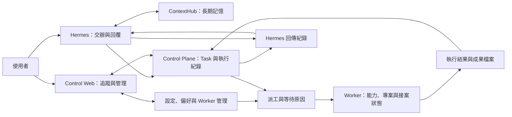
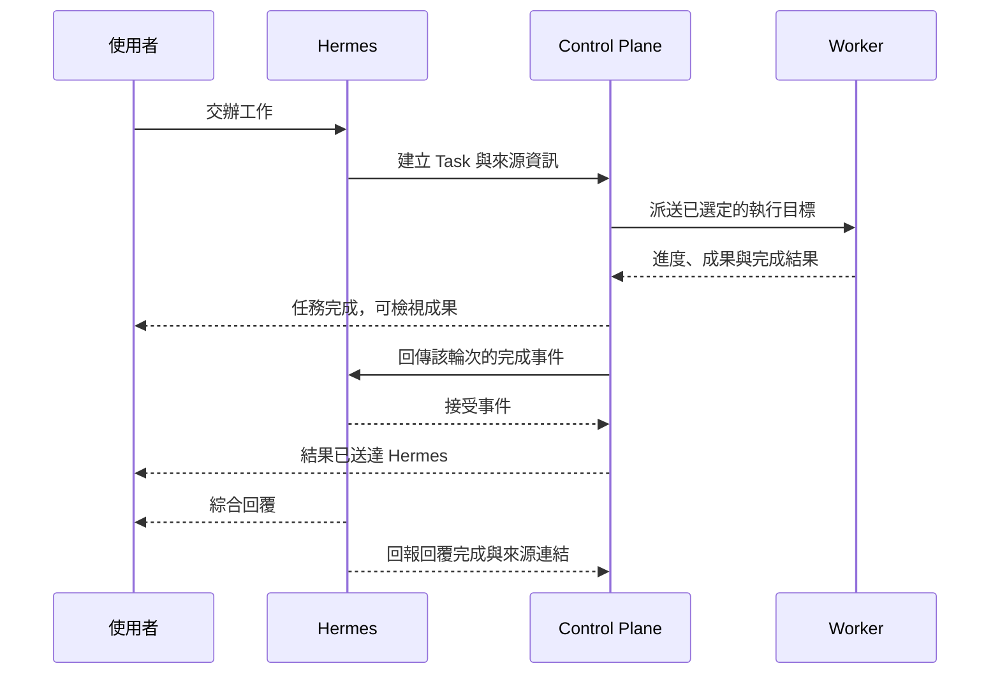

# Personal AI Control Plane v2 — 功能與人機介面改善 HLD

文件日期：2026-09-05

文件狀態：設計提案，尚未代表功能已實作或通過正式環境驗收。

範圍：2026-09-05 專案 review 提出的全部 16 項功能修正與使用體驗建議。

## 1. 目標與設計背景

本設計讓使用者能在同一個管理介面完成「確認工作 → 理解進度與阻礙 → 取得成果 → 回到原始交辦」，並讓本機 Worker 配合個人電腦的使用時間接收工作。

目前專案已具備 Task、Worker、模型清單、派工、結果儲存、Hermes 回傳與六個主要管理頁面。Review 發現五個可重現的功能問題，以及任務成果、異常處理、模型試跑、裝置導引與資訊呈現的缺口。本文件以既有 v2 架構為基礎，定義改善後的產品行為、元件責任、主要資料流與驗收條件。

### 1.1 使用情境

- 使用者透過 Hermes 交辦文件摘要、程式分析、Codex 專案修改或批次資料處理。
- NAS 持續管理工作，本機 Mac／Windows Worker 提供實際算力與專案執行環境。
- 使用者希望從網頁知道工作為何等待、由哪台電腦與哪個模型執行，以及成果在哪裡。
- 使用者需要試用本機模型並保存偏好，也需要暫停背景工作，讓個人電腦優先服務目前的使用需求。

### 1.2 與既有文件的關係

- [v2 Requirements](personal-ai-control-plane-requirements.md)：既有產品責任與基本功能。
- [v2 HLD](personal-ai-control-plane-hld.md)：維持服務、資料與規劃權責的分工。
- [v2 Detailed Design](personal-ai-control-plane-detailed-design.md)：既有模組、Task API 與 Worker 協定。
- [使用說明](personal-ai-control-plane-user-guide.md)：實作完成後需要同步更新的操作文件。
- [Implementation Status](implementation-status.md)：既有證據清單；本文件不直接更新其中的完成狀態。

本文件是 v2 的功能增補設計。實作時以本文件定義的新增行為補充既有 contract，既有 HLD 的服務分工仍然有效。先前 v1 → v2 的「不做 migration」決策不表示後續功能可以清除目前的 v2 任務與 Worker 資料。

### 1.3 本次不涵蓋

- Security review 或安全機制重新設計。
- 以程式整理、換框架、拆服務為目的的 refactor。
- 在 Control Plane 新增對話大腦、語意記憶、自主規劃或 AI 品質決策。
- 重做整套視覺風格、部署平台、帳務或多人協作系統。
- 直接實作、commit、push 或部署；本次交付為 HLD 文件。

## 2. 完整需求對照

「優先」表示實作依賴與使用影響，不表示其餘項目可省略。

| ID | Review 建議 | 設計章節 | 優先順序 |
| --- | --- | --- | --- |
| F01 | 修正人工 Retry 後無法再派工 | 5.1 | 優先 |
| F02 | 修正 auto 選錯執行環境 | 5.2 | 優先 |
| F03 | 修正 Codex 工作目錄傳遞 | 5.3 | 優先 |
| F04 | 讓 Settings 真正影響執行 | 5.4 | 優先 |
| F05 | 修正最近任務排序、分頁與完整統計 | 5.5 | 優先 |
| P01 | 顯示任務卡住原因與下一步 | 6.1 | 優先 |
| P02 | 提供成果預覽、複製與下載 | 6.2 | 優先 |
| P03 | 串回 Hermes 原始工作與結果交付狀態 | 6.3 | 優先 |
| P04 | 模型一鍵試跑、比較與常用偏好 | 7 | 後續依賴功能 |
| P05 | 新增 Worker、專案與能力導引 | 8 | 後續依賴功能 |
| P06 | 個人電腦接案模式 | 9 | 後續依賴功能 |
| U01 | 首頁優先呈現待處理工作 | 4.1 | 與任務介面一起交付 |
| U02 | 主要操作使用繁體中文 | 4.2 | 全頁面共同要求 |
| U03 | 人可閱讀的摘要與可展開詳細資訊 | 4.3 | 全頁面共同要求 |
| U04 | 搜尋、篩選與跨頁跳轉 | 4.4、5.5 | 與清單一起交付 |
| U05 | 可恢復的讀取錯誤與更新狀態 | 4.5 | 全頁面共同要求 |

## 3. 高階架構與責任

### 3.1 系統分工

| 元件 | 本次責任 |
| --- | --- |
| Hermes | 接收使用者交辦、選擇工作策略、建立正式任務、解讀成果與回覆使用者；提供來源工作連結 |
| ContextHub | 繼續管理長期語意記憶；本次只增加可用的入口連結，不複製其資料 |
| Control Web | 顯示工作、原因、成果與設定；提供人工重試、模型試跑及 Worker 管理操作 |
| Control Plane | 保存任務與各次執行、決定實際派工目標、提供統計與原因投影、保存成果、追蹤 Hermes 交付狀態 |
| Worker | 回報即時能力、模型、專案與接案條件；執行已明確指定的工作並回報結果 |

沿用一個 NAS Control Plane process/container、既有 SQLite authority 與 artifact 儲存。以下方塊代表職責，並不要求建立新服務或重構現有程式。

### 3.2 設計原則

1. 正式工作仍由 Hermes 規劃；管理頁不另建規劃器。
2. 狀態資料必須回答「目前如何、原因是什麼、下一步可做什麼」。
3. 任務需求與實際執行選擇分開記錄，避免畫面一直顯示 `auto`，看不到實際使用的 Worker／runtime／model。
4. 任務成功、結果交付成功、Hermes 回覆成功是不同事實，分開呈現。
5. UI 的成功訊息要有對應結果；設定寫入、Worker 套用與試跑成功不可混為一談。
6. 支援能力以實際回報為準；未知、未支援與失敗有不同畫面。

## 4. 資訊架構與共同介面行為

保留六個既有主要路由，調整名稱與頁面內容。

| 路由 | 中文名稱 | 主要內容與動作 |
| --- | --- | --- |
| `/` | 工作總覽 | 待處理事項、執行中工作、最新成果、服務與算力摘要 |
| `/tasks` | 任務 | 搜尋、篩選、排序、分頁、進入任務詳情 |
| `/workers` | 執行裝置 | 新增裝置、接案模式、可用能力、專案、目前工作 |
| `/models` | 模型 | 可用性、載入狀態、試跑、比較、常用偏好 |
| `/systems` | 系統 | Hermes／ContextHub／Control Plane 狀態、服務入口及交付異常摘要 |
| `/settings` | 設定 | 中文欄位、單位、作用範圍、生效狀態及儲存結果 |

### 4.1 工作總覽（U01）

首頁縮小現有大型介紹區，主要順序為：

1. **需要你處理**：失敗任務、長時間無可用候選的工作、回傳異常、未完成的 Worker 設定。
2. **正在執行**：任務名稱、實際裝置／模型、階段、開始時間與已執行時間。
3. **最新成果**：完成時間、摘要、預覽／下載與來源工作入口。
4. **整體狀態**：正在執行、等待中、失敗數，以及裝置與服務摘要。

預設統計期間為最近 24 小時，並提供全部期間。每個統計數字可跳到套用相同條件的清單；目前仍在執行或等待的工作另列即時總量，避免被期間篩選隱藏。

「暫時等待空位」不直接列成需要處理的錯誤；等待多久需要提醒由 Settings 的明確門檻決定。新增此門檻時也必須納入設定生效與驗收機制。

### 4.2 中文名稱與操作語意（U02）

| 原名稱 | 顯示名稱 | 操作說明 |
| --- | --- | --- |
| Queued / Assigned / Running | 等待執行／已派送／執行中 | 保留不同階段，不合併為模糊的「處理中」 |
| Retry | 重新執行 | 沿用原指令、輸入、專案與明確限制；重新選擇符合條件的執行目標 |
| Cancel | 取消任務 | 停止後續執行；執行中的取消回應另顯示處理狀態 |
| Drain | 完成目前工作後暫停接案 | 不因暫停接案而取消已執行工作 |
| Resume | 恢復接案 | 解除人工暫停，仍受閒置模式等條件限制 |
| Disable / Enable | 停用裝置／啟用裝置 | 與短暫停止接收新工作分開 |
| READY / UNAVAILABLE | 可用／目前無法使用 | 附上具體原因與最後確認時間 |

產品名稱、模型名稱與必要識別碼保留原文。英文狀態碼移至詳細資訊。重新執行按鈕需有處理中狀態，避免連按產生多次操作。

### 4.3 摘要與詳細資訊（U03）

- 任務預設顯示指令摘要、實際執行目標、專案、目前階段、成果及下一步。
- Worker 預設顯示名稱、連線狀態、可執行工作、接案模式、目前工作及最近一次試跑結果。
- 原始 JSON、事件 payload、長 ID 與診斷欄位放入可展開的「詳細資訊」，提供複製功能。
- 不使用空白或單一破折號混合代表所有缺失狀態；區分「尚未回報」「不支援」「不適用」。
- 長結果、模型名稱與識別碼須可換行，避免撐破卡片。
- 小螢幕優先呈現任務名稱、狀態與主要動作；資料表保留明確的水平捲動區域，詳細欄位可展開。

### 4.4 搜尋與跨頁跳轉（U04）

- 任務支援名稱／ID／來源關聯搜尋，以及狀態、專案、Worker、工作類型、日期篩選。
- 篩選、排序與目前頁面記錄在 URL；從詳情返回清單時保留條件。
- 任務內的 Worker、模型與來源工作可以跳轉；Worker 內可查看其目前及歷史任務。
- 同一模型可能存在於多個 Worker 或 runtime，模型連結要指向特定實例或已套用條件的模型頁。
- Systems 提供可從使用者瀏覽器開啟的 Hermes／ContextHub 入口；服務內部 health URL 留在詳細資訊。
- 尚未設定服務入口或來源連結時，顯示原因，不產生無效連結。

### 4.5 載入、錯誤與即時更新（U05）

所有頁面使用一致的初次載入、空資料、篩選無結果、背景更新、讀取失敗與操作失敗狀態。

- 初次讀取失敗時顯示原因與「重新載入」，不永久停留在同步中。
- 背景更新失敗時保留上次成功資料，標記最後更新時間與資料可能過期。
- SSE 作為更新提示；重新連線後重新取得資料，並以有限頻率的 REST 更新作為斷線時的補充。
- 對短時間大量事件合併更新，不打斷使用者正在閱讀的結果或重設捲動位置。
- Settings 的編輯草稿獨立於伺服器最新值。背景事件不可覆蓋未儲存輸入；有新版本時提示使用者比較或重新載入。
- 儲存失敗保留草稿與欄位錯誤；成功後顯示實際生效結果。操作通知使用可被輔助工具讀取的狀態訊息。

## 5. 核心功能修正

### 5.1 人工與自動重試（F01）

**現況依據：** 前次隔離測試中，失敗任務按人工 Retry 後會回到 `QUEUED`，再次派工卻因執行編號重複失敗。

**設計決策：** 同一 Task 的執行編號持續遞增；重試額度與歷史執行次數分開管理。

- `attemptNumber` 在同一 Task 內永不重複，舊 attempt 及其結果完整保留。
- 每次人工重新執行建立新的執行輪次；該輪可使用原任務的自動重試上限。
- `maxAttempts` 表示每輪最多執行次數，包含第一次執行。UI 明確說明「最多執行 N 次」，避免將它誤讀為額外重試 N 次。
- 任務詳情顯示第幾輪、第幾次執行與累計次數，保留每次失敗原因。
- 正在執行中的 Task 不接受另一輪人工重試；重複送出同一次操作不建立額外輪次。
- 保留原始 Task 指令、輸入、專案與限制快照。若需要改寫工作內容，回到 Hermes 另建工作。
- 舊 attempt 的延遲結果不可覆寫新輪次的結果。

### 5.2 明確決定實際執行目標（F02）

**現況依據：** 前次測試模擬 oMLX 不可用、Ollama 可用時，Worker 收到 `auto` 任務仍先呼叫 oMLX。

**設計決策：** Scheduler 以可執行的 `(Worker, runtime, model, workspace)` 組合作為候選，派送時已明確決定目標。

1. Hermes 提供需求；`auto` 只存在於需求層。
2. Control Plane 同時檢查裝置、能力、runtime 健康、模型、專案、資源、接案模式及併發條件。
3. 選定目標後，在 attempt 保存實際選擇與原因摘要；Task 保留原始需求。
4. Worker 依選定 runtime 呼叫執行器，開始前重新確認條件。環境已變動時回報具體原因，交由 Control Plane 重新評估。

模型模式定義：`required` 必須匹配；`preferred` 優先使用指定模型，否則從符合其他條件的可用模型選擇；`any` 必須解析成一個實際可用模型。不得將空模型名稱當成自動選擇的完成結果。

Models 分開顯示「已發現」「可被派工」「已載入」「最近試跑成功」。首頁的可用模型數只計算符合當前派工條件的模型實例，並提供模型實例與去重模型數的說明。

### 5.3 Codex 專案指定（F03）

**現況依據：** 前次測試使用正式 API 的 `execution.workspace_id`，經解析後 Worker 的 Codex executor 無法辨識。

**設計決策：** HTTP 與 Worker wire contract 使用明確文件化的 `execution.workspace_id`；內部物件可使用 `workspaceId`，跨邊界必須有一致轉換。

- 專案是 logical workspace，包含 ID、顯示名稱、所在 Worker、可執行能力與最後確認狀態。
- Worker 保存 logical workspace 與本機目錄的對應並回報可用性；Control Plane 保存可派工的專案投影。
- API 入口、Task persistence、scheduler、Worker offer、executor 與結果都使用同一個專案身分。
- 對現有以 `payload.workspace_id` 傳入的請求，在過渡期間正規化為同一欄位；兩處指定不一致時回報明確輸入錯誤。
- 專案不存在或目錄已搬移時，顯示「此裝置找不到專案」，並連到 Worker 的專案設定導引。
- 任務詳情與 Codex 成果顯示實際專案，不只顯示原始請求值。

### 5.4 有效設定與生效回報（F04）

**現況依據：** 前次隔離測試儲存 5 次執行上限與 60 秒逾時，新任務仍得到 2 次與 1,800 秒。

**設計決策：** Settings 提供統一的有效設定，由對應 runtime 使用；設定寫入與實際套用分開回報。

| 目前設定 | 使用者名稱與範圍 | 生效行為 |
| --- | --- | --- |
| `default_max_attempts` | 每輪最多執行次數 | 新任務未明確指定時採用；既有任務維持建立時快照 |
| `default_task_timeout_seconds` | 單次執行時間上限，秒 | 新任務未明確指定時採用；不修改正在執行的 attempt |
| `heartbeat_interval_seconds` | 裝置回報間隔，秒 | 傳送設定版本給 Worker，收到套用回報後顯示已生效 |
| `worker_offline_seconds` | 判定裝置離線的等待時間，秒 | 派工、離線處理與 UI 狀態使用同一有效值 |
| `registration_enabled` | 接受新裝置註冊 | 新註冊請求即時採用；已註冊裝置不受影響 |
| `system_health_interval_seconds` | 系統狀態更新間隔，秒 | 重新安排下一次健康檢查，避免留下重複計時器 |
| `scheduler_interval_ms` | 工作派送檢查間隔，毫秒 | 重新安排下一次派工檢查，避免重複派送 |
| `task_retention_days` | 已結束任務保留天數 | 下一次保留週期處理使用；執行中與尚待交付的任務不清除 |
| `artifact_retention_days` | 成果檔案保留天數 | 下一次保留週期處理使用；仍被工作引用或尚待交付的成果不清除 |

補充規則：

- 有效值優先順序：明確的部署環境覆寫 → 已儲存設定 → 系統預設。被部署環境覆寫的欄位顯示唯讀值與來源，避免讓使用者保存無效變更。
- Task 明確指定的限制優先於全域任務預設；限制在建立時解析並保存。
- 表單提供型別、單位、允許範圍與跨欄位驗證，例如離線門檻不可短於正常回報所需的容許時間。
- 一次儲存要完整成功或完整失敗，不留下部分欄位已變更的狀態。
- 回傳設定版本、有效值、來源、套用狀態與適用範圍；Worker 離線時顯示「已儲存，等待裝置套用」。
- 新增等待提醒門檻、模型偏好與閒置模式參數時，沿用相同規則。
- 清理功能完成前，保留天數欄位不得宣稱已生效。清理後保留必要的過期提示，來源連結與成果入口不能只剩無法解讀的 404。

### 5.5 任務查詢、排序與統計（F05）

**現況依據：** 前次隔離測試建立 101 筆同優先度 Task，預設清單只回傳最早的 100 筆，最新一筆不在其中。

- 派工佇列繼續依 priority 與等待時間排序；使用者清單預設依建立時間新到舊，二者各自符合用途。
- 最新成果依完成時間新到舊；「最近任務」依建立時間新到舊，畫面標明排序基準。
- 清單提供明確排序參數與游標分頁，並使用唯一 ID 作為同時間資料的穩定排序依據。
- API 回傳資料、下一頁游標、套用的條件及資料時間。首頁統計由獨立的聚合查詢取得，不從第一頁資料推算。
- 搜尋與分頁由後端處理，不僅在已載入的 100 筆內搜尋。
- 返回清單時恢復篩選條件；有新任務時顯示「有新工作」，使用者可更新首屏，避免自動插入資料使閱讀位置跳動。

## 6. 任務操作流程

### 6.1 等待原因與下一步（P01）

保持既有 Task 狀態機，新增獨立的派工原因投影，不為每個原因增加 Task state。

| 等待原因 | 畫面說明 | 下一步 |
| --- | --- | --- |
| 指定 Worker 離線 | 等待指定裝置重新連線 | 查看裝置與最後連線時間 |
| 指定 runtime／模型不可用 | 模型服務尚未啟動或模型不可用 | 查看模型與裝置狀態 |
| 無符合能力或專案的裝置 | 目前沒有裝置可執行此工作 | 開啟能力／專案設定導引 |
| 所有候選都忙碌 | 等待其他工作完成 | 查看目前占用裝置的任務 |
| 人工暫停或 Drain | 裝置已暫停接收新工作 | 查看接案模式或恢復接案 |
| 閒置條件未成立 | 等待個人電腦閒置 | 查看模式，不要求使用者處理為錯誤 |
| 資源不足 | 候選裝置未符合所需資源 | 查看資源摘要，或回到 Hermes 調整工作需求 |

投影包含主要原因、其他原因、評估時間、候選摘要與可用動作。沒有可靠完成時間時只顯示等待時間，不自行推估倒數。

原因由與派工相同的條件計算。只在原因改變時記錄使用者可見事件；畫面可以重新取得最新投影，避免每秒寫入相同事件。

### 6.2 任務詳情與成果中心（P02）

任務詳情分成「摘要」「進度」「成果」「執行紀錄」「詳細資訊」。

- **摘要：** 原始交辦、實際 Worker／runtime／model／workspace、限制、目前階段與主要動作。
- **進度：** 等待、派送、啟動、執行、完成等階段與實際耗時；沒有可測量進度時不顯示虛構百分比。
- **成果：** 人可讀的文字／Markdown 預覽、複製、附件名稱、類型、大小與下載。大檔或不支援的類型提供下載與說明。
- **Codex 成果：** 專案、變更檔案摘要、實際有產生的差異與驗證結果。沒有執行測試時標記「未執行」，不把程式結束碼當成測試通過。
- **執行紀錄：** 每輪／每次執行、使用的目標、失敗原因與時間線。原始 log 可展開或下載。

Control Plane 提供管理介面可用的成果查詢與下載入口，不讓瀏覽器自行拼湊 Worker 專用 artifact 路由。Worker 的輸出應提供可展示的結構化摘要，長輸出與差異檔可作為 artifact 保存；Hermes 仍負責成果品質評估與綜合回覆。

過期、遺失、尚未上傳完成及不適用的成果各有明確狀態。成功任務沒有附件時顯示文字成果，不讓空附件區被誤解為錯誤。

### 6.3 Hermes 來源與交付狀態（P03）

Task 保存來源服務、來源工作／對話識別、顯示名稱及可選的來源連結。Hermes 提供或解析真實的使用者入口；Control Plane 不假設內部 API 路徑就是可開啟的聊天頁。

三個層次分別呈現：

1. **執行結果：** 等待中、執行中、成功、失敗或取消。
2. **結果交付：** 不需交付、等待傳送、傳送中、等待重送、已送達或需要處理。
3. **Hermes 回覆：** 尚未回報、處理中或已回覆。只有 Hermes 提供相應證據時才更新。

Hermes endpoint 接受 callback 只證明「已送達」，不能直接標記「已回覆使用者」。交付紀錄需包含 Task 輪次、完成事件 ID、最後嘗試時間、次數、錯誤與下一次重送時間，以免人工重試後顯示上一輪的交付結果。

交付失敗時提供「重新傳送結果」，不重新執行 Worker 工作。重送保留原完成事件 ID；Hermes 對重複事件不重複回覆。若要提醒使用者，由 Hermes 沿用原工作通知管道；一般等待不重複通知，完成、需處理與失敗轉變才提醒。

模型與裝置診斷任務預設不送到 Hermes，顯示「診斷工作，不需交付」。

## 7. 模型試跑與常用偏好（P04）

### 7.1 模型頁

模型列表顯示 Worker、runtime、模型名稱、載入狀態、可派工狀態、阻礙原因、最後回報時間與最近試跑結果。可用、已載入、已試跑成功使用不同標籤。

模型預設依可派工狀態分組，提供名稱、Worker 與 runtime 篩選。離線裝置上的模型仍可查看歷史，但不得計入目前可派工數量。

### 7.2 一鍵試跑與比較

1. 使用者選擇一個或多個模型實例。
2. 選擇內建短文字模板，例如摘要或程式解說，或輸入同一段自訂文字。
3. 畫面先顯示測試內容、模型、裝置與限制；使用者按「開始試跑」才建立診斷 Task。
4. 經相同 scheduler／Worker 執行流程取得結果，遵守接案模式與併發限制，預設逐一試跑。
5. 比較成功／失敗、排隊時間、執行耗時、輸出內容與可取得的 token 數據。

每次比較保存模板版本、相同輸入與可控制的參數、實際目標及測試時間；冷啟動與已載入狀態分開標示。沒有取得首 token 時間或 token 數時顯示未提供，不產生估算速度。

成功試跑只證明該次條件下可完成推論，不自動證明回答品質、Codex 能力或其他專案可執行。使用者可標記偏好；控制介面不另做 AI 品質排名。此處的程式解說模板只產生文字，不修改專案。

### 7.3 常用偏好

保存使用者明確選擇的用途偏好，例如「快速摘要」「程式分析」及主要／替代模型。偏好包含選擇順序、適用工作類型與不可用時是否允許替代。

Hermes 可以讀取偏好作為規劃輸入；Control Plane 只在 Task 明確引用偏好時，依固定規則解析成執行需求。明確指定的 Worker、runtime 或 required model 優先於偏好。Task 保存解析後的偏好版本，避免後續修改影響既有工作。

## 8. Worker 新增與專案導引（P05）

### 8.1 操作步驟

1. **選擇裝置系統：** macOS／Windows，說明登入後常駐的行為。
2. **安裝 Worker：** 提供對應安裝入口或可複製指令，帶入目前 Control Plane origin。
3. **等待連線與核准：** 顯示偵測到的裝置名稱與註冊階段；可在同一頁完成核准。
4. **確認執行能力：** 顯示本機模型、Codex、Python 的已偵測、尚未設定或不可用原因。
5. **登錄專案：** 由裝置端安裝／設定流程選擇本機目錄與 logical workspace 名稱，Worker 回報後在網頁確認。
6. **執行試跑：** 選擇模型測試或指定專案的 Codex 診斷，顯示內容與限制後開始。
7. **完成：** 顯示「可執行工作」「可用專案」「最近試跑結果」，提供接案模式設定。

### 8.2 網頁與裝置端的分工

- 網頁集中管理進度與診斷，但不能把瀏覽器的本機路徑當成遠端 Worker 的專案目錄。
- 專案登錄與 executor 啟用沿用 Worker 本機設定來源。安裝器需提供相應設定步驟；既有裝置可透過同一設定流程補登錄專案。
- Worker 回報專案顯示名稱、logical ID、支援能力、可用性與最近確認時間。Task 使用 logical ID 派工。
- 安裝器尚未提供設定操作時，不可在網頁把「專案已就緒」標記為完成；這是 P05 的必要交付依賴。
- 導引狀態保存在伺服器可辨識的註冊／裝置紀錄與設定進度中，重新整理或離開頁面後可繼續。
- 註冊逾時、安裝未啟動、runtime 未啟動、專案不存在與試跑失敗各自提供操作說明。
- Codex 診斷只驗證明確選定的專案與診斷指令，不代替正式程式修改任務。

## 9. 個人電腦接案模式（P06）

### 9.1 模式與優先關係

| 模式 | 行為 |
| --- | --- |
| 正常接案 | 符合能力與資源條件時接受新工作 |
| 暫停接案 1 小時／自訂時間 | 目前工作繼續，期限前不派送新工作；到期解除此次暫停 |
| 完成目前工作後暫停 | 現有工作繼續，之後保持暫停，直到人工恢復 |
| 閒置時才執行 | 裝置端確認符合閒置條件後才接受新工作 |

人工停用裝置優先於所有接案模式；人工暫停優先於閒置模式。定時暫停到期只解除該次暫停，不能覆蓋後續的新暫停或重新啟用已停用裝置。恢復接案後仍須符合原先的閒置條件。

### 9.2 閒置判定與既有工作的行為

- 閒置由 Worker 根據 OS 提供的使用者活動訊號判斷，預設連續 10 分鐘無互動才可接案，並可在設定中調整。
- 不以 CPU load 或 `free memory` 單一數字判斷使用者是否正在使用電腦。
- Worker 回報是否支援、目前閒置時間、有效接案狀態與原因。無法取得活動訊號時標記不支援，不能假稱模式已生效。
- 使用者恢復操作後停止接收新工作；已在執行的工作繼續完成。本次不設計任意 executor 的中途暫停／續跑。
- 正常接案、定時暫停與閒置模式在重連後重新同步。未回報套用前，管理頁顯示等待裝置確認。
- 裝置休眠或離線時顯示真實狀態，不將本功能誤標示為遠端喚醒能力。

## 10. 資料與介面增補

以下為邏輯資料與介面需求，不是已上線 API，也不是最終資料表 DDL。

### 10.1 邏輯資料

| 資料 | 核心內容 | 保存位置 |
| --- | --- | --- |
| Task 執行需求快照 | 原指令、專案、限制、引用的偏好版本 | Control Plane |
| 執行輪次與 attempt | 單調遞增編號、輪次額度、實際目標、時間與結果 | Control Plane |
| 派工原因投影 | 主要／次要原因、候選、評估時間、下一步 | Control Plane，條件變更時更新 |
| 成果摘要與附件關聯 | 預覽文字、輸出類型、檔案、驗證結果、過期狀態 | Control Plane 與既有 artifact root |
| 來源與交付投影 | 來源 ID／連結、輪次／事件 ID、交付與回覆狀態 | Control Plane；來源與回覆證據由 Hermes 提供 |
| Worker 專案與接案投影 | logical workspace、能力、模式、暫停期限、套用版本 | Control Plane；本機目錄與活動訊號由 Worker 管理 |
| 模型試跑紀錄與偏好 | 測試條件、實際模型實例、結果、使用者偏好與版本 | Control Plane |
| 有效設定 | 儲存值、有效值、來源、版本及元件套用狀態 | Control Plane；Worker 回報已套用版本 |

資料增補需保留既有 v2 任務、attempt、Worker 與成果關聯。舊任務缺少來源或實際模型資訊時顯示「歷史資料未記錄」，不補造證據。

### 10.2 介面能力

| 介面群組 | 高階變更 |
| --- | --- |
| Task 查詢 | 延伸既有 `/api/v2/tasks` 的搜尋、專案篩選、排序及分頁；提供獨立統計 |
| Task 詳情 | 回傳原始需求、實際執行目標、等待原因、成果、輪次與 Hermes 交付投影 |
| Task 動作 | 沿用 cancel／retry；新增與執行分離的結果重送操作 |
| 成果 | 增加供 Control Web 使用的預覽、附件清單與下載介面 |
| Worker 管理 | 延伸裝置詳情，提供專案、導引進度、接案模式與套用狀態 |
| 模型 | 延伸清單，提供診斷任務建立、比較紀錄及用途偏好讀寫 |
| Settings | 提供欄位中繼資料、有效設定、版本化儲存及套用回報 |
| Systems | 加入瀏覽器可用服務入口，以及待交付／異常交付摘要 |
| Worker 協定 | 明確的實際執行目標、workspace 正規化、專案／閒置能力、設定套用回報與可展示的成果資料 |
| Hermes 介面 | 來源工作連結、完成事件去重、偏好讀取及回覆完成證據 |

最終 endpoint 名稱與欄位 schema 在 detailed design 決定。新增欄位優先採增補方式；Worker 能力需先協商，尚不支援新 contract 的裝置不得被派送依賴該功能的工作，畫面應指出需要更新。

## 11. 主要設計取捨與相依性

| 決策 | 理由與影響 |
| --- | --- |
| 保持既有單一 Control Plane 與六頁導覽 | 將工作集中在功能行為，避免擴大成架構改造 |
| 派工時確定 runtime／model，Worker 再檢查可用性 | 同時解決選錯環境及執行前條件變動；需要 server 與 Worker contract 配合 |
| 人工重試保留歷史、另計輪次額度 | 可以正常重跑，也能追查每次結果；需要增補執行輪次資料 |
| UI 偏好是明確配置，Hermes 負責規劃 | 支援個人習慣而不新增第二個決策者 |
| 管理診斷使用現有 Task 執行流程 | 能驗證真實路徑；必須與正式任務分流顯示並排除 Hermes 自動回覆 |
| 已完成與已交付分開 | 能重送結果而不重做工作；Hermes 回覆完成需要相關 repository 配合 |
| 使用者恢復操作不強制暫停執行中工作 | 避免宣稱各 executor 都能續跑；接案模式只影響新工作 |
| 裝置端負責專案登錄與閒置偵測 | 網頁提供集中導引；macOS 與 Windows 必須分別取得功能證據 |

現有 Hermes 是否已有來源 deep link、回覆完成事件與去重能力，必須在相關實作開始時確認；未完成時先如實顯示「未提供」，不可將服務 health 當成整合已完成。這些是功能相依性，不是本次文件已完成跨 repository 修改的宣告。

## 12. 驗收條件

驗收依功能分為本機行為、瀏覽器操作與實際 Worker／Hermes 整合。單元測試、畫面有按鈕或 HTTP health 正常，均不能單獨代表完整工作流程驗收。

| ID | 必要驗收情境 |
| --- | --- |
| F01 | 失敗任務人工重新執行至少兩輪，每輪可使用原額度；attempt 編號不重複、歷史保留、重複點擊不新增輪次，舊結果不覆寫新結果 |
| F02 | 只有 Ollama 可用且需求為 auto 時，實際使用 Ollama；required 模型不存在時等待並顯示原因；preferred／any 解析到非空且可用的模型；環境中途失效可重新評估 |
| F03 | 僅在正式 `execution.workspace_id` 指定專案即可完成 Codex 診斷；顯示實際專案；舊欄位輸入可正規化，衝突與專案搬移有明確錯誤 |
| F04 | 儲存 5 次上限與 60 秒逾時後，新任務實際使用該值；明確限制與既有任務不被覆寫；回報／離線／派工／健康間隔實際生效；保留週期、環境覆寫與 Worker 延後套用有對應結果 |
| F05 | 超過 100 筆任務仍能看到最新工作並逐頁找到全部資料；搜尋涵蓋所有資料；完整統計不受分頁影響；時間相同的資料翻頁不重複或遺漏 |
| P01 | 離線、模型不可用、專案缺失、滿載、暫停與閒置等待均能顯示正確原因與有效下一步；狀態改變後更新且不製造重複提醒 |
| P02 | 文字可預覽／複製，附件可下載且內容正確；Codex 可看到有證據的變更及驗證結果；無附件、大檔、過期與缺失成果有清楚畫面 |
| P03 | 能回到 Hermes 原始工作；Worker 完成、Hermes 接收與已回覆分開顯示；交付失敗可重送且不重跑 Task、不重複回覆；新輪次不混用舊交付結果 |
| P04 | 使用相同輸入對至少兩個可用模型實例試跑，保存條件、耗時及輸出；偏好可儲存並被明確引用；明確 Task 要求不被偏好覆蓋；不支援的指標顯示未提供 |
| P05 | Mac 與 Windows 分別完成安裝、核准、能力辨識、專案登錄及診斷；離開導引可恢復；未具備能力的裝置不被標記已就緒 |
| P06 | 定時暫停不取消目前工作，到期解除正確的暫停；停用優先；閒置模式於實機生效，恢復使用後不再接新工作；不支援的 OS 訊號與重連後未套用狀態如實顯示 |
| U01 | 首屏能找到需要處理、執行中與最新成果；統計期間清楚，數字跳轉後條件一致 |
| U02 | 六頁主要操作與狀態為繁體中文；重新執行、暫停接案、停用與取消語意可分辨 |
| U03 | 不展開 JSON 即可確認任務進度、結果及 Worker 能力；長內容與小螢幕不遮住主要操作 |
| U04 | 搜尋、篩選與頁面狀態可由 URL 恢復；Task／Worker／模型／來源連結導向正確對象；未知入口不產生壞連結 |
| U05 | API 失敗、SSE 斷線與恢復、空資料及操作失敗都有明確畫面；背景更新不覆蓋設定草稿；錯誤後可重試恢復 |

### 12.1 驗證資料與證據

- 本機行為使用隔離資料庫與可控制的 runtime 回應，重現五個原始缺陷及修正後行為。
- 瀏覽器驗證涵蓋六頁、一般與小螢幕版面、鍵盤操作、長輸出、資料超過一頁及錯誤恢復。
- 實際整合以測試工作驗證「Hermes 建立 → Worker 執行 → 成果取得 → 回傳 → Hermes 回覆」，並保留各步驟可對應的 Task／attempt／event 證據。
- macOS／Windows、模型推論／Codex、試跑成功／品質偏好分開記錄，不互相代替。

## 13. 建議實作順序與完成定義

1. **先完成執行行為：** F01–F04，接通重試、實際執行目標、workspace 與有效設定。
2. **接通任務操作：** F05、P01–P03，加上 U01–U05，讓工作查得到、原因看得懂、成果拿得到。
3. **補齊個人使用流程：** P04–P06，完成模型試跑／偏好、裝置導引與接案模式；所需 Worker 與 Hermes 功能一起驗收。

上述為依賴順序，不是縮減交付範圍。全部 16 項都需有驗收結果；完成後同步更新使用說明、Detailed Design 與 Implementation Status，清楚區分本機實作、CI、正式環境與實際 provider 證據。

視覺調整先確認頁面配置與主要操作流程，再落實至現有介面；不以功能完成為由自行重做品牌風格。若後續進入 production，沿用既有 CI immutable image 與 NAS deployment gateway 流程，另行取得實際部署證據。

## 14. Review 依據與證據限制

本文件引用同一工作對話於 2026-09-05 完成的 review：當時檢視現行六頁，並以隔離的本機案例重現重試、auto runtime、Codex workspace、Settings 預設值及 101 筆任務查詢問題。這些不是在 NAS 上執行正式任務的證據，也不代表本文件的改善已完成。

本次撰寫重新確認的主要程式位置：

- [Task service](../apps/control-plane/src/tasks/task-service.ts)：重試、執行紀錄、清單與成果關聯。
- [Scheduler](../apps/control-plane/src/scheduler/scheduler.ts)：候選過濾、排序與無候選時的行為。
- [Worker runtime](../apps/worker/src/runtime.ts)：執行器選擇與工作處理。
- [Codex executor](../apps/worker/src/executors/codex.ts)：workspace 讀取與結果格式。
- [Contracts](../packages/contracts/src/index.ts)：輸入正規化與任務預設限制。
- [Settings service](../apps/control-plane/src/settings/settings-service.ts)：設定儲存與目前欄位。
- [Control Plane entrypoint](../apps/control-plane/src/index.ts)：派工與狀態更新週期。
- [Callback outbox](../apps/control-plane/src/callbacks/outbox.ts)：交付重試與回傳狀態。
- [Control Web](../apps/control-web/src/app.ts)：六頁內容、原始資料呈現及更新行為。

程式可能在後續工作改動；開始實作時應重查相關 contract，保留本文件的產品行為與驗收目標。
