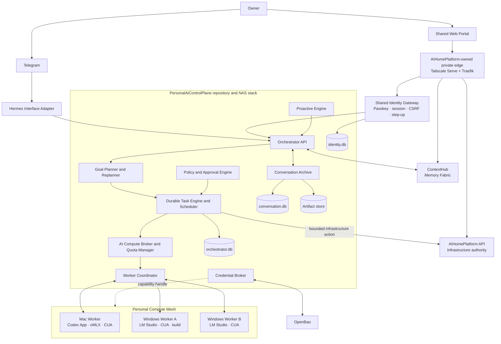
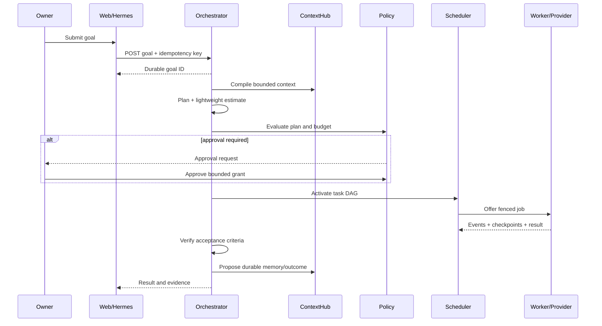
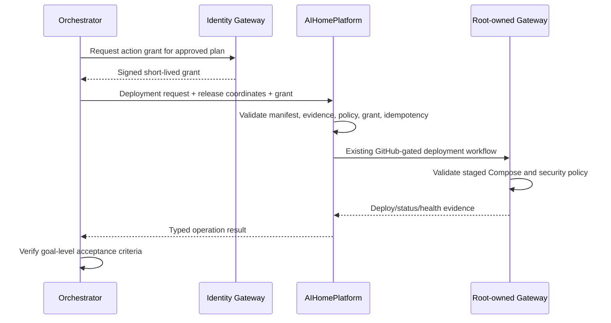
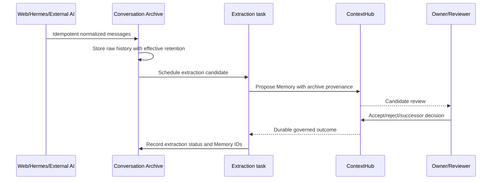

# Personal AI Control Plane — High-Level Design

Status: Proposed HLD for implementation planning

Date: 2026-08-28

Scope: Brownfield target architecture; no implementation is authorized by this document

## 1. Executive decision

The Personal AI Control Plane will be a new, independently versioned product and repository. It will not absorb AIHomePlatform, ContextHub, Hermes Agent, or their data.

The target uses one durable decision-maker on the NAS and distributed execution on enrolled Mac and Windows workers:

```text
Single Brain       = Personal AI Orchestrator
Execution Nodes    = trusted, sandboxed workers
Memory Authority   = ContextHub
Conversation Edge  = Hermes / Telegram
Infrastructure     = AIHomePlatform
Coding Specialist  = local Codex App runtime using ChatGPT subscription access
```

The NAS core is a modular monolith rather than a collection of microservices. Planning, scheduling, policy, task persistence, compute routing, worker coordination, and proactive triggers share one Orchestrator transaction boundary. Identity and Conversation Archive remain separate authority stores, but all three are released as one bounded product stack.

This design optimizes for a single owner, one NAS, fewer credentials, recoverability, and observable failure rather than high availability or horizontal scale.

## 2. Inputs and accepted decisions

This HLD implements the requirements in `docs/personal-ai-control-plane-requirements.md` plus the following accepted decisions:

1. Every durable, scheduled, mutating, multi-step, cross-machine, or approval-sensitive goal is owned by the Orchestrator. Hermes may answer stateless conversational questions but does not become a second planner.
2. AIHomePlatform's Passkey implementation is generalized into the shared entry boundary.
3. `work` is a conceptual scope and provenance label, not a memory authorization boundary.
4. Raw conversations are stored in a dedicated Conversation Archive, not in ContextHub semantic-memory tables.
5. Conversation retention defaults to forever: `conversation_retention_days = null`.
6. Codex execution uses a local Codex App/CLI runtime authenticated with the owner's ChatGPT subscription. API-key billing is disabled by default and is never an automatic fallback.
7. Durable control-plane state uses SQLite.
8. Enrolled owner devices are trusted without repeated routine approval, while each job remains capability-scoped and sandboxed.
9. Approval is granted to a bounded plan and budget; replanning inside the grant is autonomous.

## 3. Goals and non-goals

### 3.1 Goals

- Accept high-level goals from Web and Telegram.
- Plan, estimate, approve, execute, checkpoint, recover, verify, and report through one durable task graph.
- Route work across deterministic tools, local LLMs, optional metered cloud LLMs, and Codex.
- Treat workers, capabilities, model capacity, Codex subscription capacity, and credentials as schedulable resources.
- Preserve AIHomePlatform, ContextHub, and Hermes as independent systems of record for their domains.
- Provide one Passkey sign-in experience without requiring the owner to maintain service tokens.
- Retain raw conversation history forever by default while keeping semantic memory governed separately.
- Support proactive work and self-extension through the same policy and approval path as user-submitted goals.

### 3.2 Non-goals

- Kubernetes, distributed consensus, or active-active NAS failover.
- Moving service source code or persistent data into AIHomePlatform.
- Replacing ContextHub with the task database or conversation archive.
- Making Hermes a peer autonomous planner.
- Giving an LLM direct access to credentials, the Docker socket, NAS root, or an unrestricted human desktop.
- Circumventing the root-owned NAS deployment gateway.
- Automatically falling back from ChatGPT subscription Codex usage to metered API usage.
- Completing the prompt-injection backlog in the first implementation; the enforcement seam is included now.

## 4. Assumptions and service objectives

| Area | Initial design assumption |
| --- | --- |
| Owner model | One owner; multi-user tenancy is out of scope |
| Core availability | One active NAS orchestrator instance |
| Workers | Up to 10 enrolled devices and 500 registered capabilities |
| Workload | Up to 100 active goals, 10 concurrently executing steps, and 100,000 retained task events |
| Goal acknowledgement | p95 under 2 seconds when the NAS is healthy |
| Status reads | p95 under 1 second on the tailnet |
| Dispatch | Ready task offered to an online eligible worker within 5 seconds |
| Worker heartbeat | 30 seconds; stale after 90 seconds |
| Recovery | Orchestrator restart recovery within 5 minutes without replaying acknowledged side effects |
| Backup | Consistent daily SQLite snapshots; target RPO at most 24 hours |
| Restore | Isolated restore drill before declaring a release operationally verified |
| Conversation retention | Forever by default; no automatic deletion on storage pressure |
| Availability goal | Reliable recovery, not HA |

If conversation and artifact storage approach capacity, the system applies ingestion backpressure and alerts the owner. It must not silently delete forever-retained data.

## 5. Brownfield baseline

### 5.1 AIHomePlatform

AIHomePlatform is already a thin NAS service control plane. It owns a Git-backed service registry, strict Compose policy, GitHub-gated operations, OpenBao integration, platform monitoring, immutable release evidence, a root-owned gateway handoff, SQLite control state, an append-only audit chain, and production Passkey/CSRF/step-up authentication.

Reusable seams:

- Existing WebAuthn tables and flows for users, passkeys, challenges, sessions, recovery codes, CSRF, and five-minute step-up.
- Existing `/api/v1/auth/forward` pattern.
- `ServiceManifestV1`, release manifests, deployment API, capability/evidence states, health probing, GitHub workflows, and NAS deployment gateway.
- Prometheus/Grafana and OpenBao infrastructure.

Boundary to preserve: AIHomePlatform authorizes infrastructure operations; it does not become the goal planner or store application data.

### 5.2 ContextHub

ContextHub already provides the core Memory Fabric: SQLite authority, REST/MCP interfaces, candidate-to-accepted governance, version history, successor/supersession, `claim_key`, conflict exclusion, hybrid retrieval, context compilation, connector SDK, audit, idempotency, backup/restore, and human review UI.

Required refactor: its current personal/work credential and namespace isolation conflicts with the accepted `work`-as-scope decision. The target retains a real owner/tenant namespace boundary but moves `personal`, `work`, and project context into a first-class non-security `scope` field.

Boundary to preserve: ContextHub is the only shared semantic-memory authority. Agent-local memory, task checkpoints, and conversation history do not become competing authorities.

### 5.3 Hermes Agent / AiSecretaryChloe

Hermes is the existing conversational assistant, Telegram gateway, Google Workspace integration host, cron host, and thin adapter surface for Chloe applications. It already provides high-value user-facing integrations but has no durable cross-machine goal engine or general worker protocol.

Target change: Hermes becomes an interface adapter. It classifies a request as either a stateless chat or an Orchestrator goal, submits durable goals, renders status, and forwards approvals. Existing Hermes domain skills remain usable, but new durable orchestration and general scheduling move to the Orchestrator.

Boundary to preserve: Hermes, Chloe LINE Bot, and each Chloe app keep independent repositories, data, images, deployments, and rollback paths.

## 6. Target architecture



### 6.1 Deployment shape

The new NAS stack contains:

- `pai-identity-gateway`: Passkey authority and forward-auth service.
- `pai-orchestrator`: modular core containing API, planner, scheduler, policy, approvals, compute broker, quota, worker coordination, proactive engine, connector coordination, and archive services.
- `pai-control-web`: static management portal.

These are separately named processes/containers but one product release and one repository. Internal modules communicate in process where possible. No Redis, Kafka, or external workflow engine is introduced initially.

## 7. Repository and ownership topology

```text
PersonalAiControlPlane              new bounded product
├── identity gateway
├── orchestrator and durable task engine
├── scheduler, policies, approvals, proactive engine
├── compute broker and quota manager
├── cross-platform worker runtime
├── conversation archive and external conversation connectors
├── web portal
└── shared contracts

AiHomePlatform                      remains separate
├── private edge and infrastructure observability
├── service registry and release evidence
├── deployment/rollback/backup capability policy
└── root-owned NAS gateway integration

ContextHub                          remains separate
├── semantic Memory authority
├── context compiler and retrieval
├── federation, provenance, review, conflict, lifecycle
└── memory/source connector SDK

AiSecretaryChloe / Hermes Agent     remains separate
├── Telegram and conversational experience
├── Google Workspace and existing Hermes skills
├── thin Orchestrator adapter
└── Chloe-specific runtime integrations

Domain application repositories    remain separate
└── InformationRadar, ChloeLineBot, tracker apps, and future services
```

The worker runtime stays in `PersonalAiControlPlane` initially because the job envelope, capability protocol, checkpoint format, and server compatibility must be released together. Independently deployed domain capabilities may use separate repositories when they acquire their own data, release, and rollback lifecycle.

## 8. Reuse matrix

| Target component | Classification | Target owner | HLD decision |
| --- | --- | --- | --- |
| Orchestrator | New Component | PersonalAiControlPlane | Single durable decision-maker on NAS |
| Goal planning | New Component | PersonalAiControlPlane | Planner emits a versioned task DAG and plan digest |
| Durable task engine | New Component | PersonalAiControlPlane | SQLite event/state model with leases, fencing, checkpoints, and outbox |
| Scheduler | New Component | PersonalAiControlPlane | Durable schedules and resource-aware dispatch; not Hermes cron |
| Quota management | New Component | PersonalAiControlPlane | Observed/reserved provider capacity; Codex subscription limits are conservative estimates |
| AI Compute Broker | New Component | PersonalAiControlPlane | Routes deterministic, local, subscription, and optional metered compute |
| Cloud LLM integration | New Component | PersonalAiControlPlane | Optional metered adapter through Credential Broker |
| Codex integration | Extend Existing | PersonalAiControlPlane + local Codex | App-backed local SDK adapter, existing ChatGPT login, isolated worktree |
| LM Studio / oMLX | New Component | PersonalAiControlPlane worker | OpenAI-compatible local adapters with dynamic discovery |
| Worker runtime | New Component | PersonalAiControlPlane | Node.js/TypeScript cross-platform outbound agent |
| Dynamic capability discovery | New Component | PersonalAiControlPlane | Discovered and granted states remain distinct |
| Computer Use | New Component | PersonalAiControlPlane worker | Isolated session by default; shared desktop explicitly approved |
| Telegram interface | Extend Existing | Hermes | Thin goal/status/approval adapter; no peer planner |
| Web management UI | Extend Existing | PersonalAiControlPlane portal | New shell reuses AIHomePlatform and ContextHub domain UIs |
| Context / memory APIs | Reuse As-Is | ContextHub | REST for deterministic services, MCP for agent tools; extend only for scope refactor |
| Federated memory | Refactor Existing | ContextHub | One owner domain plus conceptual scopes |
| External AI memory synchronization | Extend Existing | ContextHub + PersonalAiControlPlane | Existing connector/run primitives plus conversation/source adapters |
| Conversation Archive | New Component | PersonalAiControlPlane | Raw history separate from semantic Memory; forever retention by default |
| Credential broker | New Component | PersonalAiControlPlane | Reuses OpenBao and device-local vaults through opaque handles |
| Passkey / shared entry boundary | Refactor Existing | PersonalAiControlPlane identity | Extract AIHomePlatform auth while keeping edge infrastructure in AIHomePlatform |
| Autonomy / approval policy | New Component | PersonalAiControlPlane | Pure, versioned decision engine and durable approval grants |
| Proactive task engine | New Component | PersonalAiControlPlane | Every trigger creates a normal goal; no second execution path |
| Self-extension | New Component | PersonalAiControlPlane | Proposal and approval before Codex development |
| Deployment / service management | Extend Existing | AIHomePlatform | Orchestrator requests bounded actions; AIHomePlatform and gateway remain final authority |
| Duplicated Hermes planning/task state | Replace / Retire | Hermes | Retire only after parity and migration; domain skills remain |
| General Hermes cron scheduling | Replace / Retire | PersonalAiControlPlane | Migrate durable cross-system schedules; app-local polling may remain app-owned |

## 9. Component design

### 9.1 Shared Identity Gateway

The existing AIHomePlatform WebAuthn code is refactored, not copied, into `pai-identity-gateway`.

Responsibilities:

- Preserve the existing Passkey RP ID and canonical HTTPS origin so registered passkeys remain valid.
- Own users, passkeys, challenges, recovery codes, sessions, CSRF state, and authentication time.
- Issue one `HttpOnly; Secure; SameSite=Strict` owner session for the shared portal.
- Provide forward-auth to the portal, AIHomePlatform, and ContextHub human UI.
- Require Passkey step-up for hard-stop approval and sensitive settings.
- Strip all externally supplied identity headers before adding verified internal headers.

The AIHomePlatform-owned edge remains the only private entry point. It routes `/` to the Personal AI portal, `/infrastructure` to AIHomePlatform, and `/memory` to ContextHub, with the shared Identity Gateway as forward-auth.

Background execution cannot reuse a browser cookie. For approved cross-service actions, the Identity Gateway signs a short-lived, audience-bound action grant containing:

```text
grant_id, owner_id, task_id, plan_digest, action, resource,
capability_scope, budget, issued_at, expires_at, auth_time, nonce
```

Downstream services validate the signature, audience, expiry, action, resource, and nonce. These grants are automatic runtime assertions, not owner-maintained bearer tokens. They never bypass AIHomePlatform or ContextHub domain authorization.

Migration requires a consistent backup of AIHomePlatform auth tables, migration of passkey public material and hashed recovery data, session invalidation, and a fresh login. The old AIHomePlatform auth endpoints are retired only after rollback evidence exists.

### 9.2 Orchestrator API and goal planner

The API is the sole durable entry point for goals from Web, Hermes, proactive triggers, and self-extension.

A request becomes a durable goal before expensive reasoning begins. The planner receives the goal, a bounded ContextHub package, current resource snapshots, policy version, and lightweight historical estimates. It returns:

- Goal interpretation and acceptance criteria.
- Required and optional subgoals.
- A task DAG with dependencies.
- Required capabilities, model class, worker constraints, and data scope.
- Time, token, quota, compute, and risk estimates with confidence.
- Verification steps and rollback expectations.
- A canonical plan digest.

Only the Orchestrator can revise the durable plan. Workers may report discoveries and propose changes but cannot silently expand task scope.

Hermes may keep purely stateless chat local. A request is promoted to a goal when it requires mutation, scheduling, multiple steps, multiple machines, approval, substantial budget, or a durable result.

### 9.3 Durable task engine

The engine stores materialized state and an append-only event stream in one SQLite transaction. It uses WAL, foreign keys, `synchronous=FULL`, a busy timeout, and one active writer lock.

Canonical states:

```text
PENDING -> ESTIMATING -> WAITING_APPROVAL -> READY
READY -> DISPATCHED -> RUNNING
RUNNING -> WAITING_RESOURCE | WAITING_QUOTA | WAITING_AUTH | CHECKPOINTED
RUNNING -> VERIFYING -> COMPLETED
any non-terminal -> FAILED | CANCELLED
CHECKPOINTED | WAITING_* -> READY -> RESUMING -> RUNNING
```

Every state transition records actor, reason, policy version, plan digest, attempt, timestamps, and redacted evidence. Invalid transitions fail closed.

Each dispatched attempt has a lease and monotonically increasing fencing token. Results from an expired or superseded lease cannot commit task success. Mutating steps require an idempotency key and, where the target supports it, an external reconciliation identifier.

The same transaction that changes durable state writes an outbox event. A dispatcher delivers the event and marks delivery separately, eliminating the database/message dual-write problem without introducing a message broker.

### 9.4 Scheduler

The scheduler selects only `READY` tasks whose dependencies are satisfied, approval grant is valid, policy still allows execution, required credential handles are healthy, quota is reservable, and a granted worker capability is online.

Selection order is policy-driven and considers:

1. Hard-stop and safety eligibility.
2. Deadline and user priority.
3. Existing resource reservation and resumability.
4. Data locality and required machine.
5. Quality floor.
6. Cost, quota, latency, and energy preference.

Durable schedules store timezone, recurrence expression, next run, misfire policy, and idempotency key. A schedule produces a normal goal; it does not execute tools directly.

Default misfire behavior is `run-once-when-available` for owner tasks and `skip-if-stale` for high-frequency monitoring. Domain-local deterministic polling may remain inside an application when no cross-system decision is required.

### 9.5 Autonomy and approval policy

The policy engine is a deterministic, versioned module. It evaluates at planning, approval, dispatch, sensitive tool use, replan, merge, deployment, and completion.

An approval grant binds:

- Task and plan digest.
- Allowed capability IDs and machines.
- Maximum time, token, quota, compute, and monetary cost.
- Filesystem roots, network destinations, and external recipients.
- Merge and deployment permissions.
- Expiry, approver identity, authentication time, and policy version.

Replanning is autonomous while all grant dimensions remain within bounds. Crossing any dimension checkpoints the task and creates a new estimate and approval request.

Hard stops always require explicit approval:

- Money movement or purchase.
- Credential or security-setting modification.
- Privilege escalation.
- Permanent destructive deletion.
- Security-boundary expansion.
- High-risk external communication that represents the owner.

Credential/security changes and privilege escalation require Passkey step-up. Telegram may approve ordinary bounded plans, but hard-stop approvals redirect to the shared Passkey boundary.

### 9.6 AI Compute Broker

The broker exposes one internal interface independent of provider:

```text
estimate(request) -> candidate routes
reserve(route, budget) -> reservation
execute(reservation, input) -> event stream
checkpoint(execution) -> checkpoint reference
resume(checkpoint) -> event stream
cancel(execution) -> terminal acknowledgement
```

Provider classes:

- `deterministic`: shell, API, parser, search, test, or workflow that does not need an LLM.
- `local-llm`: LM Studio, oMLX, and future local endpoints.
- `codex-subscription`: local Codex runtime using ChatGPT subscription access.
- `cloud-llm-metered`: optional OpenAI or other API billed by usage.

Routing applies a hard quality and capability filter before optimizing cost or latency. Local-first is a preference, not permission to use an incapable model.

Metered cloud LLMs are separately enabled per provider and budget. Their credentials come from the Credential Broker. Disabling cloud billing must leave deterministic, local, and subscription-backed paths functional.

### 9.7 Codex App-backed integration

Each Codex-capable worker has a local Codex App/CLI runtime and completes a one-time `Sign in with ChatGPT` flow. The credential remains in the worker's OS credential store and is never copied to the NAS.

The worker uses the local Codex SDK to start, continue, and resume coding threads. The SDK is the control interface; the installed local Codex runtime and ChatGPT login are the execution and billing boundary.

Required controls:

- Enforce `forced_login_method = "chatgpt"`.
- Verify `codex login status` reports ChatGPT authentication before advertising the capability.
- Do not configure `OPENAI_API_KEY` for the subscription adapter.
- Never fall back automatically to API-key billing.
- Store `codex_thread_id`, model, worktree, last event cursor, usage observations, and checkpoint artifact in the task attempt.
- Use `workspace_write` in an isolated git worktree by default; `full_access` requires an explicit exceptional grant.
- Limit one active orchestration-owned Codex execution per subscription initially; human work remains higher priority.

Official OpenAI documentation distinguishes ChatGPT sign-in for subscription access from API-key sign-in for usage-based billing, and documents the SDK as the programmatic control surface for local Codex threads: [Authentication](https://learn.chatgpt.com/docs/auth), [Pricing](https://learn.chatgpt.com/docs/pricing), [Codex SDK](https://learn.chatgpt.com/docs/codex-sdk).

The quota manager must not assume a supported API for exact ChatGPT subscription reset times. It records SDK/CLI usage events, explicit limit errors, observed recovery times, and a confidence level. On exhaustion it checkpoints, releases the worker, enters `WAITING_QUOTA`, and probes conservatively. It does not restart the task from the beginning.

### 9.8 Worker runtime and capability discovery

The worker is a Node.js 22/TypeScript service for macOS and Windows. It makes an outbound authenticated connection to the NAS, avoiding general inbound control ports.

Enrollment flow:

1. Worker generates a device key pair locally.
2. Owner approves enrollment through Passkey.
3. Identity Gateway issues a device-bound, automatically rotated certificate or signed credential.
4. Private key remains in macOS Keychain or Windows Credential Manager.
5. Orchestrator records device identity, Tailscale identity, owner, and trust state.

The user never copies or rotates worker tokens manually.

Every heartbeat reports a signed capability manifest:

```text
os, architecture, cpu, ram, gpu, free memory, load,
software versions, local models, Docker/build tools,
browser/CUA modes, filesystem roots, Codex login mode,
wake support, current reservations, health
```

Capability lifecycle is explicit:

```text
discovered -> reviewed/granted -> suspended -> revoked
```

Discovery proves presence, not authorization. Jobs reference versioned capability IDs and constraints. The worker independently validates that the job's action grant permits the requested capability.

Default sandboxes:

| Capability | Default boundary |
| --- | --- |
| Coding | Isolated git worktree, workspace-write only |
| Shell | Allowlisted working roots and execution profile |
| Filesystem | Capability-specific roots and read/write modes |
| Browser | Isolated browser profile/session |
| Computer Use | Isolated OS user/desktop session |
| Docker/build | Worker-local daemon; no NAS Docker socket |
| Network | Declared destinations or capability-specific policy |
| Shared desktop | Disabled unless explicitly requested and approved |

Wake-on-demand is a per-device capability. The NAS wake adapter may send a verified Wake-on-LAN packet on the local network, then wait for the normal signed heartbeat. Unsupported wake paths remain unavailable rather than simulated.

### 9.9 Computer Use

Computer Use is split into a platform-neutral job contract and platform-specific session brokers.

The default isolated mode launches or attaches to a dedicated OS account/desktop and isolated browser profile. Captured frames, actions, and artifacts are tied to the task attempt and approval grant.

Shared mode requires an explicit task statement equivalent to “operate my current screen.” It is time-bounded, visibly indicated, revocable, and cannot be inferred from device trust. Privilege prompts remain hard stops.

### 9.10 ContextHub Memory Fabric

The Orchestrator uses ContextHub REST for deterministic service operations and ContextHub MCP when an agent needs tool-based memory interaction.

At task start the Orchestrator calls `compile_context` with intent, token budget, target adapter, and conceptual scopes. Only accepted, active, authorized context is included. `conflicts[]` remains fail-closed and all conflicting claimants stay out of the model context.

New durable knowledge is proposed as a candidate. Existing accepted memory is corrected by successor, not overwritten. The owner/reviewer remains the final semantic authority unless an explicit policy accepts a trusted source projection.

The target ContextHub model becomes:

```text
namespace / owner_domain = actual owner or tenant security boundary
scope                    = personal | work | family | project:* | custom
source                    = authenticated provenance
```

Scope is a searchable and compilable context dimension, not a credential boundary. The migration must preserve item IDs where possible, revisions, source, authority, trust, reviews, successor links, claim keys, audit evidence, and import provenance. Existing `personal` and `work` namespaces are archived only after count, checksum, retrieval, conflict, backup, and rollback gates pass.

### 9.11 Conversation Archive

Conversation Archive stores raw history and provenance; ContextHub stores extracted, governed semantic Memory.

The archive accepts normalized envelopes from Web, Hermes, Codex, and external AI connectors. It uses SQLite for conversation/message metadata and text, plus a content-addressed artifact directory for attachments and large payloads.

Default retention is:

```text
conversation_retention_days = null  # forever
```

Supported policy values:

- `null`: no expiry; default.
- `0`: purge raw content after the active task reaches a terminal state.
- Positive integer: expire after that many days.

Policies may be overridden by source or scope. No storage-pressure rule may override a forever policy. Owner-initiated deletion creates a tombstone, removes content through a verified purge job, and retains only non-content audit/provenance metadata required to prove deletion.

The extraction pipeline reads archive messages, proposes facts/preferences/decisions/experiences to ContextHub, records the archive source reference, and marks extraction status. Accepted Memory can outlive a deleted conversation only when the owner or policy explicitly accepted it.

### 9.12 External conversation and memory synchronization

Connector preference order remains:

1. Official API or MCP.
2. Source-local exporter on an enrolled worker.
3. Browser/Computer Use automation.

Connectors emit idempotent normalized events containing source, external account, conversation ID, message ID, revision, timestamp, scope, content/attachment references, checksum, and synchronization cursor.

Work-to-personal synchronization may run automatically. Personal-to-work synchronization remains restricted to content explicitly marked `work-shareable`. The `work` scope itself is not an access restriction, but external-system policy, device-local credential placement, and outbound sharing policy still apply.

The system must not read unsupported private product databases or rely on undocumented file formats as a primary connector.

### 9.13 Credential Broker

The Credential Broker presents opaque capability handles rather than secret values.

Storage is hybrid:

- NAS/server credentials use AIHomePlatform-operated OpenBao KV v2 or the root-owned production environment.
- Corporate/source-local credentials remain in the work device's OS vault.
- Codex ChatGPT credentials remain in the local Codex/OS credential store.
- OAuth refresh and reauthorization are delegated to provider-specific adapters.

An LLM receives capability names and redacted status only. At execution time the adapter process resolves the handle and injects the secret into the narrowest possible environment. Secrets are never written to prompts, task events, conversation history, artifacts, or browser storage.

When a credential expires, the task enters `WAITING_AUTH`, Telegram sends a reauthorization notice, and the owner completes the provider flow. The system never asks the owner to paste a token into chat or edit a production file.

### 9.14 Hermes and Telegram

Hermes retains Telegram transport, conversational tone, Google Workspace skills, and existing domain integrations.

The new adapter provides:

- `submit_goal`
- `get_goal_status`
- `cancel_goal`
- `answer_approval`
- `open_passkey_approval`
- `fetch_result_artifact`

Hermes stores the returned goal ID in its conversation context but does not duplicate the plan or authoritative task state. Telegram callbacks are idempotent and bound to one approval request. High-risk callbacks only acknowledge and provide a Passkey link.

Existing Hermes cron jobs are reviewed individually:

- Cross-system or AI-deciding schedules migrate to the Orchestrator.
- Deterministic app-owned polling may remain with the owning app.
- No schedule is deleted until the replacement produces equivalent live evidence and a rollback path.

### 9.15 Web management portal

The portal provides a shared shell and navigation while preserving domain-owned UIs.

Primary surfaces:

- Goals, task graphs, attempts, checkpoints, artifacts, and approvals.
- Schedules, proactive policy, autonomy settings, and hard stops.
- Workers, discovered/granted capabilities, load, wake, and sandbox status.
- Compute providers, local models, routing, quota observations, and budget.
- Conversation retention, archive search/export/delete, and connector status.
- Credential health and reauthorization, never secret values.
- Links/proxied routes to ContextHub Memory Control Center.
- Links/proxied routes to AIHomePlatform infrastructure management.

AIHomePlatform and ContextHub remain the APIs of record for their domain screens. The portal does not copy their tables into the Orchestrator database.

### 9.16 Proactive engine

Proactive inputs include durable schedules, health events, connector changes, expiring credentials, stale memories, failed tasks, and capacity thresholds.

Every proactive trigger creates either:

- A notification only, or
- A normal goal with source evidence and the same planning/policy/approval path.

There is no privileged “background agent” path. Autonomy levels are configurable per domain: notify, investigate, repair-with-approval, or autonomous-within-grant.

### 9.17 Deployment and service management

AIHomePlatform remains the only application-facing infrastructure control plane. The Orchestrator may request a typed deployment, rollback, backup, or restore-test only when:

- The service manifest grants the capability.
- Required release and live evidence exists.
- A valid action grant covers the exact service, action, release coordinates, and budget.
- AIHomePlatform accepts the request.
- The root-owned deployment gateway validates and performs it.

The Orchestrator never invokes Docker, edits production Compose, or bypasses the gateway. A successful readiness probe is not deployment authority.

`PersonalAiControlPlane` itself receives an independent AIHomePlatform service manifest, image, Compose file, persistent data root, gateway project ID, backup/restore evidence, and rollback boundary.

### 9.18 Self-extension

Missing capabilities create a capability proposal rather than code execution. The proposal contains need, reusable alternatives, implementation scope, estimate, permissions, risk, tests, deployment path, and rollback.

After explicit approval:

```text
proposal -> Codex worktree -> tests -> review/CI -> merge policy
         -> immutable release -> AIHomePlatform deployment
         -> live evidence -> capability discovery -> separate capability grant
```

Development approval does not automatically authorize deployment or use. Self-extension cannot modify the policy engine, credential boundary, hard stops, or privilege model without a new Passkey-approved security decision.

## 10. Data architecture

### 10.1 Independent authority stores

| Store | Owner | Purpose | Must not contain |
| --- | --- | --- | --- |
| `identity.db` | Identity Gateway | Users, passkeys, challenges, recovery codes, sessions, signing-key metadata | Provider secrets, task state, conversations |
| `orchestrator.db` | Orchestrator | Goals, plans, tasks, attempts, events, leases, approvals, schedules, workers, capabilities, quotas, connector state | Raw provider credentials, semantic-memory authority |
| `conversation.db` | Conversation Archive | Conversations, messages, retention, provenance, extraction state, sync cursors | Accepted semantic Memory, large attachment blobs |
| Artifact directory | Orchestrator | Checkpoints, reports, patches, logs, large attachments, manifests | Unencrypted secrets |
| ContextHub SQLite | ContextHub | Source projections, semantic Memory, review, conflict, context compilation | Full conversation archive, Orchestrator task graph |
| AIHomePlatform `control.db` | AIHomePlatform | Service registry observations, operations, release evidence, audit, backup evidence | Orchestrator tasks, application data |
| OpenBao / root environment | AIHomePlatform infrastructure | NAS-held runtime secrets | User-facing values or LLM-visible payloads |

The SQLite files are never shared between processes as an integration API. Each owner exposes typed APIs. Separate files preserve backup, restore, corruption, release, and rollback boundaries.

### 10.2 Orchestrator core entities

| Entity | Key fields and invariant |
| --- | --- |
| `goals` | Owner intent, source, status, acceptance criteria, policy version; created before planning |
| `plans` | Immutable revision, canonical JSON, digest, estimate, risk, created_by; replanning creates a new revision |
| `tasks` | Goal, plan revision, type, state, priority, capability requirements, idempotency key, terminal result |
| `task_edges` | Parent/dependency relationship; DAG cycle check before plan activation |
| `attempts` | Task execution generation, worker, provider, lease, fencing token, started/ended, result class |
| `task_events` | Append-only transition/evidence event; no secrets or unrestricted raw output |
| `outbox` | Transactional delivery record for task/approval/notification/worker events |
| `leases` | Holder, fencing token, expiry; stale holder cannot commit |
| `checkpoints` | Task/attempt, schema version, artifact hash, provider resume handle, next action |
| `approval_requests` | Required scope, estimate, risk, status, expiry, UI/Telegram correlation |
| `approval_grants` | Signed bounded authorization tied to plan digest and policy version |
| `schedules` | Recurrence, timezone, next run, misfire policy, trigger template |
| `workers` | Device identity, platform, trust, heartbeat, wake policy, drain state |
| `capabilities` | Worker, versioned capability descriptor, discovered/granted/suspended/revoked state |
| `resource_reservations` | Task, provider/worker resource, amount, expiry, release status |
| `quota_observations` | Provider account, window estimate, used/remaining estimate, confidence, source |
| `connector_runs` | Connector/source, cursor, status, counts, error class, next retry |
| `audit_events` | Append-only hash-chained security and control actions |

All public IDs are time-sortable opaque identifiers. All externally retried mutations carry a caller-supplied idempotency key.

### 10.3 Conversation entities

| Entity | Key fields |
| --- | --- |
| `conversations` | Source, external account/thread, title, conceptual scope, retention override, created/updated |
| `messages` | Conversation, external message ID/revision, role, timestamp, normalized content, checksum, provenance |
| `attachments` | Message, content hash, media type, size, artifact reference, retention inheritance |
| `sync_cursors` | Source/account, cursor, last successful sync, lease, error/backoff |
| `extractions` | Message range, extractor version, ContextHub candidate IDs, status, evidence |
| `conversation_tombstones` | Target, deletion reason, requested/completed timestamps, purge evidence |

`expires_at` is derived from the effective policy. It is `NULL` for forever-retained content. A positive retention change applies prospectively unless the owner explicitly requests retroactive expiry.

### 10.4 Checkpoint artifact

Every non-trivial resumable task produces a versioned checkpoint containing:

```yaml
schemaVersion: 1
goalId: <id>
taskId: <id>
planRevision: <number>
planDigest: <sha256>
attempt: <number>
completedSteps: []
currentState: {}
nextActions: []
decisions: []
changedFiles: []
tests: []
knownIssues: []
artifacts: []
providerResume:
  kind: codex-thread | artifact-reconstruction | none
  reference: <opaque>
```

The artifact is content-addressed and referenced by hash from SQLite. A provider resume handle is an optimization; the artifact remains the portable fallback.

## 11. Interface contracts

### 11.1 Owner and interface API

All mutating endpoints require CSRF for browser sessions or an authenticated workload identity plus idempotency key.

| Method and path | Purpose |
| --- | --- |
| `POST /api/v1/goals` | Persist and submit a goal |
| `GET /api/v1/goals/:id` | Goal, active plan, aggregate status, result |
| `GET /api/v1/goals/:id/tasks` | Task graph and attempts |
| `POST /api/v1/goals/:id/cancel` | Request bounded cancellation |
| `GET /api/v1/approvals` | Pending and historical approval requests |
| `POST /api/v1/approvals/:id/decision` | Approve/reject within channel risk limits |
| `GET/POST/PATCH /api/v1/schedules` | Manage durable schedules |
| `GET /api/v1/workers` | Worker and capability inventory |
| `POST /api/v1/workers/:id/wake` | Request verified wake adapter |
| `GET /api/v1/compute/providers` | Provider health, routes, costs, quota confidence |
| `GET/PATCH /api/v1/policies` | Versioned autonomy, approval, routing, retention policies |
| `GET /api/v1/conversations` | Search retained raw history |
| `GET /api/v1/conversations/:id` | Read one conversation and provenance |
| `DELETE /api/v1/conversations/:id` | Passkey-step-up deletion and purge workflow |
| `GET /api/v1/connectors` | Connector health, cursors, reauthorization state |

`POST /api/v1/goals` returns after durable persistence, not after planning:

```json
{
  "goalId": "...",
  "status": "PENDING",
  "submittedAt": "...",
  "links": {
    "status": "/api/v1/goals/..."
  }
}
```

### 11.2 Worker protocol

The default transport is an outbound authenticated WebSocket with HTTPS long-poll fallback.

| Message | Direction | Meaning |
| --- | --- | --- |
| `worker.hello` | Worker → NAS | Protocol versions and device identity |
| `worker.heartbeat` | Worker → NAS | Health, load, reservations, capabilities |
| `job.offer` | NAS → Worker | Task, capability constraints, lease proposal, action grant |
| `job.accept/reject` | Worker → NAS | Atomic lease acceptance or reasoned refusal |
| `job.event` | Worker → NAS | Redacted structured progress event |
| `job.checkpoint` | Worker → NAS | Checkpoint hash and provider resume reference |
| `job.result` | Worker → NAS | Fenced terminal result and artifacts |
| `job.cancel` | NAS → Worker | Cooperative cancellation request |
| `capability.update` | Worker → NAS | Discovery change; not an automatic grant |

Every message includes protocol version, message ID, worker ID, timestamp, nonce, and signature. The coordinator accepts only supported version ranges.

### 11.3 Adapter contracts

- ContextHub adapter: `compile_context`, `save_memory`, `propose_successor`, `record_context_outcome`, and change-cursor operations through existing REST/MCP contracts.
- AIHomePlatform adapter: existing service/deployment/operation APIs extended to validate signed action grants for background execution.
- Hermes adapter: workload-authenticated goal/status/approval operations; no database access.
- Local model adapter: OpenAI-compatible endpoint discovery plus explicit capability probe; advertised compatibility is verified, not assumed.
- Credential adapter: `status(handle)`, `lease(handle, purpose)`, `reauthorize(handle)`, and `revoke(handle)`; secret material never crosses the adapter boundary.

## 12. Primary execution flows

### 12.1 Goal to result



### 12.2 Codex quota checkpoint and resume

```mermaid
sequenceDiagram
  participant O as Orchestrator
  participant W as Coding Worker
  participant C as Local Codex Runtime

  O->>W: Codex job + worktree + grant
  W->>W: Verify ChatGPT login; reject API-key mode
  W->>C: Start/resume thread
  C-->>W: Events and usage observations
  alt quota near/exhausted
    W->>C: Request/complete checkpoint
    W-->>O: Thread ID + artifact checkpoint + quota evidence
    O->>O: WAITING_QUOTA; release worker lease
    O->>O: Conservative recovery probe
    O->>W: Resume with new fenced attempt
    W->>C: Resume thread; fallback to artifact reconstruction
  end
  C-->>W: Completed change and test evidence
  W-->>O: Fenced result
```

### 12.3 Infrastructure deployment



### 12.4 Conversation to semantic memory



## 13. Consistency, retries, and side effects

### 13.1 Idempotency

- New logical mutations use a new idempotency key.
- A network retry of the same logical mutation reuses the same key and payload hash.
- Same key plus different payload returns conflict.
- External side effects store provider operation IDs before the task can complete.
- Notification callbacks, connector pages, and schedule triggers use stable deduplication keys.

### 13.2 Worker loss

When a worker heartbeat or lease expires:

- Pure/read-only work may be retried after the lease expires.
- Idempotent mutation may reconcile and retry.
- Non-idempotent or externally uncertain mutation enters `WAITING_RECONCILIATION`; it is never blindly replayed.
- A later result from the stale fencing token is recorded as rejected evidence and cannot complete the task.

### 13.3 Cancellation

Cancellation is cooperative. The engine records the request, sends `job.cancel`, waits for a bounded acknowledgement, checkpoints when possible, and marks the attempt abandoned after lease expiry. Cancellation does not imply rollback of completed external effects.

### 13.4 ContextHub unavailability

Tasks declare `memory_requirement = required | preferred | none`.

- `required`: wait for ContextHub rather than planning with incomplete memory.
- `preferred`: proceed only if policy allows and record `context_unavailable` in evidence.
- `none`: do not call ContextHub.

Memory proposals use the outbox and ContextHub idempotency contract. The task result does not claim semantic-memory completion until ContextHub acknowledges the candidate.

### 13.5 AIHomePlatform unavailability

Running applications remain untouched. Infrastructure steps wait or fail without direct fallback. The Orchestrator cannot replace AIHomePlatform or the deployment gateway.

## 14. Security architecture

### 14.1 Trust zones

| Zone | Trust and restriction |
| --- | --- |
| Owner browser | Passkey-authenticated; no secret values; CSRF and step-up |
| Telegram | Identity-bound conversational channel; ordinary approvals only |
| Private edge | Tailnet-only, strips spoofed headers, routes to authenticated services |
| Orchestrator | High-privilege coordinator without NAS root or Docker socket |
| Worker | Trusted enrolled device; job-specific capability and sandbox enforcement |
| LLM/provider | Untrusted reasoning component; receives data and capability descriptions, never raw secrets |
| AIHomePlatform | Infrastructure authorization and evidence boundary |
| ContextHub | Semantic-memory and provenance boundary |
| Root deployment gateway | Final production privilege boundary |

### 14.2 Defense rules

- Passkey is the human root of trust.
- Workload identities are device/service-bound and automatically rotated.
- Action grants are short-lived, audience-bound, replay-protected, and task/plan-specific.
- Credential values are resolved only inside the narrow adapter process.
- Capabilities are allowlisted and separately granted after discovery.
- Workers enforce grants locally; the NAS decision alone is insufficient.
- External content is labeled with source/provenance so a future injection engine can track taint.
- Every hard stop is enforced in the policy engine and again at the sensitive adapter.
- Audit events omit raw prompts, full content, tokens, and secrets.

Prompt-injection detection is deferred, but action execution already passes through:

```text
content provenance -> planner -> policy decision -> approval grant
                   -> capability adapter -> local enforcement -> audit
```

This allows later trust classification and taint rules without replacing the task engine.

## 15. Observability and evidence

The new service exports Prometheus metrics for:

- Goals/tasks by state and age.
- Planning, approval, dispatch, execution, verification, and queue latency.
- Worker heartbeat, load, capability health, lease expiry, and wake success.
- Provider routing, token/compute estimates, reservations, usage, quota confidence, and limit errors.
- Checkpoint/resume success and fallback reconstruction.
- Connector lag, failures, deduplication, extraction, and reauthorization.
- Conversation and artifact storage growth.
- Policy decisions, hard stops, grant expiry, and denied adapter calls.
- SQLite WAL, disk space, backup, restore drill, audit-chain verification, and outbox lag.

AIHomePlatform's Prometheus/Grafana infrastructure should scrape these endpoints. `GET /health` remains liveness/readiness only. `GET /health/ops` reports conservative release, database, backup/restore, credential-adapter, and worker-protocol evidence without secret values.

Evidence levels remain distinct:

```text
implemented_local -> ci_verified -> live_verified -> provider_verified
```

Local mocks or successful health requests do not prove real Codex, Telegram, ContextHub, local-model, CUA, wake, or deployment behavior.

## 16. Backup, restore, and disaster recovery

Each SQLite authority has its own consistent snapshot and manifest. Copying a live WAL database file directly is not an accepted backup.

Required backup set:

- `identity.db`, excluding transient expired challenges where appropriate.
- `orchestrator.db` and audit/outbox state.
- `conversation.db` and the content-addressed artifact index.
- Artifact directory with checksums.
- Non-secret configuration and service manifests from Git.
- OpenBao through its existing protected backup procedure.
- ContextHub and AIHomePlatform through their own runbooks.

Restore order:

1. Restore identity and verify Passkey metadata without accepting stale sessions.
2. Restore Orchestrator DB and artifact index into an isolated path.
3. Verify schema, foreign keys, audit chain, task/event consistency, and checkpoint hashes.
4. Restore Conversation Archive and verify content hashes and retention policies.
5. Reconnect ContextHub, AIHomePlatform, and workers through APIs; do not restore their state into the Orchestrator DB.
6. Reconcile leases as expired, external operations as uncertain until checked, and schedules according to misfire policy.

The production release requires a successful isolated restore drill. Restore of live data remains a separate owner-authorized destructive operation.

## 17. Deployment topology

```text
Tailscale Serve :443
        |
AIHomePlatform-owned Traefik/private edge
        |
        +-- /                  -> pai-control-web / pai-orchestrator
        +-- /auth              -> pai-identity-gateway
        +-- /infrastructure    -> AIHomePlatform
        +-- /memory            -> ContextHub Control Center

NAS independent stacks/data roots
├── ai-home-platform
├── personal-ai-control-plane
├── contexthub
├── hermes-agent
└── other domain services

Tailscale mesh
├── Mac worker(s)
└── Windows worker(s)
```

The Personal AI stack must use immutable Linux/amd64 images, its own Compose project name, its own approved bind roots, and a new exact deployment gateway allowlist ID. It must not be deployed until that ID exists. Production delivery follows repository tests, commit, CI image publication, immutable digest pin, staging upload, gateway validation, deploy, status, loopback/tailnet health, auth behavior, backup, and restore evidence.

## 18. Migration plan and constraints

Migration is capability-by-capability with explicit rollback, not a repository merger.

### Phase A — Foundation and shared contracts

- Initialize `PersonalAiControlPlane` as an independent Git repository.
- Define versioned goal, task, worker, capability, approval, checkpoint, provider, conversation, and action-grant schemas.
- Build the SQLite task/event/outbox foundation and read-only portal surfaces.
- Register the service in AIHomePlatform as non-deployable until release and gateway evidence exists.

Exit gate: schema compatibility, crash recovery, idempotency, backup, restore drill, and fail-closed policy tests.

### Phase B — Shared Passkey boundary

- Preserve current RP ID and canonical origin.
- Snapshot and migrate AIHomePlatform passkey/recovery data into `identity.db`.
- Invalidate old sessions and require a fresh Passkey login.
- Place AIHomePlatform and ContextHub human UIs behind forward-auth.
- Retain rollback to the previous AIHomePlatform-authenticated route until new login, CSRF, step-up, recovery, and route isolation are live-verified.

Constraint: changing RP ID or origin invalidates existing passkey usability and requires an explicit owner migration.

### Phase C — Hermes ingress and durable goals

- Add the thin Hermes Orchestrator adapter.
- Route durable requests to the Orchestrator while keeping stateless chat local.
- Mirror existing cross-system schedules in disabled/read-only mode, then cut over one at a time.

Exit gate: real Telegram goal submission, status, cancellation, ordinary approval, Passkey redirection, restart recovery, and duplicate callback tests.

### Phase D — Worker and Codex

- Enroll one Mac worker.
- Verify outbound transport, capability grant, sandbox, isolated worktree, checkpoint, stale lease fencing, cancellation, and artifact return.
- Verify local Codex runtime is ChatGPT-authenticated and refuses API-key mode.
- Exercise real subscription quota exhaustion/recovery behavior before claiming quota automation.
- Add Windows workers after protocol behavior is stable.

Exit gate: real Codex provider verification, not only SDK mocks or login status.

### Phase E — Compute mesh and local models

- Add LM Studio and oMLX discovery/probe adapters.
- Record context, throughput, vision/tool support, memory use, and load.
- Validate routing quality floors and local-first policies against representative tasks.
- Add Wake-on-LAN and isolated CUA per verified machine.

Exit gate: provider-specific correctness, load, failure, and recovery evidence.

### Phase F — ContextHub scope refactor and Memory integration

- Create a replacement ADR in ContextHub explicitly superseding personal/work namespace isolation for this owner deployment.
- Add the conceptual scope field and owner-domain authorization model.
- Back up, export, migrate, reconcile counts/checksums/claims/reviews, reindex, and test rollback.
- Connect Orchestrator context compilation and candidate proposal.

Constraint: current ContextHub `AGENTS.md`, ADR-001, policies, tests, and docs intentionally enforce the old boundary. Implementation must update all of them together; no direct production SQL edits or admin-token bypass.

### Phase G — Conversation Archive and external sync

- Ingest Web and Hermes conversations first.
- Default `conversation_retention_days` to `NULL`/forever.
- Add Codex and external AI connectors only through verified supported interfaces.
- Add extraction-to-ContextHub with review and provenance.
- Validate export, owner deletion, physical purge, backup growth, and restore.

### Phase H — Proactive engine and self-extension

- Convert approved proactive events into normal goals.
- Add domain autonomy policies progressively.
- Enable capability proposals and the Codex development pipeline.
- Keep deployment and capability grant as separate approvals/evidence gates.

## 19. Verification strategy

### 19.1 Contract and unit tests

- Schema round-trip and compatibility tests for every protocol.
- Task-state transition, DAG cycle, lease/fencing, idempotency, outbox, and scheduler tests.
- Policy/hard-stop/approval-budget/property tests.
- Retention calculation, forever semantics, expiry, tombstone, and purge tests.
- Provider routing, reservation, quota confidence, and no-API-fallback tests.
- Credential redaction and audit-content tests.

### 19.2 Integration tests

- Passkey, CSRF, step-up, recovery, forward-auth, and action-grant replay protection.
- Orchestrator restart at every material task state.
- Worker disconnect, duplicate result, stale fencing token, and uncertain side effect.
- ContextHub compile/candidate/successor/conflict and scope migration.
- AIHomePlatform deployment request accepted/denied without gateway bypass.
- Conversation connector replay, edit, deletion, attachment, and extraction provenance.

### 19.3 Provider and live evidence

- Real Hermes Telegram session.
- Real ChatGPT-authenticated Codex SDK session and resume.
- Real quota-limit checkpoint and later resume when practical.
- Real LM Studio/oMLX model discovery and inference.
- Real isolated CUA session on each OS.
- Real Wake-on-LAN per device.
- Gateway status, NAS loopback health, tailnet health, expected unauthenticated `401`, and authenticated behavior.
- Backup and isolated restore drill for every new authority store.

## 20. Key trade-offs

| Decision | Benefit | Cost / limitation |
| --- | --- | --- |
| Modular monolith on NAS | Fewer services and transactional core | Core release is coupled; internal boundaries require discipline |
| SQLite single writer | Familiar, reliable, low operations burden | No active-active HA and limited write concurrency |
| Separate SQLite authorities | Clear data/restore ownership | More backup manifests and cross-service reconciliation |
| App-backed Codex subscription | Reuses Plus subscription; avoids default API billing | Quota is shared with human use and reset timing is not authoritative |
| Outbound workers | Smaller network attack surface | Requires persistent connection/reconnect handling |
| Trusted device plus sandbox | Low approval friction with failure containment | Sandbox implementation differs by OS |
| ContextHub scope refactor | Matches one-owner conceptual memory model | Deliberately changes a current security invariant and requires a full migration |
| Forever conversation retention | Complete reconstruction and provenance | Unbounded storage growth; needs capacity alerts and owner-driven pruning |
| AIHomePlatform remains deployment authority | Preserves tested privilege boundary | Background deployment needs signed action-grant integration |
| Hermes remains interface | Reuses working Telegram/skills without a second brain | Existing planning/scheduling behavior needs careful retirement |

## 21. Items to revisit as the system grows

- Move `orchestrator.db` to PostgreSQL only if sustained write contention, multiple active orchestrators, or HA becomes a real requirement.
- Introduce a message broker only if the SQLite outbox and worker transport cannot meet measured load.
- Split the worker repository only if it develops an independent compatibility and release lifecycle.
- Add object storage only when the content-addressed NAS filesystem becomes an operational bottleneck.
- Add authoritative provider quota APIs if OpenAI or another provider exposes supported subscription telemetry.
- Revisit multi-user identity, tenant isolation, and shared-device policy only when a second owner is required.
- Implement the prompt-injection backlog before granting broad external-content-to-action autonomy.

## 22. Remaining decisions before low-level design

These are not blockers to the HLD, but each requires an implementation ADR or machine-specific discovery before coding its subsystem:

1. Exact canonical tailnet hostname and path-routing migration for the shared entry boundary.
2. OS-specific isolated CUA technology for macOS and each Windows edition.
3. Per-device wake mechanism and whether sleep control is safe and supported.
4. Initial local-model inventory and quality benchmarks for LM Studio/oMLX routing.
5. Which external AI systems expose supported export/API/MCP interfaces and their connector-specific retention/deletion semantics.
6. Storage capacity threshold and backup destination sized for forever conversation retention.
7. Default human-reserved Codex subscription capacity and probing interval after an observed limit.

## 23. Requirements coverage

| Requirement area | HLD section |
| --- | --- |
| Single brain, goal planning, replanning | 6, 9.2, 12.1 |
| Durable task engine, checkpoint/resume | 9.3, 10.2, 10.4, 13 |
| Scheduler and proactive behavior | 9.4, 9.16 |
| Resource estimation and approvals | 9.2, 9.5 |
| Quota-aware execution | 9.6, 9.7, 12.2 |
| Compute mesh and dynamic discovery | 9.8 |
| Wake-on-demand | 9.8 |
| Computer Use | 9.9 |
| AI Compute Broker and local-first routing | 9.6 |
| Codex, isolated worktree, merge/deploy | 9.7, 9.17, 9.18 |
| Context and federated Memory | 9.10, 12.4 |
| Raw history and retention | 9.11, 10.3 |
| Work/external memory synchronization | 9.10, 9.12 |
| Unified identity and credential broker | 9.1, 9.13 |
| Web and Telegram | 9.14, 9.15 |
| Hard stops and minimum security | 9.5, 14 |
| Self-extension | 9.18 |
| Deployment/service management | 9.17, 17 |

## 24. HLD acceptance criteria

This HLD is ready to enter low-level design when the owner accepts:

- The new repository and component ownership boundaries.
- The shared-edge and Identity Gateway migration approach.
- The modular-monolith and separate-SQLite-store data architecture.
- The app-backed ChatGPT-subscription Codex adapter with no automatic API-key fallback.
- The ContextHub owner-domain plus conceptual-scope refactor.
- Forever raw-conversation retention and its storage consequences.
- AIHomePlatform as the unchanged final infrastructure authority.
- The worker trust, sandbox, approval, and action-grant model.
