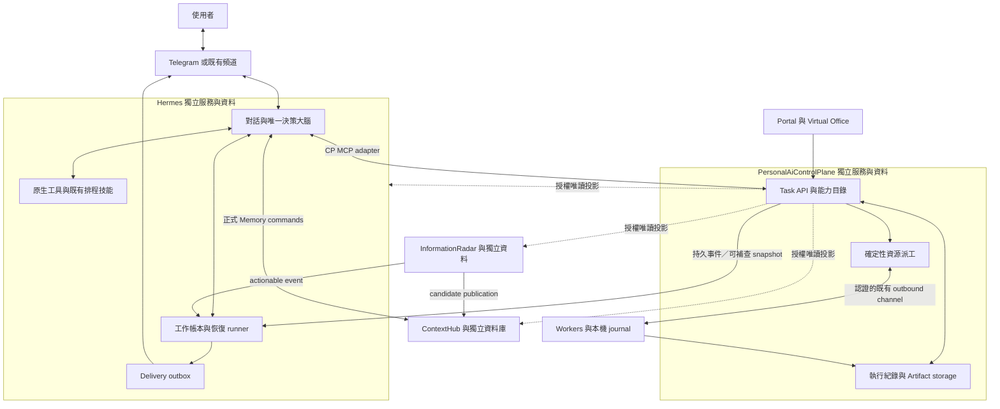
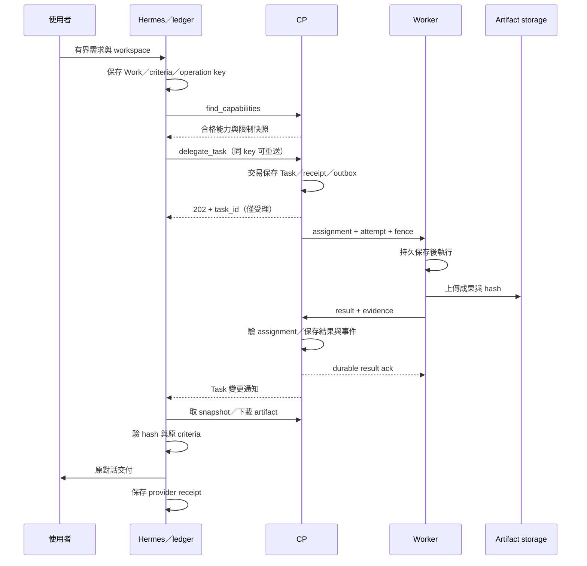

# Personal AI Platform v2 — High-Level Design

日期：2026-09-15｜版本：1.0｜狀態：**設計提案，尚未實作或完成 runtime 驗收**。

依據：[需求 v2.1](personal-ai-platform-v2-system-requirements-v2.1.md)、[需求審查 R01–R15](reviews/personal-ai-platform-v2-review.md)。配套：[Detailed Design](personal-ai-platform-v2-detailed-design.md)。

## 1. 設計結論與文件效力

Hermes 擁有目標、規劃、排程、技能、背景工作續接、驗收與交付。CP 保留能力目錄、Worker Task 派工、資源占用、執行證據與 Portal。ContextHub 擁有共享記憶及使用者裁決；Radar 擁有資訊蒐集、insight 與發布紀錄；Worker 執行有界工作。

本設計落實已確認 D01–D05，不重開產品取捨。新設計對責任歸屬優先於舊 [Hermes Brain v2 HLD](hermes-control-brain-v2-hld.md) 與 [個人代理能力 HLD](personal-agent-capabilities-hld.md)；舊文件仍用來理解 legacy 協定與歷史，不再指導新版 CP decision loop。Task／Worker 既有執行約束延續，差異依 Detailed Design 遷移。

本文的 platform v2、文件版本、HTTP `/api/v2`、Task schema、Worker protocol 是不同版本軸。設計不等於刪除、部署或資料遷移授權。

### 1.1 成功條件

1. 使用者交辦後，Hermes 重啟仍找得到工作、委派結果、待確認問題與待交付成果。
2. CP Task 完成只產生執行事實及通知；不啟動下一輪 AI 決策、不自動建立後續 Task。
3. 執行結果、成果可讀、Hermes 驗收、頻道交付分開記錄且可追溯。
4. 未確認停止的 Worker 不被當作安全釋放；副作用未知時不盲目重做。
5. Hermes／Radar 新知識經 ContextHub candidate 與使用者審核後才進一般共享 recall。
6. 目標、排程、技能實際在 Hermes 保存、重啟及觸發；CP 保留執行投影與 Virtual Office。

## 2. 本機基準與落差

本次 CP 原始碼基準：`79ba642896090e76301616afb4d3517416994874`。本次只讀本機文件／程式，未測 NAS、Hermes runtime、Worker、Telegram 或外部 provider。下表的「存在」不等於完整需求已達成。

| 區域 | 已核對的本機依據 | 新設計落差 |
| --- | --- | --- |
| Task contract | [contracts](../packages/contracts/src/index.ts) 有六個 Task 狀態與 typed execution | 追加相容契約、控制／觀測維度、來源去重、明確 required/preferred |
| Task lifecycle | [TaskService](../apps/control-plane/src/tasks/task-service.ts) 有 runs、attempts、revision、operation receipts、artifact 檢查 | `expire`、`loseAttempt` 可進可重排 fail 路徑；新版需停止與副作用證據 gate；一般 Task 取消也須檢驗停止證據 |
| Resource dispatch | [scheduler](../apps/control-plane/src/scheduler/scheduler.ts) 有資源與 workspace 選擇 | 複合能力 all-of、credential／verification freshness、跨 Worker workspace 排他需逐項補驗證 |
| 高階工作 | [missions](../apps/control-plane/src/missions/coordinator.ts)、[agent-work](../apps/control-plane/src/agent-work/agent-work-service.ts) 與舊設計 | 新版權威移交 Hermes；legacy 工作分流，不能單純將舊 coordinator 改名 |
| HTTP／artifacts | [server](../apps/control-plane/src/server.ts)、[artifact storage](../apps/control-plane/src/artifacts/artifact-storage.ts) | 既有 results／download 可重用；Hermes 實際下載驗 hash、MCP 工具載入仍需驗收 |
| Hermes／Hub／Radar | 需求審查 §4 的跨 repo 證據；本輪另核對 Hermes adapter 檔案與 Hub ADR-006 | 不宣告已具備新高階 persistence、MCP runtime integration、Radar publication 或 provider delivery |

## 3. 系統與部署邊界

沿用 CP 單一 active writer 與 SQLite；Hermes、Hub、Radar 各自保存自己的 durable storage，禁止跨 repo 直接寫 DB。先重用既有 inbox/outbox、Worker channel、原生 scheduler 與 skill storage；不足部分加在責任 owner 的 adapter。初版不引入 message broker、分散式 workflow 產品或共享 DB。事件通知至少一次傳送，冪等與對帳在 domain 層完成。

部署沿用各 repository 的不可變映像與私有服務連線。Worker 使用既有 outbound channel，無需新增對外 listener。連線及 secret 使用引用；discovery 不提供內部端點或憑證。CP 不接管通用 infrastructure、secret、backup 或 root 操作控制。

## 4. 元件責任與資料權威

| 領域 | 決策／操作 owner | 權威資料 | CP 可做的事 |
| --- | --- | --- | --- |
| 對話、Goal、Milestone、Plan | Hermes | Hermes 原生資料與工作帳本 | 授權投影、來源連結、相關 Task |
| Routine、Skill | Hermes | 原生 schedule／skill 版本；adapter 補 occurrence ledger | 顯示引用與執行證據 |
| Task／Run／Attempt | CP | CP DB；Worker journal 提供實際程序證據 | 驗證、派工、有限重試、等待、取消與對帳 |
| Worker 資格與資源 | CP＋實測 backend | 核准與 credential 由 CP；資源由觀測值提供 | 不信任單純自報；重新核對接案資格 |
| 原生工具執行 | Hermes | Hermes tool operation journal | 接收可延後補送摘要，不能建假 Worker Task |
| 驗收與交付 | Hermes／provider | criteria evaluation 與 delivery receipt | 顯示具 revision 的投影 |
| 記憶與審核 | ContextHub／使用者 | canonical item、revision、trust 與 ACL | 健康、授權可見統計、審核連結 |
| Insight／publication | Radar；Hub 裁定採納 | Radar insight／outbox；Hub item | 來源狀態、發布／事件投遞各自顯示 |
| Artifact | CP registry／storage；Worker 提供 bytes | CP artifact manifest 與受控實體檔案 | 授權存取、hash、保留與過期狀態 |
| Registry | 每項設定指定唯一 owner | 設定與 source observations 分開 | 聚合且顯示 freshness |

不透明 conversation reference 由 Hermes 解析到真實原對話；CP 不靠使用者任填 chat ID 決定收件人。所有投影有 `source_revision`、`observed_at`、`freshness`，不得回寫覆蓋原 authority。

## 5. Hermes 工作模型與流程

### 5.1 原生與委派路由

簡單句子整理直接回覆。需要特定 workspace、runtime、GPU 或背景追蹤的工作，由 Hermes 查能力後選擇 CP 委派。Hermes 原本可用的工具保留；同一 execution operation 在發出前持久固定 `lifecycle_owner=HERMES_NATIVE` 或 `CP_TASK`。

從 CP 改走原生路徑前，必須證明 CP 沒有受理，或舊執行已停止且副作用已對帳。單純 HTTP timeout 不足以切換。策略變更產生新工作 revision，由 Hermes 決定，不由 CP 猜測替代。

### 5.2 工作帳本與恢復

Hermes Work 是整體目標的持久續接單位，關聯原生 Goal／Skill／Schedule；不是 CP Task 的新名稱。只存行動計畫摘要、工具意圖、依賴、外部 Task ID、criteria、等待與交付，不存模型私有思考。

Hermes 在網路操作前提交 operation intent；提交 CP 時攜帶穩定 key；回應遺失用同 key 找回原 Task。Work runner 由事件或 timer 喚醒，先讀權威 snapshot，再呼叫 Hermes 做下一個策略決策。等待不需要持續 LLM 推理。多個 runner 使用工作 revision／lease 避免同一 action 重複發出。

CP 只通知「Task 有變更」，Hermes 自己排定結果讀取與驗收。Hermes 停機期間 Worker 可完成，CP 與 Worker 保留結果，恢復後補取。

### 5.3 委派到交付

Push、部署、刪 storage 等需確認行動由 Hermes 在具體目標／變更已可檢閱時取得批准，批准綁定內容與範圍。相同有效批准沿用，CP／Worker 不重問；目標或內容變更後重新確認。現有 workspace、來源 ACL 與 deployment gateway 限制繼續生效。

## 6. CP 與 Worker 執行設計

CP MCP 是正式 Task domain service 的薄 adapter；HTTP、MCP、Portal 共用驗證、receipt 與 DB。能力要求分 capability、runtime/model、workspace、資料所在地與資源。`required_worker` 為硬限制，`preferred_worker` 只在合格集合內排序；未具備能力與暫時忙碌分開回應。

六個既有 Task enum 保留。新增 execution certainty、control request、stop evidence、occupancy、waiting reason、Hermes validation／delivery 投影；`CANCELLED` 不等於程序已停止，`SUCCEEDED` 不等於驗收與交付完成。新客戶端必須讀複合狀態。

每個 Task 可有多個 Run；顯式重做建立 Run，每次實際嘗試建立 Attempt。transport 重送不增加 attempt。CP 只能依提交時的有限 retry policy 重試相同工作，不能改策略或放寬權限。停止與外部副作用不明時保留 UNKNOWN，workspace 與資源不自動釋放。

Worker journal、CP assignment 與 workspace fence 必須一致。以共享 workspace reference 管理排他，backend 在開始與高風險操作前核對 fence；無法證明遠端舊程序停止時，不能僅靠 lease 到期讓另一 Worker 寫同一 workspace。

## 7. 記憶與 Radar

Hermes Memory Provider 的 prefetch/search/store/update/sync 映射 ContextHub 正式 commands，沿用 canonical schema、server-derived identity、namespace、ACL、revision 與 candidate/successor。索引是可重建投影。

一般搜尋只讀可用 accepted 版本，排除 candidate、expired、revoked、superseded 與未裁決衝突。AI 修正 accepted item 必須提出 candidate successor，使用者裁決才原子切換。Hermes native memory 分 local_only、cache_pointer、shared_candidate；共享身份與偏好不另存權威副本。

Radar 的 insight 持久化、Hub publication、Hermes event delivery 是三條獨立狀態。事件可早於 publication，內含授權摘要、來源、revision、expiry 與 publication 狀態；Hermes 可評估其即時價值，但不能宣稱它已成共享知識或將事件當批准。撤回與更正使用新 revision／tombstone，不能被晚到舊事件復活。Detailed Design 定義去重及版本競爭。

## 8. Portal 與可觀測性

| 頁面 | 主要資料與互動 |
| --- | --- |
| Overview／Systems | owner、declared/observed version、health、freshness；錯誤不顯示為零或健康 |
| Active Tasks／Task detail | 執行、控制、等待、Run/Attempt、artifacts、Hermes 驗收、delivery 分欄；取消顯示停止是否確認 |
| Workers／Capabilities | approval、credential、verified evidence、workspace、容量與不接案原因 |
| Hermes work／Goals／Schedules／Skills | Hermes 唯讀投影與 owner 頁面連結；相關 Task，顯示同步時間 |
| Memory | Hub 授權統計與 candidate 審核連結；裁決仍由 Hub 處理 |
| Knowledge Sources | Radar last scan、insight、publication／event delivery、來源過期 |
| Usage／Audit | 計量來源、coverage、單位、成本幣別／價格版本、操作與批准引用 |
| Virtual Office | 實體 Worker 與邏輯角色分開；等待／未知照真實狀態呈現 |

最小 Task detail 與第一條真實垂直流程一起交付，不能最後才補 UI。測試必須比對 API 與實際 rendered 頁面；動畫與 heartbeat 不作進度證據。使用者在 Portal 提交高階需求時交給 Hermes；CP 不自行生成 Plan。

## 9. 可靠性、容量與安全

本設計初期採單 active writer、各服務本機 durable journal、至少一次傳送與定期 reconciliation。這降低 NAS 維運複雜度，但單機故障須靠備份／還原，並非 HA 承諾。容量、heartbeat、timeout、retention、RPO/RTO 與負載提案見 Detailed Design §13；未實測不可聲稱已達標。

| 故障 | 降級與恢復 |
| --- | --- |
| CP 不可用 | 原生工作繼續；CP 提交狀態不明則保留 key 待查，不雙派 |
| Worker 失聯 | attempt UNKNOWN、保留占用、等待 journal／程序／效果對帳；其他獨立 workspace 可繼續 |
| Hermes 不可用 | CP／Worker 保存執行事實；策略、驗收、delivery 等恢復 |
| Hub 不可用 | 不造共享記憶；與記憶無關工作可繼續，候選寫入保留待送 |
| Radar 不可用 | 顯示資料過期；保存 cursor、publication／event outbox |
| Provider 不可用或結果不明 | 保存成果，只恢復 delivery；UNKNOWN 先對帳 |
| Disk／quota 不足 | 拒絕新成果寫入或派工並給原因，保留已受理工作的 journal，不假成功 |

密鑰只使用既有 secret references；不進 Task、manifest、log。Worker output、記憶候選與外部文章是資料，不能升格成 policy。部署只能經 `Tim@gnest` 的 `/usr/local/bin/deployment` allowlist → staging → validate → immutable image deploy → status／app verification，所有 privileged commands 用 `sudo -n`。獨立 repo 保有獨立 release、migration 與 rollback。

## 10. 功能移交與切換

| 既有模型 | 目標處置 | 切換證據 |
| --- | --- | --- |
| Mission／Plan／Step／高階 Run | Hermes Work 與原生工作模型；CP legacy 唯讀歷史 | Hermes 不靠 CP decision callback 仍可續接、驗收、修正 |
| Goal／Milestone | Hermes authority，保留 ID/version mapping | 建立／讀取／重啟後仍存在 |
| Routine | Hermes 原生 scheduler＋occurrence ledger | 時區、next fire、每個 occurrence 唯一；切換不重複觸發 |
| Skill | Hermes 原生 skill storage＋固定版本引用 | 重啟後選用同版技能，Task 仍有 evidence |
| Task／Worker／Artifacts | 留在 CP，擴充相容契約 | 舊 client 與新版 contract tests |
| Virtual Office | 更新 projection，保留頁面 | 實際 Worker、Hermes work、等待與歷史正確 |

先新增相容 reader／writer、Hermes durable runtime 及 MCP adapter，完成真實工作閉環與負向驗收，再移交與關閉新工作進入舊 loop。Legacy active work 固定原協定直到完成，或在已停止發出動作的安全點移交。使用 ownership epoch／mapping 防止雙 owner。

切換前逐筆處理 approval、outbox、UNKNOWN attempts、待交付結果與 schedule occurrences。未解決項保留等待，不靠刪除清空。回滾只在資料與 owner 安全點逆轉；新 Hermes Work 不得直接餵給 legacy CP planner。無相容舊映像時採修正前進或已演練的資料還原＋外部效果對帳。

## 11. 關鍵架構決策（ADR 摘要）

以下狀態為 Proposed 的實作選擇；D01–D05 產品方向為 Confirmed。決策者為平台 owner，實作可依實測修訂。

| ADR | 決策／考慮選項 | 取捨與重訪條件 |
| --- | --- | --- |
| ADR-P01 | 在 Hermes 補 durable work adapter；不在 CP 保留新版 planner，也不全面重寫 Hermes | 符合單一大腦；須驗證原生 persistence hooks，欠缺部分由 Hermes repo 補足 |
| ADR-P02 | 重用單 writer SQLite＋各自 outbox；替代為 broker／分散式 workflow | 維運簡單；無跨庫交易、需對帳；實測寫入競爭或容量超標才重訪 |
| ADR-P03 | 保留 Task enum＋新增正交狀態；替代為立即破壞式 API 升版 | 舊歷史可讀；UI 必須懂複合狀態；舊 client 無法安全操作新語意時拒絕 mutation |
| ADR-P04 | MCP 包裝同一 domain service；替代為另一個 MCP Task service | 無第二份任務真相；API parser、MCP schema 必須一同版本測試 |
| ADR-P05 | ContextHub candidate／successor 與人工裁決；替代為 agent 自動採納 | 符合 D03；recall 有人工審核延遲，不能以來源可信繞過 |
| ADR-P06 | Approval 在 Hermes，CP 傳遞／記錄最小 proof；替代為中央 policy engine | 不重問；仍須驗 identity、scope/hash、有效性與既有 backend 邊界 |
| ADR-P07 | 至少一次事件＋冪等、未知則對帳；不承諾跨 provider exactly-once | 接受暫時 UNKNOWN，避免無證據的外部副作用重送 |

後續工作：依 Detailed Design 的契約、runtime 缺口、migration mapping、測試矩陣實作；每個 repo 分別保存版本與驗收證據。

## 12. 需求追溯

| 需求／審查 | HLD | Detailed Design |
| --- | --- | --- |
| D01、D02、H-01–H-03、R01/R02 | §4–§5、§10 | §2、§3、§12 |
| CP-01–CP-03、W-02、R07/R13 | §4、§6、§8 | §4、§11 |
| CP-04–CP-06、W-01/W-03、R03/R04/R11 | §5–§6 | §4–§7 |
| D04/D05、CP-07、H-05、R05/R06 | §5、§9 | §3、§8 |
| D03、M-01–M-04、R08/R09 | §7 | §9 |
| R-01–R-03、R10 | §7 | §10 |
| H-04、W-04、R12 | §5、§6 | §7 |
| CP-08、R14 | §8 | §11 |
| Reliability／Migration、R15 | §9–§10 | §12–§14 |
| A01–A16、功能歸屬驗收 | §1、§10 | §14 完整證據矩陣 |
