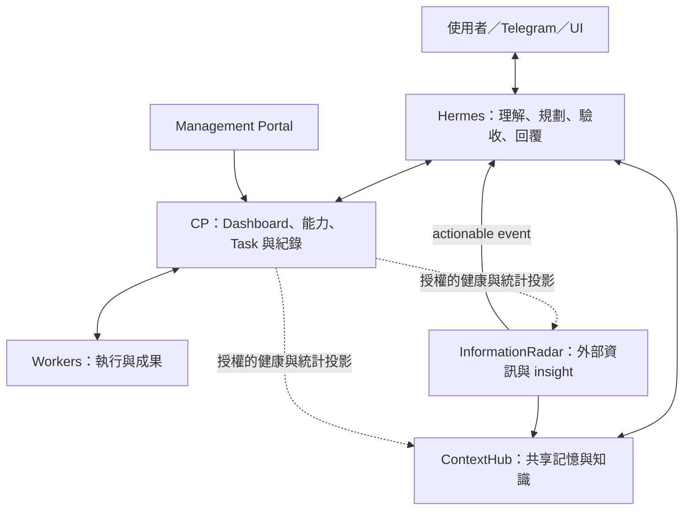

# Personal AI Platform v2 — System Requirements

文件版本：2.1。日期：2026-09-15。
狀態：**需求審查修訂版；五項產品方向已依使用者回覆確認。本文不宣告實作或部署完成。**

本文件修訂[原需求](</Users/tim_hong/Downloads/Personal AI Platform v2 — System Requirements.md>)；修改理由見[審查報告](reviews/personal-ai-platform-v2-review.md)。原文件保留不變。

## 0. 文件效力與已確認決策

這是平台產品需求，不是執行部署、刪除功能或改寫記憶的操作授權。「v2」指平台目標版本；「2.1」指本文件修訂，不自動更改 HTTP API、資料庫或 Worker 協定版本。

「必須」為必要條件；「建議」為可調整設計。除另述外，介面名稱與欄位是語意要求，不宣稱現有 API 已實作。D 編號記錄本輪確認的產品取捨。

| ID | 狀態 | 使用者已確認的方向 |
| --- | --- | --- |
| D01 | CONFIRMED | Hermes 是決策大腦；CP 回到 dashboard、capability layer，負責派工與執行紀錄，不重複大腦功能。 |
| D02 | CONFIRMED | 目標／排程／技能交給 Hermes；CP 顯示相關執行紀錄，Virtual Office 保留為視覺化。高階工作由 Hermes 主導，CP 不維持另一套規劃引擎。 |
| D03 | CONFIRMED | Hermes／Radar 的新知識全部先存 candidate，經使用者審核後才進共享讀取；正式記憶修正也遵守此流程。 |
| D04 | CONFIRMED | Hermes 原本能做的事照舊；CP 授權管理從簡，可接收執行紀錄，不作為 Hermes 原生工具的全面前置授權層。 |
| D05 | CONFIRMED | git push、正式部署等需確認；Hermes 可透過 Telegram 取得 approval，再執行並留存紀錄。 |

本版對元件責任、功能歸屬、approval 與記憶採納的定義優先於舊 HLD。後續 HLD／Detailed Design 必須配合更新；本文不直接改變現行協定或授權刪除歷史資料。

## 1. 目的、範圍與成功定義

使 Hermes、PersonalAiControlPlane（以下 CP）、ContextHub、InformationRadar、Workers 的責任明確，讓使用者交辦後能取得可驗證的結果，並能從 Portal 了解可用資源與執行狀態。

### 1.1 核心責任

| 元件 | 責任 | 不應擁有的責任 |
| --- | --- | --- |
| Hermes | 理解需求、查背景、規劃、選擇能力、驗收、修正與對話交付 | 偽造 Worker 結果、繞過適用授權、覆寫其他系統的權威資料 |
| CP | Dashboard、能力目錄、Worker 派工、執行狀態、成果與操作紀錄 | 任務策略、計畫拆解、指揮 Hermes 的推理迴圈、重做 Hermes 原生功能或全面授權中心 |
| ContextHub | 共享記憶與知識的 schema、讀寫授權、來源、版本及生命週期 | 接管 Task 執行、把未裁決推論默認成使用者事實 |
| InformationRadar | 外部資訊蒐集、整理、insight 與 actionable event | 指揮 Hermes、直接展開跨 Worker 的後續工作 |
| Worker | 在授權範圍內執行有界任務，回報證據與成果 | 改寫全域目標、自行跨 Worker 派工、擴張授權 |

**策略決策**是決定做什麼、如何拆解、成果是否足夠與下一步。**執行協調**是按已接受的決策管理狀態、依賴、資源、等待與有界重試。本版由 Hermes 主導策略與整體工作流程；CP 只保留 Worker Task 所需的狀態追蹤、資源配置、等待與有界重試。CP 不因 Task 完成就自行產生下一個工作。

Hermes 必須持久保存它負責的待辦、Task 關聯與交付進度，並在重啟後續接。CP 保存 Worker 執行事實；Hermes 讀取結果後決定下一步。不能讓背景工作只存在於一段仍存活的 LLM 對話。

### 1.2 範圍

- 需求涵蓋五元件的介面與協作；跨 repository 的實作各自維護、發佈與驗收。
- 不要求全面重寫，也不要求所有元件共用資料庫、repository、release 或備份。
- 本次不因「Infrastructure Management」名稱就增加通用 secret、backup 或部署控制系統；既有服務控制權需要明列來源與整合方式。
- 主要成功條件是決策只由 Hermes 負責，CP 可查能力、派工與看結果；不在 CP 重建 Hermes 的規劃、技能選擇或對話系統。所有情況都須驗證結果正確性、等待可靠性與交付。

## 2. Target Architecture 與資料權威

Hermes→ContextHub、Radar→ContextHub 不必經過 CP。Worker 委派統一經過 CP。Hermes 原生工具照既有方式直連，必要的 approval 由 Hermes 處理；CP 可接收其執行摘要。CP 不可用不能阻斷原本無需 CP 的 Hermes 工作。

| 資料 | 權威來源 | 其他元件可保存 |
| --- | --- | --- |
| 使用者對話、Hermes session | Hermes／原頻道 | 授權的任務輸入及不透明 conversation reference |
| Worker identity、授權、dispatch、Task 執行紀錄 | CP；實際程序與結果由 Worker 提供證據 | 具版本及時間的投影 |
| Mission／Plan／Goal／Routine／Skill | Hermes；具體工作模型由 Hermes 實作，現況與移交見 §11 | 不建立互相覆寫的兩份 authority |
| 共享記憶、裁決、修正版本 | ContextHub | reference、revision 與允許的暫時 context |
| Radar 原始資料、insight、發布紀錄 | Radar | 授權摘要、來源引用、投遞回執 |
| 最終頻道投遞結果 | Hermes delivery adapter／provider 回執 | CP 保存狀態與引用，不宣稱使用者已閱讀 |
| service 設定與 health | 指定 registry owner；health 由來源服務觀測 | CP 投影及 observed_at、freshness |

## 3. Control Plane 需求

### CP-01 System Registry

每項服務須有 `service_id`、名稱、類型、owner、連線設定引用、health 介面、contract version 與觀測時間。設定值與觀測值分開保存。

觀測至少能表達 healthy、degraded、unreachable、unknown、stale；無資料不得顯示為健康。版本資料須區分 declared version 與實際回報的版本。健康連線與密鑰只供授權 adapter 使用，不透過 discovery 回傳憑證。

### CP-02 Worker Registry 與接案資格

Worker 註冊至少包含穩定 identity、顯示名稱、OS／架構、Worker 版本、協定版本、execution backend、capability manifest、workspace references、資源、concurrency 與 heartbeat。

註冊不等於可接案。CP 必須分別記錄 owner approval、credential validity、connectivity、enabled/drain、能力驗證與可用容量。派工前重新核對；已撤銷的 Worker 不能只靠重新 heartbeat 恢復權限。

### CP-03 Capability Discovery

概念介面：`find_capabilities(requirements, task_description?)`、`list_workers()`、`get_worker(worker_id)`。

自然語言描述供 Hermes 理解用途；CP 依結構化要求與規則比對，不需新增 LLM planner。要求至少支援能力、runtime、模型、OS、workspace、資料所在地、資源、期限與授權範圍。

回應包含符合／不符合原因、capability 版本、Worker 候選、有效授權、觀測時間、可用性、佇列／負載、限制及有來源的成本估計。過期或未知值明確標示，不以 0 代替。

Discovery 是當下快照，不是資源預約。提交後暫時無容量時可等待並顯示原因；從未具備所需能力與暫時忙碌須能區分。

Hermes 選工作需要的能力；CP 在合格且授權的 Worker 中做資源配置。指定 `preferred_worker` 是偏好，`required_worker` 才是硬限制，不能悄悄將硬限制降級。

### CP-04 Delegation 與 MCP

Hermes 使用 CP MCP 的語意介面，底層可包裝既有正式 API；不再建立第二套 Task database 或授權規則。最低操作為：

| 操作 | 語意 |
| --- | --- |
| `find_capabilities` | 取得可用能力與限制 |
| `delegate_task` | 冪等受理一個有界工作，回傳 Task ID 與目前狀態 |
| `get_task_status` | 回傳執行、控制、驗證與結果可用狀態 |
| `get_task_result` | 取得摘要、結構化結果、成果引用與證據 |
| `wait_task` | 有界等待或持久訂閱；等待連線中斷不影響執行 |
| `cancel_task` | 提出取消並回傳是否已確認停止 |

Hermes 透過 CP 委派時只需能力與任務參數，不必知道 SSH 地址、Worker 密鑰或內部 execution endpoint。此抽象不撤除 Hermes 既有原生工具。CP 的 generic task 轉接使用已知 task type 的 typed adapter，依既有 backend 限制執行。

CP 缺少 adapter、權限或協定版本時，回傳明確不可用原因。Hermes 可重新選擇本來就可用的原生工具，但須先確認沒有殘留 CP 執行，不繞過工具限制或需確認的操作。

### CP-05 Unified Task Model

保留單一 canonical contract，至少表達：

- 識別與版本：`schema_version`、`task_id`、`run_id`、`attempt_id`、`revision`、`idempotency_key`、來源意圖與 conversation reference。
- 歸屬：驗證後的 requested_by、可選 parent_task／高階工作引用；parent 關聯本身不授予子任務權限。
- 工作：type、description、結構化 input、capability requirements、workspace、資料處理範圍、驗收條件與 artifacts。
- 配置：preferred／required worker、assigned worker、priority、queue deadline、execution timeout、max attempts。
- 狀態：execution outcome、waiting reason、cancel request、stop evidence、progress、error；validation 與 delivery 是 Hermes 回報的投影，CP 不自行裁定。
- 時間與證據：created／assigned／started／finished、updated_at、worker/runtime/model 版本、結果及 metrics。

現有外部 Task 狀態為 `QUEUED / ASSIGNED / RUNNING / SUCCEEDED / FAILED / CANCELLED`。本版不得未經相容遷移就直接改成原草稿的 `COMPLETED / TIMEOUT / WAITING_INPUT`。

建議優先增加明確狀態維度與 reason code；若需要新 enum，Detailed Design 必須提出版本、轉換與舊 client 行為。Task／Run／Attempt 與高階工作的狀態不得混成同一 enum。

### CP-06 可靠的生命週期

1. 受理成功前，工作與來源去重資訊必須持久化。同一 logical request 重送回原 Task；同 key 不同內容回 conflict。
2. 每次執行有不同 attempt identity；同一 Task 只接受目前有效 attempt 的結果。過期結果存入稽核，不能覆寫新狀態。
3. Worker heartbeat 失聯只代表無法觀測，不等於程序已停止。必須能表達 `UNKNOWN`，並保留資源或 workspace 尚未安全釋放的狀態。
4. `cancel_task` 回應區分 requested、confirmed stopped、unknown；已發生的外部效果不因取消而撤回。
5. Timeout 不直接證明失敗或可重做。有副作用任務須先確認舊程序停止、查詢操作結果或取得可去重證據，才能重派。
6. 安全的 transport retry 沿用 operation key；重新執行工作建立新 attempt。策略改變交回 Hermes，CP 只做已定義的有限重試。
7. 進度與結果須可在 reconnect 後補送；重複 receipt 不能重複套用。waiter 消失不取消任務。
8. Worker 需要輸入時回報等待原因；Hermes 負責問題、工作版本、期限與對話回覆關聯，CP 保存等待與恢復紀錄。過期問題的回答不能套入新工作。
9. CP／Worker 重啟後先核對存活程序、持久 assignment、未確認結果與事件，再恢復派工；狀態不明不得盲目 replay。

### CP-07 簡單的確認與操作紀錄

本版不新增通用 policy engine、複雜角色／權限矩陣，或要求所有 Hermes 工具先經 CP 批准。沿用既有服務連線身分與 Worker enrollment，避免未登記端點混入或接錯工作即可；既有來源系統與 NAS gateway 的限制照常適用。

確認責任在 Hermes：

- 一般讀取、分析與任務範圍內程式修改可照既有方式執行。
- git push、正式部署、刪除 storage 等原需求列為需確認的操作，執行前由 Hermes 提供具體對象、變更摘要與影響，取得使用者確認。
- 使用者可在 Telegram 回覆或按批准操作；回覆須能對應到特定待確認事項。多個待批准工作時不能猜測「好」指哪一件。
- 批准後若對象或變更內容已不同，Hermes 重新提出確認；取消或過期的問題不能繼續執行。
- 同一項批准可隨 delegated Task 傳遞，CP／Worker 不另發第二次同內容批准要求。執行仍遵守既有 backend 與部署 gateway 邊界。

CP 記錄 request／session reference、Task／Worker、開始／結束、結果／artifact，以及適用的 approval reference。Hermes 原生工具由 Hermes 保留原始紀錄，CP 可接收摘要；沒有 Worker 執行就不建立假的 Worker Task。CP 暫時不可用時，Hermes 可保存待補送紀錄。

原文件的 AUTO／REQUIRE_APPROVAL／DENY 可作顯示或 adapter 回應，但不要求為三個標籤建置一套中央政策產品。紀錄不得包含憑證或模型私有思考過程。

### CP-08 Usage 與 Cost

呈現 cloud LLM、Codex、local LLM、GPU、Task 數、queue time、duration、failure rate。每個指標包含來源、計量期間、單位、範圍及 `measured / estimated / unavailable`。

Token、GPU 時間和貨幣成本分開；本地工作不因沒有 API 帳單就當成零成本。未知用量不能當 0；Hermes 與 Worker 的同一 provider 紀錄不可重複加總。估價須標示幣別與價格版本，不能聲稱是帳單。

月預算與 per-project budget 維持原需求的未來選項；若啟用硬上限，需另定義 reservation、實際結算與跨重試累計。

## 4. Hermes 需求

### H-01 唯一 AI 決策入口

Hermes 負責 reasoning、planning、task decomposition、skill/tool selection、result validation、修正與使用者回覆。CP 可以拒絕不可執行或不合法決策，但不取代 Hermes 另選策略。

### H-02 Delegation policy

每次 substantial task 都應判斷自行完成或委派；簡單改寫不強制查能力。考量資料與工具可達性、環境、時間、佇列、資源、授權、品質及有依據的成本，不以降低主 agent token 為唯一目標。

Coding、長批次、GPU、特定機器資料與非同步工作是候選情境，不是硬性機器名稱路由。「分析大量 log」本身不代表必須 GPU；要先確認方法、資料量與可用能力。

### H-03 執行與持久續接

標準流程：理解目標 → 判斷委派 → 查能力 → 提交有界工作 → 持久保存關聯 → 等待／處理其他工作 → 取回成果 → 驗收 → 交付或修正。

同一 delegated execution 不得同時走 Hermes 直啟 Codex 與 CP Task 兩條路。長工作須能在 Hermes 重啟後重新找到 Task 與待交付結果。高階工作狀態與續接由 Hermes 主導，沿用 Hermes 能力並補必要 adapter。CP 不反向控制 Hermes 的規劃／驗收迴圈；既有 CP Mission 的歷史與遷移依 §11 處理。

### H-04 驗收與回報

驗收依工作開始時的 criteria 與實際證據，不能只看 Worker 的 success 摘要。回覆應區分已受理、正在執行、等待、結果不明、驗收通過與已交付。

完成通知送回原 conversation；失敗附可理解原因與下一步。若僅投遞失敗，重試交付而非重跑工作；provider 結果不明時先對帳。

### H-05 原生工具保持既有方式

Hermes 原本具備的查詢、記憶、檔案、Codex 協作及其他工具能力不因本版改成一律經 CP。Hermes 依既有工具能力執行，需確認的操作依 CP-07 由 Hermes 取得 approval。

需要平台 Worker、特定機器資源或由 CP 持續追蹤的委派工作才走 CP Task。Hermes 原生 Codex 執行與 CP Codex Worker 是兩條可區分路徑，同一工作只選一條，不能雙重派工。

CP 可展示原生工具操作摘要，但不因此成為該工具執行或 ContextHub 記憶裁決的 authority。記錄失敗不阻擋原生工具工作；顯示紀錄未同步，而不是虛構成功紀錄。

## 5. ContextHub 需求

### M-01 共用介面、單一資料語意

保留 MCP 與 Hermes Memory Provider 整合目標。Provider 的 prefetch/search/store/update/sync 必須映射到 ContextHub 正式 commands，和 MCP 共用授權、版本、稽核與 idempotency；不得另存一份共享記憶。

現有 MCP 已有 search/compile、save_memory、propose_successor 等操作。原草稿的 search_memory/store_memory/update_memory 是產品語意，不要求另造同義 API。Hermes 自動 relevant-memory retrieval 必須在實際 runtime 驗證。

### M-02 Schema 與 Namespace

以 ContextHub canonical schema 為準。保留內容、摘要、來源、information class、memory kind、tags/entities、confidence、時間、有效期、revision、visibility、provenance、supersession 與 trust state。

原草稿 fact／preference／decision／project-context／research／insight／event／procedure 不直接當新 enum：前幾項對照既有 memory_kind，其餘先判斷屬 information_class、topic、tag 或新的語意種類，再決定是否遷移。

Namespace、owner、來源身分由可信驗證結果推導，caller 不得任意指定來越權。global search 只表示授權範圍內的跨集合搜尋；跨 namespace 聚合需明確可用的權限與 adapter，不以萬用字元 bypass ACL。

Embedding／全文索引是可重建 projection，不是權威記憶，也不要求每個 client 自行生成 embedding。

### M-03 候選、使用者審核與修正

Hermes 與 Radar 產生的新知識一律先寫成 candidate；只有經使用者審核 accepted 後，才能進一般共享搜尋、prefetch 與未來對話的記憶讀取。不得因來源可信、importance 高或模型 confidence 高就自動採納。

Accepted memory 不直接被 AI 覆寫。新發現或更正建立 candidate successor，由使用者審核後原子 supersede 舊版本，保留來源與版本歷史。Agent 可查自己的候選供追蹤，但不能透過私有候選清單繞過共享採納規則。

審核 authority 保持在 ContextHub，沿用既有審核介面；CP 可顯示待審數與連結，不另建裁決引擎。Radar 的 publisher 不得借用可信 service 的 source-projection 權限，把 AI 整理出的 insight 自動變成 accepted。

查詢不得把未裁決矛盾、過期或已撤銷記憶當成目前結論。建立、修正、supersede、expire、archive、deduplicate 須有一致、可稽核語意。使用者未審核的 insight 在未來 recall 情境中不算已可用共享知識。

### M-04 Hermes Native Memory

以 authority 與使用範圍劃界，不以大小或名稱劃界。Hermes 專屬操作規則可 local_only；跨系統使用者偏好、身份事實與 project knowledge 由 ContextHub 管理。

沿用 local_only、cache_pointer、shared_candidate 的區分。pointer cache 保存 item/revision/cursor，不能以過期副本覆蓋 Hub。Hub 不可用時說明未取得共享記憶；若任務依賴某筆記憶或授權，等待或提問，不能自行補造。

## 6. InformationRadar 需求

### R-01 資訊分層

Raw Data 在 Radar 自有 storage；具持續價值、聚合與去重的 insight 可發布到 ContextHub；需要即時注意的 actionable event 交 Hermes。Radar 可執行自己的蒐集與整理 pipeline，不決定 Hermes 的後續工作。

### R-02 Insight 與 Publication

Insight 至少含 stable ID、revision、topic/title/summary、來源清單與 URL、來源發布時間、detected_at、confidence 的依據、importance、tags、related entities、引用證據及內容 hash。

Radar 保存 publication operation key、Hub item/revision、candidate/accepted 狀態與錯誤。重送同一版本不重複新增；新版本與來源更正須可修正或 supersede，撤回能傳遞。不得將所有 crawling data 寫入 Hub。

### R-03 Actionable Event

事件含 event ID、schema version、source、insight ID/revision、priority、action_required、occurred_at、expiry、摘要及 publication 狀態。Hub 尚未 accepted 或暫時不可用時，Hermes 仍可依事件中授權可讀的來源摘要評估，不把它宣稱為已採納記憶。

Hermes 決定忽略、摘要、研究、委派或通知。事件不是執行授權。外部文章、insight 及 Worker output 均視為資料，不得將內含指令提升成平台政策。

Radar 與 Hermes 分別持久保存待發送／已受理紀錄；處理重複、亂序、過期、補送與來源中斷。通知成功與 Hub 發布成功獨立記錄。

## 7. Worker 需求

### W-01 有界執行

Worker 接受型別化 task，使用已核准 backend。允許 Codex 等 executor 為完成單一任務安排局部步驟、測試及修正；不得更改全域目標、自行要求其他 Worker 工作或超出 repository／directory／environment 授權。

### W-02 Capability Manifest

Manifest 分開描述：

| 維度 | 例子 | 意義 |
| --- | --- | --- |
| execution capability | codex、python、llm.inference | 有正式輸入／輸出契約的工作能力；示例沿用現有 Task type |
| runtime／model | Python 版本、Ollama、具體模型 ID | 執行工具與版本；Qwen 家族名稱不等於具體模型可用 |
| resources | RAM、GPU/VRAM、CPU、free storage | 實際容量與觀測時間 |
| workspace／constraints | repository reference、OS、資料可離機限制 | 哪裡可以執行及資料限制 |
| evidence | advertised、verified、unavailable、stale | 能力宣告與實測分開 |

新增 Worker 使用既有 capability contract 不需修改 Hermes core；新增全新 capability 語意仍需 schema、adapter、權限與測試，不能僅新增一個名稱就宣稱可執行。

### W-03 協定與生命週期

支援 registration／heartbeat／submit／status／progress／logs／result／cancel，與 CP 協商版本。可沿用既有 outbound connection；概念 submit 不代表必須對外暴露 Worker listener。

本機持久保存 assignment、執行 handle、未確認結果與必要停止證據。多 Worker 寫同一 workspace 必須受一致排他控制；撤銷與舊 attempt fencing 須在實際 backend 生效。

### W-04 進度與成果

進度包含 stage、message、sequence、observed_at，以及可量測時的 completed_units/total_units/percentage。不可量測時 percentage 為 null；heartbeat 不冒充進度。

Result 包含 execution outcome、summary、structured output、error、metrics、logs reference、artifact manifest 及驗證證據。Coding 工作應有基準 revision、變更摘要、diff／檔案引用及實際測試結果。

Artifact 包含 ID、所屬 Task/Attempt、檔名、media type、size、hash、可讀取方式與 retention／expiry。不能只回 Worker 本機絕對路徑；Hermes 必須能在授權下取得檔案。缺失、損壞、過期、無權限均為明確狀態。

## 8. Cross-System Contracts

| Contract | 主要 owner | 必要條件 |
| --- | --- | --- |
| Task／Capability | CP | 型別、版本、授權、error codes、狀態語意與新舊 client 相容 |
| Memory | ContextHub | canonical schema、namespace、trust、provenance、revision／successor |
| Insight／publication | Radar；Hub 接收端按 Memory contract | stable ID、version、dedup、採納與撤回 |
| Event envelope | 各 producer 依共同規格實作 | event_id、type/version、source、subject、correlation、occurred_at、sequence、payload |
| Artifact | CP 的註冊與存取契約 | integrity、ownership、availability、access、retention |
| Delivery | Hermes／provider adapter | 原對話關聯、operation key、provider receipt、unknown 處理 |

持久狀態是權威，事件只是通知或同步依據。事件可能至少一次傳送；consumer 要去重，同 subject 依序處理，缺 sequence 能重新查權威 snapshot。不得承諾無證據的跨服務 exactly-once。

認證身份由接收端核對。MCP、HTTP 與 Portal 操作共享 domain authorization；Worker callback 只可更新其有效 assignment。不能因在私有網路就信任 arbitrary command。

## 9. Portal 與 Observability

Portal 保留原需求的 Systems、Active Tasks、Workers、Memory、Knowledge Sources、Usage，並提供 Audit、成果及待處理問題。Virtual Office 保留為視覺化；目標／排程／技能資料來自 Hermes，CP 顯示其相關執行紀錄與同步時間。

- 首頁能回答系統是否健康、Worker 能做什麼、工作在哪裡、為何等待／失敗、結果是否可取、需要 owner 做什麼。
- Memory 顯示 ContextHub 健康、授權可見計數、近期新增、來源分布與資料時間；不自建 memory engine。
- Radar 顯示 last scan、insight、high-priority event、publication 與 delivery 錯誤；無資料與零新 insight 分開。
- Usage 顯示覆蓋範圍與 unavailable；無法蒐集的統計不可補成 0。
- 所有系統提供 health/readiness、version、uptime、error、request count、latency；Task 額外有 queue time、duration、worker、outcome、resource use。各指標可標示 unsupported。
- Portal 必須從正式 API 顯示真實資料；新 backend 契約的最小狀態頁應隨垂直流程驗證，完整頁面再擴充。

## 10. Security、Reliability 與運作條件

### 10.1 Security

採用現有 service／Worker identity 與 workspace 限制，保留操作紀錄；本版不增加複雜授權平台。密鑰使用既有 secret reference，不嵌入 task、artifact、manifest 或 log。

NAS 部署沿用 root-owned `/usr/local/bin/deployment`：allowlist、staging Compose、validate、immutable image deploy、status 與應用驗證。所有 privileged 操作 `sudo -n` 且非互動。禁止直接改 root-owned Compose、gateway、sudoers 或透過 Worker 繞行。這是未來實作的約束，本文件本身不發起部署。

### 10.2 故障降級

| 故障 | 預期行為 |
| --- | --- |
| 單一 Worker 失聯 | Hermes 可繼續對話；相關 Task 標示未知／等待對帳，其他合格工作可繼續 |
| CP 不可用 | Hermes 可處理不依賴 CP 的簡單工作；不能聲稱已受理新的 CP Task；Hermes 原生工具照常使用，紀錄可延後補送 |
| ContextHub 不可用 | Hermes 說明缺少共享記憶；與記憶無關工作繼續，依賴記憶的判斷等待或追問 |
| Hermes 不可用 | 已合法提交的 Worker Task 可完成並持久保存結果；需要新策略／驗收／對話交付的工作等待 Hermes 恢復 |
| Radar 不可用 | Hermes／Hub 主要功能不受阻；顯示來源過期並保存補送進度 |
| 通知通道不可用 | 工作結果仍可從 Portal 取得；交付獨立待重試，不重做 Task |

### 10.3 上線前必填的運作設定

不得猜測使用者的容量與資料保留需求。實作設計須提出並記錄 heartbeat interval、offline threshold、queue/execution timeout、retry limit、event retention、artifact retention／容量、備份週期、可接受資料遺失時間（RPO）、可接受復原時間（RTO）及目標並行負載。

驗收使用已記錄的值；觀察時間與量測條件需可重現。未定義這些值時不得宣稱達到可靠性或效能目標。

## 11. 現有功能與 Migration

### 11.1 既有基準

以下是本機設計／程式現況，非本輪正式環境驗證：

| 功能 | 目前責任 | 本版處理 |
| --- | --- | --- |
| Task／Worker／Scheduler／Artifacts | CP 有既有實作 | 延伸契約與補驗收，不重建第二套 |
| Mission／Run／Plan／Step | CP 保存與協調，Hermes 提策略 | 高階規劃與工作續接移交 Hermes；CP 停止主導 decision loop，保存 Task 執行及歷史投影，既有 Mission 安全結束或移交後退役舊控制路徑 |
| Goal／Milestone | CP 保存事實，Hermes 選下一步 | 目標與里程碑管理交 Hermes；CP 顯示引用與相關執行紀錄 |
| Routine | Hermes 定義／觸發；CP 保存 binding／occurrence 執行證據 | Hermes 管排程及觸發；CP 保存 occurrence reference 與 Task 紀錄，不設第二個 scheduler |
| 工作 Skill | CP 保存版本與驗證證據，Hermes 選用 | 技能管理交 Hermes，優先沿用原生 skill 機制；CP 只保留執行時 skill/version reference 與成果證據 |
| Virtual Office | 既有工作狀態與實體 Worker 的視覺投影 | 保留；依真實 Hermes／Task／Worker 資料呈現，角色／座位不成為規劃或派工權限來源 |
| ContextHub MCP／共享記憶 | ContextHub canonical commands | 沿用；新知識一律 candidate，再由使用者審核 |
| Hermes CP integration | 既有 API adapter 與 Mission 協定 | 核對 MCP 包裝與實際工具載入，不能憑文件宣稱接通 |

### 11.2 改造順序

以下是依賴順序，不是預先決定多次發佈或要求每階段人工批准。

1. 依已確認 D01–D05 與 §11.1，盤點跨 repo 缺口，設計 Hermes 接手目標／排程／技能／高階工作，以及 CP 舊控制路徑退役方式。
2. 固定相容 Task／Capability／Memory／Event 契約及來源去重；定義 credentials、版本與驗收方法。
3. 用一個已核准真實 Worker 完成 Telegram→Hermes→CP→Worker→artifact→Hermes 驗收→原對話交付，並顯示最小 Portal 狀態。
4. 驗證重啟、重送、取消、timeout、舊結果及 unavailable；補 Hermes 自動記憶查詢與記憶政策測試。
5. 完成 Radar→Hub publication、Radar→Hermes event 與未來 recall，驗證重複及撤回。
6. 擴充其他 Worker 與完整 Portal；各 backend 有獨立實測證據，Virtual Office 只使用真實狀態投影。
7. 新路徑通過後才切換與退役舊路徑，保留歷史、rollback 與協定相容性。

### 11.3 移交要求

Hermes 接手前，需證明目標、排程、技能與背景工作能在實際 Hermes runtime 保存、讀取、執行及重啟續接，不能只移動文件或 API 名稱。沿用既有 Hermes 能力；缺少的能力以 Hermes adapter／資料模型補足，不轉回 CP 新建決策系統。

移交需保存原 ID 對照、目標／技能版本、排程時區與下一次觸發、活動 Task 關聯及待交付結果。排程切換每個 occurrence 只觸發一次。舊 CP 模型可暫時作相容與歷史讀取，不再承接新版高階決策。不得只把 CP 原有規劃迴圈改名為「紀錄」而繼續運作。

### 11.4 切換與回滾條件

每個 repository 有獨立 source commit、image/version、migration 與 rollback；不得要求一次性共享資料庫切換。

活動工作固定其建立時的協定語意，或在明確安全點遷移；不得中途用新狀態機重新解譯。資料遷移需一致備份、mapping、完整性檢查與還原演練。版本回退若不相容新 schema，須使用已驗證方案，不把舊映像直接接上不相容資料。

切換前要處理 pending approvals、outbox、未知執行與 delivery。無法安全解決者明列等待，不因退役而遺失或重複送出。

## 12. End-to-End Acceptance

需求完成必須同時有 contract 測試與真實整合證據；健康、`202 accepted`、Worker 啟動或 UI 畫面都不足以替代。

| ID | 情境 | 必須觀察到的結果／證據 |
| --- | --- | --- |
| A01 | 簡單句子整理 | Hermes 自行完成，無強制 discovery／Worker Task |
| A02 | 修改指定 repository API | 真實合格 Codex Worker、正確 workspace、可檢閱變更、相關測試、artifact 可讀、Hermes 驗收與原對話交付 |
| A03 | 明確需要 GPU 的批次工作 | 匹配具體 runtime/model/資源、真實處理輸入數與結果；Worker 忙碌有可理解原因；等待不占用持續推理 |
| A04 | 過往研究回憶 | Hermes 自動從 Hub 取已允許的相關資料與來源／版本；排除未審候選、過期、撤銷及未裁決衝突 |
| A05 | Radar insight 未來可回憶 | 多來源去重 insight→Hub publication→使用者審核 accepted→之後新的 Hermes 對話可檢索；回傳來源引用 |
| A06 | Radar actionable event | 重送同 event 不重複建立後續工作；Hub publication 尚未完成時仍正確呈現狀態；不自動當執行授權 |
| A07 | 重送與舊 attempt | 相同 operation key 只有一個 logical Task；不同內容 conflict；過期 attempt 不能覆寫目前結果 |
| A08 | Worker 失聯、取消與 timeout | 無停止證據保持 unknown／未確認；有副作用工作不盲重派；確認停止後才安全釋放資源 |
| A09 | Hermes／CP／Worker 各自重啟 | 已受理工作、待交付結果及關聯可恢復；沒有遺失或重複外部效果 |
| A10 | 交付失敗或未知 | Task 與 artifact 仍可查；只修復 delivery；有 provider receipt 才標示已送出，不標示已閱讀 |
| A11 | 新 Worker 與假能力宣告 | 核准且支援既有 contract 的 Worker 不改 Hermes core 即可使用；未驗證／未授權／缺 workspace 不派工 |
| A12 | 越權與批准變更 | 原有 workspace／namespace 限制保持；push／部署由 Hermes 取得對應確認，CP 不重問；目標改變須重確認；原生工具不依賴 CP 事前批准 |
| A13 | Artifact 異常與假進度 | 缺檔／hash 不符／失效連結不算成功交付；不可量測進度不用虛構百分比 |
| A14 | 故障降級與 Portal | 各服務失效時呈現 §10 行為；缺資料顯示 unknown/stale；後端狀態與真實頁面一致 |
| A15 | 協定升降版與保留功能 | 活動工作與歷史可讀、回滾有演練；目標／排程／技能已由 Hermes 管理，CP 舊決策路徑不再承接新版工作，Virtual Office 仍呈現正確狀態 |
| A16 | Usage 完整性 | 已知用量可追來源；未知標 unavailable；無跨 Hermes／Worker 重複計帳或偽零成本 |

每個案例保存執行時間、部署版本、操作範圍、Task/Attempt／事件 ID、artifact hash、驗收結果與適用回執。分別標記 design、implemented_local、ci_verified、live_verified、provider_verified，不把較低層證據提升成較高層完成。

### 12.1 功能歸屬的必要驗收

另須在實際 Hermes runtime 建立一個目標、保存並選用一個技能、建立一次排程，重啟後仍能取得且觸發對應工作。CP 顯示相同來源引用與 Task 執行紀錄；不依賴 CP 的 Mission decision loop 推動 Hermes。Virtual Office 顯示真實 Worker、活動與等待狀態，不能以動畫取代進度證據。

## 13. 最終責任原則

Hermes 決定目標如何完成並主導工作流程；CP 提供 Dashboard、能力、派工與可核對的執行事實；ContextHub 管共享知識；Radar 產生外部資訊與 insight；Worker 在授權範圍內執行。

跨元件功能是合理的。新增功能應先列出誰決策、誰授權、誰執行、誰保存權威資料與誰對外回覆，再定義契約。不要把「涉及兩個元件」本身當成錯誤，也不要讓兩個元件對同一狀態各自做主。
