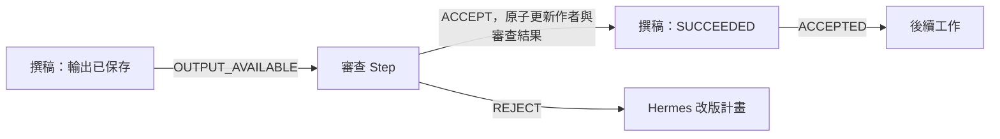

# Personal AI Control Plane — 虛擬辦公室 Detailed Design

日期：2026-09-07

狀態：實作基準；截至 2026-09-07，Contracts/DB/Office/Mission intake、Plan validation/activation、Coordinator 派工、Hermes adapter、Worker mission features、UI 與 fail-closed recovery/acceptance probe 均有 `implemented_local` 證據。本文件不把本機實作誤代表完整 production/provider acceptance。

上位設計：[虛擬辦公室 HLD](virtual-office-hld.md)。

## 1. 範圍、基準與規格約定

本文件將 HLD 展開為資料約束、狀態機、交易邊界、API、Hermes command、Worker 協定、UI 與驗收規格。維持一個 Control Plane process/container、既有 SQLite、既有 Task/Task Run/Attempt 與 Worker WebSocket；Hermes 規劃與驗收，ContextHub 管理長期語意記憶。

本次原始碼基準為 PersonalAiControlPlane `22996c0`、AiSecretaryChloe `7e8fdc0`。現有 migration 編號已到 6；Task Service 自行開 transaction；EventHub 為記憶體通知；Hermes callback receiver 目前寫入 JSONL。以上為本機程式觀察，不是正式環境證據。

文件原始交付只包含 HLD、本文及 README 索引；本次已依工作包 1–5 加入 additive schema migration、Coordinator、Hermes adapter、Worker protocol 與 Office UI，並加入 recovery/acceptance probe。NAS 部署、真實 provider turn、實體 Worker 與跨服務 production acceptance 仍須取得對應授權與證據。

### 1.1 通用格式

- 公開 HTTP request、Hermes command 與 Worker message 使用 `snake_case`；新公開 REST response 使用 `camelCase`，符合既有查詢介面。Hermes internal request/response 一律 `snake_case`；serializer 明確轉換，不直接轉送 DB row。
- ID 使用既有 UUIDv7；範例短 ID 僅供閱讀。DB 時間為 UTC Unix milliseconds，API 為 RFC 3339 UTC，UI 預設 Asia/Taipei。
- JSON 欄位經 strict parser 驗證，未知欄位回 `400 UNKNOWN_FIELD`；所有 request schema 與 event payload 有明確版本。
- `null` 為未設定或未知，不以 0 代替未知 usage、時間或能力。設定中的 0 若有停用語意，必須個別宣告。
- 名稱 1–100 字、title 1–200 字、goal 最多 32 KiB、summary 最多 16 KiB；一般 JSON request 最多 1 MiB、command/result 最多 2 MiB。大資料走 artifact。
- 所有上限與效能數值為設計預設／驗收目標，尚未量測。

### 1.2 不可破壞的 invariant

| ID | 規則 |
| --- | --- |
| I01 | 同一 Step execution generation 最多建立一個 Task 或一個主要 Hermes command |
| I02 | domain 狀態、事件、去重 receipt 與衍生 command 在同一 DB transaction 提交 |
| I03 | 網路、LLM、檔案串流及 SSE 發送不在 write transaction 內 |
| I04 | 只有目前 Mission Run、active plan、Step generation 的執行可推進計畫 |
| I05 | UI 活動不能建立工作事實；REST/DB 為 authority，SSE 為更新提示 |
| I06 | 完成與驗收的 artifact 必須可讀、digest 相符並受到 retention pin 保護 |
| I07 | 角色數量不能增加設備／Hermes 槽位；未知停止狀態不能釋放衝突資源 |
| I08 | Worker task 成功、Step 驗收、Mission 完成、外部交付分別保存 |
| I09 | transport 重送不新增邏輯工作；重新執行須增加 attempt／generation 並扣額度 |
| I10 | 暫停、取消、重規劃同時作用於 Coordinator 與既有 Task Scheduler 的派工前置檢查 |
| I11 | HLD 中的權限／資源限制不能由 role prompt、文件內容或 Hermes 回傳自行放寬 |

## 2. 模組與呼叫邊界

| 模組位置（新增提案） | 責任與主要介面 |
| --- | --- |
| `apps/control-plane/src/office/office-service.ts` | role/member 版本、binding、版面；`createMember`、`reviseRole`、`snapshot` |
| `missions/mission-service.ts` | `create`、`appendInput`、`control`、`reopen`；接收 owner／Hermes 原始委託 |
| `missions/plan-service.ts` | `validateProposal`、`stagePlan`、`activatePlanInTx`；純結構檢查與版本安裝 |
| `missions/coordinator.ts` | `tick`、`reconcile`、`advanceRunInTx`；DAG、等待、期限與有限執行 |
| `missions/execution-service.ts` | Step → Task/command、retry safety、generation、資源保留 |
| `missions/command-service.ts` | durable outbox、claim、admission、結果去重及 stale 隔離 |
| `missions/artifact-service.ts` | Mission upload、handoff、manifest、pin 與 GC 協調 |
| `missions/projection.ts`、`missions/routes.ts` | 列表、Office snapshot、等待原因、事件分頁與 HTTP serializer |
| `packages/contracts/src/office/` | 新 domain types、parse/serialize、schema version；由既有 index 匯出 |
| `apps/control-web/src/office/`、`missions/` | 新頁面與元件；沿用現有 navigation/popstate、fetch、EventSource |
| Hermes `services/office_adapter/` | inbox DB、consumer、BrainDriver、CP client、delivery adapter |
| Worker `runtime.ts`、各 executor | feature 協商、執行限制、scope、程序停止證據與 resource reconciliation |

表列檔案僅拆出必要職責，不要求整理既有單檔 UI 或重構所有 Task 模組。

### 2.1 與 Task Service 共用交易

目前 `ControlPlaneDatabase.transaction()` 使用 `BEGIN IMMEDIATE`，不能在其中再次呼叫自行開 transaction 的 `TaskService.create()`。新增同步 `createInTx(tx, input, ownership)`、`retryInTx`、`cancelInTx`、`assignInTx` 等內部入口；既有公開 method 保留，包一層 transaction 後呼叫內部入口。此交易限制可見 [SQLite transaction 文件](https://www.sqlite.org/lang_transaction.html)。

`tx` 是只能由 database unit-of-work 建立的內部 context，保存 connection 與 after-commit notifications；不接受外部 JSON 建立。transaction callback 禁止 async/Promise。Mission 與 standalone Task 都使用此單一寫入核心，避免複製 INSERT 邏輯。

Task terminal transaction 依 `owner_kind` 路由：`STANDALONE` 寫原 callback outbox；`MISSION` 寫 `mission_inbox` 的 task terminal record。後者不再直接喚醒 legacy Hermes callback consumer。舊事件與 API 保留，但 Mission 子任務 retry/cancel 先經 Coordinator 的 generation/control 檢查。

## 3. 身分、版本與 snapshot

### 3.1 版本分工

| 欄位 | 變更原因 | 比對用途 |
| --- | --- | --- |
| `mission_revision` | 原始委託補充、目標／scope／limits 改變、明確重開 | owner 編輯衝突與 Mission snapshot |
| `objective_revision` | 影響計畫的輸入、目標、scope 或限制改變 | Hermes 計畫／最終驗收有效性 |
| `control_revision` | pause、resume、cancel、manual retry、replan request | owner 控制操作 CAS |
| `plan_revision` | 安裝新的不可變計畫 | 所有 Step execution 的計畫歸屬 |
| `execution_generation` | 同 Step 人工重試或取代邏輯執行 | 拒絕先前 generation 的結果 |
| `attempt_id`、`task_run_id` | 沿用現有 Worker 重試層級 | Worker result fence |
| `projection_revision` | 可見進度、等待原因、成果或控制更新 | ETag/UI refresh，不能使正常 command 失效 |
| `authority_epoch` | 首次建立，或災難還原後明確換成新的 UUID | 隔離還原前的 CP/Worker/Hermes 命令 |

正常 process restart 不變更 `authority_epoch`；避免把可重送的合法結果全部作廢。恢復舊備份才進入 reconciliation mode 並產生新 epoch，不能用備份內的遞增整數猜測外界最新代數。

HLD 的概念欄位 `expected_revision` 在本文具體拆成 `expected_mission_revision`、`expected_control_revision` 與 `expected_objective_revision`；不能以「任何資料更新就加一」的同一 revision 作為所有 command fence。

### 3.2 角色及後端

Role 定義採 immutable `(role_id, version)`。Member 配置另有 config revision、presentation revision：名稱、頭像、座位只影響 presentation；role、binding、concurrency 影響 config，已提交 Plan 保存完整有效 snapshot。

`HERMES_PROFILE` 保存 `{profile_id, profile_version, action_kinds}`；只可引用 capability discovery 回報的已配置 profile。`WORKER_SELECTOR` 保存 capabilities、runtime、model required/preferred、worker IDs、logical workspace、resources、fallback policy。預設不跨到未明列的 workspace／runtime；離線是暫時等待，不等於 profile 或能力契約非法。

有效範圍為 Mission scope、role contract、Hermes profile／Worker executor allowlist 的交集。模型名稱、instruction 與 prompt 不可引入 executable、任意 filesystem path 或新的工具權限。角色服務不保存 Hermes system prompt 私有內容，只保存外部 ID、摘要及版本。

## 4. 資料模型、約束與 migration

### 4.1 Office 與 Mission

以下為規範性欄位表。未註明的 ID 為 TEXT，時間為 INTEGER，revision/counter 為非負 INTEGER；JSON 欄位為已驗證的 TEXT。所有 FK 預設 RESTRICT；有歷史的資源採 archived_at，不級聯清除。

| Table | 欄位及約束 |
| --- | --- |
| `offices` | `id PK, name, layout_json, presentation_revision, created_at, updated_at, archived_at`；seed 一間，不限制 DB 永遠只能一筆 |
| `role_definitions` | `role_id, version, name, responsibilities, contract_json, contract_hash, created_at, archived_at`；PK(role_id, version) |
| `office_members` | `id PK, office_id FK, role_id, role_version, display_name, avatar_key, seat_key, binding_json, max_concurrency, config_revision, presentation_revision, archived_at`；複合 FK(role_id, role_version)，有效座位在 office 內唯一 |
| `missions` | `id PK, office_id FK, title, goal, source_ref_json, scope_json, limits_json, delivery_target_json, mission_revision, objective_revision, current_mission_run_id, first_started_at, deadline_at nullable, deadline_mode, created_at, updated_at, archived_at` |
| `mission_inputs` | `id PK, mission_id FK, input_seq, objective_revision, kind, text_json, artifact_id FK nullable, content_hash, created_at`；UNIQUE(mission_id, input_seq)，追加不可覆寫 |
| `mission_runs` | `id PK, mission_id FK, run_number, phase, control, control_revision, active_plan_revision nullable, pending_plan_revision nullable, objective_snapshot_json, limits_snapshot_json, scope_snapshot_json, projection_revision, authority_epoch, next_wake_at, wait_summary_json, started_at, finished_at, stop_reason, cleanup_state`；UNIQUE(mission_id, run_number) |
| `mission_plans` | `id PK, mission_run_id FK, revision, base_revision nullable, objective_revision, status, proposal_json, proposal_hash, command_id FK, created_at, activated_at`；UNIQUE(mission_run_id, revision)；status=PROPOSED/ACTIVE/SUPERSEDED/REJECTED |

`missions.current_mission_run_id` 使用延後 FK，在 create transaction 內先插 Mission 再插 Run、最後設 current pointer；同一 Mission 最多一筆非終態 Run。Run snapshot 不隨 Settings 變化；owner 明確增加限制時記錄新 mission/objective revision 與變更事件，歷史 snapshot 保留在事件中。

first_started_at 在首次 Mission 收件 transaction 設為 created_at，之後不重設；期限從交辦時開始，不等 Worker 上線才開始計時。Current Run 必須屬於該 Mission，以複合 FK／transaction validator 保證；非終態 Run 用 partial UNIQUE(mission_id) 索引約束。

### 4.2 計畫與執行

| Table | 欄位及約束 |
| --- | --- |
| `mission_steps` | `id PK, plan_id FK, step_key, kind, member_snapshot_json, contract_json, input_fingerprint nullable, state, wait_reason, next_wake_at, execution_generation, output_manifest_json, output_ready_at, accepted_at, current_execution_id nullable, reused_from_step_id nullable, failure_json, updated_at`；UNIQUE(plan_id, step_key) |
| `mission_step_dependencies` | `plan_id FK, from_step_id FK, to_step_id FK, condition, input_mapping_json`；PK(from_step_id, to_step_id)；condition=ACCEPTED/OUTPUT_AVAILABLE；禁止 self-edge |
| `mission_step_executions` | `id PK, step_id FK, generation, backend_kind, task_id FK nullable, task_run_id FK nullable, command_id FK nullable, state, retry_safety, operation_key, request_hash, resolved_target_json, resource_state, started_at, finished_at`；UNIQUE(step_id, generation)；backend 關聯互斥 |
| `office_resource_slots` | `resource_key, slot_no, execution_id FK nullable, task_attempt_id FK nullable, brain_attempt_id FK nullable, state, acquired_at, released_at`；PK(resource_key, slot_no)；非 FREE 時 task_attempt_id/brain_attempt_id 恰一個非 null；state=FREE/RESERVED/RUNNING/RELEASING/UNKNOWN |
| `mission_budget_charges` | `mission_id FK, mission_run_id FK, charge_key, dimension, amount, created_at`；PK(mission_id, charge_key, dimension)，amount>=0 |
| `mission_decisions` | `id PK, mission_run_id FK, step_id FK nullable, objective_revision, request_hash, kind, prompt_json, state, answer_json, answer_hash, expires_at, decided_at`；state=OPEN/ANSWERED/EXPIRED/SUPERSEDED |

`mission_steps.contract_json` 與成員 snapshot 在計畫建立後不可變，state/output 欄位可變；dependency 兩端必須由複合 FK 或 transaction validator 證明屬於相同 plan。新 Plan 的所有 Step 使用新 ID，舊成果只能以明確引用重用。

`mission_step_executions.state` 為 CREATED/QUEUED/RUNNING/OUTPUT_READY/SUCCEEDED/FAILED/CANCELLED/UNCERTAIN；不能用它取代 Task/Attempt authority。Task Run 與 command reference 各設 UNIQUE 非 null index；task_id 本身不可唯一，因同 Task 人工重試會有多個 Task Run。`task_run_id` 必須屬於該 task，service transaction 驗證。

Resource key 格式為 `member:<id>`、`hermes:office`、`workspace:<resource-id>`。預設 workspace resource ID 由 Worker ID/logical workspace ID 組成，共用實體檔案樹必須配置相同 resource ID。一般 Worker 總槽位沿用現有 occupancy 計數，不另加一份總容量；Mission 的 member/workspace/brain slot 是額外限制。槽位期限只觸發核對，不能自動把 RUNNING/UNKNOWN 改為 FREE。

槽位 owner 是實際 task_attempt 或 brain_attempt，包含不屬於任何 Step 的主管規劃／最終驗收。重試前舊 attempt 的 UNKNOWN 占用仍計入容量；同一 logical execution 不可藉此隱藏兩個實際執行。

### 4.3 Command、event、artifact 與交付

| Table | 欄位及約束 |
| --- | --- |
| `mission_commands` | `id PK, mission_run_id FK, step_execution_id FK nullable, kind, logical_key, envelope_json, request_hash, transport_state, processing_state, next_send_at, delivery_attempts, claim_token, claim_until, brain_attempts, current_brain_attempt_id nullable, result_hash, result_json, applied_at, expires_at, last_error`；UNIQUE(mission_run_id, logical_key) |
| `mission_command_attempts` | `id PK, command_id FK, attempt_number, admission_key, admission_hash, admission_receipt_json, state, claim_generation, last_heartbeat_at, deadline_at, process_evidence_json, result_hash, created_at, finished_at`；UNIQUE(command_id, attempt_number)、UNIQUE(command_id, admission_key)；state=ADMITTED/RUNNING/RESULT_READY/SUCCEEDED/FAILED/STOPPED/UNKNOWN |
| `mission_inbox` | `id PK, producer, producer_event_id, mission_run_id FK, payload_json, payload_hash, state, available_at, processed_at, error_json`；UNIQUE(producer, producer_event_id)；state=PENDING/APPLIED/STALE/REJECTED |
| `mission_events` | `seq INTEGER PK AUTOINCREMENT, event_id UNIQUE, office_id FK, mission_id FK, mission_run_id FK, type, event_version, payload_json, created_at`；只追加 |
| `mission_uploads` | `id PK, owner_scope_json, scope_key, artifact_key, expected_digest, expected_size, filename, media_type, state, temp_relative_path, artifact_id FK nullable, expires_at, created_at`；UNIQUE(scope_key,artifact_key)；state=RESERVED/UPLOADING/VERIFIED/COMMITTED/EXPIRED |
| `mission_artifacts` | `id PK, mission_id FK, mission_run_id FK nullable, step_id FK nullable, execution_id FK nullable, owner_key, artifact_id FK, purpose, pin_state, retain_until, created_at`；purpose=INPUT/OUTPUT/CHECKPOINT/FINAL；UNIQUE(owner_key,artifact_id,purpose) |
| `mission_deliveries` | `id PK, mission_run_id FK, final_manifest_hash, target_key, target_ref_json, state, command_id FK nullable, receipt_revision, receipt_json, created_at, delivered_at, last_error`；UNIQUE(mission_run_id, final_manifest_hash, target_key)；state=PENDING/DELIVERED/ATTENTION |

`target_key` 為 office 或 Hermes opaque channel reference 的穩定 hash，需實體欄位；單純查閱 Office 不建立外部 delivery record，projection 為 NOT_REQUESTED。一般寫入去重沿用 `operation_receipts`，scope 例 `mission:create:<office-id>`、`mission-control:<run-id>`；新增 `retain_until` 並保留舊資料。

### 4.4 既有表必要增補

| Table | 新增／修改 |
| --- | --- |
| `tasks` | `owner_kind TEXT NOT NULL DEFAULT 'STANDALONE'`、`mission_execution_id TEXT FK nullable UNIQUE`；MISSION 必須有 reference，外部 create_task 不可自填此欄位 |
| `task_attempts` | `stop_evidence_json TEXT`、`effect_state TEXT DEFAULT 'UNKNOWN'`；Mission attempt 保存 scope/generation snapshot 在 resolved execution |
| `worker_workspaces` | `resource_id TEXT nullable`；由 owner 配置，舊資料以 worker_id/workspace_id 正規化；共用檔案樹必須使用共同 ID |
| `artifacts` | `owner_scope_json TEXT nullable`；原 task_id 已可 null，沿用大小、digest、storage_state，禁止用 null 代表公開可讀 |
| `operation_receipts` | `retain_until INTEGER nullable`；活動 Mission 的 receipt 不可因一般清理過期 |
| `runtime_metadata` | 新增 key：office_authority_epoch、office_recovery_mode、office_list_revision、office_capability_snapshot |

`tasks.mission_execution_id` 與 execution.task_id 在同一 transaction 互相連結；插 execution 時 task_id 可暫時 null，但 commit validator 保證對外可見的 WORKER execution 一定連結完整。Artifacts 的讀取一律檢查 scope，不能沿用「task_id 為 null 就略過驗證」的分支。

人工 retry 保留 task_id、由現有 Task Service 新增 Task Run，同交易建立新 Step generation、更新 tasks.mission_execution_id 為目前 execution。歷史 terminal/late event 依事件的 task_run_id 對應 execution，不能以 tasks 的目前 pointer 轉投新版 Step。QUALITY_REJECTED 使用 replan，不以相同 instruction 的人工 retry 假裝修正品質問題。

`scope_key`、`owner_key` 是由 server 依 owner 類型與 ID 產生的非 null canonical key；不由 client 自填，避免 JSON 字串排序及 nullable unique semantics 造成重複關聯。

必要索引：Run(phase,next_wake_at)、Step(plan_id,state,next_wake_at)、Inbox(state,available_at)、Commands(transport_state,next_send_at,claim_until)、Commands(processing_state,expires_at)、Events(mission_id,seq)、Events(office_id,seq)、Mission(office_id,created_at DESC,id DESC)、Artifact(artifact_id,pin_state)、Delivery(state,created_at)。Unique index 的 nullable 欄位須使用明確 partial predicate，避免以 NULL 誤以為已去重。

### 4.5 Migration 順序與開關

1. 版本 7：roles/offices/missions/runs/plans/steps、依賴與版本約束；建立一間辦公室，不建立假的可用成員。
2. 版本 8：execution ownership、Task 內部共用 transaction、inbox/commands/events/resource slots/budget charges。
3. 版本 9：uploads、artifact pin、decisions/deliveries、所需 retention 欄位。
4. 若實作時版本被占用則順延；每個版本使用內容 checksum，比對失敗即停止，不用 INSERT OR IGNORE 掩蓋不同 migration。
5. 使用既有 v2 資料副本跑 upgrade、重複啟動、transaction 中斷及 foreign_key_check；舊 Task 保持 STANDALONE，Worker 身分與 token 不重建。
6. Schema ready 與 feature enabled 分離。`PAI_OFFICE_ENABLED=false` 時保留 read-only 歷史與活動 Run 的 drain/recovery 能力，拒絕新 Mission；另有 maintenance mode 才完全停止 dispatch。

SQLite 使用本機磁碟 WAL；Office 啟用的整個 CP connection 使用 `synchronous=FULL`，不在同一 connection 為不同 transaction 切換模式。先測量效能，未達標時調整 progress batching；不能默默降低 durability 卻仍宣稱同一承諾。SQLite 的 [WAL durability 說明](https://www.sqlite.org/wal.html#performance_considerations) 是此取捨依據。

## 5. Mission、Step 與控制狀態機

### 5.1 Run phase

| 目前狀態 | 事件／前提 | 下一狀態與原子變更 |
| --- | --- | --- |
| 不存在 | 合法 create、範圍及額度有效 | PLANNING；建立 Run、input snapshot、plan.requested command |
| PLANNING | 合法 Plan 已 stage、control ACTIVE、舊執行已安全釋放 | EXECUTING；啟用 Plan、必要 Step READY、plan.committed event |
| EXECUTING | required Step 全部 SUCCEEDED，optional Step 已完成或明確 SKIPPED，無活動執行 | REVIEWING；建立唯一 mission.finalize command |
| EXECUTING/REVIEWING | 資訊變更、QUALITY_REJECTED、需要新策略且仍有額度 | PLANNING；停止舊 Plan 新 dispatch，發 replan command，保留正在完成的成果 |
| REVIEWING | 目前 Plan/objective 的最終 acceptance、manifest 完整 | COMPLETED；final pin、完成事件、外部 delivery command（如需） |
| 非終態 | 可安全恢復的短暫失敗／資源不可用 | phase 不變；保存 wait reason/next_wake_at |
| 非終態 | 無可行恢復、硬期限、或 on_limit=FAIL 的額度耗盡 | FAILED；stop_reason、禁止新 dispatch、請求停止活動工作 |
| 非終態 | owner cancel | CANCELLED；作廢未啟動工作、請求停止、保留 cleanup_state |
| 終態 | owner reopen 且有明確新額度、無衝突執行 | 新 Run PLANNING；舊 Run 不變 |

`cleanup_state=CLEAR/PENDING/ATTENTION` 與 phase 分開。FAILED/CANCELLED 不宣稱外部程序已停止；仍需接收停止證據並處理 resource reservation。終態只接受 cleanup、delivery 與歷史 late evidence，不接受計畫推進。

### 5.2 Run control

| 操作 | 前置檢查 | 結果 |
| --- | --- | --- |
| pause | 非終態、expected control revision 相同 | PAUSE_REQUESTED；queued Task 保留，但 scheduler gate 禁止新 assign；Hermes 未 admission command 不啟動 |
| settle pause | 無活動 executor／未確認副作用；成果已保存 | PAUSED；AWAITING_REVIEW 可保留到 resume，等待 owner/timer 不占槽位 |
| resume | PAUSE_REQUESTED/PAUSED、未超 deadline/limit、沒有相衝突 cleanup | ACTIVE；重算依賴、資源與待辦，不新增 generation |
| cancel | 非終態、revision 相同 | CANCEL_REQUESTED；同 transaction 將 phase 關閉，未發送 command 作廢，活動執行發 cancel |
| repeat same action | 相同 idempotency key/hash | 回傳原 receipt，不再增加 revision 或發送取消 |

Pause 期間容許已 admission 的 Step 保存輸出，禁止啟動新的 review/finalize；正在產生的計畫可 stage 成 PROPOSED，只有 resume 後才可能 activate。Pause 不修改 objective/Step generation，不使合法的已執行成果失效。

### 5.3 Step 與驗收

| 狀態 | 進入／離開規則 |
| --- | --- |
| PENDING | 尚有未滿足依賴；條件成立時 → READY |
| READY | 控制／上限通過後建立 execution；資源不足 → WAITING，reason 明示 |
| WAITING | TASK_QUEUED、RESOURCE、HERMES、OWNER、TIMER、RETRY_BACKOFF、RECONCILIATION；保存 wake condition |
| RUNNING | Worker task.started 或 Hermes started receipt；ASSIGNED/accepted 仍顯示準備中 |
| AWAITING_REVIEW | 輸出與 manifest 已確認，語意驗收尚未完成；可作 OUTPUT_AVAILABLE 依賴 |
| SUCCEEDED | 已通過該 Step 宣告的驗收；產生 accepted_at 與 handoff event |
| FAILED | 確定失敗或被語意審查拒絕；進入有限 replan 或可用的人工 retry |
| SKIPPED | 僅限 Plan 宣告 optional，且所有下游有明確可用的替代輸入；不能把 required Step 當成成功 |
| CANCELLED | Run 取消或 Plan 取代；晚到結果只作歷史證據 |

`HUMAN_INPUT` 是結構化待辦，decision answer/hash 落地後依 schema 驗證，通過即 SUCCEEDED；拒絕授權或不符合前提時不繼續原動作，交回 Hermes 改版。`WAIT_UNTIL` 以 UTC due_at 判斷，到期才 SUCCEEDED；重啟以 DB 的 due_at 掃描，不新增一個計時起點。

### 5.4 避免審查依賴死鎖

一般依賴使用 `ACCEPTED`。`HERMES_ACTION` 的 action=`REVIEW` 可對被審查 Step 使用 `OUTPUT_AVAILABLE`；該邊只允許讀取成果與檢查，不能在驗收前執行下游外部動作。REVIEW 成果明列 target_step_id、target_execution_generation、manifest_hash 與 ACCEPT/REJECT。



審查者自己的 Step 在有效審查結果保存後為 SUCCEEDED；被拒絕的作者 Step 為 FAILED/QUALITY_REJECTED，不能因「審查已做完」當作整份工作成功。每個待驗收 Step 在 Plan 中只能有一位 decision owner；其他評語可作 evidence，不可競爭覆寫 acceptance。

## 6. 計畫契約、驗證與改版

### 6.1 Plan payload

```json
{
  "schema_version": 1,
  "expected_objective_revision": 1,
  "base_plan_revision": null,
  "steps": [
    {
      "key": "draft",
      "kind": "WORKER_TASK",
      "member_id": "writer-1",
      "required": true,
      "depends_on": [],
      "inputs": [{"name": "brief", "source": "MISSION_INPUT", "input_id": "input-1"}],
      "instruction": "依交辦摘要完成報告草稿，列出依據與不確定事項。",
      "task": {"task_type": "llm.inference", "payload_template": "report-draft-v1"},
      "output_contract": {"schema_id": "report-draft-v1", "required_artifact_names": ["report.md"]},
      "acceptance": {"mode": "HERMES_REVIEW", "reviewer_step_key": "review"},
      "retry_safety": "REPLAY_SAFE",
      "limits": {"queue_timeout_seconds": 86400, "timeout_seconds": 1800, "max_attempts": 2}
    },
    {
      "key": "review",
      "kind": "HERMES_ACTION",
      "action": "REVIEW",
      "member_id": "reviewer-1",
      "required": true,
      "depends_on": [{"step_key": "draft", "condition": "OUTPUT_AVAILABLE"}],
      "inputs": [{"name": "draft", "source": "STEP_OUTPUT", "step_key": "draft", "artifact_name": "report.md"}],
      "review_targets": ["draft"],
      "acceptance": {"mode": "STRUCTURED_RESULT", "schema_id": "review-result-v1"},
      "retry_safety": "REPLAY_SAFE",
      "limits": {"queue_timeout_seconds": 86400, "timeout_seconds": 900, "max_attempts": 2}
    }
  ],
  "finalization": {"member_id": "manager-1", "artifact_refs": [{"step_key": "draft", "artifact_name": "report.md"}]}
}
```

例子省略部署實際 ID；兩個指定 schema/template 必須由已版本化的 template registry 提供。`payload_template` 是已配置的 renderer ID，將 typed inputs 與 instruction 產生既有 Task payload，不可含任意 JS／shell expression。

`report-draft-v1` 的輸出 renderer 將 LLM 回傳的已驗證文字轉成 `report.md` artifact；不假設只有推論能力的模型會直接寫檔。此 renderer 在 Worker 的 Mission feature 中註冊，依既有 artifact upload/ACK 流程確認後才回完整 manifest。Task 回成功但缺少必要 artifact 時，Step 保持 WAITING、reason=OUTPUT_INCOMPLETE，不能進入審查。

`WORKER_TASK` 的 execution selector 取自 member snapshot，可在 role/Mission 範圍內縮小；API 不接受擴大其權限的任意 execution override。`HERMES_ACTION` 第一版只提供 PRODUCE/REVIEW，PLAN 與 FINALIZE 是主管的 lifecycle command。HUMAN_INPUT 保存 schema/expiry，WAIT_UNTIL 保存 due_at；不帶其他 kind 的欄位。

### 6.2 驗證順序

1. Envelope/schema/body size、command identity、objective/base_plan revision 正確。
2. 1–100 個唯一 step key；dependency 參照存在、相同 Plan、無 self-edge；Kahn topological sort 必須走完全部節點。
3. Kind 專屬欄位、member config、profile/tool/template version、scope 交集有效。暫時離線不拒絕合法能力，標記部署後等待條件。
4. 輸入參照可解析、artifact scope/digest 有效；尚未產生的 Step output 引用對應 output schema，不能讀取沒有 dependency 的其他 Step。
5. OUTPUT_AVAILABLE 只能指向審查／純檢查；review target/generation 綁定清楚，驗收圖不能間接依賴自己的 ACCEPTED 狀態。
6. 每個 required output 有驗收條件；STRUCTURED_RESULT 只驗證形狀，不當作語意品質證明。測試檢查需實際結果與 exit code，不能只相信文字「測試通過」。
7. finalization 由有效主管執行，所引用 output 在 required DAG 中；無效 optional fallback 拒絕，不執行任意布林腳本。
8. 每 Step timeout/max_attempts、Mission 跨版本 step/turn/replan/時間上限都符合；額度不足回具體 error，不能部分安裝。

Validation 回傳 `errors[]`，每筆有 `path/code/message`。無效提案記錄為 REJECTED；command 結果 receipt 仍保存，transport 不重送同一錯誤提案。若可修正且有 Hermes turn 額度，發出新的 plan.repair command，最多 2 次；耗盡後需處理，不能無限自修。

### 6.3 原子啟用與成果重用

初次 Plan：驗證後在單一 transaction 配發 revision、建立 immutable steps/dependencies、設 ACTIVE pointer、增加投影與 event。只持久化後才通知 UI。

改版採保守的全 Plan 安全交接：收到 replan request 時停止舊計畫新的 assign/admission，現有執行可在既有限額內到安全邊界；Hermes 可同時規劃。候選存為 PROPOSED，舊執行與衝突資源 CLEAR、objective 未變、control ACTIVE 時才整份切換。等待過久由 owner 選擇取消舊工作或維持等待，不強行釋放可寫 workspace。

舊 SUCCEEDED Step 可由新 proposal 的 `reuse_from_step_id` 引用；CP 必須比對 input fingerprint、role/contract/template version、scope、output digest、原 acceptance 與 artifact 可用性完全一致。新 Plan 建立自己的 Step/接受紀錄並標示 reused，不把舊 Step 移到新 Plan。任一條件不同則重做或重新審查，由 Hermes 提案決定；active plan 安裝後，舊未完成 Step 標為 CANCELLED/SUPERSEDED。

## 7. Coordinator、派工與預算算法

### 7.1 有界迴圈

Coordinator tick 預設 1 秒、每次最多 20 個 Run，每個 Run 最多 20 次確定性轉移；每次 work unit 使用短 transaction。依 priority DESC、最近獲得執行機會的時間 ASC、created_at ASC、ID 排序，同 priority 每 Mission 輪流一個可啟動 Step。新流程任務的公平挑選不得改變獨立 Task 已約定的 priority 意義。

```text
tick(now):
  recoverExpiredTransportClaims(now)
  applyPendingInboxEvents(limit=100)
  for run in dueRuns(limit=20):
    transaction(tx):
      reload run; check authority_epoch and recovery mode
      reconcile linked tasks/commands and pending cleanup
      if terminal: reconcile delivery/cleanup only; stop
      enforce deadline and cumulative limits
      settle pause or activate validated staged plan when safe
      if not ACTIVE or phase PLANNING: persist next_wake_at; stop
      resolve dependencies and due timer/human answers
      create at most one eligible execution with unique key
      if every required step accepted and no live work: enqueue finalize once
      append domain events; persist next_wake_at
    publish after-commit hints
```

每 30 秒做一次有索引的 reconciliation，查「等待但相關 Task 已終態」「pending command 逾期」「到期 timer」「PROPOSED 可切換」；inbox 事件漏掉時，使用 task terminal event ID 與 current task_run_id 補入同一去重入口。不是每輪掃描所有歷史 log。

### 7.2 建立子任務的 transaction

```text
createWorkerExecutionInTx(tx, step):
  check current run/plan/generation and limits
  get unique (step_id, generation); return existing if present
  resolve/pin typed inputs and immutable request fingerprint
  reserve one task creation charge
  insert execution with task reference temporarily null
  task = TaskService.createInTx(tx, normalizedTask, missionOwnership)
  link task_id and task_run_id; mark Step WAITING/TASK_QUEUED
  insert command/operation receipt and step.execution.created event
```

Task 入列尚未占 Worker/member 槽位。既有 Scheduler 選中候選後，`assignInTx` 必須重新確認 Run ACTIVE、plan/generation 正確、queue deadline、額度、member 空位、目標 Worker/workspace 可用，原子保留 member/workspace 資源與原 Task attempt occupancy，再扣 attempt charge。Queued Task 可有多筆，但不能跳過 member 公平性；所有 gate 回相同 eligibility reason 給 UI。

Hermes command 在 CP admission 成功時保留 member 與 `hermes:office` 槽位、扣 turn charge。一般 transport accepted 不保留執行槽位；避免離線或未消費的 inbox 長期占用算力。每個 admission 還要驗證 objective/plan/Step generation；cancel command 與 query 不需要新的 brain 槽位。

### 7.3 有限執行與額度

| 限制 | 預設 | 扣除時點／語意 |
| --- | --- | --- |
| active Mission | 5 | 包含 PAUSED/WAITING；終態且 cleanup 未完成不增加可衝突資源 |
| per Mission active execution | 3 | Worker 已保留 attempt 與 Hermes 已 admission 合計 |
| per member active execution | 1 | 可配置，仍受真實 Worker/Hermes 槽位限制 |
| plan step count | 100 | 每次 proposal 驗證 |
| cumulative introduced steps | 200 | Plan activate；所有 revision 計入，包括 reused Step |
| replans | 3 | replan command 首次建立即扣，不以成功安裝才計算 |
| Hermes turns | 30 | 每個新的實際 brain attempt admission；含 repair/review/finalize |
| Worker attempts | 100 | 每次 assign；同 Task 自動 retry 也計入 |
| per Task Run attempts | 2 | 包含第一次；NON_REPLAYABLE 預設 1 |
| total elapsed | 604800 秒 | 首次 Mission started_at 起含排隊、owner 等待與 pause |

`mission_budget_charges` 為去重 ledger；相同 charge_key/dimension 重放不再扣。耗盡時停止新 admission/assign，保留成果並進入 FAILED/LIMIT_EXCEEDED 或可明確增加額度的待辦；選用哪種結果由建立時的 `on_limit=WAIT_OWNER/FAIL` 決定，預設 WAIT_OWNER，硬 deadline 永遠停止。

WAIT_OWNER 是 Run 的 wait reason，保存增加額度的 decision，不必插入假的 Plan Step。max_elapsed_seconds 也是硬期限，不因 WAIT_OWNER 延長；到期之前可由 owner 明確 extend_limits，增加值仍受全域硬上限限制。

Mission 重開仍保存 lifetime charges；只有 owner 在 reopen 請求中明列新上限／延長絕對到期時間才增加額度。不能因新 Run 產生便清空計數。Provider 金額或 token usage 可記錄，但不作未經 provider 支援的精確限額保證。

## 8. 公開 HTTP API

### 8.1 通用 mutation 與錯誤

所有 POST/PATCH/PUT mutation 使用 `Idempotency-Key`（1–128 ASCII 字元），依操作 scope 保存 canonical request hash 與原 response；相同 key/hash 先回原 receipt，再檢查當前 revision。相同 key 不同 hash 回 `409 IDEMPOTENCY_CONFLICT`。Hash 以遞迴排序物件 key 的 JSON 編碼計算；array 順序有意義，不排序。

新 receipt、domain 寫入、event 必須同 transaction；去重時間覆蓋活動 Mission 與終態後 90 天。已過保留期的舊 Mission/Run mutation 不自動視為新請求，回 `410 OPERATION_WINDOW_EXPIRED`，由明確 reopen 操作處理。

錯誤回應統一為 `{error:{code,message,details,retryable},requestId}`。Code 例：`INVALID_PLAN`、`REVISION_CONFLICT`、`STALE_EXECUTION`、`OFFICE_NOT_READY`、`MISSION_LIMIT_REACHED`、`UNSUPPORTED_BACKEND`、`RESOURCE_RECONCILIATION_REQUIRED`、`ARTIFACT_SCOPE_MISMATCH`、`ARTIFACT_UNAVAILABLE`、`INTERNAL_ROUTE_FORBIDDEN`。

400 用於格式/schema；403 用於信任／scope；404 為不存在；409 為版本/去重/狀態衝突；410 為已過保留期；413 為大小超限；429 為暫時流量限制；503 為無法持久化或尚未具備 Office contract。不得將「無 Worker 可用」回成任務建立失敗；合法工作可入列並顯示等待。

### 8.2 路由與前置條件

| Method/path（皆在 `/api/v2` 下） | Request／條件 | Response |
| --- | --- | --- |
| GET `/offices`、GET `/offices/:id` | office 存在 | 200，列表或完整 snapshot |
| GET `/role-definitions`、POST `/role-definitions` | POST 有 contract/versioned profile ref | 200/201，角色不可變版本 |
| POST `/role-definitions/:id/versions` | expected_role_version | 201，新版本；不回寫既有 Plan |
| GET/POST `/offices/:id/members` | POST 有有效角色/binding | 200/201，configRevision |
| PATCH `/offices/:id/members/:memberId` | expected_config_revision 或 expected_presentation_revision，兩種修改不能混用 | 200，新配置／版面 |
| POST `/offices/:id/members/:memberId/archive` | expected_config_revision、沒有活動 Step | 200，封存；歷史保留 |
| POST `/offices/:id/artifact-uploads` | 尚未建立 Mission 的附件準備 | 201，provisional upload descriptor |
| POST `/missions` | Office enabled、已確認 adapter 支援或允許等待恢復、目標/scope/limits 有效 | 202，已保存 Mission/Run |
| GET `/missions` | office_id、phase、wait_reason、member_id、search、cursor、limit≤100 | 200，items/page/filters/summary |
| GET `/missions/:id` | optional mission_run_id，預設 current | 200，run/plan/steps/decisions/delivery 等 projection |
| POST `/missions/:id/inputs` | expected_mission_revision、text/artifact/reference | 201，附加輸入及新版 objective；啟動 replan quiescence |
| POST `/missions/:id/actions` | pause/resume/cancel/reopen/extend_limits、mission_run_id、expected_control_revision；reopen/extend_limits 另需 expected_mission_revision/new_limits | 202，實際 phase/control/cleanup |
| POST `/missions/:id/decisions` | decision_id、decision request_hash、answer、expected_objective_revision | 200，ANSWERED；過期或 scope 變更回 409 |
| POST `/missions/:id/steps/:stepId/retry` | mission_run_id、generation、expected_control_revision | 202，新 generation 與 Task Run／command，或衝突原因 |
| GET `/missions/:id/events` | after_seq≥0、limit≤200、optional mission_run_id | 200，items/nextSeq/hasMore/snapshotSeq |
| GET `/missions/:id/results` | optional mission_run_id | 200，availability/acceptance/final manifest/delivery |
| POST `/missions/:id/artifact-uploads` | Mission 已存在且 scope 有效 | 201，上傳 descriptor |
| PUT `/office/artifact-uploads/:uploadId/content` | Content-Length/digest 與預留值相同，合法呼叫 scope | 200，VERIFIED；重傳同 bytes 等價 |
| POST `/office/artifact-uploads/:uploadId/complete` | 已 VERIFIED、未到期 | 200，artifactId/digest/availability |
| POST `/missions/:id/deliveries/:deliveryId/retry` | delivery ATTENTION 且策略允許；expected_receipt_revision | 202，同交付 ID；結果不明的非冪等通道回 409 |

Member max_concurrency 調低不殺掉執行中的工作，只阻止新增；config 更新如果影響活動 Plan 的授權有效性（如撤銷 grant），安全檢查立即阻止新執行，既有 snapshot 不能覆蓋權限撤銷。一般配置改動仍只影響未來 Plan。

### 8.3 建立 Mission 範例

```json
{
  "office_id": "office-1",
  "title": "完成架構研究報告",
  "goal": "整理提供的資料、比較方案並交付附來源的 Markdown 報告。",
  "inputs": [{"kind": "TEXT", "text": "比較維運成本、可恢復性與擴充方式。"}],
  "scope": {"workspace_ids": [], "capabilities": ["llm.inference"], "external_effects": []},
  "limits": {"max_elapsed_seconds": 604800, "max_hermes_turns": 30, "max_worker_attempts": 100, "on_limit": "WAIT_OWNER"},
  "deadline": {"at": null, "mode": "SOFT"},
  "delivery": {"mode": "OFFICE_ONLY"}
}
```

```json
{
  "missionId": "mission-1",
  "missionRunId": "mission-run-1",
  "missionRevision": 1,
  "objectiveRevision": 1,
  "controlRevision": 1,
  "phase": "PLANNING",
  "control": "ACTIVE",
  "activity": "WAITING_HERMES",
  "createdAt": "2026-09-06T15:00:00Z"
}
```

省略限制欄位由有效 Settings 補齊並保存 snapshot。未指定外部動作／workspace 不代表全部允許。Deadline 與 max elapsed 同時存在時，以較早的 hard bound 為實際硬期限；soft deadline 只提醒。Source 由入口 adapter 設定；body 中的角色名稱不能被當成授權憑據。

### 8.4 列表、事件與更新一致性

列表 cursor 綁定正規化 filter hash 與 `(created_at,id)`，預設新到舊；不使用會隨 progress 改變的 updated_at 作分頁鍵。統計由同一 filter 查詢取得，活動工作不因建立日期太早從 Office 即時總數消失。

Office/Mission snapshot 在單一 read transaction 取得 projection 與 event high-watermark `snapshotSeq`。UI 先取得 snapshot，再讀 `after_seq=snapshotSeq`；先訂閱 SSE 或後訂閱都以補讀查詢收斂。Event 重送依 eventId 去重；SSE 只帶 entity ID/revision，不串流大結果。

事件保留窗口外的 cursor 回 `409 EVENT_CURSOR_EXPIRED` 與 resetRequired=true；UI 重新抓 snapshot。`ETag` 綁定 projection/config revision；304 不表示 Worker 剛有新 heartbeat，仍顯示其實際 last_seen_at。斷線時每 15 秒做一次可取消的 fallback refresh，背景分頁降低頻率；不啟動業務工作。

## 9. Hermes Office Adapter 與持久化續接

### 9.1 實作邊界與 BrainDriver

Hermes 目前 repository 是固定 upstream image digest 加 adapters，沒有將 upstream agent 原始碼納入本機 repository。不能假設目前 receiver 已有「恢復 session」API，也不能用任意 upstream 最新版取代已固定的 runtime。

在 Hermes image 增加一個 s6 管理的 `office-adapter` longrun（不是每角色一個程序）；HTTP receiver、SQLite inbox、consumer 在此服務內，工作階段以有界 child process 執行。與現有 `hermes_evidence` receiver 分開 command schema，保留原 task callback endpoint。

Adapter 使用 container 私有 port，CP 使用固定 `PAI_HERMES_OFFICE_URL`；不新增 NAS host port 或 Tailscale browser 入口。現有 pinned upstream dashboard 已占用 `9120`，因此本 implementation profile 使用 `9121`，保留既有 9119 legacy callback origin；若未來 upstream dashboard port 改為非衝突值，可在 release preflight 以同一環境變數切換。沿用容器非 root Hermes 使用者與已核准 data mount，無需新增任意 host mount。

新增自有 Python `BrainDriver` 邊界，以下方法是**需實作的 adapter 介面，不宣稱 upstream 已提供同名 API**：

```text
describe() -> supported_runtime_digest, profiles, tools, max_slots, resume_mode
start_turn(command_id, brain_attempt_id, profile_ref, context_bundle,
           output_schema, allowed_tools, deadline_at) -> process_handle
poll_turn(process_handle) -> RUNNING | RESULT_READY | FAILED | STOPPED
cancel_turn(process_handle) -> STOP_REQUESTED | STOPPED | UNKNOWN
read_result(brain_attempt_id) -> validated structured result + artifact manifest
```

固定 wrapper module 在 Hermes image 內呼叫該 digest 實際可用的 agent entrypoint。第一版 `resume_mode=STEP_CONTEXT`：每次使用已保存的 context bundle 開新有界 turn，足以跨天續工作；不依賴任意 upstream 私有 conversation restore 函式。日後驗證原生 session resume 後再公告 NATIVE_SESSION，不影響 Office protocol。

建置測試須在相同 upstream digest 的 image 內驗證 import/entrypoint、輸出 schema、工具限制、停止行為；不通過時 `available=false`，不能公告 READY。這是固定 driver contract 的相容性驗收，不是留下未定義的任意 shell command。

### 9.2 Command envelope 與種類

```json
{
  "protocol_version": 1,
  "command_id": "command-1",
  "kind": "step.execute",
  "authority_epoch": "epoch-1",
  "mission_id": "mission-1",
  "mission_run_id": "mission-run-1",
  "expected_objective_revision": 1,
  "base_plan_revision": 1,
  "step_id": "step-review",
  "execution_generation": 1,
  "profile_ref": {"id": "reviewer", "version": 1},
  "request_hash": "sha256:example",
  "context_ref": {"kind": "MISSION_SNAPSHOT", "mission_run_id": "mission-run-1"},
  "input_refs": [{"artifact_id": "artifact-1", "sha256": "sha256:example"}],
  "output_schema_id": "review-result-v1",
  "expires_at": "2026-09-07T15:00:00Z"
}
```

`request_hash` 計算範圍為 envelope 除 hash 本身的 canonical JSON；重送 body 完全相同。Kind 為 `plan.requested`、`plan.repair`、`plan.revise`、`step.execute`、`mission.finalize`、`mission.deliver`、`execution.cancel`。Plan command 沒有 Step；delivery 指向已完成 Run 的 manifest，取消 command 指向原 execution，兩者使用專屬 schema。

`context_ref` 只含內部 ID；adapter 向固定 CP origin 取得輸入，不接受命令提供任意 URL。不同角色的 bundle 包含目標、scope、目前 Plan、該 Step 的輸入與審查準則，不把其他 Mission 私有對話全部帶入。

### 9.3 雙邊 state 與 admission

| 位置 | 狀態 |
| --- | --- |
| CP transport_state | PENDING/IN_FLIGHT/RETRY_WAIT/ACCEPTED/ATTENTION/CANCELLED |
| CP processing_state | NOT_STARTED/ADMITTED/RUNNING/RESULT_RECEIVED/APPLIED/FAILED/STALE/CANCELLED |
| Hermes inbox state | RECEIVED/CLAIMED/RUNNING/RESULT_READY/ACKED/FAILED/UNCERTAIN/CANCELLED |

Hermes inbox DB 位於其既有 writable data root 的 `office/adapter.db`，與 CP DB 分離；WAL、foreign keys、FULL。表包含 command_id PK/request_hash/envelope/state/claim_generation/claim_until/brain_attempt_id/process_identity/context_ref/result_json/result_hash/next_report_at/error。另有 attempts、context snapshots 與 delivery ledger；每次 result/report 狀態變更使用本機 transaction。

流程為：

1. CP POST 固定 Hermes `/api/internal/office/commands`；Hermes 同 ID/hash 回 200 duplicate，首次 fsync commit 後回 202 accepted，不同 hash 回 409。
2. Consumer 取得 inbox claim 後，POST CP `/api/v2/internal/office/commands/:id/admissions`。CP 原子確認 fence/控制/額度／資源，配發穩定 brain_attempt_id、保存 admission receipt，才允許 start_turn。
3. Admission response 遺失時以同 idempotency key 重試，取得同 brain_attempt_id，不重扣額度；driver 的 process identity 與 attempt 在同一主機 registry 防止重複啟動。
4. Driver 開始後回 started；每 20 秒保存 heartbeat 與有限 progress。單 turn 預設最多 900 秒，lease 60 秒；heartbeat 不延長業務 deadline。
5. Result 先落地成 RESULT_READY，再傳給 CP；CP 檢查 fence/hash/schema，原子保存 inbox、成果／計畫／驗收、APPLIED receipt 與 events。
6. Hermes 收到 APPLIED 或查到同 result hash 的已套用結果後標 ACKED，釋放本機 claim。CP 持有的執行槽位依 RESULT/STOPPED 證據釋放。

同一 brain_attempt 同時只允許一個實際程序；單機 claim lease 過期時先核對 process identity，仍執行就接回監看，狀態不明則 UNCERTAIN。不能因 lease 到期就啟動第二個帶外部工具的 Hermes turn。

### 9.4 限制角色工具與避免重複規劃

Office session 只能使用該 command 的角色工具 allowlist。主管 PLAN/REPAIR/REVISE 只產生結構化計畫；Office 角色不能直接呼叫 `create_task`、新建 Mission、委派其他 Worker 或任意 spawn agent。需要額外工作時回 `NEEDS_PLAN_CHANGE`，由主管產生新版 DAG。

一般角色可執行其已授權工具，但 CP 派出的 command 已是完整 execution scope。工具本身必須執行 scope/side-effect 檢查；僅在 prompt 中寫「不要」不構成限制。無法由 pinned runtime/driver 實際限制的 profile 不公告可用。

Driver 在結果持久化前崩潰：REPLAY_SAFE 可在確認舊程序停止後申請下一個 brain attempt，計入 turn 限制；外部副作用可能已發生者先查 delivery/effect ledger，不確定則 UNCERTAIN。已 RESULT_READY 的輸出一律重送，不重新呼叫模型。這保證狀態套用去重，不承諾每次模型計算只發生一次。

## 10. 內部 API、結果套用與投遞恢復

### 10.1 Internal surface

| 服務／路由 | 行為 |
| --- | --- |
| Hermes GET `/api/internal/office/capabilities` | protocol_version/runtime_digest/resume_mode/profiles/tool contracts/max_slots/available/checked_at |
| Hermes POST `/api/internal/office/commands` | durable 收件；不執行未經 CP admission 的工作 |
| Hermes GET `/api/internal/office/commands/:id` | request_hash/state/brain_attempt_id/result_hash/process_status；給 CP 對帳 |
| CP GET `/api/v2/internal/office/commands/:id` | 完整 command 與 processing receipt；給 Hermes 確認結果是否套用 |
| CP GET `/api/v2/internal/office/commands/:id/context` | 僅該 command 的 goal/plan/input/allowlist snapshot；scope 失效時回 409 |
| CP POST `/api/v2/internal/office/commands/:id/admissions` | request_hash、authority_epoch、expected generation；相同 operation key 回相同 brain_attempt_id |
| CP POST `/api/v2/internal/office/commands/:id/progress` | brain_attempt_id、progress_seq、started/heartbeat/phase 摘要；舊 seq 忽略、不更新 objective revision |
| CP POST `/api/v2/internal/office/command-results` | 完成結果、schema、hash、fence；回 APPLIED/STALE/REJECTED |
| CP POST `/api/v2/internal/office/commands/:id/stop-receipts` | brain_attempt_id、STOPPED/UNKNOWN、process identity 與 evidence；不接受以 transport ACK 代替 |
| CP POST `/api/v2/internal/office/delivery-receipts` | delivery_id、receipt_revision、manifest_hash、通道 evidence／不確定結果 |

Admission 被 pause/資源不足暫擋時回 `409 ADMISSION_DEFERRED` 與 retry_after_seconds；不消耗 turn。已取消/過期/舊 generation 回 `409 STALE_EXECUTION`，Hermes 停止處理該 command。所有 internal mutation 也須 idempotency key；progress 可用 `(brain_attempt_id,progress_seq)` 作天然去重。

`/internal` 不是身份證明。沿用現有私人服務網路，CP internal route guard 只接受明確配置的 Hermes 私有 peer 位址，依真實 socket peer 判斷，不能相信 forwarded header 或 body 的 actor。Hermes command endpoint 同理只接受 CP 私有 peer；browser ingress 阻擋這些 route，拒絕帶瀏覽器 Origin 的 internal mutation。Peer 來源由固定服務設定解析並限制於核准網路，不由請求傳入任意主機名稱。

這是既有單 owner/受信任服務網路模型，不新增每角色或 service token，也不宣稱能抵抗整個私人網路已被接管。Capability/profile reference 是功能契約，不是秘密憑證。發佈驗收需同時走 ingress 與直接 listener 測試，確認 route guard 沒有旁路。

### 10.2 結果 envelope

```json
{
  "protocol_version": 1,
  "result_id": "result-1",
  "command_id": "command-1",
  "brain_attempt_id": "brain-attempt-1",
  "authority_epoch": "epoch-1",
  "mission_run_id": "mission-run-1",
  "plan_revision": 1,
  "step_id": "step-review",
  "execution_generation": 1,
  "expected_objective_revision": 1,
  "kind": "step.reviewed",
  "result": {
    "verdicts": [{"target_step_id": "step-draft", "target_execution_generation": 1, "manifest_hash": "sha256:example", "decision": "ACCEPT", "evidence_artifact_ids": ["review-evidence-1"]}],
    "summary": "來源與必要比較項目齊全。"
  },
  "result_hash": "sha256:example"
}
```

同 result_id/hash 重送回原 APPLIED response；同 result_id 不同 hash 或同 brain_attempt 提交不同終態結果回 `409 RESULT_CONFLICT` 並保存最小 audit。Result hash 排除 result_hash 本身。無效 schema 回 400 並記錄拒絕；語意不合格是合法 REVIEW/REJECT，不是 HTTP 400。

結果套用 transaction 的順序：先讀既有 receipt → 驗證 command/brain attempt/epoch → 比對 Run/objective/Plan/Step → 驗證 manifest 及 pins → 套用 domain 變更 → 保存 receipt/event。STALE 結果回 200 且 `application_state=STALE`，明示不會推進工作；Hermes 可停止重送。初次合法結果是否使 phase 推進取決於控制狀態，pause 不阻止安全成果保存。

### 10.3 Transport lease 與 backoff

CP 使用原子 conditional UPDATE claim：僅 PENDING/RETRY_WAIT 且 due，或 IN_FLIGHT lease 已過期者可領取。每次 claim 生成新的 claim_token；成功／失敗更新均需 token 相同。正常 HTTP timeout=5 秒、transport lease=30 秒、dispatcher 每 2 秒最多 20 筆。

退避序列 2、5、15、30、60、300、900 秒，加 0–20% jitter，最多 10 次自動投遞。429 尊重有上限的 Retry-After，408/429/5xx/網路錯誤可重試；其他 4xx 為 contract/scope 問題，進 ATTENTION。缺少 Hermes origin 顯示 NOT_CONFIGURED，不燒完重試額度。

ACCEPTED 之後等待 processing receipt；每 30 秒對逾期處理做狀態查詢。GET 顯示已 RESULT_READY 就要求重送同一結果；仍 RUNNING 且 lease/progress 有效就等待；Hermes 無紀錄才重送同 command ID。不能把 transport accepted 假設為 command 已完成，也不能重發新的 command ID 繞過去重。

既有 `callbacks/outbox.ts` 同步補上 expired IN_FLIGHT recovery 與上述 408/429 分類，保持舊 payload contract；與 Mission command 共用純 backoff/claim helper即可，不把 task_id NOT NULL 的舊 outbox 強行改成通用表。

## 11. Worker 協定與停止／重試安全

### 11.1 可協商的新 feature

Worker protocol 仍為 2，hello features 新增 `mission_execution_v1`、`stop_evidence_v1`、`workspace_exclusion_v1`。Coordinator 只派 Mission 工作至支援必需 features 的 Worker，舊 Worker 繼續處理原 standalone Task，Office 顯示需更新。新增 payload parser 必須驗證 nested context，不因看到未知欄位就略過 scope。

`task.offer` 增加可選 `mission_context`：authority_epoch、mission_id、mission_run_id、plan_revision、step_id、execution_generation、operation_key、retry_safety、scope_hash、workspace_access。Result/log/progress/stop receipt 回帶同 context；server 核對，不能由 Worker 自選新的 generation。

`workspace_access` 為 NONE/READ/WRITE_EXCLUSIVE；第一版 Codex 預設 WRITE_EXCLUSIVE，Python/command 依靜態 profile 判定，不能相信 request 宣稱唯讀。所有會使用相同可寫 workspace 的工作（含 standalone Task）都經相同 scheduler exclusion gate，否則 Mission 鎖無法避免另一個入口改檔。

第一版保守鎖整個 logical workspace。兩台 Worker 若設定指向同一共用檔案樹，必須配置相同 `workspace_resource_id`；無法證明獨立時不可當作不同資源平行寫入。日後加入 isolated checkout feature 時，以 commit/input digest 與隔離 root 作明確 contract，不直接重用目前 checkout。

### 11.2 Retry classification

| 事件 | REPLAY_SAFE | IDEMPOTENT_EFFECT | NON_REPLAYABLE |
| --- | --- | --- | --- |
| offer 明確拒絕且未啟動 | 有額度可重排 | 有額度可重排 | 可重排；須有未啟動證據 |
| 網路失聯、程序狀態未知 | 只可在資源互不衝突時重做，舊 attempt fence 保留 | 查 operation key/effect ledger，再決定 | UNCERTAIN，等待核對 |
| 程序已停止、無成功輸出 | 有額度可 retry | 確認同 effect key 不會重複才 retry | 確認無副作用並由明確決定允許才 retry |
| 輸出已 durable、ACK 遺失 | 重送相同 result | 重送相同 result | 重送相同 result |
| 品質不合格 | Hermes 改版，不視為 infrastructure retry | 同左 | 同左，副作用另處理 |

`operation_key` 綁定邏輯效果，不隨 transport/attempt 改變；輸入或效果變更需新 key 並重新檢查範圍。工具不支援去重/查詢就不能公告 IDEMPOTENT_EFFECT。對 UNKNOWN 的外部效果，late success 只作核對證據，不能自動套用到新 Plan。

現有 TaskService.fail/staleSweep/expire 的 Mission 分支先做此分類，不能先將 occupancy 清空再詢問 Coordinator。無法重做的失敗保存 task failure、Step WAITING/RECONCILIATION 及 RELEASING/UNKNOWN 資源；清楚的停止證據才可釋放。

### 11.3 取消、程序 registry 與斷線

Worker 收到 task.cancel 先保存 cancel intent，再要求 executor 停止。新增 `task.stop.receipt`：attempt_id、stop_state=STOPPED/UNKNOWN、effect_state=NONE/CONFIRMED/UNKNOWN、evidence={process_identity,observed_at,exit_code,children_accounted_for}。

`task.cancelled` 維持舊邏輯 ACK 語意；對支援新 feature 的 Mission，只有 STOPPED 且 children_accounted_for=true 才解除 workspace/member/Worker 占用。一般送出 SIGTERM 或呼叫 abort 不是停止證據。

每個本機 attempt 在既有 local DB 新增 process registry：PID、啟動時間／OS process identity、attempt_id、child supervisor ID、workspace resource key、command fingerprint。PID 相同但啟動時間不同視為不同程序，不能誤殺。macOS 使用可追蹤的程序群組／supervisor，Windows 使用能追蹤及終止子程序的 Job Object adapter；未實作的平台公告 stop_evidence 不可用，相關 Mission 暫不派工。[Microsoft Job Objects 文件](https://learn.microsoft.com/en-us/windows/win32/procthread/job-objects)

取消先發溫和停止，10 秒後依 executor 靜態政策終止其所擁有的程序群組，仍無法確認則 UNKNOWN。網路送出取消失敗保留 intent，重連先對帳，再讓 Worker 接新衝突工作。Worker process restart 不直接忘掉仍存活的子程序；registry 必須 reconcile 後才公告該 workspace 可接案。

### 11.4 Checkpoint 與 handoff

第一版所有 executor 的 `resume_mode=STEP_BOUNDARY`，不提供任意中途續跑按鈕。已接受 Step 的 artifact 是可恢復邊界；未完成 inference 可在安全條件下整次重做，Codex 則先確認 workspace 狀態。

未來 `checkpoint_v1` 至少帶 schema/version、executor/runtime version、input fingerprint、workspace portability、artifact digests 與明確 resume entrypoint。這個 feature 不作第一版必要條件，也不在本次新增假的支援標記。

## 12. Artifact 生命週期與最終交付

### 12.1 上傳、提交與保留

單檔預設上限 100 MiB，Mission 保留總量預設 1 GiB，provisional TTL 24 小時；實際值由 Settings 及磁碟容量設定，不能超過全域 artifact 限制。

1. Reserve：生成 upload_id 與 server-owned 相對路徑，在 DB 保存 scope、size、digest、artifact_key。上傳 ID 不是 bearer credential。
2. Upload：串流至 `.partial`，計算 hash/size，fsync 完成檔；不持有 DB write lock。重傳相同內容等價，不同 hash 回 409。
3. Verify：符合預留值後 atomic rename 至 immutable artifact 路徑並 fsync 目錄，再 transaction 寫 artifact record、upload VERIFIED/COMMITTED 與 linkage。
4. Complete：相同 key 回同 artifact ID；reply 遺失時可重新查詢。檔案已 rename 但 DB 未 commit 的 orphan 由 reconcile 根據 upload record 找回或於 TTL 後移除。
5. Mission create 在 transaction 中檢查 provisional owner scope 並認領 INPUT/pin；同一次表單重送不能重複認領／新增 Mission。

Mission/Hermes output 使用同一 artifact store 的新 scope serializer，不重用 Worker token API。Worker output 仍需既有 worker/task/attempt 關聯驗證。Final manifest 需有 artifact_id、display_name、media_type、size_bytes、sha256、來源 Step/Task Run/Attempt、availability 與 acceptance reference。

GC 先在 transaction 檢查無 active pin、未在備份保留集合，再標 PURGING；新增 pin 的 transaction 必須拒絕 PURGING，避免查完後仍被刪除。刪除成功標 EXPIRED；失敗可重試。活動 Run 的必要輸入／輸出、checkpoint 與 finalization 中的成果不能被一般 log retention 清除。

### 12.2 最終驗收與通道交付

`mission.finalize` 的結果包含 objective_revision、plan_revision、required_step_acceptance_refs、summary、final_artifact_ids、manifest_hash、verdict。CP 重新查 required Step 與 artifact，不只相信 Hermes 回傳 `ACCEPT`。不足時不進 COMPLETED，回合法驗收拒絕並保存原因。

Office-only：final transaction 保存 COMPLETED、final manifest/pin，UI 可查看即構成成果可取得；Delivery 投影為 NOT_REQUESTED。Hermes channel：同 transaction 建立 delivery record 與唯一 mission.deliver command，原 opaque source channel reference 由 Hermes 解析。

Delivery receipt 區分 SENT/FAILED/UNCERTAIN；只有 provider message reference 或明確成功證據才為 DELIVERED，單純 API accepted 不足。通道若沒有冪等傳送能力，發送後 crash 或 timeout 進 UNCERTAIN/ATTENTION，先查通道紀錄；無法查證時不自動重送，Office 顯示「成果已完成，原通道交付待確認」。

Receipt revision 僅可遞增；同 revision/hash 重送等價，內容不同回 conflict。Failed delivery retry 使用同 delivery ID/manifest，不能呼叫整筆 Mission retry。初始 source channel 不存在時成果仍保存在 Office，不新增未授權的通知對象。

## 13. Office UI、資料投影與操作細節

### 13.1 頁面與元件

| Route／元件 | 內容與行為 |
| --- | --- |
| `/office`／OfficePage | OfficeScene、NeedsAttention、ActiveMissions、RecentDeliverables；可以切換空間／清單 |
| `/office/members`／MemberEditor | 職責、profile/binding、實際能力、concurrency、名稱／座位；展示設定與生效範圍 |
| `/missions`／MissionList | phase、等待原因、成員、日期、搜尋、分頁；filter 寫 URL |
| `/missions/new`／MissionIntake | 目標、輸入、成果、範圍、期限；預設安全設定，進階 limits 可收合 |
| `/missions/:id`／MissionDetail | GoalSummary、PlanGraph/StepList、Timeline、DecisionPanel、ResultPanel、DeliveryPanel |
| 既有 `/tasks` 詳情 | 增加 Mission/Step breadcrumb 與返回入口；控制操作經 Mission API |

第一版視覺預設為柔和中性色的 2D 俯視辦公室、固定接待/主管/工作桌/審查/成果區，頭像使用本地靜態圖形與姓名縮寫。拖曳只更新已知 seat_key，不能任意插入 DOM/URL；移動焦點或用鍵盤「換座位」有同等效果。Pixel-art 或其他美術替換可在 mockup 確認後進行，不影響本契約。

### 13.2 Member projection

每位成員返回 id/displayName/roleName/configRevision/presentationRevision、activity、resources、workItems[]、waitReasons[]、lastUpdatedAt；每筆 work item 顯示 Mission/Step、backendKind、resolved Worker/runtime/model、排隊／開始時間。

activity 優先順序：RUNNING_REVIEW → RUNNING_PRODUCE → PLANNING → PREPARING → WAITING_OWNER → WAITING_DEPENDENCY → IDLE。資源 unavailable/offline 不覆蓋真實活動；例如裝置剛斷線，顯示「執行狀態待確認／裝置離線」。同時多筆工作顯示數量，不能只取最後一筆讓其他工作消失。

資源理由使用現有 eligibility 投影並加上 MEMBER_BUSY、WORKSPACE_LOCKED、HERMES_UNAVAILABLE、PROTOCOL_UPGRADE_REQUIRED、MISSION_PAUSED、REPLAN_DRAINING、LIMIT_WAIT_OWNER、RECONCILIATION_REQUIRED。每個 reason 有 since/nextCheckAt/ownerAction；UNKNOWN 不呈現為 READY。

### 13.3 表單、待辦與衝突

表單按送出時產生一次 idempotency key，在成功／明確放棄之前持續重用；timeout 後重試不能重建 key。成功後依 Mission ID 導頁；保存失敗保留草稿。附件草稿只存 upload reference、名稱與狀態，不在 localStorage 保存附件內容、秘密或工具憑證。

owner mutation 前取得 revision；409 時重新讀取最新資料，顯示「工作已更新」及實際差異，保留尚未送出的文字，禁止自動用新 revision 再送同一破壞性操作。

DecisionPanel 顯示完整、具體且可供檢查的待辦：問題／動作、成果預覽、影響範圍、所需答案、到期與為何需要 owner。已有授權的正常交接不要求再次批准。答案送出後只有 server ANSWERED 才關閉卡片；objective 改變導致 SUPERSEDED 時顯示新待辦連結。

### 13.4 控制、進度與成果

Pause 按鈕文字為「暫停後續工作」，PAUSE_REQUESTED 顯示仍在執行的 Step 與「待本步驟結束」。Cancel 回應後顯示「已取消新工作／正在停止 N 個執行」，cleanup UNKNOWN 仍保留原因與核對入口。

進度使用目前 planRevision 的 `acceptedRequiredSteps/totalRequiredSteps`，另顯示 optional/reused 數量；不推算精確 ETA。PlanGraph 顯示 OUTPUT_AVAILABLE 的審查邊與 ACCEPTED 交接邊不同標籤。文字清單使用同一資料，不由前端自行再算一套狀態。

ResultPanel 先呈現 Hermes 最終摘要、驗收結論與下載；技術 IDs、原始輸出、Worker/model 和 log 在可展開細節。檔案缺失／到期顯示具體 availability，不使用仍可點擊的失效成功按鈕。Mission 完成而 delivery ATTENTION 時仍可取得成果。

### 13.5 可存取性、手機與失聯

互動角色是有名稱與工作摘要的 button，不只 SVG path；所有狀態同時有文字／圖形，不只顏色。鍵盤可循序到座位、工作、待辦；新事件不搶焦點，狀態提示使用低干擾 live region。對 prefers-reduced-motion 停用移動動畫；手機預設清單與底部詳情面板。

第一版空間最多渲染 20 個成員，超過時以清單瀏覽而不截斷資料。動畫由已保存 handoff event 觸發，可跳過；分頁回到前景只顯示目前狀態，不補播數百個動畫。SSE 失聯超過 15 秒標示「資料可能已過期」與最後成功讀取時間。

## 14. 設定、健康與可觀測性

### 14.1 設定 registry

| Key | 預設／範圍 | 生效範圍 |
| --- | --- | --- |
| `office_enabled` | false | 允許新 Mission；活動工作可 drain/recover |
| `office_max_active_missions` | 5；1–20 | 新委託 admission |
| `office_default_run_concurrency` | 3；1–10 | 新 Mission snapshot |
| `office_default_max_elapsed_seconds` | 604800；3600–2592000 | 新 Mission lifetime bound |
| `office_default_max_hermes_turns` | 30；1–200 | 新 Mission snapshot |
| `office_default_max_worker_attempts` | 100；1–1000 | 新 Mission snapshot |
| `office_max_plan_steps`／`office_max_total_steps` | 100／200；硬上限 500／2000 | 新 Plan admission，同時受 Run snapshot 限制 |
| `office_default_max_replans` | 3；0–10 | 新 Mission snapshot；0 禁止自動改版 |
| `office_default_queue_timeout_seconds` | 86400；60–604800 | 新 Step snapshot |
| `office_default_decision_timeout_seconds` | 604800；60–2592000 | 新 decision，仍受硬 deadline 約束 |
| `office_artifact_limit_bytes`／`office_mission_artifact_limit_bytes` | 100 MiB／1 GiB | 新 reserve；不能超全域容量限制 |
| `office_completed_retention_days`／`office_log_retention_days` | 90／30；最低 90／1 | GC；活動 pin 與重送窗口優先 |

固定 internal origins、trusted peer 設定與 FULL durability 為部署/runtime 配置，不能由 role 編輯器或 Hermes payload 更改。Heartbeat/lease 等 protocol 常數由版本契約提供；若後續設為可調，需保持 request timeout < transport lease，避免 live request 被再次 claim。

### 14.2 Health 與診斷

`GET /api/v2/offices/:id` 含 workflowHealth：READY/WAITING_DEPENDENCY/ATTENTION/DISABLED/RECOVERY_MODE，細列 schemaReady、coordinatorLastTick、oldestInboxAge、oldestCommandAge、hermesProtocol、artifactWritable、resourceReconciliationCount。

CP 原 `/healthz` liveness 與 `/readyz` DB/artifact 能力保留；Hermes 離線不使整個 CP 無法管理舊 Task，但 Office intake 必須依 negotiated contract 顯示等待或尚未設定。從未驗證 driver 的服務不能因 capabilities JSON 宣告就標為 provider_verified。

Log fields 統一有 authorityEpoch、missionId、missionRunId、planRevision、stepId、executionGeneration、taskId/taskRunId/attemptId 或 commandId/brainAttemptId；避免記錄 token、完整敏感輸入與私有推理。指標包括等待時間、claim recovery、duplicate/stale、turn/attempt 使用、DAG 推進延遲、artifact 缺失、finalization/delivery 結果。

Metrics 不以 Mission ID 作無上限 label；ID 放 logs/event lookup。告警在 command ATTENTION、資源 UNKNOWN、持續無實際進度、deadline/限額或 artifact 不可用時產生，去重至同 incident key；正常 heartbeat 不通知 owner。

## 15. 發佈、備份與回復

### 15.1 相容性矩陣

| CP | Hermes | Worker | 可用行為 |
| --- | --- | --- | --- |
| 舊版 | 新 adapter | 任意既有 | 原 Task callback/Worker contract 不變，Office 不開啟 |
| 新版、Office disabled | 舊版 | 舊版 | 既有 Task/Web 正常，新 Mission 拒絕為未設定 |
| 新版 | 有 office protocol 但 driver 未通過 | 新版 | 可讀 Office，不能宣稱可執行；不啟動新 brain turn |
| 新版 | 已驗證 adapter | 舊版 | Hermes-only 合法 Step 可工作，Worker Step 等待更新 |
| 新版 | 已驗證 adapter | 有所需 features 的新版 | 完整 Mission；provider evidence 仍需實測 |

發佈先 Hermes adapter、再 Worker features、再 CP schema/domain/UI，最後開啟 office_enabled。Schema/API 均 additive；rollout 不要求所有 Worker 同時更新。第一輪 cross-repository CI 固定 Hermes upstream digest 與 CP/Worker commit，避免用最新版通過卻部署另一版。

啟用前執行現有 check/typecheck/test/build、Office contract/failure tests 及固定 Hermes image 的 driver tests。正式環境仍經 allowlist、CI immutable publish、staging Compose、gateway validate/deploy/status，所有 privileged command 使用 sudo -n；本文件沒有直接 production 變更命令。

### 15.2 關閉與回滾

關閉新 intake 不停止已交辦的工作；maintenance mode 才阻止新 assign/admission。回滾前先停止 intake、drain 或取消活動 Run、確認 cleanup/resource 狀態，再檢查目標 image 能否讀寫新語意。

**不能直接把舊 CP image 放回有 Mission queued Task 的 DB**：舊 Scheduler 不認識 owner_kind/control gate，可能繞過暫停派工。舊 image 的回退條件是不存在未終態 Mission Task／command，或經批准使用配套 DB/artifact 備份恢復並完成外部對帳。不能只因 migration 為 additive 就推論舊 runtime 安全。

### 15.3 備份與 restore

每日以 SQLite 一致性 backup 產生 DB snapshot，保存 image/schema/authority_epoch、必要 artifact ID/digest manifest，備份期間 pin 該集合；另由 Hermes 自己備份 adapter.db/context/result/delivery ledger，保持資料 authority 分離。不同服務不是同一 DB transaction，restore 必須以 command ID/hash 對帳。

還原順序：

1. 阻止 CP/Hermes 新派工，保存當前未備份的事件／可能已執行效果的證據。
2. 還原相符 DB/artifact 集合，跑 integrity_check/foreign_key_check/digest 驗證。
3. CP 進 RECOVERY_MODE，產生新 authority_epoch；正常 retry 不能跳過此模式。
4. 列出備份後可能已執行的 command/task/外部效果，對照 Hermes ledger、Worker result spool/registry 與通道證據。
5. 無法確定者保持 UNCERTAIN，舊 epoch 結果只輸入 reconciliation evidence；已確認成果由明確 reconciliation transaction 匯入，不直接冒充新 attempt result。
6. 無衝突後解除 recovery mode；保存實際 RPO/RTO、未恢復資料範圍及保留成果。

目標 RPO 24 小時、RTO 2 小時；未跑實際還原演練前僅能記為設計目標。Process restart、NAS 斷電、磁碟損毀分開報告。

## 16. 驗證規格與 HLD 追溯

### 16.1 必要測試集合

以下為完整 Virtual Office 仍需建立的行為驗收；目前已新增 Mission/Plan contract、去重、transaction、Coordinator→Worker execution、Hermes no-config fail-closed 與 HTTP projection 測試，不能宣稱下列完整 production/provider 案例已通過。

| HLD ID | 測試／注入點 | 必須斷言 |
| --- | --- | --- |
| VO-01 | 6 member/2 Worker，共用 worker/member/workspace 資源 | 活動 attempt/admission 不超出任何一層容量；取消未知仍占用 |
| VO-02 | create/assign/admission commit 後丟失 response，再重送 | 相同 Mission/Step execution/brain attempt；ledger 只扣一次 |
| VO-03 | 兩條平行分支 + OUTPUT_AVAILABLE review + ACCEPTED join | 審查可啟動且不死鎖；未驗收不能進正式下游；有環圖拒絕測試 |
| VO-04 | 關閉瀏覽器、Hermes 結束回合、隔日 Worker 回結果 | durable inbox 主動續接，final manifest 與實際 Hermes 回覆證據齊全 |
| VO-05 | claim 後、Task 插入後、event commit 前後強制 crash | 交易全有或全無、IN_FLIGHT 回收、不重複推進 |
| VO-06 | Hermes 在 child start、RESULT_READY、CP APPLIED 後各 crash | 不重複 start 存活程序；已落地結果重送；新 attempt 計額度 |
| VO-07 | cancel 與 task.result 競爭、lease 過期、晚到舊 generation | 至多一個有效終態，cleanup/effect 不被成功文字覆蓋 |
| VO-08 | pause 後舊 Scheduler tick、plan stage、resume、input 改版 | 沒有跨控制 gate 的 assign/admission，staged plan 只在安全邊界切換 |
| VO-09 | Mission + standalone 同時寫相同 workspace，含別名／共用路徑 | 相同 resource ID 排他；舊程序未確認停止前不釋放 |
| VO-10 | Worker/模型/Hermes/ContextHub 各自離線再恢復 | reason 正確、必要依賴不被略過、合法獨立工作可繼續 |
| VO-11 | schema 合法但品質不合格、錯誤 manifest hash、舊 acceptance | 不提早 COMPLETED；review/finalize 校驗目前 revision與實際成果 |
| VO-12 | 通道 accepted 後 timeout、舊 receipt 重送、來源對話移除 | Office 成果可取、delivery 不確定不盲送、不重新執行 Mission |
| VO-13 | reserve/upload/rename/DB commit 各 crash；GC 與 pin 競爭 | 無部分檔當成果、無活動依賴被刪、orphan 可回收 |
| VO-14 | 恢復較舊備份後重送舊命令／舊結果 | 新 epoch 隔離，對帳完成前不新派工，記錄 RPO/RTO |
| VO-15 | browser keyboard/mobile/reduced-motion/SSE gap/cursor 過期 | 同一 projection、可完成交辦與下載、過期提示與 snapshot 收斂 |
| VO-16 | 自動 retry、人工 retry、repair、replan、reopen 累計超限 | ledger 沒有重複扣款或重設漏洞；限制確實擋住派工 |

額外契約測試：同 key 不同內容、同 result_id 不同 hash、未知欄位、跨 scope artifact、internal peer/header spoof、profile 權限擴張、read-only 宣告與實際 executor 不符、legacy callback 雙重喚醒、舊 image 的不安全回退。

### 16.2 第一條實體驗收腳本的邏輯

1. 選定一台真實 Worker、可用模型及版本化 report/review template；Office 設主管、撰稿員、審查員，資料使用非敏感固定 fixture。
2. 從 Office 建 Mission，記下 Mission/Run/Plan/Task IDs；關閉 Office 分頁，讓 Hermes 釋放當前 turn。
3. 在 Worker task RUNNING 期間重啟 CP，驗證重連／重送；在審查命令 inbox 已收件後重啟 Hermes adapter。
4. 驗證 artifact 可讀與 hash、REVIEW acceptance、Mission COMPLETED；原通道有設定時取得 provider message reference，否則 Office final result 即可取用。
5. 再跑一輪錯誤 fixture，驗證 rejection/replan 上限與 owner 待辦，不只測 happy path。
6. Mac/Windows 分別完成需要 stop/workspace feature 的測試；只有某一平台通過時不得替另一平台宣告 provider_verified。

每個證據包包含 commit/image digest、schema/protocol/runtime version、時間範圍、輸入 hash、事件與結果／交付 reference；不放 token、真實敏感內容或私有推理。

### 16.3 效能與容量驗收

使用 8 成員、5 活動 Mission、每 Plan 100 Step、各類等待混合、10 個更新中的 Worker 的 fixture：Office snapshot p95 < 500 ms、已 commit 事件 2 秒內可見、重新連線 5 秒內收斂、Coordinator 重啟後 60 秒內完成首輪 reconciliation。測量需使用 FULL durability，記錄硬體、事件速率、artifact 負載與至少 10 分鐘樣本。

若不達標，先檢查索引、snapshot 查詢、每 tick 工作量與 progress batching；不更改耐久性／驗收語意來使測試通過。實際長時執行驗證需另有跨夜案例，短時間 fake clock 測試不能取代。

## 17. 實作工作包與完成標準

| 順序 | 工作包 | 可交付的完整結果 |
| --- | --- | --- |
| 1 | Contracts/DB/unit-of-work | 型別/schema、migration、版本/fence、單交易 Task ownership、去重與資源約束 |
| 2 | Durable command/Hermes driver | 固定 image 的 driver、inbox/admission/results/stop、read-only 有界 turn 真實成功 |
| 3 | Mission Coordinator | Plan parser/DAG/review edges、pause/cancel/replan/retry/limits、artifact/finalization |
| 4 | Worker features | 真實 runtime features、stop evidence、workspace 排他、斷線對帳 |
| 5 | Office UI | 角色配置、交辦、空間／清單、Mission 詳情、待辦與成果；既有路由可用 |
| 6 | Cross-repo/recovery/release | 所有 VO 案例、相容性、實體 Worker/Hermes、備份還原、gateway health 與瀏覽器證據 |

工作包是依賴順序，不把只完成 UI 或 HTTP 202 當成完整功能。新版 runtime 必須先具備內部安全與資源 gate，才允許建立可派送的 Mission Task。

本設計已定稿第一版的 2D/單 owner/STEP_CONTEXT/STEP_BOUNDARY/DAG/有限改版方案。後續可替換美術、增加 executor 或原生 session resume，但須透過已定義的 feature/版本契約，不能改寫歷史或弱化驗收。

## 18. 程式定位與一手參考

- [v2 HLD](personal-ai-control-plane-hld.md)、[功能與 UX Detailed Design](personal-ai-control-plane-functional-ux-detailed-design.md)：既有架構與 UI/Task contract。
- [Database](../apps/control-plane/src/db/database.ts)：migration 1–6、BEGIN IMMEDIATE、NORMAL durability；需新增的共用交易與 schema 邊界。
- [Task Service](../apps/control-plane/src/tasks/task-service.ts)、[Scheduler](../apps/control-plane/src/scheduler/scheduler.ts)：Task ownership、retry/cancel/assign gate 與 occupancy。
- [Server](../apps/control-plane/src/server.ts)、[Callback Outbox](../apps/control-plane/src/callbacks/outbox.ts)：HTTP idempotency、legacy callback、expired claim recovery。
- [Worker Runtime](../apps/worker/src/runtime.ts)、[Codex Executor](../apps/worker/src/executors/codex.ts)：現有 signal/cancel 與程序停止證據的差異。
- [Artifact Storage](../apps/control-plane/src/artifacts/artifact-storage.ts)：現有 task scope 與 storage root；需補串流提交與 Mission scope。
- Hermes repository `Dockerfile`、`services/hermes_evidence/evidence_proxy.py`：固定 upstream digest、s6 longrun、現有 callback receiver；Hermes runtime 功能仍需 image-level 驗證。
- [SQLite transactions](https://www.sqlite.org/lang_transaction.html)：BEGIN 不可巢狀；設計以共享交易 context 維持原子性。
- [Microsoft Job Objects](https://learn.microsoft.com/en-us/windows/win32/procthread/job-objects)：Windows 程序群組管理與子程序生命週期；實作需限制 breakaway，測試停止證據。

本文是設計與實作追蹤基準；目前本機切片的狀態記錄於 `docs/implementation-status.md`。`ci_verified`、`live_verified`、`provider_verified` 仍須在取得對應證據後才更新。
