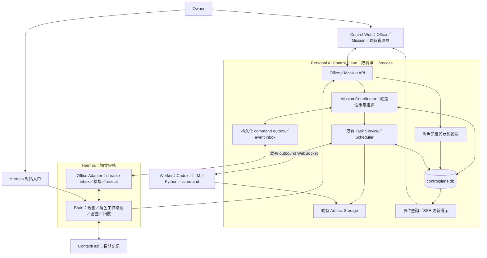
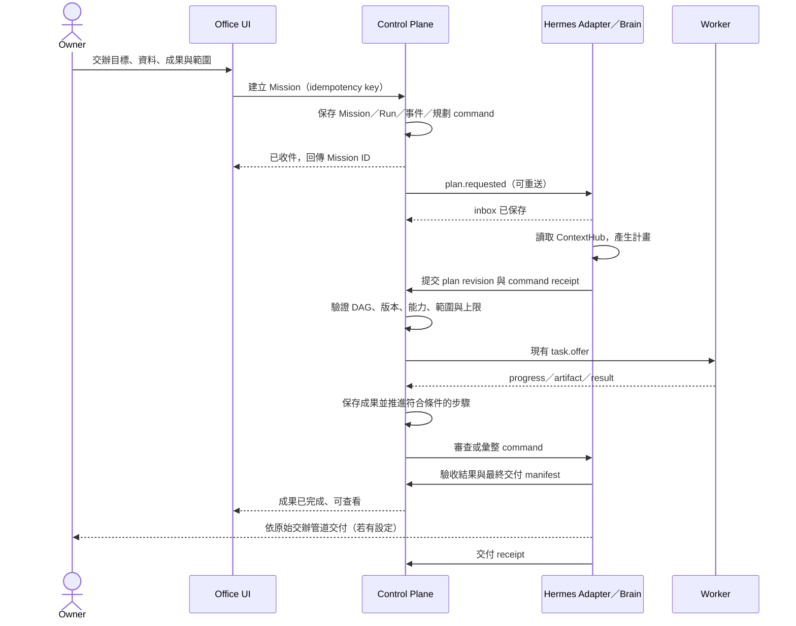

# Personal AI Control Plane — 虛擬辦公室 HLD

文件日期：2026-09-06

文件狀態：設計提案；本次交付為 HLD，尚未實作、部署或驗收。

建議定位：Personal AI Control Plane 內的 Virtual Office 功能領域。

2026-09-07 補充：[Detailed Design](virtual-office-detailed-design.md) 已將本提案展開為資料約束、API、狀態機與驗收規格；版本欄位、審查依賴與協定細節以該文件為準。

## 1. 架構判斷

**適合放在 Personal AI Control Plane。** 辦公室需要把交辦、角色分工、執行資源、進度、阻礙與成果放在同一個操作介面，這與 Control Plane 現有的 Task、Worker、派工、成果與事件管理高度重疊。

建議在現有執行層上增加「委託 Mission」與「辦公室角色」，把一次交辦轉為可持續數小時或數天的工作。辦公室畫面是實際工作狀態的呈現；長時間工作的可靠性由伺服器持久化與 Hermes 續接能力提供。

責任分工延續 v2：

| 系統 | 虛擬辦公室中的責任 |
| --- | --- |
| Hermes | 主管與推理大腦：理解需求、規劃、選擇角色、修改計畫、評估成果、彙整及回覆 |
| Personal AI Control Plane | 辦公室與工作管理：保存委託、執行計畫、依賴、等待條件、角色配置、任務與交接紀錄 |
| Worker | 具體執行：模型推論、Codex、Python 或核准的 command 工作 |
| ContextHub | 長期語意記憶：由 Hermes 決定查詢與寫入哪些可重用知識 |

**本提案明確擴充 v2 的管理範圍**：Control Plane 從單一 Task 管理，擴充至執行 Hermes 已提交的多步驟計畫。它可以依確定性規則等待依賴、啟動步驟、處理到期與重試，但不能自行用 LLM 拆解需求、選擇新策略或判斷成果品質。

此項增補應於實作時同步修訂 [v2 HLD](personal-ai-control-plane-hld.md) 的責任說明。Hermes、ContextHub 仍保有獨立 repository、資料、映像、發佈及回滾邊界。

## 2. 現況與設計基礎

本次以本機 PersonalAiControlPlane `22996c0`、AiSecretaryChloe `7e8fdc0` 原始碼核對；未查驗 NAS 正式環境。下列為原始碼觀察，不能推論為 `live_verified` 或 `provider_verified`。

| 現有能力 | 觀察與本次用途 |
| --- | --- |
| 單一 Control Plane process、SQLite、React/Vite Control Web | 沿用部署與技術結構，增加模組與頁面 |
| Task、Task Run、Attempt、事件與結果 manifest | 作為 Mission 底下的執行單元；不再建立另一套 Worker 任務系統 |
| capability、runtime、model、workspace 與接案狀態 | 作為角色後端的實際可用性與派工條件 |
| Worker 本機 assignment/result 保存、result ACK、attempt fencing | 沿用結果重送與過期結果隔離，不能據此宣稱任意程序可接續 |
| callback outbox、交付重試、Hermes receipt API | 已有傳輸與回覆狀態介面；需補足跨重啟恢復與 Mission 事件 |
| Hermes callback receiver | 本機程式接受事件、去重並寫入 JSONL；本次搜尋未找到消費此 inbox 並自動續接工作的 consumer |
| Mission、角色、計畫版本、步驟依賴與執行 checkpoint | 尚需新增，現有 `group_id`／`parent_task_id` 不等於工作流程引擎 |

與既有 [功能與 UX HLD](personal-ai-control-plane-functional-ux-hld.md)、[功能與 UX Detailed Design](personal-ai-control-plane-functional-ux-detailed-design.md) 共用 Task Run、成果、來源、交付、Worker 接案狀態等概念；較早的狀態文件可能落後於目前程式，實作前仍需核對。

### 2.1 直接影響長時間任務的既有缺口

- `callbacks/outbox.ts` 目前只選取 `PENDING`／`RETRY_WAIT`。程序若在 claim 後停止，過期的 `IN_FLIGHT` 未見自動回收路徑；必須加入 lease recovery。
- `server.ts` 的 Task 建立與 HTTP idempotency receipt 寫入分開執行。Mission 步驟建立 Task 時，必須把步驟關聯、Task 與去重紀錄放在同一個 transaction，避免重啟後重複建立。
- Hermes receiver 回 `202 accepted` 只代表事件落地，尚不足以證明 Hermes 被喚醒、提交下一步或完成回覆。
- 現有失敗處理可重排執行；新增會改檔或有外部副作用的 Mission 時，必須加入可重試性分類，不能把失聯等同可安全重做。

這些是本設計的實作前置項目，本次不修改執行程式。

## 3. 產品目標與範圍

### 3.1 使用者應能完成的事

1. 打開辦公室，看到有哪些成員、各自職責、正在處理什麼，以及缺少什麼資源。
2. 交辦目標、輸入資料、期望成果、期限與可執行範圍，由 Hermes 安排工作。
3. 查看 Hermes 的計畫、角色交接、平行工作、審查與成果修訂。
4. 關閉瀏覽器、離開電腦或等待隔天，仍能回到同一筆委託查看進度。
5. 在需要時補充資訊、調整目標、暫停後續步驟、取消工作或處理異常。
6. 取得可追溯至角色、Worker、模型、工作版本與檢查結果的最終成果。

### 3.2 初始設計假設

| 項目 | 設計假設，非既有容量保證 |
| --- | --- |
| 使用對象 | 單一 owner、私人辦公室；沿用現有私有入口 |
| 辦公室 | 第一版一間；資料模型保留 `office_id` |
| 成員與設備 | 4–8 位邏輯成員、1–10 台 Worker；成員數不代表並行算力 |
| 工作量 | 最多 5 筆同時進行的 Mission，每份計畫上限 100 個步驟 |
| 持續時間 | 以數小時至 7 天為初始驗收情境；可等待 owner、設備或依賴 |
| 並行 | 預設每個成員 1 個活動步驟；Hermes 執行槽另由 adapter 公告，初始 1 槽 |
| 有限執行 | 預設最多 3 次改版計畫、每個可安全重做的 Task 最多 2 次 attempt；跨版本總步驟上限 200 |

上限需在建立委託時保存成 snapshot，包含所有 Hermes turn 與 Worker 工作；owner 可調整。期限可省略，但 Mission 必須有總執行上限，避免無限重規劃。金額／token 顯示以實際可取得的 usage 為準；無法量測時顯示未知，不承諾精確金額封頂。

### 3.3 第一版不納入

- 多人即時遊戲、3D 移動、物理碰撞、語音會議或自由漫遊。
- 每個角色一個永久 daemon、container、帳號或獨立憑證。
- Control Plane 自主思考、自行招聘 agent、自由對話循環或 Worker 自行委派。
- 保證任意 LLM、Codex、Python 程序可從中途指令續跑。
- 通用企業組織、多人 RBAC、帳務或新的 production approval engine。

## 4. 核心概念與角色模型

### 4.1 職責、成員與執行後端

| 概念 | 定義 | 例子 |
| --- | --- | --- |
| Role Definition | 職責、輸入／輸出格式、可要求的能力、驗收標準與版本 | 研究員、工程師、審查員 |
| Office Member | UI 中有名稱、頭像、座位及職責的邏輯成員 | 研究員「阿研」 |
| Backend Binding | 成員如何取得執行資源與其限制 | Hermes profile，或符合條件的 Worker pool |
| Mission | 使用者的一次完整委託，有目標、範圍、期限、交付物與驗收條件 | 完成一份架構研究報告 |
| Mission Run | 該委託的一輪執行；完成或失敗後重開會新增一輪 | 第 2 輪重做，保存第 1 輪成果 |
| Plan Revision／Step | Hermes 提交的版本化步驟及依賴 | 蒐集資料 → 分析 → 撰稿 → 審查 |
| Task／Task Run／Attempt | 現有 Worker 工作、人工重試輪次與單次派工 | Codex task 的第 1 run、第 2 attempt |
| Handoff | 已保存的輸入、成果及驗收條件移交下一個步驟 | 研究資料交給撰稿員 |

Mission Run 與既有 Task Run 為不同層級；API、資料庫與詳細資訊必須使用完整名稱，避免共用模糊的 `run_id`。

Backend Binding 第一版提供：

- **`HERMES_PROFILE`**：使用 Hermes 管理的角色 profile 與隔離工作階段。Control Plane 保存 profile ID、版本與能力描述，不保存 Hermes 私有對話或推理歷程。
- **`WORKER_SELECTOR`**：指定能力、runtime、模型條件、logical workspace，以及可選的固定 Worker／Worker pool。若符合條件的 Worker 不可用，成員顯示等待資源。

職責一旦用於計畫，保存角色版本、profile 版本與 binding snapshot。修改頭像可立即生效；修改職責、工具或 binding 只影響未來計畫，既有工作需明確改版。刪除有歷史的成員以封存處理。

### 4.2 建議預設成員

| 成員 | 主要職責 | 建議後端 | 成果 |
| --- | --- | --- | --- |
| 辦公室主管 | 理解目標、規劃、分派、改版、最終驗收與回覆 | Hermes | 計畫、決策、最終交付 |
| 研究員 | 依清楚的研究題目蒐集／整理證據 | Hermes profile；有相應工具時可使用 Worker | 來源清單與研究摘要 |
| 分析師 | 比較方案、執行資料分析 | Python／LLM Worker | 計算結果、圖表、分析檔 |
| 工程師 | 在指定專案內實作與執行檢查 | Codex Worker | patch、commit reference、檢查紀錄 |
| 撰稿員 | 依資料與指定格式產出文件 | LLM／文件工具 Worker | 文件與成果 manifest |
| 審查員 | 依驗收條件檢查成果並列出具體缺口 | Hermes profile，可調用獨立檢查 Task | 審查結論與證據 |

上述為角色範本，不能讓未安裝的工具變成可用能力。Worker 若只有推論 API，就不能因被命名為研究員而取得瀏覽能力。Hermes 的多個 profile 是同一大腦下的不同職責；同一模型自審不代表獨立驗證，需要時明列不同模型／工具／測試證據。

同一 Worker 可以承接多位成員，同一成員也可選擇多台合格 Worker。所有成員共享設備的真實 concurrency 與資源限制；同一可寫 workspace 的工作需排他租約或各自隔離的 checkout，避免不同角色互相覆寫。

## 5. 辦公室 UI 與操作

### 5.1 空間配置

使用 React DOM 搭配 SVG/CSS 的 2D 俯視或輕等角辦公室；座位、角色與狀態可直接點選。第一版使用固定區域、可調整成員座位，不需要遊戲引擎。確切美術風格在 UI 實作前用 mockup 確認。

```text
┌ 虛擬辦公室 ── 進行中 3 · 等待你 1 · 可用裝置 2 ──［交辦工作］┐
│                                                              │
│  接待區／交辦箱       主管桌 Hermes          成果櫃            │
│  新委託、補充資料     正在規劃：研究報告     最新交付、下載      │
│                                                              │
│  研究桌              分析桌                 工程桌            │
│  阿研：整理來源      小析：等候資料         小工：執行檢查    │
│  工作 A · 步驟 2     工作 A · 步驟 3        工作 B · 步驟 4   │
│                                                              │
│  撰稿桌              審查桌                 待處理區          │
│  小文：可接案        小審：檢查草稿         工作 C 缺少附件    │
├──────────────────────────────────────────────────────────────┤
│ 工作看板：研究報告 3/6 已驗收｜下一步：分析｜最後更新 10:42   │
└──────────────────────────────────────────────────────────────┘
```

空間用途：接待區承接 Mission、主管桌查看計畫與決策、工作桌查看角色工作、審查區顯示驗收、成果櫃取得交付物、待處理區集中顯示真正需要 owner 的事項。休息或離線只是可用性視覺，不模擬虛構人類活動。

### 5.2 資訊與互動

- 點成員：顯示職責、目前步驟、待辦、後端可用性、實際 Worker／runtime／model，以及工作詳情入口。
- 點 Mission：顯示目標、計畫圖／清單、各步驟成果、阻礙、決策紀錄、交付狀態與來源入口。
- 交辦表單：目標、輸入附件／來源、期望輸出、期限、範圍、可使用的專案／工具與執行上限。進階設定可收合。
- 送出後立即取得 Mission ID 與「已收件／等待主管規劃」；只有 Hermes 實際領取工作後才顯示規劃中。
- 對已有授權且資訊充足的工作，自動規劃與交接。需要補充資訊、超出原範圍或涉及尚未授權的外部動作時，才顯示具體待辦。
- 拖曳角色座位只改版面；不能透過拖動頭像偷偷改變派工或權限。重新指派是明確操作，顯示影響的未開始步驟。
- 委託補充採附加紀錄；進行中改目標會要求 Hermes 產生新計畫版本，不能直接改寫已執行的 instruction。

建議新增 `/office`、`/missions`、`/missions/:missionId`、`/office/members`；保留既有 Dashboard、Tasks、Workers、Models、Systems、Settings 的入口與功能。Office 可設為偏好的首頁，第一版不強制取代現有總覽。

### 5.3 真實狀態投影

成員同時顯示「活動」與「資源」：活動可為可接案、規劃、執行、審查、等待資料、等待你；資源可為可用、繁忙、離線、未設定、不支援。成員可能正在排隊，而背後 Worker 因另一位成員繁忙，兩者不能共用一個 ONLINE 圓點。

每個狀態提供原因、開始／最後更新時間與可採取的動作；「等待依賴」不等於錯誤。多人交接動畫只能在已保存的事件後播放。UI 不顯示編造的內心對話；顯示可查證的操作摘要與成果。

進度預設顯示「已驗收 3／6 個步驟」及目前計畫版本，不以經過時間假造百分比或 ETA。改版使步驟總數增加時明示原因。

Office、看板與清單共用同一份伺服器 projection。支援鍵盤、文字標籤、減少動態效果、手機清單模式與色彩以外的狀態提示；關閉動畫不影響操作。資料過期時標示更新時間與重新連線，不繼續假裝成員工作中。

## 6. 高階系統架構



新增 `office/`、`missions/` 與 Hermes adapter 的協定模組即可；不為每個角色拆服務。新增 Coordinator 負責執行 dependency DAG、等待條件、timer 與執行上限。所有需要理解內容的決策，都發出持久化 command 給 Hermes。

Coordinator 只在目前計畫的依賴已滿足、授權範圍有效、資源與限制允許時啟動步驟。Worker 步驟建立既有 Task，Hermes 步驟建立 command，不將 Hermes 偽裝成有 Worker bearer token 的裝置。

## 7. 主要資料流

### 7.1 新委託到交付



由 Hermes 對話建立的 Mission 使用相同 API，附 `source_ref` 與 opaque conversation reference。Office 不保存完整對話；Hermes 持有 conversation/session 與 channel 的對應。

### 7.2 計畫、平行工作與交接

計畫由 DAG 組成，每個 Step 明列類型、成員、輸入參照、輸出格式、前置條件、驗收條件、執行範圍、timeout 及 retry safety。第一版支援四類：`WORKER_TASK`、`HERMES_ACTION`、`HUMAN_INPUT`、`WAIT_UNTIL`。

可獨立的步驟依資源平行執行；需要彙整的步驟等待所有 required input。依賴預設要求上游已成功且驗收通過；可略過的分支與替代輸入需由 Hermes 事先明列。計畫有循環、遺失參照、超出角色能力、超過限額或沒有最終驗收／交付定義時，API 拒絕並回傳結構化原因。

Worker 的執行成功只表示 task contract 完成。Step 若需語意驗收，先停在 `AWAITING_REVIEW`，交由 Hermes；指定的測試、schema 或 hash 等可由已宣告的確定性檢查驗證。品質不合格交回 Hermes 改版，不讓 Coordinator 自己重寫提示詞。

每次交接保存：來源／目的 Step、產生該成果的 task/run/attempt、artifact ID／digest、schema 版本、簡短摘要及驗收條件。下游重新取得已保存的輸入，不能依賴前一個角色的聊天記憶或本機暫存路徑。

## 8. 狀態、控制與完成定義

### 8.1 分開保存生命週期與控制意圖

| 層級 | 狀態與意義 |
| --- | --- |
| Mission Run phase | `PLANNING → EXECUTING → REVIEWING → COMPLETED`；另有 `FAILED`、`CANCELLED` 終態 |
| Run control | `ACTIVE`、`PAUSE_REQUESTED`、`PAUSED`、`CANCEL_REQUESTED`；控制是否能啟動新工作 |
| Step | `PENDING`、`READY`、`RUNNING`、`AWAITING_REVIEW`、`WAITING`、`SUCCEEDED`、`FAILED`、`SKIPPED`、`CANCELLED` |
| Wait reason | 等待上游、Worker、Hermes、owner、時間、可安全重做的退避期限或狀態核對 |
| Delivery | `NOT_REQUESTED`、`PENDING`、`DELIVERED`、`ATTENTION`；與執行完成分開 |

`WAITING` 要保存原因、負責方、下一次檢查時間或所需事件；不靠背景 busy polling。部分步驟等待、其他仍可做時繼續執行；全部無法前進才將 Mission 投影為等待，並指出原因。

執行或審查期間需要改版時，可以回到 `PLANNING`；提交新版本後再依待辦回到執行／審查。終態 Run 不重新開啟，需新增 Mission Run；新的執行額度必須明確保存，不能以重開操作無聲重設原委託限制。

### 8.2 操作語意

- **暫停後續工作**：保存 `PAUSE_REQUESTED`，停止啟動新 Step；目前工作到達安全邊界後才為 `PAUSED`。UI 顯示尚有哪些工作仍在執行。
- **繼續**：重新檢查期限、資源及未完成待辦，從現有 Step 狀態推進，不重做已驗收步驟。
- **取消**：立即阻止新 dispatch，對活動 Task 與 Hermes command 發取消請求。Run 可關閉為 `CANCELLED`，另顯示資源釋放／外部副作用是否仍待確認。
- **重試**：短暫且可安全重做的失敗沿用 Task attempt；人工重試沿用既有 Task Run 機制並更新 Step 關聯；品質改作由 Hermes 新增計畫版本。終態 Mission 重開產生新的 Mission Run。
- **改目標／換角色**：保存變更請求、由 Hermes 產生計畫差異；增加權限或超出既有交辦才需要 owner 決定。新版本只在驗證成功後生效。

計畫改版以 `expected_revision` 比對；已完成步驟只以明確的成果參照重用，輸入／驗收變更使下游結果失效時，建立新 Step，保留舊紀錄。仍在執行且受改版影響的 Step 需先凍結或撤銷；新舊版本不可同時寫入同一工作區。

### 8.3 完成與成果

Mission 只有在 required Step 全部已驗收、最終 artifact／摘要可用，且 Hermes 對目前 plan revision 提交最終 acceptance 時才為 `COMPLETED`。一般工作不強制要求 owner 再按一次核准；驗收需要人判斷時，計畫明列 human gate。

完成卡片同時顯示「執行完成」「成果驗收」「結果交付」。Office-only 委託在成果保存後即能查看；Telegram 等通道交付失敗只變更 Delivery，不把整份已完成工作重跑。

通知由 Hermes 原有通道承接，只在需要決定、重要成果、完成、無法前進或重大失敗時通知。一般 heartbeat、角色換座與可自動恢復的短暫等待不逐筆通知。

## 9. 長時間工作的可靠性

### 9.1 持久化協調，不依賴活著的對話

Coordinator 在 DB 保存目前 phase、plan revision、Step 狀態、等待條件、下次喚醒時間及活動執行關聯。每次狀態變更、事件與待送 command 在同一個 transaction 提交；transaction 外才進行 HTTP、WebSocket 或檔案傳輸。

瀏覽器與 SSE 都不持有執行權。程序啟動時掃描未完成 Run、待送事件、到期 timer 與過期 lease；週期性 reconciliation 以 DB 為準補回漏掉的推進。重放只重做確定性狀態計算，不重新呼叫 LLM 或執行有副作用的工具。

每個「Step → Task／Hermes command」具有唯一 execution key。Step 關聯、Task 建立與 operation receipt 必須原子提交。Command claim 保存 lease、owner 與 generation；重啟可回收 `IN_FLIGHT`，舊 owner 的回覆因 fencing 被拒絕。去重與業務寫入需一併提交，符合 [AWS Builders’ Library 的 idempotent API 設計原則](https://aws.amazon.com/builders-library/making-retries-safe-with-idempotent-APIs/)。

所有接收端以 `mission_id + mission_run_id + plan_revision + step_id + execution_generation` 判定有效性，再以既有 `task_run_id + attempt_id` 隔離 Worker 結果。取消或改版後的晚到結果可封存為證據，但不能推進新計畫。

### 9.2 Hermes 續接協定

Hermes repository 新增 Office Adapter，負責以下閉環：

1. 收到 command，依 `command_id` 在自己的 durable inbox 去重並落地；完成後才回傳 accepted。
2. Consumer 取得有期限的 claim，依 opaque Mission reference 載入 Hermes session／profile、目前計畫、已驗收成果與必要記憶。
3. 執行一次有時間及輪數上限的 Hermes turn，保存輸出；不持續占用一個跨天 HTTP request。
4. 以原 command ID 與 expected revision 向 Control Plane 提交計畫、成果或決策；CP 原子保存狀態與 command receipt。
5. 若回應遺失，查詢或重送相同結果；不因 transport timeout 產生新策略或重複派工。
6. 若工作仍需等待，保存等待關聯後釋放 Hermes 槽位。下次事件到來再續接；process crash 後由 inbox lease recovery 恢復。

傳輸 ACK、Hermes 已領取、結果已套用、最終對外回覆為不同狀態。沒有 receipt 的 command 到期後先查詢 CP／Hermes durable record；超過重試上限才顯示 `HERMES_CONTINUATION_ATTENTION`。

Hermes 同一 Mission 的規劃與改版採單一 writer；不同角色 action 可以使用隔離 session，但受共同執行槽與 Mission version 限制。Hermes 的對話狀態仍存於 Hermes；Control Plane 保存結構化決策與公開成果，不保存私有推理鏈。

若來源對話已消失、通道權限失效或續接不支援，成果仍保存在 Office，呈現交付待處理及具體原因。不能把健康檢查或 receiver 的 `202` 當作 adapter 支援宣告。

### 9.3 步驟 checkpoint 與換機

第一版保證 **Step 邊界恢復**：完成的輸出以 artifact ID、digest、輸入版本及驗收紀錄保存，重啟後從未完成的 Step 繼續。適合拆成「一批資料、一份文件、一個 patch、一輪測試」，避免單一 command 包含整天的工作。

步驟內 checkpoint 為 executor 可選能力，需明確公告 checkpoint schema、程式／工具版本、輸入 digest、resume 方法與可攜性。UI 只有在 descriptor 與實際 checkpoint 都存在時才顯示「可從中途續跑」。一般 LLM request 不保證接續；Codex 能否續 session，需依實際 executor contract 驗證。

- 可攜 artifact 與相容 runtime：可重新選擇合格 Worker。
- 綁定 workspace／本機 session：等待原 Worker，或由 Hermes 產生搬移／重建計畫。
- Worker 本機路徑不能當成可跨機 artifact；必要輸出先上傳確認後，Step 才算具備可恢復成果。
- 上游已驗收成果被目前 Run 引用時禁止自動清除，避免跨天後下游失去輸入。

### 9.4 重試、外部副作用與不確定狀態

| 類別 | 例子 | 自動恢復策略 |
| --- | --- | --- |
| `REPLAY_SAFE` | 唯讀分析、固定輸入的隔離計算 | bounded retry，可換合格設備 |
| `IDEMPOTENT_EFFECT` | 工具支援相同 operation key 去重的寫入 | 沿用同一 operation key，先查結果再重送 |
| `NON_REPLAYABLE` | 無去重能力的寄信、發佈、未隔離的檔案修改 | 結果不明時等待核對；禁止盲目重做 |

重試分類由已配置 executor／tool contract 限制；Hermes 只能選擇相同或更保守等級，不能把任意 command 標成安全。執行上限同時約束 infrastructure retry、人工 retry、Hermes turn 與計畫改版，避免繞過上限。

Worker 失聯不代表程序已停止。Attempt fencing 能保護 CP 資料，不能撤銷外部副作用；對可寫 workspace，重派前需確認舊程序停止或使用隔離 checkout。結果不確定時以 `WAITING_RECONCILIATION` 呈現，在核對完成前不啟動衝突工作。

取消 ACK 也需區分「邏輯取消已接受」與「executor 已停止」。Worker adapter 若無法證明停止，保留資源釋放待確認狀態，不宣稱整台設備已空閒。發送通知等外部工具若無 idempotency 支援，端到端 exactly-once 不在本設計保證內。

### 9.5 到期、可用性與限制

Mission deadline、Step queue timeout、單次 execution timeout、等待 owner 的期限與無進度告警是不同欄位。Heartbeat 只證明存活；以最後實際進度、executor timeout 與步驟 checkpoint 判斷是否卡住。

到達硬性 Mission deadline 時停止新工作並請求取消活動執行；保留部分成果，記錄 `DEADLINE_EXCEEDED`。若 deadline 僅作提醒，需在建立時明示為 soft deadline。累計時間與輪數上限不因重啟、改版或手動重試重設。

Hermes 或 ContextHub 離線時，已具備完整輸入與權限的獨立 Worker Step 可繼續；需要推理、記憶或驗收的步驟等待相應服務。不可無聲忽略必要記憶後宣稱完成原驗收條件。

## 10. 資料與儲存設計

### 10.1 Authority 與主要實體

沿用本機磁碟上的 `controlplane.db`，增加版本化 schema migration；禁止清空現有 v2 資料。採 current-state tables 加 append-only domain events，不引入完整 event-sourcing framework。

| 邏輯實體／建議資料表 | 主要內容 |
| --- | --- |
| `offices`、`office_members` | 辦公室版面、成員、角色版本、backend binding、封存狀態 |
| `role_definitions` | 職責與輸出契約、所需能力、Hermes profile reference、版本 |
| `missions`、`mission_runs` | 原始交辦與補充、範圍 snapshot、來源 reference、phase/control、期限與累計限制 |
| `mission_plans` | immutable plan revision、由誰提交、驗收標準、與前版的關係 |
| `mission_steps`、`mission_step_dependencies` | 類型、角色 snapshot、輸入／輸出、狀態、等待條件、generation |
| `mission_step_executions` | Step 與 task_id/task_run_id 或 Hermes command_id 的唯一關聯 |
| `mission_artifacts` | Mission 輸入、步驟交接、checkpoint、最終成果與 retention reference |
| `mission_events` | 單調遞增 sequence、事件 ID、run／plan／step、已保存的狀態改變 |
| `mission_commands`、`mission_inbox` | command payload、去重鍵、lease、重試、receipt；接收外部結果與去重 |
| `mission_decisions` | 需要 owner 的具體問題、輸入版本、決定與適用範圍；不取代既有授權 authority |

`mission_step_executions` 對有效 generation 設唯一約束；operation key 的 request hash 不同時回 conflict。歷史 Run、Plan、Role、artifact digest 保持可追溯，不以更新成員配置回寫歷史。

Hermes 的 inbox、session 與 profile 定義留在 Hermes storage；長期知識留在 ContextHub。Mission 成果是工作紀錄，只有 Hermes 判斷適合重用時才透過 ContextHub 正式 API 寫入長期記憶，並回傳 memory reference。

### 10.2 Artifact 邊界

沿用既有 artifact root、大小限制、digest、下載及安全預覽能力。增加 Mission input／Hermes output 的受限註冊與上傳 scope，與現有 Worker task-authenticated upload 分開識別呼叫者；不要求 Hermes 假冒 Worker token。

附件先以 provisional upload 保存，完成 digest 檢查後才可關聯 Mission；未關聯檔案有短期 TTL。Handoff／final manifest 只引用已確認可用的 artifact。拒絕任意 host path、跨 scope 的未授權 ID 與任意 callback URL；UI 不直接執行產出的 HTML／script。

### 10.3 資料持久性、備份與保留

SQLite WAL 支援此單機設計，但同時只有一位 writer，資料庫不可放在由不同主機共同開啟的網路檔案系統。所有 transaction 保持短小，批次記錄 progress；參考 [SQLite WAL 文件](https://www.sqlite.org/wal.html)。

目前程式使用 `synchronous=NORMAL`。本提案針對委託與交接耐久性，建議評估改為 `FULL` 並測量 NAS 寫入延遲；NORMAL 在電源中斷時可能遺失近期提交，不可直接承諾斷電零遺失。[SQLite durability 說明](https://www.sqlite.org/wal.html#performance_considerations)

初始保留政策建議：未完成 Run 的必要輸入／checkpoint 持續 pin；完成紀錄與最終成果至少 90 天；詳細 progress/log 30 天；去重 receipt 保留至 Run 終態後至少 90 天，且不得短於最大事件重送期限。容量不足時停止新附件／新工作並提示處理，不能刪除活動 Run 的依賴。

備份使用 SQLite 一致性備份能力，搭配 artifact manifest、digest 及所引用的檔案；不只複製運行中的 `.db`。[SQLite Backup API](https://www.sqlite.org/backup.html) 備份期間固定 artifact 保留集合；Restore 後先停止派工、更新 runtime generation，再與 Hermes／Worker 對帳後恢復，避免舊 snapshot 重送已完成的外部動作。

初始目標為每日備份、災難恢復 RPO 24 小時、RTO 2 小時；均需透過實際 restore 演練建立證據。Process restart 的恢復與磁碟損毀後的還原是不同驗收項目。

## 11. API、事件與協定邊界

以下皆為**新增提案**，不是目前可呼叫的 endpoint。正式欄位與 error schema 在 Detailed Design 定稿，沿用現有 v2 snake_case request 風格。

| API | 用途 |
| --- | --- |
| `GET /api/v2/offices/:id` | 辦公室、成員活動、資源與最近更新 projection |
| `GET/POST /api/v2/role-definitions` | 取得或新增版本化角色契約 |
| `GET/POST /api/v2/offices/:id/members` | 查看／配置成員；變更使用 revision check |
| `POST /api/v2/missions` | 從 Office 或 Hermes 建立委託與首個 Mission Run |
| `GET /api/v2/missions`、`GET /api/v2/missions/:id` | 分頁列表、目標、Run、計畫、阻礙與交付 |
| `POST /api/v2/missions/:id/inputs` | 附加補充資料，必要時觸發 Hermes 改版 |
| `POST /api/v2/missions/:id/actions` | pause、resume、cancel、reopen，回傳實際控制狀態 |
| `POST /api/v2/missions/:id/decisions` | 回答具體待辦，綁定 decision ID 與 revision |
| `GET /api/v2/missions/:id/events?after_seq=...` | 可恢復的事件增量與 next cursor |
| `GET /api/v2/missions/:id/results` | 指定 Mission Run 的驗收與 final manifest |
| `POST /api/v2/missions/:id/artifact-uploads` | 建立受限 Mission 上傳 scope；完成後驗證並關聯 |
| `POST /api/v2/internal/office/command-results` | Hermes 提交計畫、角色成果、驗收與 command receipt |
| `GET /api/v2/internal/office/commands/:id` | Hermes 對帳既有 command 是否已套用 |
| Hermes：`POST /api/internal/office/commands` | 新的 durable inbox；接受規劃、角色工作、審查與取消 command |
| Hermes：`GET /api/internal/office/capabilities` | protocol version、profile、續接支援及可用執行槽 |

寫入 API 使用 `Idempotency-Key`；改版與控制操作附 expected revision／Mission Run ID。同 key 不同內容或過期 revision 回 `409`，不做隱含覆寫。建立回 `202` 與已持久化的 Mission reference，不代表 Hermes 已開始執行。

建議 command envelope：

```json
{
  "protocol_version": 1,
  "command_id": "opaque-command-id",
  "kind": "plan.requested",
  "mission_id": "opaque-mission-id",
  "mission_run_id": "opaque-mission-run-id",
  "expected_revision": 1,
  "plan_revision": null,
  "step_id": null,
  "execution_generation": 1,
  "profile_ref": {"id": "office-manager", "version": 1},
  "input_refs": [],
  "expires_at": "2026-09-07T12:00:00Z"
}
```

Event 種類至少包括 `mission.created`、`plan.committed`、`step.started`、`step.waiting`、`handoff.committed`、`decision.requested`、`mission.completed`、`delivery.updated`。Domain event commit 後再發布 SSE refresh hint；SSE 斷線後用 cursor 補讀。Cursor 過期時回明確 reset 訊號，UI 重新取得 snapshot。

既有 `/api/v2/tasks` 與 Worker protocol v2 繼續服務獨立 Task。Mission 所屬 Task 的 terminal event 只由 Mission Coordinator 消費後決定是否喚醒 Hermes；既有獨立 Task 保留原 callback，避免同一結果同時觸發兩條自動續接路徑。HTTP response 與事件都保留足夠的 run／plan／step 關聯。

Tasks 頁仍可查看 Mission 子任務，但其 retry／cancel 等寫入需經 Coordinator 檢查目前 Step、Run 與 revision，再呼叫既有 Task Service。API 不能繞過此檢查直接重跑已失效的子任務；每次人工重試都要原子更新 `mission_step_executions` 與事件，避免辦公室與 Tasks 頁形成兩套控制狀態。

## 12. 授權、資源與部署邊界

- 沿用私人 Tailscale／現有入口與 owner 操作邊界；新增內部 API 的 `/internal` 名稱本身不是保護，須沿用實際私有網路可達性及現有代理限制驗證。
- 角色名稱、prompt 與 UI 座位不授予權限。Mission 可執行範圍是使用者交辦、既有 executor allowlist、Worker capability grant、workspace 邊界與 Hermes 工具限制的交集。
- Control Plane 保存 owner 決定與既有 authority reference，只驗證操作仍在已配置的結構化範圍內；不另建身份、全域 approval policy、secret vault 或 provider quota authority。
- 未授權的寄信、發佈、部署等具體外部動作先完成可供檢查的成果，再透過既有 owner gate 處理。已有明確授權的步驟不重複問；計畫改版若改變動作或輸入，舊決定不能擴張適用。
- Hermes 與 Worker 使用既有憑證／工具管理；每位成員不增加 token。來源文件、網頁與 artifact 內容是資料，不能覆寫角色權限或執行規範。
- 角色 pool 的候選仍需 capability/runtime/model/workspace/availability 全部符合；`UNAVAILABLE` 或空模型清單不能派工。
- 共用一個 Control Plane container。Hermes adapter 在 Hermes repository 發佈；ContextHub 第一版只使用既有 API，若無新增 contract，不要求改版。
- 正式部署沿用 CI immutable image、allowlist、staging Compose、`deployment validate/deploy/status`，以 `sudo -n` 非互動執行。不得改動 root-owned deployment controller、production Compose 或環境秘密。

## 13. 容量、效能與可觀測性

以下是要驗證的目標，尚無本次量測：

| 指標 | 初始目標／處理方式 |
| --- | --- |
| Office snapshot | 8 成員、5 活動 Mission 下，API p95 < 500 ms，不包含跨服務呼叫 |
| 事件到 UI | 已提交事件 2 秒內可見；斷線恢復後 5 秒內更新 snapshot |
| Coordinator restart | 服務恢復後 60 秒內重新列出等待與可執行工作；不包含設備重連時間 |
| 事件量 | UI progress 每 Step 每秒最多合併一次；terminal／decision／handoff 不丟棄 |
| 資源 | 只處理協調與小型 projection；模型與長計算在 Hermes／Worker 執行 |
| 公平性 | 依 priority、Mission 年齡與每筆 Mission 的並行上限派工，避免單一委託吃完所有槽位 |

Office snapshot 從 CP 已保存的狀態計算，不同步等待每台 Worker／Hermes 的健康查詢。列表分頁；大型檔案與詳細 log 不嵌入 snapshot。先沿用記憶體中的短期 projection cache，cache 可完全重建，不能用來判斷哪個步驟已執行。

至少記錄：各等待原因與時間、最老 command age、lease recovery 次數、Step retry、late result、重複 command、plan revision、Hermes 續接耗時、最後實際進度、artifact 可用性、成果驗收與交付成功率。所有 log 帶 Mission／Step／Task／Attempt／Command 關聯，隱去秘密及不必要的原始內容。

辦公室顯示獨立的 `workflow_health`。Hermes 不支援續接時，新 Mission 顯示不可啟動或等待設定，既有 Task 管理仍可使用；不能因 UI 可開啟便宣稱 Office 可承接跨天委託。

若上述負載下長期無法達成 p95、DB 寫入爭用明顯、需要多台主機同時協調或多 owner 隔離，再評估獨立 durable workflow service 與其他資料庫。使用實際瓶頸觸發拆分，不先引入分散式基礎設施。

## 14. 主要取捨

| 決策 | 收益 | 成本／重新評估時機 |
| --- | --- | --- |
| Office 放在 Control Plane | 共用 Task、Worker、成果與管理入口 | CP 增加 Mission 協調責任；需維持 planner 邊界 |
| 角色與 Worker 分離 | 可換設備、共用算力、呈現 Hermes 職責 | 需清楚顯示邏輯活動與設備可用性 |
| Hermes 唯一 planning authority | 延續架構、對話與工具管理集中 | 續接 adapter 是關鍵依賴，Hermes 離線會阻擋規劃與驗收 |
| SQLite、單一 Coordinator | 使用既有 NAS 結構與 transaction | 單機故障點、備份與 lease recovery 必須完成 |
| 先採 Step 邊界恢復 | 可驗收、適用多種 executor | 無法保證任意程序從中途繼續，需合理拆分工作 |
| DAG 加有限改版 | 平行工作、明確依賴與可觀測性 | 不支援無限制 agent 自由循環；複雜策略由 Hermes 提交新版本 |
| 2D DOM/SVG 辦公室 | 與現有 UI 整合、可存取、手機可降級 | 遊戲感有限；有明確需求與效能證據後再考慮 canvas／3D |

## 15. 實作依賴與交付邊界

以下為實作工作包與先後依賴，不是本次已開始實作：

| 工作包 | 交付內容 | 依賴 |
| --- | --- | --- |
| A：可靠性與跨 repo contract | outbox lease recovery、Task 建立原子去重、retry safety、Hermes durable inbox／consumer／result receipt | 長任務核心前置 |
| B：Mission domain | schema migration、Run／Plan／Step、依賴協調、等待、取消、重試、artifact pin、final acceptance | A 的明確協定 |
| C：角色配置與 Office UI | 角色／成員／binding、辦公室／看板、交辦、詳情、待辦、成果、真實狀態投影 | B；美術方向先用 mockup 確認 |
| D：復原與實體驗收 | 跨夜、關瀏覽器、CP／Hermes／Worker 重啟、斷線、取消競態、跨機／本機綁定、備份還原 | A–C |

第一個完整使用閉環為「交辦研究報告 → Hermes 規劃 → 研究與分析 → 撰稿 → 審查 → Office 成果與原通道交付」，至少含一個實體 Worker、一次等待後續接與一次服務重啟。只有角色會動的頁面不能算完成此閉環。

新功能以 feature flag 控制，預設待 adapter capability 與 schema 相容性確認後啟用。發佈順序為先提供相容的 Hermes adapter，再更新 CP domain，最後開啟 Office；關閉 flag 只停止收新 Mission，不能遺棄活動工作。移除功能前先 drain／取消並保存成果。

DB 採 additive migration，舊版 rollback 前必須確認能忽略新表與新任務 metadata；不支援時使用已驗證的配套還原流程。既有獨立 Task、Worker enrollment、模型與設定均需回歸驗證。

## 16. 驗收矩陣

| ID | 情境 | 必須看到的證據 |
| --- | --- | --- |
| VO-01 | 新增六位成員、只有兩台 Worker | UI 分工正確，派工不超出兩台裝置的實際 concurrency |
| VO-02 | 從 Office 或 Hermes 交辦並重送相同請求 | 同一 Mission／Run，沒有重複 Task 或 Hermes command |
| VO-03 | 串行、平行及彙整步驟 | 依賴未完成不執行；交接引用正確 artifact／版本；所需資源符合條件 |
| VO-04 | 關閉所有瀏覽器並讓 Hermes 結束當前回合 | Worker 完成後由 durable consumer 喚醒 Hermes，原 Mission 繼續與交付 |
| VO-05 | CP 在保存／派工／claim／收到結果等位置崩潰 | 唯一 Step execution、過期 lease 恢復、無重複狀態推進 |
| VO-06 | Hermes 接收後或提交結果前重啟；HTTP 回應遺失 | inbox 恢復、相同 command 去重、同 revision 不重複套用計畫或交付 |
| VO-07 | Worker 斷線、晚到結果、重啟與取消同時發生 | 目前 generation／attempt 才能更新；未知副作用等待核對，資源釋放狀態真實 |
| VO-08 | 暫停後繼續、到期、人工補充、改版 | 不派送未允許的新步驟、不重做已驗收成果、舊計畫不能推進新計畫 |
| VO-09 | 同一 workspace 的兩個工程角色 | 排他或隔離 checkout 生效；舊程序未確認停止前不衝突重派 |
| VO-10 | 中途無模型／Hermes／ContextHub，之後恢復 | 原因與等待時間可見；僅符合輸入及能力的工作繼續；恢復後可續接 |
| VO-11 | 使用錯誤成果與合格成果各跑一輪 | Worker 成功不直接完成 Mission；Hermes 拒絕／改版／驗收有明確證據 |
| VO-12 | 成果已完成、通知通道失敗或失去來源對話 | Office 成果可取得，交付顯示待處理；不重新執行整份工作 |
| VO-13 | Artifact 清理與活動 Mission 同時發生 | 必要輸入／checkpoint 不被清除；manifest／digest 可追溯 |
| VO-14 | 備份後還原、重送舊事件 | 先對帳再派工，舊 generation 不覆寫現況；記錄實際 RPO／RTO |
| VO-15 | 行動版、鍵盤、減少動態、SSE 斷線 | 能交辦與取得成果；清單與空間一致；過期狀態有提示 |
| VO-16 | 超過改版、總步驟、時間或執行上限 | 停止自動增加工作並保存成果，沒有無限重試或無聲增加權限 |

證據依 `implemented_local`、`ci_verified`、`live_verified`、`provider_verified` 分級。單元／整合測試驗證狀態、去重、版本與故障恢復；NAS live 驗證部署和服務重啟；實體 Mac／Windows Worker、實際 Hermes turn、模型輸出及原通道交付才構成完整使用驗收。

## 17. 實作前需定稿的少數項目

本 HLD 採用上述預設即可開始 Detailed Design。仍需用具體 contract／mockup 定稿：

1. Hermes 建立隔離角色 session、一次有界 turn、取消與續接的實際呼叫介面；沒有確認前不能估作已支援。
2. 使用者最常交辦的第一種長任務及成果格式，用來固定第一條驗收流程。
3. 辦公室美術方向、角色名稱與版面細節；功能與權限契約不隨美術改變。
4. 各 executor 的 retry safety、workspace 隔離與 checkpoint descriptor；不支援者採保守模式。
5. NAS 上 FULL durability 的效能、資料保留容量及實際備份／還原方式。

## 18. 依據與程式定位

本文件的新增名稱、API、上限與指標均為設計提案；現況核對主要依據如下：

- [現有 v2 HLD](personal-ai-control-plane-hld.md)：Hermes／ContextHub／Control Plane／Worker 分工。
- [功能與 UX HLD](personal-ai-control-plane-functional-ux-hld.md)：工作總覽、成果、來源、交付與裝置接案體驗。
- [Database](../apps/control-plane/src/db/database.ts)：現有 Task Run、Attempt、migration 與 SQLite 設定。
- [Task Service](../apps/control-plane/src/tasks/task-service.ts)：任務結果、重試、取消與 attempt fencing。
- [Server](../apps/control-plane/src/server.ts)：既有 API、Task 建立、operation receipt 與成果路由。
- [Callback Outbox](../apps/control-plane/src/callbacks/outbox.ts)：claim、投遞與 receipt；長時間工作的 lease recovery 前置項目。
- [Event Hub](../apps/control-plane/src/events/event-hub.ts)：目前記憶體事件通知，需要以持久化事件補足恢復。
- [Worker Runtime](../apps/worker/src/runtime.ts)：assignment、result 重送、executor 與取消語意。
- Hermes repository `AiSecretaryChloe/services/hermes_evidence/evidence_proxy.py`：本次核對的 callback 接收與 JSONL 保存；未據此宣告自動續接。

外部一手資料僅用於耐久性與去重設計，已在對應段落附連結；產品分工與功能選擇由本專案需求及現有程式推導。
